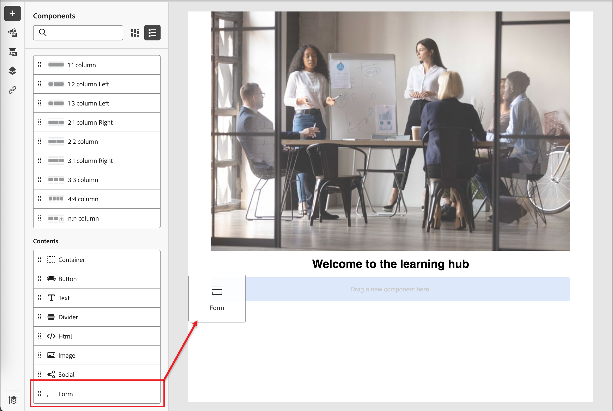

# Criação de conteúdo - adicionar formulários

Um formulário é um componente reutilizável que pode ser referenciado por várias páginas de aterrissagem e modelos de página de aterrissagem no Adobe Journey Optimizer B2B edition. É um bloco de campos e um botão de envio que pode ser pré-criado e inserido rapidamente para tornar o design da página mais rápido e consistente.

O exemplo a seguir descreve as etapas para adicionar um formulário à medida que você cria a página.

1. Na seção **[!UICONTROL Conteúdo]**, arraste o item **[!UICONTROL Formulário]** e solte-o em um componente estrutural no espaço de design da página.

   {width="600"}

   >[!TIP]
   >
   >Para adicionar o formulário de forma que ele ocupe o layout horizontal inteiro no email, adicione uma estrutura de coluna 1:1 e arraste e solte o formulário nele.

1. Clique no ícone _Formulário_ na barra de ferramentas do componente ou use as propriedades **[!UICONTROL Incorporar Formulário]** à direita para selecionar o formulário publicado.

   {width="600"}

1. Se você deseja substituir o **[!UICONTROL Tipo de acompanhamento]** padrão do formulário, altere a configuração de acordo com os requisitos da página ou do modelo.

   Isso também é conhecido como a _página de agradecimento_ do formulário e essa configuração determina o que acontece quando um visitante envia o formulário:

   * **[!UICONTROL Permanecer na página]** - Escolha essa opção para manter o visitante na mesma página quando o formulário for enviado.

   * **[!UICONTROL Página de aterrissagem]** - Escolha essa opção para selecionar qualquer página de aterrissagem do Journey Optimizer B2B edition ou do Marketo Engage como acompanhamento.

   * **[!UICONTROL URL Externa]** - Escolha esta opção para especificar qualquer URL como página de acompanhamento. Depois que o visitante envia o formulário, o navegador carrega o URL designado.

     >[!TIP]
     >
     >Se quiser que o use o formulário para baixar um arquivo, você pode especificar uma URL para o arquivo hospedado. Com essa configuração, o botão Submit funciona como um botão de download.

   {width="280"}

1. Se quiser limitar a exibição de formulário por tipo de dispositivo, altere a configuração **[!UICONTROL Opções de Exibição]**:

   * **[!UICONTROL Mostrar apenas em dispositivos desktop]**
   * **[!UICONTROL Mostrar apenas em dispositivos móveis]**
   * **[!UICONTROL Mostrar em todos os dispositivos]** (padrão)

1. Se necessário, selecione a guia **[!UICONTROL Estilos]** no painel direito para definir as margens do formulário na página.
