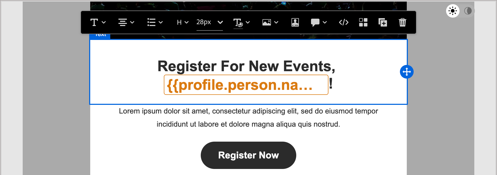

# Criação de conteúdo - personalização

O Journey Optimizer B2B Edition usa uma sintaxe simples embutida que permite criar expressões com conteúdo personalizado delimitado por chaves `{{}}`. É possível adicionar várias expressões no mesmo conteúdo ou campo sem restrições.

Por exemplo, você pode adicionar uma expressão de personalização como `Hello {{lead.firstName}} {{lead.lastName}}`. Ao processar o conteúdo, o Journey Optimizer B2B Edition substitui a expressão pelos dados contidos no banco de dados do Experience Platform. Assim, o primeiro exemplo torna-se _Olá, John Doe_.

Consulte [Personalização de conteúdo](../user/content/personalization.md) para obter informações mais abrangentes sobre o uso de ferramentas de personalização no Journey Optimizer B2B Edition.

>[!NOTE]
>
>O Journey Optimizer B2B Edition segue a sintaxe _camel case_ para tokens de personalização em emails a fim de corresponder aos outros aplicativos do Adobe Experience Platform para obter uma experiência consistente. Este formato de token é totalmente compatível com a [linguagem de modelo Handlebars](https://handlebarsjs.com/guide/#what-is-handlebars){target="_blank"}. Todos os tokens adicionados antes dessa alteração são atualizados automaticamente.

O exemplo a seguir descreve as etapas para personalizar o conteúdo usando tokens de pessoa e sistema. Ele reflete a versão atual do Journey Optimizer B2B Edition.

1. Selecione o componente de texto e clique no ícone _Adicionar personalização_ (  ) na barra de ferramentas.

   {width="600"}

   Esta ação abre a caixa de diálogo _Editar Personalization_.

1. Adicione um token clicando no sinal de adição ( **+** ) ao lado dele.

   Se quiser adicionar o token com um fallback (texto padrão que aparece quando esse campo não está disponível para um cliente potencial), clique no ícone _Mais_ ( **...** ) e escolha **[!UICONTROL Inserir com texto de fallback]**.

   {width="700" zoomable="yes"}

1. Adicione tokens adicionais ou outro texto estático que deseje incluir.

1. Clique em **[!UICONTROL Salvar]**.

   O script de personalização é exibido no espaço de design visual. Você pode selecioná-la para fazer alterações quando necessário.

   {width="600"}
