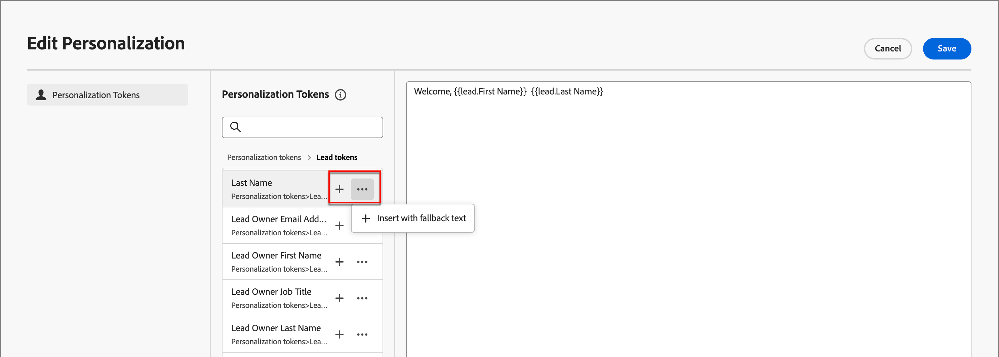

# Criação de conteúdo - personalização

O Journey Optimizer B2B Edition usa uma sintaxe simples em linha que permite criar expressões com conteúdo personalizado delimitado por chaves duplas `{}`. É possível adicionar várias expressões no mesmo conteúdo ou campo sem restrições.

Exemplos:

* `Hello {{profile.person.name.firstName}} {{profile.person.name.lastName}}`

* `Hello {{profile.person.name.fullName}}`

Ao processar a mensagem (email e SMS), o Journey Optimizer B2B Edition substitui a expressão pelos dados contidos no banco de dados Experience Platform. Assim, o primeiro exemplo torna-se _Olá, John Doe_.

O exemplo a seguir descreve as etapas para personalizar o conteúdo usando atributos de lead/conta e tokens de sistema.

1. Selecione o componente de texto e clique no ícone _Adicionar personalização_ na barra de ferramentas.

   {width="600"}

   Esta ação abre a caixa de diálogo _Editar Personalization_.

1. Clique em **+** ou **...** para adicionar um token ao espaço em branco.

   {width="700" zoomable="yes"}

1. Clique em **[!UICONTROL Salvar]**.
