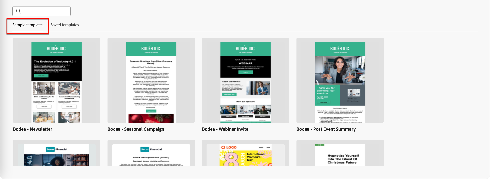

# Criação de conteúdo - selecionar modelo de email

Você pode escolher entre:

* **Modelos de exemplo**. A interface do Journey Optimizer oferece 20 modelos de email prontos para uso que você pode escolher.

* **Modelos salvos**. Use um modelo personalizado salvo que você criou do zero usando o menu _[!UICONTROL Modelos]_ ou salvou de um email em uma jornada usando a opção _[!UICONTROL Salvar como modelo de conteúdo]_.

Use a seção _[!UICONTROL Selecionar modelo de design]_ para começar a criar o conteúdo a partir de um modelo. Você pode usar um modelo de amostra ou um modelo de email personalizado salvo da instância do Journey Optimizer B2B Edition.

>[!BEGINTABS]

>[!TAB Modelos salvos]

Na página inicial _Criar seu modelo_, a guia _Modelos de amostra_ é selecionada por padrão. Para usar um modelo personalizado, selecione a guia **[!UICONTROL Modelos salvos]**.

A lista de todos os modelos de email criados na sandbox atual é exibida. Você pode classificá-los por _[!UICONTROL Nome]_, _[!UICONTROL Última modificação]_ e _[!UICONTROL Última criação]_.

{width="800" zoomable="yes"}

Selecione o template desejado na lista.

Após a seleção, é exibida uma pré-visualização do modelo. No modo de visualização, você pode navegar entre todos os modelos de uma categoria (amostra ou salva, dependendo da seleção) usando as setas para a direita e para a esquerda.

{width="800" zoomable="yes"}

Quando a exibição corresponder ao que você deseja usar, clique em **[!UICONTROL Usar este modelo]** na parte superior direita da janela de visualização.

Essa ação copia o conteúdo no designer de conteúdo visual, onde você pode editar o conteúdo conforme necessário.

>[!TAB Modelos de exemplo]

O Adobe Journey Optimizer B2B Edition oferece uma seleção de modelos de email oferecidos _prontos para uso_, que podem ser usados para criar emails e modelos de email.

{width="800" zoomable="yes"}

>[!ENDTABS]