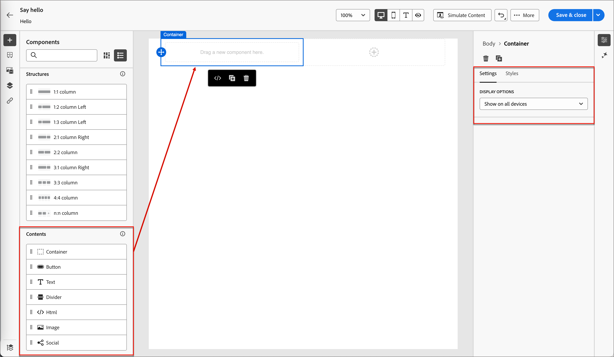
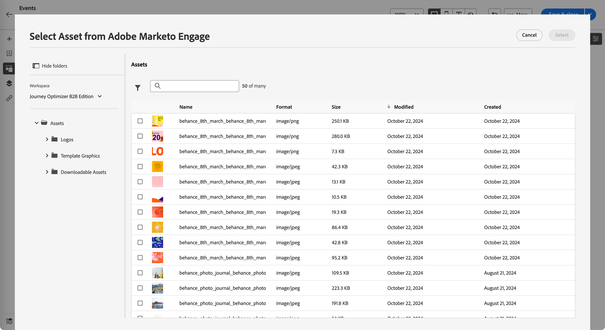

# Snippets

<!-- Content authoring steps for reuse -->

## Configuração de dados de intenção {#intent-data-note}

>[!NOTE]
>
>Os dados de intenção são incluídos quando configurados para sua instância do Journey Optimizer B2B edition. Também é necessário que uma ou mais jornadas publicadas **ou** tenham criado grupos de compras. Para obter mais informações sobre o modelo de Detecção de Intenção e como enviar palavras-chave, produtos e categorias, consulte [Dados de Intenção](../user/admin/intent-data.md).

## Nota de licenciamento do AEM Assets {#aem-assets-licensing-note}

>[!NOTE]
>
>As licenças do AEM Assets as a Cloud Service e do Dynamic Media são pré-requisitos para a integração. Verifique se a [Mídia dinâmica com API aberta](https://experienceleague.adobe.com/pt-br/docs/experience-manager-cloud-service/content/assets/dynamicmedia/dynamic-media-open-apis/dynamic-media-open-apis-overview){target="_blank"} está habilitada. A integração é limitada a repositórios da _Camada de entrega_. Se você usa a _camada do Autor_ e deseja convertê-la, contate o Suporte da Adobe Experience Manager. 
>Dependendo do contrato e da configuração, o Adobe Experience Manager Assets as a Cloud Service pode ser acessado diretamente do Adobe Journey Optimizer B2B edition ao projetar conteúdo visual.

## Criação de conteúdo - Componentes - etapa de estruturas {#structures-step}

1. Para iniciar o design do conteúdo, arraste um item das **[!UICONTROL Estruturas]** e solte-o na tela.

   Adicione quantos itens de _[!UICONTROL Estruturas]_ forem necessários e edite as configurações para cada um no painel à direita.

   >[!TIP]
   >
   >Selecione o componente _[!UICONTROL n:n coluna]_ para definir o número de colunas de sua escolha (entre três e 10). Você também pode definir a largura de cada coluna movendo as setas abaixo dela.

   {width="800" zoomable="yes"}

   Cada tamanho de coluna não pode ser menor que 10% da largura total do componente de estrutura. Somente colunas vazias podem ser removidas.

## Criação de conteúdo - Componentes - etapa de conteúdo {#contents-step}

1. Expanda a seção **[!UICONTROL Conteúdo]** e adicione quantos elementos forem necessários em um ou mais componentes da estrutura.

   {width="800" zoomable="yes"}
   <!--
   reference to the contents elements--->

## Criação de conteúdo - Componentes - Etapa de configurações {#settings-step}

1. Se necessário, você pode fazer personalizações adicionais para cada componente nas guias _[!UICONTROL Configurações]_ ou _[!UICONTROL Estilo]_.

   Por exemplo, é possível alterar o estilo do texto, o preenchimento ou a margem de cada componente.

## Criação de conteúdo - etapa de ativos {#assets-step}

1. No seletor de _Ativos_, você pode selecionar diretamente os ativos armazenados na biblioteca de ativos.

   Clique duas vezes na pasta que contém seus ativos. Arraste e solte os itens em um componente de estrutura.

   Para obter mais informações sobre como usar os ativos do seu tipo de origem, consulte [Adicionar ativos ao seu conteúdo](../user/content/assets-overview.md#use-assets-for-content-authoring).

   {width="800" zoomable="yes"}

## Criação de conteúdo - etapa de personalização {#personalization-step}

1. Insira campos de personalização para personalizar seu conteúdo de atributos de perfis, associações de público-alvo, atributos contextuais e muito mais.

## Criação de conteúdo - Ativar etapa de conteúdo de condição {#dynamic-content-step}

1. Clique em **[!UICONTROL Habilitar conteúdo de condição]** para adicionar conteúdo dinâmico e adaptar o conteúdo aos perfis direcionados com base em regras condicionais.

## Criação de conteúdo - etapa de rastreamento de links {#links-tracking-step}

1. Selecione a guia **[!UICONTROL Links]** no painel esquerdo para exibir todas as URLs do seu conteúdo que é rastreado.

   Você pode modificar o _Tipo de Rastreamento_ ou o _Rótulo_ e adicionar marcas, se necessário.

## Componentes de conteúdo — estilos avançados {#styles-advanced}

Para aplicar atributos adicionais compatíveis com CSS com valores, use as configurações de estilo **[!UICONTROL Avançadas]**. Você pode alterar os valores dos atributos existentes ou adicionar novos. O estilo é aplicado ao componente usando o modelo de herança CSS para componentes pai-filho (elementos).

Os atributos exibidos refletem os estilos que estão definidos atualmente para o componente. Você pode alterar os valores de acordo com [definições de CSS](https://www.w3schools.com/CSSref/index.php){target="_blank"}. Clique no ícone _Adicionar_ (**+**) para adicionar um novo atributo de estilo para o componente.

{width="250"}

## Componentes do conteúdo - estilos de alinhamento horizontal {#styles-alignment-h}

Expanda a seção **[!UICONTROL Alinhamento]** e escolha o alinhamento horizontal que deseja usar: esquerda, centro ou direita. Este estilo traduz para um estilo CSS `text-align` padrão e afeta como o componente é posicionado dentro do componente que o contém.

{width="250"}

## Componentes do conteúdo - estilos de alinhamento vertical {#styles-alignment-v}

Expanda a seção **[!UICONTROL Alinhamento]** e escolha o alinhamento vertical que deseja usar: superior, meio ou inferior. Este estilo traduz para um estilo CSS `vertical-align` padrão e afeta o posicionamento dentro do componente que o contém.

{width="250"}

## Componentes do conteúdo - estilos de alinhamento horizontal e vertical {#styles-alignment-h-v}

Expanda a seção **[!UICONTROL Alinhamento]** e escolha o alinhamento horizontal e vertical que deseja usar. Os estilos de alinhamento afetam como o componente do HTML é posicionado dentro do componente que o contém (estrutural ou contêiner).

O alinhamento horizontal é convertido em um estilo CSS `text-align` padrão, e você pode escolher entre esquerda, centro ou direita. O alinhamento vertical é convertido para o estilo CSS `vertical-align` padrão e você pode escolher entre cima, meio ou baixo.

{width="300"}

## Componentes de conteúdo — estilos de plano de fundo {#styles-background}

Com a guia _[!UICONTROL Estilos]_ selecionada no painel direito, use a seção **[!UICONTROL Plano de fundo]** para definir a cor de plano de fundo do componente.

Marque a caixa de seleção e clique no quadrado de cores para escolher uma cor no seletor. Você pode escolher uma cor inserindo um valor RGB, HSL, HSB ou hexadecimal conhecido. Ou você pode usar o controle deslizante de cores e o campo de cores para selecionar a cor.

{width="300"}

## Componentes de conteúdo - estilos de borda {#styles-border}

1. No painel direito, com a guia _[!UICONTROL Estilos]_ selecionada, expanda a seção **[!UICONTROL Borda]** e defina as opções para exibir uma borda para o componente:

1. Mova o botão para a direita para ativar as opções de exibição de borda e defina-as de acordo com seus critérios de design:

   * Para definir a **[!UICONTROL Cor da borda]**, marque a caixa de seleção e clique no quadrado de cores para escolher uma cor no seletor. Você pode escolher uma cor inserindo um valor RGB, HSL, HSB ou hexadecimal conhecido. Ou você pode usar o controle deslizante de cores e o campo de cores para selecionar a cor.

   {width="300"}

   * Para definir o **[!UICONTROL Tamanho da borda]** (largura da linha), clique nos ícones de seta para cima e para baixo para aumentar ou diminuir o número de pixels.

   * Para definir o **[!UICONTROL Estilo de borda]**, escolha um valor na lista de valores CSS `border-style` padrão.

   * Para determinar onde a borda é exibida, marque cada caixa de seleção **[!UICONTROL Posição da borda]**.

   {width="250"}

1. Para o **[!UICONTROL Raio da borda]**, defina o valor numérico de acordo com a curva desejada para os cantos.

   Um valor de 0 (padrão) produz um canto quadrado.

## Componentes de conteúdo - estilos de margem {#styles-margin}

No painel direito com a guia _[!UICONTROL Estilos]_ selecionada, expanda a seção **[!UICONTROL Margem]** e defina as opções de espaçamento de margem dentro do componente estrutural. Esse estilo replica o parâmetro CSS `margin`, que controla o espaço fora da borda de um componente, separando-o de outros componentes. Ele cria uma lacuna ao redor do componente para influenciar seu posicionamento e o layout do conteúdo ao redor.

Defina os valores de margem em pixels de acordo com suas necessidades de design. É possível definir a margem de todos os lados, de cima para baixo, da esquerda para a direita ou de cada lado do componente independentemente:

* **Todos os lados** - Para definir um valor a ser aplicado a todos os lados, desmarque a caixa de seleção **[!UICONTROL Margem diferente para cada lado]**. Clique nos ícones de seta para cima e para baixo para aumentar ou diminuir o número de pixels.

  {width="250"}

* **Superior-inferior** - Para definir as margens superior e inferior com o mesmo valor, defina o ícone _Bloqueado_ entre as configurações superior e inferior. Clique nos ícones de seta para cima e para baixo para aumentar ou diminuir o número de pixels.

* **Esquerda-direita** - Para definir as margens esquerda e direita com o mesmo valor, defina o ícone _Bloqueado_ entre as configurações esquerda e direita. Clique nos ícones de seta para cima e para baixo para aumentar ou diminuir o número de pixels.

  {width="250"}

* **Independente** - Para definir cada margem como um valor independente, defina o ícone _Desbloqueado_ entre as configurações superior e inferior e entre a esquerda e a direita. Para cada configuração, clique nos ícones de seta para cima e para baixo para aumentar ou diminuir o número de pixels.

  {width="250"}

## Componentes de conteúdo — estilos de preenchimento {#styles-padding}

No painel direito com a guia _[!UICONTROL Estilos]_ selecionada, expanda a seção **[!UICONTROL Preenchimento]** e defina as opções de preenchimento dentro do componente estrutural. Esse estilo replica o parâmetro CSS `padding`, que é o espaço entre o conteúdo de um componente e sua borda. O preenchimento fornece espaçamento interno que pode ser usado para controlar a distância entre o conteúdo e a borda do componente.

Defina os valores de preenchimento em pixels de acordo com suas necessidades de design. Você pode definir o preenchimento de todos os lados, o botão superior, o esquerdo direito ou cada lado do componente independentemente:

* **Todos os lados** - Para definir um valor a ser aplicado a todos os lados, desmarque a caixa de seleção **[!UICONTROL Preenchimento diferente para cada lado]**. Clique nos ícones de seta para cima e para baixo para aumentar ou diminuir o número de pixels.

  {width="250"}

* **Superior-inferior** - Para definir o preenchimento superior e inferior com o mesmo valor, defina o ícone _Bloqueado_ entre as configurações superior e inferior. Clique nos ícones de seta para cima e para baixo para aumentar ou diminuir o número de pixels.

* **Esquerda-direita** - Para definir o preenchimento à esquerda e à direita com o mesmo valor, defina o ícone _Bloqueado_ entre as configurações à esquerda e à direita. Clique nos ícones de seta para cima e para baixo para aumentar ou diminuir o número de pixels.

  {width="250"}

* **Independente** - Para definir o preenchimento de cada lado como um valor independente, defina o ícone _Desbloqueado_ entre as configurações superior e inferior e entre a esquerda e a direita. Para cada configuração, clique nos ícones de seta para cima e para baixo para aumentar ou diminuir o número de pixels.

  {width="250"}

## Componentes de conteúdo — estilos de tamanho {#styles-size}

No painel direito com a guia _[!UICONTROL Estilos]_ selecionada, expanda a seção **[!UICONTROL Tamanho]** e defina as opções de altura e largura do componente:

* **[!UICONTROL Altura]** - Clique nos ícones de seta para cima e para baixo para aumentar ou diminuir o número de pixels. Um valor vazio (Automático) é o padrão e dimensiona a altura do elemento de acordo com seu conteúdo.

* **[!UICONTROL Largura]** - Use o botão de alternância para definir a largura por pixels ou porcentagem.

   * Para uma largura de porcentagem, use o controle deslizante para definir o valor percentual. A porcentagem determina o tamanho do elemento com base na caixa de conteúdo do bloco, o que exclui o preenchimento e as bordas. Por exemplo, um valor de 50 define a largura do elemento como 50% da largura do conteúdo do bloco.

     Estilo de {width="250"}

   * Para uma largura baseada em pixels, clique nos ícones de seta para cima e para baixo para aumentar ou diminuir o número de pixels. Um valor vazio (Automático) é o padrão e dimensiona a largura do elemento de acordo com seu conteúdo.

     {width="250"}

## Componentes de conteúdo — estilos de texto {#styles-text}

No painel direito com a guia _[!UICONTROL Estilos]_ selecionada, expanda a seção **[!UICONTROL Texto]** e defina as opções para os estilos de texto do componente:

* **[!UICONTROL Família da fonte]** - Clique no ícone de seta para baixo para selecionar uma família de fontes para o texto no componente.

* **[!UICONTROL Tamanho da fonte]** - Clique nos ícones de seta para cima e para baixo para aumentar ou diminuir o tamanho da fonte ou insira um valor. Para valores inseridos, é possível usar decimais.

* **[!UICONTROL Altura da linha]** - Clique nos ícones de seta para cima e para baixo para aumentar ou diminuir a altura da linha ou insira um valor. Para valores inseridos, é possível usar decimais.

  {width="250"}

* **[!UICONTROL Estilos de texto]** - Selecione o ícone para o estilo de texto: _Negrito_, _Itálico_, _Sublinhado_ ou _Tachado_.

* **[!UICONTROL Alinhamento do texto]** - Selecione o ícone para o alinhamento do texto horizontal: _Esquerda_, _Centralizada_, _Direita_ ou _Justificada_.

* **[!UICONTROL Cor da fonte]** - Clique no quadrado de cores para escolher uma cor de fonte no seletor. Você pode escolher uma cor inserindo um valor RGB, HSL, HSB ou hexadecimal conhecido. Ou você pode usar o controle deslizante de cores e o campo de cores para selecionar a cor.

  {width="300"}

## Conteúdo - seleção de imagem - Marketo DAM {#me-dam}

Escolha esse tipo para procurar e selecionar um ativo de imagem da biblioteca B2B edition do Journey Optimizer ou da instância conectada do Market Engage.

{width="700" zoomable="yes"}

Na caixa de diálogo, é possível escolher uma imagem do repositório selecionado. Clique em **[!UICONTROL Selecionar]** para adicionar o ativo.

Há ferramentas disponíveis para ajudar a localizar o ativo necessário:

* Clique no ícone _Filtro_ na parte superior esquerda para filtrar os itens exibidos de acordo com seus critérios.

* Digite texto no campo _Pesquisa_ para filtrar os itens exibidos para uma correspondência do nome do ativo.

  {width="700" zoomable="yes"}

## Conteúdo - seleção de imagem - AEM Assets {#aem-assets-dam}

Escolha este tipo para procurar e selecionar um ativo de imagem de um [repositório configurado do Experience Manager Assets](../user/admin/configure-aem-repositories.md).

Na caixa de diálogo _[!UICONTROL Selecionar Assets]_, escolha uma imagem usando as ferramentas disponíveis para localizar o ativo necessário e clique em **[!UICONTROL Selecionar]**.:

* Altere o **[!UICONTROL Repositório]** na parte superior direita.

* Clique em **[!UICONTROL Gerenciar ativos]** na parte superior direita para abrir o repositório do Assets em outra guia do navegador e usar as ferramentas de gerenciamento do AEM Assets.

* Clique no seletor de _Tipo de exibição_ na parte superior direita para alterar a exibição para **[!UICONTROL Exibição de Lista]**, **[!UICONTROL Exibição de Grade]**, **[!UICONTROL Exibição de Galeria]** ou **[!UICONTROL Exibição em Cascata]**.

* Clique no ícone _Ordem de classificação_ para alterar a ordem de classificação entre crescente e decrescente.

  {width="700" zoomable="yes"}

* Clique na seta de menu **[!UICONTROL Classificar por]** para alterar os critérios de classificação para **[!UICONTROL Nome]**, **[!UICONTROL Tamanho]** ou **[!UICONTROL Modificado]**.

* Clique no ícone _Filtro_ na parte superior esquerda para filtrar os itens exibidos de acordo com seus critérios.

* Digite texto no campo _Pesquisa_ para filtrar os itens exibidos para uma correspondência do nome do ativo.

  {width="700" zoomable="yes"}

## Conteúdo - upload de imagem {#image-upload}

Escolha esse tipo para selecionar um arquivo do seu sistema e importá-lo para a biblioteca de ativos do Journey Optimizer B2B edition.

Na caixa de diálogo _[!UICONTROL Carregar imagem]_, arraste e solte um arquivo do seu sistema na caixa de arquivo. O tamanho máximo do arquivo é 100 MB.

{width="450"}

Os nomes de arquivo das imagens selecionadas são exibidos na caixa de diálogo. Os nomes dos arquivos do ativo devem ser exclusivos (em várias pastas). Se um arquivo com o nome já existir, uma mensagem será exibida. Os nomes podem ter no máximo 100 caracteres e não podem conter caracteres especiais (como `;`, `:`, `\` e `|`).

Clique em **[!UICONTROL Importar]**.

## Atividades de pontuação do engajamento - Marketo {#engagement-activities-me}

| Nome da atividade | Descrição | Contagem máxima de frequência diária | Peso de atividade do modelo padrão |
| --- | --- | --- | --- |
| [!UICONTROL Participar do evento] | Um membro participou de um evento | 20 | 60 |
| [!UICONTROL Email clicado] | Um membro clica em um link em um email | 20 | 30 |
| [!UICONTROL Email Aberto] | Um membro abre um email | 20 | 30 |
| [!UICONTROL Formulário preenchido] | Um membro preenche e envia um formulário em uma página da Web | 20 | 40 |
| [!UICONTROL Momento interessante] | Um membro tem um momento interessante | 20 | 60 |
| [!UICONTROL Cliques em links] | Um membro clica em um link em uma página da Web | 20 | 40 |
| [!UICONTROL Exibições de página] | Um membro exibe uma página da Web | 20 | 40 |
| [!UICONTROL Inscrever-se no Evento] | Um membro registrado para um evento | 20 | 60 |
