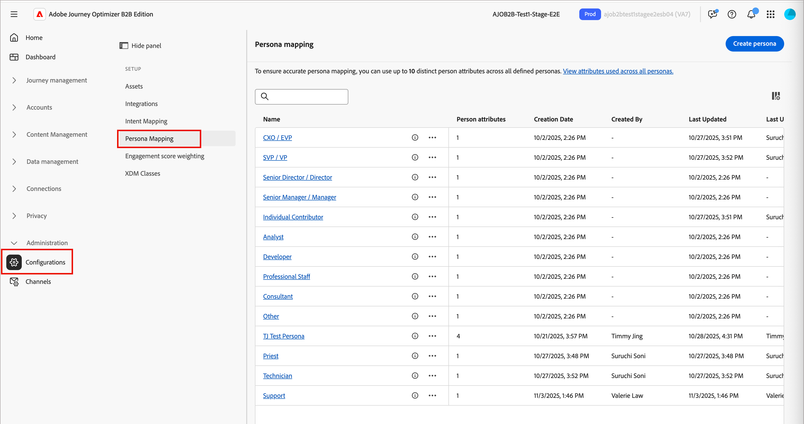

# Mapeamento de personas

<!-- not available until GA -->

As personas são um aspecto principal em uma abordagem de marketing baseado em conta (ABM) porque ajudam os profissionais de marketing a ajustar suas estratégias às necessidades, preferências e pontos problemáticos específicos dos indivíduos nas contas de destino. Os profissionais de marketing podem criar perfis detalhados para cada persona, incluindo o histórico, as responsabilidades, os pontos problemáticos e os canais de comunicação preferidos. Com essas definições, os administradores podem configurar personas de acordo com os atributos de pessoa no Journey Optimizer B2B Prime, para que as listas de pessoas e as jornadas de pessoas possam usar uma filtragem simplificada e consistente que capture essas personas.

No Journey Optimizer B2B Prime, o mapeamento de persona fornece um recurso adicional além das condições do modelo de função: você pode filtrar [listas de pessoas](../audiences/people-lists.md) e [jornadas de pessoas](../marketing/person-journeys.md) usando **[!UICONTROL Persona derivada]** como critério de filtro. Um _perfil derivado_ é o perfil que o sistema infere para um registro de pessoa avaliando seus atributos em relação a todas as definições de perfil configuradas.

Definição pessoal e limitações de uso:

* É possível ter até 20 personalidades definidas na lista _[!UICONTROL Mapeamento de persona]_.
* Cada persona pode incluir até cinco atributos em sua definição.
* Em todas as personalidades definidas, você pode usar até dez atributos de pessoa diferentes.

>[!BEGINSHADEBOX]

**Caso de uso: variações de cargo**

Muitas equipes de marketing e vendas usam cargos como uma maneira de identificar diferentes perfis em uma conta. Mas os títulos dos contatos podem ser inconsistentes e usar várias variações para funções semelhantes. Ao criar filtros de lista de pessoas ou condições de público-alvo de jornada de pessoas, pode ser necessário definir cada título de trabalho relacionado possível para uma determinada função. É possível simplificar essas definições e trazer pessoas com títulos de trabalho semelhantes para uma persona inferida, que você pode direcionar filtrando por _A Persona derivada é o Gerenciamento de produto_ em vez de corresponder a valores de título de trabalho individuais.

>[!ENDSHADEBOX]

## Acessar os perfis configurados {#access}

1. Na navegação à esquerda, escolha **[!UICONTROL Administração]** > **[!UICONTROL Configurações]**.

1. Clique em **[!UICONTROL Mapeamento de persona]** no painel intermediário para exibir a lista de personas.

   {width="800" zoomable="yes"}

   Nesta página, você pode [criar](#create-a-persona), [editar](#edit-a-persona) ou [excluir](#delete-a-persona) personas.

   A lista Mapeamento de pessoas está organizada como uma tabela e exibe os perfis atualizados mais recentemente na parte superior (classificado por _[!UICONTROL Última atualização]_). Você pode personalizar a tabela exibida ao clicar no ícone _Configurações de coluna_ (  ) no canto superior direito e marcar ou desmarcar as caixas de seleção da coluna.

   {width="300"}

1. Para acessar os detalhes de uma persona, clique no nome.

### Personas padrão

A lista _Mapeamento de persona_ inclui cinco personas padrão definidas de acordo com o atributo de cargo. Você pode editar qualquer um desses perfis padrão de acordo com as necessidades de sua organização:

| Persona | Cargos |
| ------- | ---------- |
| CXO / EVP - CXO / Vice-presidente executivo | CEO, CIO, CTO, CMO, CFO, vice-presidente executivo de estratégia |
| Vice-presidente/Vice-presidente sênior | Vice-presidente de marketing, vice-presidente de vendas, vice-presidente de operações, vice-presidente de produtos, vice-presidente de TI |
| Diretor sênior / Diretor - Diretor sênior / Diretor | Diretor de engenharia, Diretor sênior de produto, Diretor financeiro, Diretor de sucesso do cliente |
| Gerente sênior / Gerente - Gerente sênior / Gerente | Gerente de marketing sênior, gerente de TI, gerente de operações, gerente de vendas, gerente de RH |
| Contribuinte Individual - Contribuinte Individual | Executivo de contas, engenheiro de software, especialista em marketing, representante de sucesso do cliente |
| Analista - Analista | Analista de negócios, Analista de dados, Analista de pesquisa de mercado, Analista financeiro, Analista de operações |
| Desenvolvedor - Desenvolvedor | Desenvolvedor front-end, desenvolvedor back-end, desenvolvedor de pilha completa, desenvolvedor de aplicativos móveis, engenheiro de DevOps |
| Equipe profissional - Equipe profissional | Especialista de RH, consultor jurídico, analista de conformidade, gerente de projeto, especialista em aquisição |
| Consultor - Consultor | Consultor de gerenciamento, consultor de TI, consultor de processos de negócios, consultor de marketing |
| Outro - Outro | Especialista do setor, consultor independente, consultor independente, especialista no assunto |

### Filtragem de lista

Para localizar o perfil desejado, insira uma cadeia de texto na barra de pesquisa para corresponder perfis por nome.

{width="700" zoomable="yes"}

## Criar uma persona {#create-a-persona}

1. Na navegação à esquerda, escolha **[!UICONTROL Administração]** > **[!UICONTROL Configuração]**.

1. Clique em **[!UICONTROL Mapeamento de persona]** no painel intermediário.

1. Clique em **[!UICONTROL Criar persona]**.

1. Insira um **[!UICONTROL Nome]** e uma **[!UICONTROL Descrição]** exclusivos (opcional) para a persona.

   {width="700" zoomable="yes"}

1. Selecione os atributos a serem usados para corresponder à persona.

   * Clique em **[!UICONTROL Selecionar atributos de pessoa]**.

   * Na caixa de diálogo, marque a caixa de seleção de cada atributo que você deseja mapear (no máximo cinco).

     Você pode personalizar a tabela exibida clicando no ícone _Configurações de coluna_ (  ) no canto superior direito.

     Para filtrar a lista de atributos por nome, digite uma string de texto na barra de pesquisa. Você também pode clicar no ícone _Filtro_ (  ) na parte superior esquerda para filtrar a lista exibida por tipo, _Padrão_ ou _Personalizado_.

     {width="700" zoomable="yes"}

   * Clique em **[!UICONTROL Salvar]**.

     Os atributos selecionados são preenchidos na seção _[!UICONTROL Atributos pessoais]_.

1. Para cada atributo, insira os valores separados por vírgula que você deseja corresponder ao atributo.

1. Clique em **[!UICONTROL Enviar]**.

## Editar uma persona {#edit-a-persona}

Clique no nome da persona para acessar e editar os detalhes dela.

Você pode alterar o nome ou a descrição, adicionar atributos ou atualizar os valores do atributo. Clique em **[!UICONTROL Enviar]** quando as alterações forem concluídas.

## Excluir um perfil {#delete-a-persona}

Excluir uma pessoa a remove da lista _Mapeamento de pessoas_ e ela não está mais disponível como um filtro de pessoa derivado em listas de pessoas ou jornadas de pessoas.

1. Na página _[!UICONTROL Mapeamento pessoal]_, localize o perfil que deseja excluir.

1. Ao lado do nome, clique nas reticências (**...**) e escolha **[!UICONTROL Excluir]**.

1. Na caixa de diálogo de confirmação, clique em **[!UICONTROL Excluir]**.

## Filtrar por persona derivada {#derived-persona-filter}

Depois que as personas são configuradas, o Journey Optimizer B2B Prime deriva uma persona para cada registro de pessoa avaliando os atributos do registro em relação aos mapeamentos de persona definidos. Você pode usar o resultado inferido — a _Pessoa derivada_ — como filtro ao definir o público-alvo para uma lista de pessoas ou uma jornada de pessoa.

O filtro Persona derivado aparece no painel de filtros na categoria **[!UICONTROL Filtros especiais]** junto com outros atributos inferidos, como associação de jornada.

### Listas de pessoas

Ao adicionar ou remover membros de uma lista estática de pessoas, ou ao definir as regras de associação para uma lista dinâmica de pessoas, você pode filtrar por Persona derivada para direcionar todas as pessoas cujos atributos correspondam a uma persona configurada específica.

**Lista estática — Adicionar membros**

1. Abra a lista estática e clique em **[!UICONTROL Adicionar pessoas]** na parte superior direita.

1. Na caixa de diálogo de filtro, expanda **[!UICONTROL Filtros especiais]** e arraste **[!UICONTROL Persona derivada]** para a tela.

1. Na condição de filtro, escolha **[!UICONTROL é]** e selecione uma ou mais personalidades na lista.

1. Clique em **[!UICONTROL Concluído]** para aplicar o filtro e qualificar as pessoas correspondentes na lista.

**Lista dinâmica — Definir regras de associação**

1. Abra a lista dinâmica e selecione a guia **[!UICONTROL Regras]**.

1. Clique em **[!UICONTROL Editar regras]**.

1. Na caixa de diálogo de filtro, expanda **[!UICONTROL Filtros especiais]** e arraste **[!UICONTROL Persona derivada]** para a tela.

1. Na condição de filtro, escolha **[!UICONTROL é]** e selecione uma ou mais personalidades na lista.

1. Clique em **[!UICONTROL Concluído]** para salvar a regra.

   A associação é atualizada automaticamente à medida que os registros de pessoa são avaliados em relação à regra.

### Jornadas de pessoas

Ao configurar o público-alvo de uma jornada de pessoa usando um público-alvo de evento, você pode usar a Persona derivada como um filtro de perfil de pessoa para controlar quais pessoas entram na jornada.

1. Clique no nó **[!UICONTROL Público-alvo de pessoa]** na tela de jornada.

1. No painel de propriedades do nó, selecione **[!UICONTROL Audiência do evento]** como o tipo de audiência.

1. Em **[!UICONTROL Filtros de perfil de pessoa]**, clique em **[!UICONTROL Adicionar filtro]**.

1. Expanda **[!UICONTROL Filtros especiais]** e arraste **[!UICONTROL Persona Derivada]** para a tela de filtro.

1. Na condição de filtro, escolha **[!UICONTROL é]** e selecione uma ou mais personalidades na lista.

   Somente as pessoas cujo perfil derivado corresponda aos valores selecionados podem inserir a jornada.
