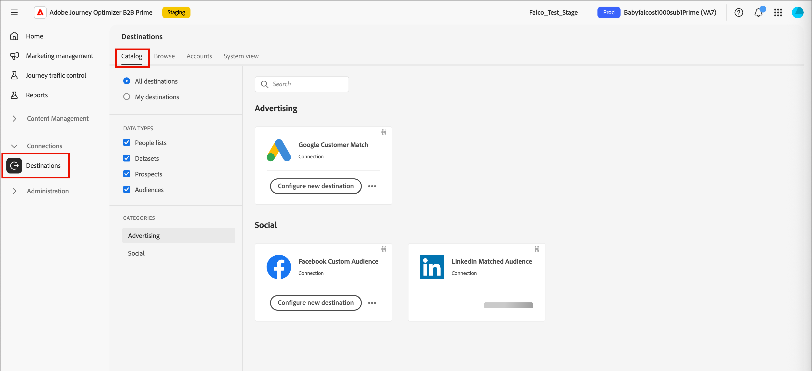

# Destinos

Os destinos são integrações pré-criadas que permitem exportar dados da lista de pessoas do [!DNL Adobe Journey Optimizer B2B Prime] para plataformas de marketing externas, como redes de publicidade, provedores de serviços de email e sistemas de CRM. Em [!DNL Journey Optimizer B2B Prime], você ativa [listas de pessoas estáticas](./people-lists.md#static-list) (compostas por registros de pessoas do Marketo Engage) para destinos de modo que esses públicos-alvo estejam disponíveis para direcionamento e envolvimento em canais downstream.

<!-- 
Does not align w/AEP info for Beta

Activating a static list to a destination follows a three-step process:

1. **Connect** — Authenticate and configure a connection to a destination platform.
1. **Map** — Select the static list and map its people attributes to the fields required by the destination.
1. **Schedule** — Define when and how often the list data is exported to the destination.

Destination activations reflect the membership state of the static list at the time of each synch.

## Destination types {#destination-types}

[!DNL Journey Optimizer B2B Prime] supports the following destination types for activating static people lists:

| Type | Description |
|--- |--- |
| Streaming | Real-time API-based connections that push audience membership updates to the destination as they occur. |
| File-based (batch) | Scheduled exports that deliver audience data as structured files to cloud storage or SFTP locations, which the destination platform then ingests. |

-->

## Conectar um destino {#connect-destination}

1. Na navegação à esquerda, expanda **[!UICONTROL Conexões]** e selecione **[!UICONTROL Destinos]**.

1. Na guia _[!UICONTROL Catálogo]_, localize o conector de tipo de destino externo.

   >[!TIP]
   >
   >Você pode encontrar rapidamente o conector inserindo o nome, como `LinkedIn`, na caixa de pesquisa.

   {width="800" zoomable="yes"}

1. Na placa do conector, clique em **[!UICONTROL Configurar novo destino]**.

1. Selecione **[!UICONTROL Nova conta]** e insira suas credenciais de conta.

   {width="500"}

1. Clique em **[!UICONTROL Conectar ao destino]**.

   >[!IMPORTANT]
   >
   >Neste ponto, **não** insira os _[!UICONTROL detalhes do Destino]_. Somente a conexão é necessária.

1. Revise as configurações de governança de dados e ação de marketing e clique em **[!UICONTROL Salvar]**.

O destino conectado aparece na lista da guia _[!UICONTROL Procurar]_ e está disponível para ativação de lista estática.

## Ativar uma lista estática para um destino {#activate}

>[!NOTE]
>
>Somente [listas estáticas de pessoas](./people-lists.md#static-list) podem ser ativadas para destinos em [!DNL Journey Optimizer B2B Prime]. [As listas dinâmicas](./people-lists.md#dynamic-lists) não estão qualificadas para ativação de destino.

1. Na navegação à esquerda, expanda **[!UICONTROL Gerenciamento de marketing]**.

1. À direita na lista de recursos de **[!UICONTROL Marketing]**, selecione **[!UICONTROL Listas de pessoas]**.

   {width="800" zoomable="yes"}

1. Selecione a guia **[!UICONTROL Listas estáticas]**.

1. Localize a lista estática que deseja ativar para um destino.

1. Clique no ícone _Ativar_ (  ) ao lado do nome da lista estática.

1. Marque a caixa de seleção da conexão de destino configurada.

   {width="600" zoomable="yes"}

1. Clique em **[!UICONTROL Salvar]**.

<!--

This method not working for Beta

1. On the _[!UICONTROL Browse]_ tab, locate the destination you want to use for the activation and click the name to open it.

1. Select the **[!UICONTROL Activation data]** tab.

1. Click **[!UICONTROL Activate people lists]**.

1. Select the static people list you want to export and click **[!UICONTROL Next]**.

1. Map the people list attributes to the required fields of the destination schema and click **[!UICONTROL Next]**.

1. Set the export schedule:

   * **[!UICONTROL Frequency]** — Choose how often the list is exported (for example, daily or weekly).
   * **[!UICONTROL Start date]** — Set when the first export should run.

1. Review the activation summary and click **[!UICONTROL Finish]**.

The activation is created and the static list data is exported to the destination according to the defined schedule.

-->
