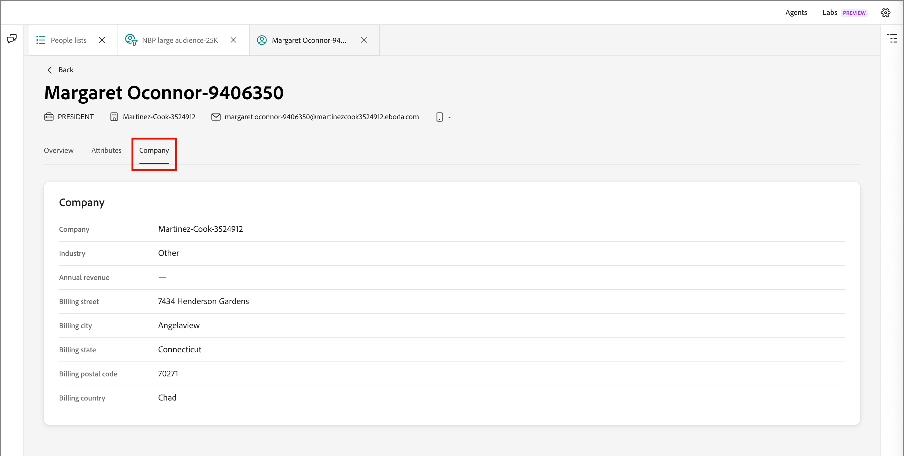

# Dados da pessoa

Em [!DNL Adobe Journey Optimizer B2B Prime], quando você clica no nome de uma pessoa na guia _[!UICONTROL Membros]_ de uma [lista de pessoas](./people-lists.md), a página de detalhes da pessoa abre com uma exibição consolidada desse indivíduo. Esta página fornece:

* Um resumo de intenção, envolvimento e persona gerado por IA
* Um histórico completo de atividades
* Atributos do perfil e da empresa
* Interface de bate-papo do Assistente de IA com escopo para responder perguntas sobre a pessoa

## Abrir detalhes da pessoa {#open-person-details}

1. Na navegação à esquerda, expanda **[!UICONTROL Gerenciamento de marketing]**.

1. À direita na lista de recursos de **[!UICONTROL Marketing]**, selecione **[!UICONTROL Listas de pessoas]**.

1. Abra uma lista dinâmica ou estática.

1. Clique no **[!UICONTROL Nome]** de uma pessoa da lista.

   {width="600" zoomable="yes"}

A página de detalhes da pessoa é aberta com três guias: **[!UICONTROL Visão geral]**, **[!UICONTROL Atributos]** e **[!UICONTROL Empresa]**.

## Cabeçalho da página {#page-header}

O cabeçalho exibe o nome da pessoa como o título da página, juntamente com uma faixa de contato de visão rápida:

* Nome do cargo
* Empresa
* Endereço de email
* Número de telefone

Clique em **[!UICONTROL Voltar]** para retornar à lista de origem.

## Guia Visão geral {#overview-tab}

A guia **[!UICONTROL Visão geral]** contém os cartões de resumo de cliente potencial e a linha do tempo da atividade.

{width="700" zoomable="yes"}

### Resumo de clientes potenciais {#lead-summary}

Três cartões fornecem uma avaliação gerada por IA da pessoa:

| Cartão | Conteúdo |
|---|---|
| **[!UICONTROL Pessoa]** | O [perfil derivado](./personas.md) da pessoa, além de uma breve narrativa que descreve sua função, empresa e setor. Clique no ícone de informações para obter mais detalhes. |
| **[!UICONTROL Engajamento]** | A [pontuação de engajamento da pessoa](./engagement-scores.md), tendência (por exemplo, _Crescente_) e nível (_Baixo_, _Medium_, _Alto_). |
| **[!UICONTROL Propósito]** | Tentativa de compra detectada, ou _Nenhuma detectada_, com orientação contextual e um link para ajudar a aumentar a intenção do produto. |

### Atividades {#activities}

Abaixo do resumo de clientes potenciais, o painel **[!UICONTROL Atividades]** lista o histórico completo de interação da pessoa, agrupado por data. Cada grupo de datas pode ser expandido e recolhido, e cada linha mostra um carimbo de data/hora, uma marca de tipo de atividade (por exemplo, _[!UICONTROL Alterar valor dos dados]_, _[!UICONTROL Adicionar à lista]_, _[!UICONTROL Adicionar pessoa à Jornada]_ ou _[!UICONTROL Transição de nó de Jornada]_) e uma descrição em linguagem simples do que aconteceu. Quando aplicável, a descrição inclui um link, como **[!UICONTROL Exibir lista]** ou **[!UICONTROL Exibir jornada]**, para ir para o objeto relacionado.

Use os controles do painel para trabalhar com a linha do tempo:

* **Tipo de atividade** - Filtre a linha do tempo para um tipo de atividade específico, como envios por email, interações de webinário ou alterações de lista e jornada.
* **Intervalo de datas** - Restrinja a linha do tempo a um intervalo de datas específico usando o controle de calendário.
* **[!UICONTROL Exportar]** - Exporta os dados de atividade visíveis.
* **[!UICONTROL Recolher tudo] / [!UICONTROL Expandir tudo]** - Alternar cada agrupamento de datas aberto ou fechado simultaneamente.

## Guia Atributos {#attributes-tab}

{width="700" zoomable="yes"}

A guia **[!UICONTROL Atributos]** exibe os campos de perfil armazenados da pessoa como uma lista de rótulo/valor:

* Nome
* Segundo nome
* Sobrenome
* Email
* Título
* Telefone
* Endereço
* Cidade
* Estado
* País
* Empresa
* Criado
* Última atualização

## Guia Empresa {#company-tab}

{width="700" zoomable="yes"}

A guia **[!UICONTROL Empresa]** exibe dados firmográficos associados à empresa da pessoa:

* Empresa
* Setor
* Receita anual
* Rua de cobrança
* Cidade de faturamento
* Estado da cobrança
* Código postal de cobrança
* País de cobrança

Os campos sem dados disponíveis são mostrados como um traço.

## Pergunte ao assistente de IA sobre uma pessoa {#ask-ai-assistant}

Abra o ícone do painel **[!UICONTROL Assistente de IA]** próximo à parte superior da página para obter ajuda com o registro de pessoa atual. O painel abre com escopo para essa pessoa — um chip abaixo do thread da mensagem (por exemplo, _pessoa: [Nome da pessoa]_) confirma qual registro seus prompts direcionam.

{width="700" zoomable="yes"}

### Iniciar com base em um prompt sugerido {#suggested-prompts}

Quando você abre o painel a partir de uma página de detalhes da pessoa, o Assistente de IA recebe você com uma mensagem de boas-vindas contextual e prompts sugeridos por padrão, como:

* _Ajude-me a entender o [Nome da pessoa]_
* _Conte-me sobre a persona de [Nome da pessoa]_
* _Resumir a atividade de engajamento_ de [Nome da pessoa]

Clique em um prompt sugerido ou digite sua própria pergunta na caixa de entrada na parte inferior do painel.

### Revisar a resposta {#review-response}

Selecionar um prompt executa uma [habilidade](../agents/skills.md) de várias etapas, mostrada como etapas de status sequenciais (por exemplo, _Pesquisar pessoa por ID_ e _Obter história de pessoa_) enquanto o Assistente de IA compõe a resposta. A resposta é um resumo estruturado que pode incluir detalhes do perfil, histórico de engajamento e desempenho de email da pessoa.

Use o controle para cima/baixo para classificar a resposta. Como em toda a saída do Assistente de IA, analise a resposta antes de usá-la. Para obter mais informações, consulte as [Diretrizes de usuário da IA gerativa da Adobe](https://www.adobe.com/legal/licenses-terms/adobe-dx-gen-ai-user-guidelines.html){target="_blank"}.
