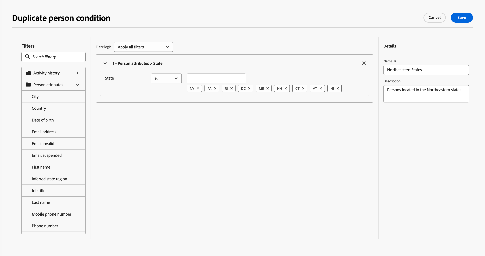

# Conteúdo condicional

O conteúdo condicional permite adaptar o conteúdo do email e fragmentá-lo com base em regras condicionais. Essas regras são definidas usando atributos de perfil ou eventos contextuais. Você pode criar regras condicionais no construtor de regras e armazená-las para reutilização em suas jornadas pessoais.

Para adicionar conteúdo condicional aos seus fragmentos e mensagens de email, o [!DNL Journey Optimizer B2B Prime] permite aplicar regras condicionais armazenadas na biblioteca _Condições_. Aplique regras condicionais no espaço de design visual ao criar [conteúdo de email](./email-authoring.md) ou um [fragmento](./fragment-authoring.md).

## Adicionar conteúdo condicional {#add-conditional-content}

>[!CONTEXTUALHELP]
>id="ajo-b2b-prime_conditional_content"
>title="Conteúdo condicional"
>abstract="Use regras condicionais para criar diversas variantes de um componente de conteúdo. Se nenhuma das condições for atendida ao enviar a mensagem, o conteúdo da variante padrão será exibido."

>[!CONTEXTUALHELP]
>id="ajo-b2b-prime_conditional_rule_select"
>title="Conteúdo condicional"
>abstract="Use uma regra condicional salva na biblioteca ou crie uma nova."

Ao criar um [fragmento](./fragment-authoring.md) ou um [email](./email-authoring.md) no espaço de design visual, use regras condicionais para definir várias variantes para um componente de conteúdo.

1. Selecione um componente de conteúdo e clique no ícone **[!UICONTROL Habilitar conteúdo condicional]** na barra de ferramentas do componente.

   Consulte [Barras de ferramentas do componente de conteúdo](./content-components.md#content-component-toolbars).

   O componente é contornado em laranja para indicar que está ativado como um componente condicional. O painel **[!UICONTROL Conteúdo Condicional]** é exibido à esquerda com a _Variante Padrão_ e a _Variante - 1_.

   {width="700" zoomable="yes"}

   O conteúdo original selecionado e ativado é o padrão e se aplica quando nenhuma das regras condicionais é satisfeita para nenhuma das variantes definidas.

   Nesse painel, você pode definir várias variantes para o componente de conteúdo selecionado usando regras condicionais.

1. Passe o mouse sobre a primeira variante (_Variante - 1_) e clique no ícone _Selecionar condição_ (  ).

   {width="700" zoomable="yes"}

   A caixa de diálogo _[!UICONTROL Selecionar condição]_ é aberta e exibe a biblioteca de condições.

   Se desejar exibir detalhes de uma condição para garantir que ela seja o que você deseja, clique no ícone _Mais menu_ (**...**) e escolha **[!UICONTROL Exibir Informações]**.

   {width="600" zoomable="yes"}

   Se a condição necessária não existir, [crie uma regra condicional](#create-conditional-rule) clicando em **[!UICONTROL Criar novo]**.

1. Selecione a regra condicional e clique em **[!UICONTROL Selecionar]** para associá-la à variante.

<!-- 

   You can review the associated condition by clicking the _More menu_ icon (**...**) for the variant and choosing **[!UICONTROL View condition]**.

   {width="600" zoomable="yes"}

   Click X at the top right to close the popup.

   {width="500"}

   -->

1. Para facilitar a leitura, renomeie a variante clicando no ícone _Mais menu_ (**...**) para a variante e escolhendo **[!UICONTROL Renomear]**.

   Insira um nome significativo para a variante que ajude a identificar a variante e sua intenção.

   {width="600" zoomable="yes"}

1. Com a variante selecionada no painel esquerdo, altere o componente para alterar como ele aparece na mensagem quando a condição for verdadeira.

   Neste exemplo, a variante do componente de texto usa uma descrição diferente com base na região do recipient.

   {width="600" zoomable="yes"}

1. Se necessário, defina outra variante clicando em **[!UICONTROL Adicionar variante]**.

   Repita as etapas 2 a 5 para selecionar uma condição, renomear a variante e alterar o componente para a variante.

   É possível adicionar quantas variantes forem necessárias para o componente de conteúdo. Altere a variante selecionada no painel esquerdo a qualquer momento para verificar como o componente de conteúdo aparece para a condição.

   >[!IMPORTANT]
   >
   >O conteúdo condicional é avaliado em relação às regras associadas na ordem em que as variantes são listadas. A primeira variante com uma condição que é avaliada como verdadeira é usada para o componente.
   >
   >Se nenhuma das condições de variante definidas for considerada verdadeira ao enviar a mensagem, o componente de conteúdo aparecerá de acordo com a **[!UICONTROL Variante padrão]**.

1. Para excluir uma variante, clique no ícone _Mais menu_ (**...**) para a variante e escolha **[!UICONTROL Excluir]**.

   Clique em **[!UICONTROL Excluir]** no diálogo de confirmação.

## Regras condicionais {#conditional-rules}

As regras condicionais são um conjunto de expressões condicionais que podem ser avaliadas como true ou false. Use essas regras para determinar qual variante de conteúdo exibir em uma mensagem com base em vários filtros, como atributos de perfil ou eventos contextuais.

As regras são armazenadas na biblioteca de condições, onde estão disponíveis para reutilização em emails e fragmentos de conteúdo para sua organização.

<!--
M1.5 info -- out of date?

### Condition filters {#condition-filters}

| Condition type | Filters | Description |
| -------------- | ------- | ----------- |
| **Account** | Account Attributes | Attributes from the account profile, including: <li>Annual revenue</li><li>City</li><li>Country</li><li>Employee size</li><li>Industry</li><li>Name</li><li>SIC code</li><li>State</li> |
| | [!UICONTROL Special filters] > [!UICONTROL Has Buying Group] | The account does or does not have members of buying groups. The filter can also be evaluated against one or more of the following criteria: <li>Solution Interest</li><li>Buying Group status</li><li>Completeness Score</li><li>Engagement Score</li> |
| **Person** | [!UICONTROL Activity history] > [!UICONTROL Email] | Email activities associated with the journey: <li>[!UICONTROL Clicked link in email]</li><li>Opened Email</li><li>Was delivered email</li><li>Was sent email</li> These conditions are evaluated using a selected email message from earlier in the journey. |
| | [!UICONTROL Person Attributes] | Attributes from the person profile, including: <li>City</li><li>Country</li><li>Date of birth</li><li>Email address</li><li>Email invalid</li><li>Email suspended</li><li>First name</li><li>Inferred state region</li><li>Job title</li><li>Last name</li><li>Mobile phone number</li><li>Phone number</li><li>Postal code</li><li>State</li><li>Unsubscribed</li><li>Unsubscribed reason</li> |
| | [!UICONTROL Special filters] > [!UICONTROL Member of Buying Group] | The person is or is not a buying group member evaluated against one or more of the following criteria: <li>Solution Interest</li><li>Buying Group status</li><li>Completeness Score</li><li>Engagement Score</li><li>Is Removed</li><li>Role</li> |
-->

### Criar uma regra condicional {#create-conditional-rule}

>[!CONTEXTUALHELP]
>id="ajo-b2b-prime_conditions_rule_editor"
>title="Criar condição"
>abstract="Combine atributos e eventos contextuais para criar regras que determinem qual variante de conteúdo será exibida em mensagens de email."

Acesse o construtor de regras condicionais no espaço de design ao selecionar uma condição para uma variante de componente.

1. Na caixa de diálogo _[!UICONTROL Selecionar condição]_, clique em **[!UICONTROL Criar novo]**.

   {width="700" zoomable="yes"}

   Esta ação abre a caixa de diálogo _[!UICONTROL Criar condição]_. Use as ferramentas de caixa de diálogo para combinar atributos na tela (semelhante à experiência de construção de segmentos no Experience Platform). Os atributos do filtro são organizados em três guias:

   * **[!UICONTROL Perfil]** - O Esquema XDM do Perfil B2B lista todos os atributos de perfil associados ao esquema XDM (Experience Data Model) definido no Adobe Experience Platform.

   * **[!UICONTROL Contextual]** - Quando a mensagem é usada em uma jornada, os campos de jornada contextual ficam disponíveis por meio desta guia.

   * **[!UICONTROL Públicos-alvo]** - Lista todos os públicos-alvo gerados a partir das definições de segmento criadas no serviço de Segmentação do Adobe Experience Platform.

   {width="700" zoomable="yes"}

1. Crie a regra condicional de acordo com suas necessidades.

   Para cada filtro que deseja incluir na regra, arraste e solte o item na tela da regra. Expanda o filtro e conclua a expressão.

   {width="700" zoomable="yes"}

   Arraste e solte filtros adicionais conforme necessário.

   Se você incluir mais de um filtro, poderá alternar a configuração de lógica do filtro de acordo com como deseja aplicar os filtros:

   * **[!UICONTROL E]** - A regra é avaliada como verdadeira se **todos** os filtros forem verdadeiros.
   * **[!UICONTROL Ou]** - A regra é avaliada como verdadeira se **qualquer** dos filtros for verdadeira.

   {width="700" zoomable="yes"}

1. Clique em **[!UICONTROL Selecionar]** para usar a regra personalizada para a condição.

   Se quiser disponibilizar a regra para reutilização, você poderá adicioná-la à biblioteca.

### Adicionar uma condição à biblioteca {#add-to-library}

1. Na caixa de diálogo Criar Condição, clique em **[!UICONTROL Salvar condição]** na parte inferior.

1. À direita, digite o **[!UICONTROL Nome]** (obrigatório) e uma **[!UICONTROL Descrição]** (opcional) para a regra.

   Use um nome significativo e uma descrição útil para ajudar outras pessoas em sua organização a reutilizá-lo, em vez de criar uma condição duplicada.

   {width="700" zoomable="yes"}

1. Clique em **[!UICONTROL Adicionar]**.

   A regra condicional é salva na biblioteca e você pode selecioná-la para a variante atual. Ele também está incluído na biblioteca para uso por qualquer outra variante de conteúdo dinâmico nas jornadas de pessoa.

>[!NOTE]
>
>Não é possível modificar uma regra condicional salva na biblioteca. No entanto, é possível usar uma regra salva para criar uma nova regra. Para fazer isso, abra a regra condicional, faça as alterações desejadas e salve-a na biblioteca com um novo nome.

<!--

### Duplicate a rule {#duplicate-rule}

Conditional rules saved to the library cannot be modified. However, you can duplicate an existing rule and change it to create a new rule.

1. Click the _More menu_ icon (**...**) for the variant and choose **[!UICONTROL Duplicate]**.

   A duplicate of the rule opens in the rule builder. Use the duplicate as a starting point for the rule that you want to build.

   {width="600" zoomable="yes"}

1. In the rule builder, change, add, or delete conditions according to what you need.

1. Change the name and description to match the purpose or items in the rule.

1. When your conditional rule is complete, click **[!UICONTROL Save]**.
-->
