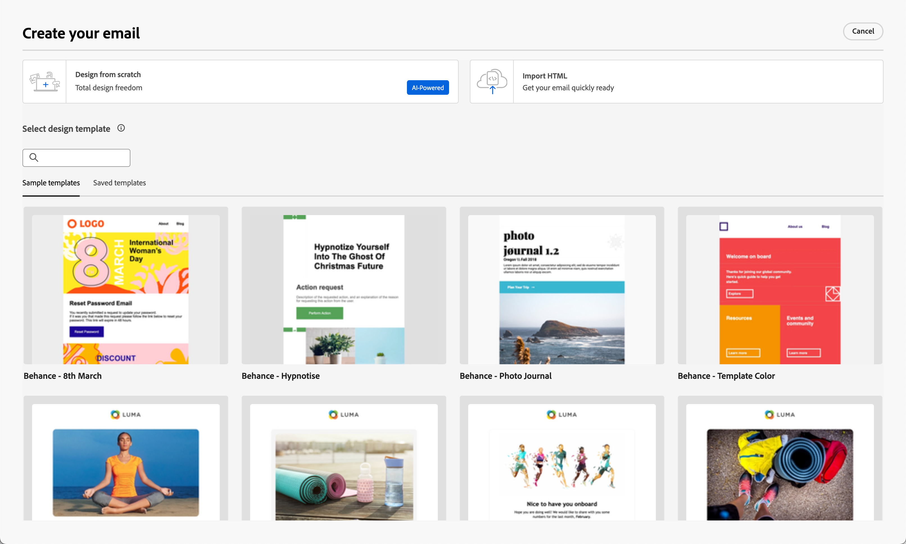

# Criação de conteúdo de email

No [!DNL Adobe Journey Optimizer B2B Prime], o espaço de design de email fornece uma tela visual onde os profissionais de marketing compõem emails. As ferramentas de design de email nos painéis à esquerda e na parte superior (estruturas, componentes de conteúdo, modelos, fragmentos e muito mais) oferecem suporte à criação do zero com arrastar e soltar. Você também pode optar por iniciar com base em um modelo, colar HTML bruto ou reunir mensagens de fragmentos visuais reutilizáveis.

>[!IMPORTANT]
>
>Para obter a configuração do administrador de subdomínios, autenticação, pools de IP e configurações de canal de email, consulte [Entregabilidade de email](../start/email-deliverability.md) e [Configuração de canal de email](../admin/email-channel-configuration.md).

No [!DNL Journey Optimizer B2B Prime], cada email está associado a uma ação _[!UICONTROL Enviar Email]_ na jornada de uma pessoa. O fluxo de trabalho completo, desde o design da jornada até a definição de email, acontece em uma experiência contínua. Quando você [adicionar um nó _Enviar Email_](../marketing/action-nodes.md#add-an-action-node) a uma jornada de pessoa, clique em **[!UICONTROL Criar email]** para iniciar o processo. Primeiro, defina as Ações e as configurações de conteúdo para o email. Clique em **[!UICONTROL Editar corpo do email]** para iniciar o espaço de design de conteúdo de email, no qual você pode escolher como deseja criar seu email a partir das seguintes opções:

* [Crie o email do zero](#design-from-scratch) usando a interface de design visual. Crie o componente de layout de email por componente usando a função arrastar e soltar em uma tela em branco. Esse método é melhor para criar novos modelos ou emails únicos.

* [Importe conteúdo existente do HTML](#import-html-content) para o editor de código ou trabalhe lado a lado com a tela visual.

* [Selecione um modelo existente](#templates) em uma lista de modelos de email predefinidos ou personalizados. Esse método é mais adequado para casos de uso de email repetíveis.

<!-- * Upload a design prototype (JPG, PNG, PDF, or Figma export) and have AI Assistant convert it into a responsive HTML email. (Image to HTML (Img2HTML) -->

{width="800" zoomable="yes"}

## Ferramentas de design de email {#email-design-tools}

* **Barra de ferramentas superior:** Salvar, Voltar, Alternar para o editor de código, controles de visualização.
* **Painel esquerdo:** Estruturas (layouts de coluna), Conteúdo (texto, botão, imagem, divisor, social, HTML), Fragmentos, Modelos, Árvore de navegação (hierarquia de estilo DOM do email).
* **Tela do Centro:** editor do WYSIWYG com visualização móvel e de área de trabalho.
* **Painel direito:** configurações e estilos do componente selecionado no momento, incluindo propriedades de conteúdo, plano de fundo, borda, preenchimento e personalização.

>[!BEGINSHADEBOX]

## Práticas recomendadas de design de email {#design-best-practices}

Seguir as práticas recomendadas do HTML e do CSS ajuda a garantir a renderização consistente entre os clientes de email.

| Abordagem | Orientação |
| -------- | -------- |
| **Recomendado** | Layouts estáticos baseados em tabela · Tabelas HTML e tabelas aninhadas · Larguras de modelo de 600 a 800 px · CSS simples em linha · Fontes seguras para a Web |
| **Use com cuidado** | Imagens de plano de fundo (suporte limitado ao cliente) · Fontes personalizadas da Web (sempre definir uma fonte de fallback) · Layouts com mais de 800 px · Mapas de imagem |
| **Evitar** | JavaScript, iframes ou Flash · Áudio ou vídeo incorporado · Formulários HTML · Layouts baseados em Div |

>[!NOTE]
>
>O conteúdo do email também deve atender aos requisitos de acessibilidade digital aplicáveis. Cabeçalhos de estrutura logicamente, fornecem texto alternativo para todas as imagens e verificam o contraste de cores nos modos claro e escuro.

>[!ENDSHADEBOX]

## Criar email do zero {#design-from-scratch}

Use o espaço de design de conteúdo visual para definir a estrutura e o conteúdo do email. Ao adicionar e mover componentes estruturais com ações simples de arrastar e soltar, é possível projetar o layout e a organização do conteúdo de email em segundos.

1. Na página _[!UICONTROL Criar seu email]_, selecione a opção **[!UICONTROL Criar do zero]**.

<!-- 

1. In the _[!UICONTROL Create email]_ dialog, choose the type of email content that you want to author.

   * **[!UICONTROL Use Themes]** - Choose this option to create the email in _Theme mode_. In this mode, you can use a defined brand theme to streamline the content authoring process and make sure that the design aligns with defined standards.

   * **[!UICONTROL Manual Styling]** - Choose this option to create the email in _Manual mode_. In this mode, you manually set the styling for all structure and content components that you add to the blank canvas.

-->

1. [Adicionar componentes de estrutura e conteúdo](#structure-content) à tela.

1. [Examinar e atualizar links](#preview-and-edit-linked-urls).

1. [Testar o email](#check-and-test-the-email).

Quando estiver satisfeito com o conteúdo, clique em **[!UICONTROL Salvar]**.

## Importar conteúdo existente do HTML {#import-html-content}

{{$include /help/_includes/content-design-import.md}}

{width="500"}

>[!NOTE]
>
>Usar uma marca `<table>` como a primeira camada em um arquivo do HTML pode causar perda de estilo, incluindo configurações de plano de fundo e largura na marca de camada superior.

Você pode personalizar o conteúdo importado conforme necessário com as ferramentas do editor visual de email.

## Selecione um modelo {#templates}

Ao abrir o espaço de design de email, use a seção **[!UICONTROL Selecionar modelo de design]** para começar a partir de um modelo de amostra interno ou de um modelo personalizado salvo. Consulte [Usar um modelo em um email](./templates.md#use-in-journey) para obter o fluxo de trabalho completo.

>[!NOTE]
>
>Os modelos salvos podem ter configurações de governança (bloqueio de conteúdo) aplicadas a um ou mais componentes. O espaço de design visual fornece diretrizes sobre componentes bloqueados quando você [cria um email a partir de um modelo controlado](./template-content-governance.md).

## Adicionar estrutura e conteúdo {#structure-content}

Use o editor visual de email para criar sua mensagem de email. Adicione um pré-cabeçalho, estruture o layout com colunas e divisores e preencha essas estruturas com componentes de conteúdo, como imagens, botões e texto. Você também pode aplicar CSS personalizado para estilos avançados e visualizar como o design é renderizado no modo escuro.

### Definir o pré-cabeçalho {#preheader}

O pré-cabeçalho é o trecho de texto exibido após a linha de assunto nas visualizações da caixa de entrada. No [!DNL Journey Optimizer B2B Prime], o pré-cabeçalho é configurado na tela visual do espaço de design de email, não na tela de propriedades de email ao lado da linha de assunto.

Com o **[!UICONTROL Corpo]** selecionado na árvore de navegação esquerda, abra o painel **[!UICONTROL Configurações]** à direita.

Clique na região de texto **[!UICONTROL Pré-cabeçalho]** e insira sua cópia de pré-cabeçalho. Clique no ícone _Adicionar personalização_ (  ) para aplicar formatação e [tokens de personalização](#personalize-content) conforme necessário usando os controles de rich text.

>[!TIP]
>
>Mantenha seu pré-cabeçalho entre 40 e 100 caracteres. Ele deve complementar a linha de assunto (não repeti-la) e dar ao recipient um motivo extra para abrir o email.

### Modo escuro {#dark-mode}

A renderização no modo escuro tem suporte por meio de consultas de mídia `prefers-color-scheme` CSS. As ferramentas de design de email incluem uma pré-visualização no modo escuro e opções para definir o estilo personalizado para clientes de email, ajudando você a validar se o texto permanece legível, se os logotipos são visíveis e se as cores da marca se mantêm contra planos de fundo escuros.

Para obter orientações detalhadas sobre visualização, definição de configurações personalizadas do modo escuro, suporte a clientes de email e práticas recomendadas de teste, consulte [Modo escuro para conteúdo de email](./email-dark-mode.md).

### Adicionar componentes de estrutura e conteúdo {#components}

Crie seu layout de email adicionando [componentes de estrutura](./structure-components.md) e [componentes de conteúdo](./content-components.md) à tela. Arraste os itens das seções **[!UICONTROL Estruturas]** e **[!UICONTROL Conteúdo]** no painel esquerdo e configure cada componente nas guias _[!UICONTROL Configurações]_ e _[!UICONTROL Estilos]_ à direita.

### Adicionar CSS personalizado {#custom-css}

Você pode adicionar CSS personalizado diretamente no espaço de design de email para obter um estilo avançado, além das configurações padrão do componente. É uma prática recomendada adicionar esse estilo de mais alto nível antes de incluir componentes de conteúdo, como imagens, botões e texto.

Consulte [Adicionar CSS personalizado para o seu conteúdo](./design-custom-css.md) para obter etapas, regras de sintaxe e solução de problemas.

>[!NOTE]
>
>Se sua mensagem de email for criada usando um [modelo com conteúdo bloqueado](./template-content-governance.md), você não poderá adicionar CSS personalizado ao seu conteúdo. O rótulo do botão é alterado para **[!UICONTROL Exibir CSS personalizado]** e qualquer CSS personalizado já presente no conteúdo é somente leitura.

### Adicionar fragmentos {#visual-fragments}

Um fragmento visual é um componente de design reutilizável que pode ser referenciado por vários ativos de conteúdo no [!DNL Journey Optimizer B2B Prime]. Geralmente, é um bloco de conteúdo que pode ser pré-criado e inserido rapidamente para tornar a criação mais rápida e consistente.

O exemplo a seguir descreve as etapas para adicionar fragmentos à medida que você cria seu conteúdo.

1. Para abrir a lista de fragmentos, selecione o ícone _Fragmentos_ (  ).

   É possível:

   * Classifique a listagem.
   * Procurar, pesquisar ou filtrar a listagem.
   * Alternar entre as visualizações em miniatura e em lista.
   * Atualize a lista para refletir qualquer um dos fragmentos criados recentemente.

   {width="700" zoomable="yes"}

1. Arraste e solte qualquer um dos fragmentos no componente estrutural.

   O editor renderiza o fragmento na seção/elemento da estrutura de email.

   O conteúdo do fragmento é atualizado dinamicamente na estrutura para visualizar como o fragmento é renderizado no email.

<!-- 
>[!BEGINSHADEBOX]

**Editable fields in customizable fragments**

A visual fragment can include editable fields that you can customize. Custom fields allow you to modify parameters when you incorporate the fragment into your content and create a tailored experience without affecting the original fragment. The fragment author can design the fragment for customization of text, image, and button components. If an included fragment contains components with editable fields, you can change the default values to customize it for your content.

1. Select the fragment component.

   The Settings displayed on the right include editable fields with the default values.

   {width="700" zoomable="yes"}   

1. Change any editable field as needed.

>[!ENDSHADEBOX]
-->

Depois que o email for salvo, ele aparecerá na página de detalhes do fragmento ao selecionar a guia _[!UICONTROL Usado por]_ no resumo.

### Adicionar ativos de imagem {#insert-image}

Quando [!DNL Journey Optimizer B2B Prime] é provisionado, os ativos existentes do Marketo Design Studio ficam disponíveis no espaço de design de email. Você pode navegar e inserir essas imagens em seus emails diretamente do seletor de ativos.

>[!IMPORTANT]
>
>A disponibilidade do ativo no [!DNL Journey Optimizer B2B Prime] é baseada em uma **cópia única** dos seus ativos do Marketo Design Studio. Modificar ativos no Marketo Engage após a cópia inicial **não** refletido em [!DNL Journey Optimizer B2B Prime]. Você também pode carregar ativos de imagem diretamente do espaço de design visual ou da [biblioteca Assets](./digital-asset-management.md).

Tipos de arquivo de imagem compatíveis:

* **Totalmente compatível** (visível no seletor, incorporável em linha): JPG, PNG, GIF, WebP.
* **Acessível com aviso**: SVG (com um aviso de que alguns clientes de email não renderizam o SVG).
* **Não suportado nesta versão do Beta:** TIFF, PDF, DOCX, XLSX, PPTX, CSS, JS, HTML, TXT, arquivos binários, PSD, AI, INDD.

No espaço de design de conteúdo visual, selecione o ícone do _Assets_ (  ) na barra de navegação esquerda. No seletor de ativos, é possível selecionar diretamente os ativos armazenados na biblioteca do Assets.

* Adicione um novo ativo arrastando e soltando o ativo de imagem em um componente de estrutura.

  {width="800" zoomable="yes"}

* Substitua um ativo de imagem existente selecionando-o na tela e clicando em **[!UICONTROL Selecionar ativo]** nas ferramentas de origem da imagem.

  {width="600" zoomable="yes"}

Para obter mais informações sobre o uso de ativos, consulte [_Usar ativos para criação de conteúdo_](./digital-asset-management.md#assets-authoring).

### Navegar pelas camadas, configurações e estilos {#navigation-layers}

Use a árvore de navegação para selecionar componentes e colunas e, em seguida, ajuste suas configurações e estilos no painel direito. Consulte [árvore de navegação](./structure-components.md#navigation-tree).

### Personalizar conteúdo {#personalize-content}

[!DNL Journey Optimizer B2B Prime] usa a sintaxe Handlebars para personalização. Os tokens são substituídos no momento do envio por valores dos dados de perfil de cada recipient. Há vários lugares onde você pode usar a personalização em um email:

* **Linha de assunto** — ponto de personalização mais comum.
* **Pré-cabeçalho** — definido dentro da tela visual; oferece suporte a tokens de atributos de perfil.
* **Texto do corpo do email** — nomes e outros atributos de perfil inseridos em linha.
* **URLs de Botão** — acrescentar parâmetros por destinatário.

>[!NOTE]
>
>Somente atributos de perfil estão disponíveis no Editor do Personalization nesta versão do Beta.

_Para adicionar personalização :_

1. No espaço de design de email (ou na página de propriedades de email da linha de assunto), clique no campo onde deseja inserir um token.
1. Clique no ícone _Personalizar_ (  ) para usar um token de personalização.
1. Na caixa de diálogo de personalização, navegue pela árvore de esquema à esquerda. Os atributos de perfil (nome, sobrenome, email, cargo e outros campos de perfil) são listados.
1. Selecione um atributo. O editor insere a expressão Handlebars correspondente — por exemplo, `{{profile.firstName}}`.
1. Adicione um valor de fallback para tratar dados ausentes: `{{profile.firstName | default: "there"}}`.
1. Clique em **[!UICONTROL Confirmar]** ou **[!UICONTROL Inserir]**. A expressão aparece em linha no campo.

+++Padrões de personalização comuns {#personalization-patterns}

Use expressões Handlebars como a seguir (a personalização usa a mesma sintaxe descrita em [Personalizar conteúdo](#personalize-content)):

* `{{profile.lastName}}` — Inserir o sobrenome do destinatário.
* `{{profile.jobTitle}}` — Fazer referência ao título do trabalho do destinatário no corpo do texto.
* `{{profile.firstName}}, ready to take the next step?` — Combinar token e texto estático embutido.

Para uma saudação de nome com um fallback quando o valor estiver ausente, use o auxiliar do `default` como mostrado nas etapas de personalização anteriores (por exemplo, nome com padrão `"there"`).

+++

+++Handlebars helpers {#handlebars-helpers}

Além de `default`, o editor de personalização inclui auxiliares Handlebars integrados para lógica condicional, transformação de texto e formatação de data. Use o navegador de função do editor para explorar os auxiliares disponíveis e inseri-los com a sintaxe correta.

>[!TIP]
>
>No espaço de design de email, digite `{{` diretamente em qualquer campo de texto para acionar uma lista suspensa de preenchimento automático em linha listando os atributos de perfil disponíveis. Não é necessário abrir a caixa de diálogo de personalização completa para inserções rápidas.

+++

+++Expressões assistidas por IA {#ai-personalization}

O Assistente de IA no editor de personalização pode gerar expressões Handlebars a partir de uma descrição em linguagem simples, explicar o que uma expressão existente faz e identificar possíveis problemas. Use-a para acelerar a criação de expressões, especialmente para lógica condicional ou auxiliares de formatação de data.

+++

Para obter detalhes sobre as ferramentas e a sintaxe do editor de expressões, consulte [expressões Personalization](./personalization-expressions.md).

### Editar rastreamento de URL vinculado {#preview-and-edit-linked-urls}

{{$include /help/_includes/content-design-links.md}}

## Verificar e testar o email {#check-and-test-the-email}

Use os controles de visualização móvel e de desktop na barra de ferramentas do espaço de design de email para revisar o layout de email antes de salvar. Alterne para a visualização do modo escuro para validar a legibilidade e o contraste (consulte [Modo escuro para conteúdo de email](./email-dark-mode.md)).

Perfis de teste, **[!UICONTROL Simular conteúdo]** e enviar fluxos de trabalho de prova não estão disponíveis nesta versão do Beta. Consulte [Limitações atuais](../marketing/email-channel.md#limitations) na visão geral do canal de email.

Revise [Validando conteúdo de email](#validation) para obter alertas de conteúdo que você deve resolver antes da ativação da jornada.

## Validação de conteúdo de email {#validation}

Antes de ativar a jornada, o conteúdo do email deve ser válido. [!DNL Journey Optimizer B2B Prime] exibe alertas de nível de conteúdo no email e na tela de jornada. Esta seção aborda os alertas que você pode ver e como resolvê-los.

### Alertas de conteúdo comuns {#content-alerts}

| Alerta | O que significa | Como resolver |
| ----- | ------------- | -------------- |
| **Linha de assunto ausente** | O campo Linha de assunto está vazio. | Abra o email e insira uma linha de assunto na guia **[!UICONTROL Conteúdo]**. Os tokens do Personalization são permitidos, mas o campo não pode estar vazio. |
| **O corpo do email está vazio** | A tela no espaço de design de email não tem conteúdo. | Clique em **[!UICONTROL Editar corpo do email]** para abrir o espaço de design de email. Arraste pelo menos uma Estrutura e um componente Conteúdo para a tela e clique em Salvar. |
| **Configuração de canal não selecionada** | Nenhuma configuração de canal de email foi escolhida para o nó de email. | Na guia **[!UICONTROL Ações]**, selecione uma **[!UICONTROL Configuração de canal de email]** ativa. |
| **Configuração de canal excluída** | A configuração de canal selecionada anteriormente foi excluída ou não está mais ativa. | Na guia **[!UICONTROL Ações]**, selecione outra **[!UICONTROL Configuração do canal de email]** ativa. Se nenhum estiver disponível, um administrador deverá criar ou reativar um na [Configuração do canal de email](../admin/email-channel-configuration.md). |
| **O tamanho do email excede 100 KB** | O tamanho total do email (HTML, CSS em linha, conteúdo codificado) é maior que o limite de 100 KB das práticas recomendadas do ISP. | Reduzir o tamanho do email: substitua imagens grandes em linha por imagens hospedadas externamente do Marketo Design Studio, remova o CSS em linha não usado e simplifique as estruturas aninhadas. |
| **Token de personalização não resolvido** | Um token Handlebars faz referência a um atributo de perfil sem fallback e o atributo pode estar ausente para alguns destinatários. | Adicione um fallback usando o auxiliar Handlebars `default`, conforme descrito em [Personalizar conteúdo](#personalize-content). Como alternativa, restrinja o público-alvo da jornada aos perfis em que o atributo é garantido. |
| **Imagem não carregada** | Um componente de imagem faz referência a um ativo que não está mais disponível. | Clique na imagem, abra o seletor de ativos e selecione novamente o ativo na biblioteca do Assets. |
