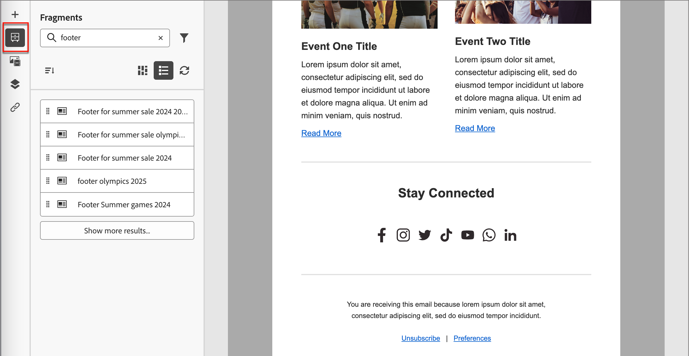

# Fragmentos

Um fragmento é um componente reutilizável que pode ser referenciado em um ou mais emails e modelos de email no [!DNL Journey Optimizer B2B Prime]. Geralmente, é um bloco de conteúdo (texto, imagem ou ambos) que pode ser pré-criado e inserido rapidamente em um email ou modelo de email. Com essa funcionalidade, você pode pré-criar vários blocos de conteúdo personalizados para serem usados pelos membros da equipe de marketing para montar conteúdo de email a fim de oferecer um processo de design aprimorado. Casos de uso comuns incluem blocos de conteúdo de cabeçalho/rodapé para email, banners para convites de eventos e saudações sazonais.

>[!BEGINSHADEBOX]

**Fragmentos visuais**

Fragmentos visuais são blocos visuais predefinidos criados usando as ferramentas de design visual que você pode reutilizar em vários emails ou modelos de email. O escopo atual de [!DNL Journey Optimizer B2B Prime] e esta documentação incluem somente fragmentos visuais.

>[!NOTE]
>
>Fragmentos baseados em expressão ainda não têm suporte em [!DNL Journey Optimizer B2B Prime].

>[!ENDSHADEBOX]

Para aproveitar ao máximo os fragmentos em seus workflows:

* _Criar seus próprios fragmentos_ - Crie fragmentos visuais, do zero ou salvando o conteúdo como um fragmento do espaço de design de conteúdo visual.
* _Reutilizar fragmentos_ - use-os quantas vezes forem necessárias no conteúdo do seu email ou modelo de email.

## Acessar e gerenciar fragmentos {#access-manage-fragments}

Para acessar fragmentos visuais em [!DNL Journey Optimizer B2B Prime], vá para a navegação à esquerda e expanda **[!UICONTROL Gerenciamento de Conteúdo]**. Em seguida, selecione **[!UICONTROL Fragmentos]**. Essa ação abre uma página de listagem com todos os fragmentos criados na instância listada em uma tabela.

{width="700" zoomable="yes"}

A tabela é classificada pela coluna _[!UICONTROL Modificado]_, com os fragmentos atualizados mais recentemente na parte superior por padrão. Clique no título da coluna para alterar entre crescente e decrescente.

A estrutura de pastas à esquerda permite organizar fragmentos. Por padrão, todos os fragmentos são exibidos. Ao selecionar uma pasta, somente os fragmentos e subpastas incluídos na pasta selecionada são exibidos.

### Status do fragmento {#fragment-status}

O status do fragmento determina sua disponibilidade para uso em um email ou modelo de email e as alterações que você pode fazer nele.

| Status | Descrição |
| ------ | ----------- |
| Rascunho | Quando você cria um fragmento, ele está no status de rascunho. Ele permanece nesse status à medida que você define ou edita o espaço de design visual, até que você o publique para uso em um email ou modelo de email. Ações disponíveis: <ul><li>Editar todos os detalhes<li>Editar no espaço de design visual<li>Publicação<li>Duplicar<li>Excluir |
| Ativo | Ao publicar um fragmento, ele fica disponível para uso em um email ou template de email. O conteúdo do fragmento publicado não pode ser modificado no espaço de design visual. Ações disponíveis: <ul><li>Edite a descrição<li>Adicionar a um email ou modelo<li>Criar versão de rascunho<li>Duplicar<li>Excluir (se não estiver em uso) |
| Ao vivo (com rascunho) | Ao criar um rascunho a partir de um fragmento ao vivo, a versão ao vivo permanece disponível para uso em um modelo de email ou de email e o conteúdo do rascunho pode ser modificado no espaço de design visual. Se você publicar a versão de rascunho, ela substituirá a versão atual disponível e o conteúdo será atualizado nos emails e modelos de email em que está sendo usado. Ações disponíveis: <ul><li>Edite a descrição<li>Adicionar a um email ou modelo<li>Editar versão de rascunho no espaço de design visual<li>Publicar versão de rascunho<li>Duplicar<li>Excluir (se não estiver em uso) |
| Arquivado | O fragmento está arquivado e não é exibido na lista _Fragmentos_. |

### Filtrar a lista de fragmentos {#filter-list}

Para pesquisar um fragmento por nome, insira uma string de texto na barra de pesquisa para uma correspondência. Quando uma [pasta](#folders) é selecionada, a pesquisa se aplica a todos os fragmentos ou pastas no primeiro nível de hierarquia dessa pasta.

{width="500" zoomable="yes"}

Clique no ícone _Filtro_ (  ) para mostrar as opções de filtro disponíveis e alterar as configurações para filtrar os itens exibidos de acordo com seus critérios especificados.

### Personalizar a exibição da coluna {#column-display}

Personalize as colunas que deseja exibir na tabela clicando no ícone _Personalizar tabela_ (  ) na parte superior direita.

Na caixa de diálogo, selecione as colunas a serem exibidas e clique em **[!UICONTROL Aplicar]**.

{width="300"}

### Ações em massa {#bulk-actions}

Você pode selecionar vários fragmentos usando as caixas de seleção e aplicar operações em massa a todos eles. As ações disponíveis são exibidas em uma barra de ação em massa na parte inferior da página da lista. As operações a seguir estão disponíveis:

* **[!UICONTROL Mover para pasta]** - Mover os fragmentos selecionados para uma pasta.
* **[!UICONTROL Arquivar]** - Arquiva os fragmentos selecionados.

Também é possível classificar a lista de fragmentos clicando em qualquer cabeçalho de coluna e redimensionar colunas arrastando a borda da coluna para ajustar os dados necessários.

## Criar fragmentos {#create-fragments}

Você pode criar novos fragmentos visuais em [!DNL Journey Optimizer B2B Prime] clicando em **[!UICONTROL Criar fragmento]** na parte superior direita.

1. Na página _[!UICONTROL Criar fragmento]_, insira um **[!UICONTROL Nome]** útil (obrigatório) e uma **[!UICONTROL Descrição]** (opcional).

   * Nome - Máximo de 100 caracteres; deve ser exclusivo, não diferencia maiúsculas de minúsculas

   * Descrição - Máximo de 300 caracteres

   * São permitidos caracteres Alpha, numéricos e especiais

   * Os caracteres reservados **_não são permitidos_**: `\ / : * ? " < > |`

   {width="700" zoomable="yes"}

1. Clique em **[!UICONTROL Criar]**.

   O espaço de design visual é aberto com uma tela vazia.

1. Use as ferramentas de design de conteúdo para criar o conteúdo visual do fragmento:

   * [Adicionar estrutura e conteúdo](./fragment-authoring.md#design-fragment)
   * [Adicionar ativos](./fragment-authoring.md#add-assets)
   * [Navegar pelas camadas, configurações e estilos](./fragment-authoring.md#navigate-layers-settings-styles)
   * [Personalizar conteúdo](./fragment-authoring.md#personalize-content)
   * [Editar rastreamento de URL vinculado](./fragment-authoring.md#edit-linked-url-tracking)

1. Clique em **[!UICONTROL Salvar]** a qualquer momento para salvar o fragmento de rascunho.

1. Quando estiver pronto para disponibilizar o fragmento para uso em um modelo de email ou email, clique em **[!UICONTROL Publicar]**.

## Exibir detalhes do fragmento {#view-details}

Clique no nome de qualquer fragmento na página da lista para abrir a página de detalhes do fragmento. Você pode optar por editar o fragmento, renomear o fragmento ou atualizar a descrição do fragmento. Faça atualizações e clique fora do campo de nome ou descrição para salvar automaticamente as alterações.

>[!NOTE]
>
>Se um fragmento publicado estiver sendo usado por um modelo de email ou de email, você não poderá alterar o nome ou editar o conteúdo. Você pode criar uma versão de rascunho se quiser fazer alterações no fragmento.

{width="700" zoomable="yes"}

Clique em **[!UICONTROL Editar fragmento]** para abrir o fragmento no editor de conteúdo visual.

Saia da exibição a qualquer momento clicando na seta _Voltar_ na parte superior esquerda, que o retorna à página da lista _Fragmentos_.

## Exibir referências de fragmento {#references}

Para um fragmento do _Live_, é possível exibir uma lista de ativos que atualmente fazem referência (usam) ao fragmento.

1. Na página de detalhes do fragmento, clique no link Mais (**...**) ícone na parte superior direita.

1. Selecione **[!UICONTROL Explorar referências]**.

   A página _[!UICONTROL Uso do fragmento]_ exibe uma lista de ativos em que o fragmento é usado atualmente no [!DNL Journey Optimizer B2B Prime], em emails e modelos de email.

   >[!IMPORTANT]
   >
   >Qualquer fragmento que esteja sendo usado atualmente por qualquer email ou modelo de email não pode ser excluído.

   As referências são exibidas de acordo com a categoria: _Email_ ou _Modelo de email_. Cada email em [!DNL Journey Optimizer B2B Prime] é definido em um nó de ação _Enviar Email_ de uma jornada de pessoa, de modo que a jornada principal do email que usa o fragmento é exibida nas referências.

1. Clique no link para abrir o email ou modelo de email correspondente onde o fragmento é usado.

## Usar pastas para gerenciar fragmentos {#folders}

Para navegar facilmente pelos fragmentos, é possível usar pastas para organizá-los com mais eficiência em uma hierarquia estruturada. Isso permite categorizar e gerenciar os itens de acordo com as necessidades da organização.

Selecione a pasta _[!UICONTROL Raiz]_ para exibir todos os fragmentos, incluindo aqueles localizados em todas as subpastas. Selecione qualquer pasta na estrutura para exibir seu conteúdo. Com uma pasta selecionada, clique em Criar fragmento para criar um novo fragmento nessa pasta.

### Criar pastas {#folders-create}

1. Com a pasta pai selecionada (Raiz ou outra pasta), clique em **[!UICONTROL Criar pasta]** na parte superior direita.

1. Insira um **[!UICONTROL Nome]** para a nova pasta e clique em **[!UICONTROL Salvar]**.

   A nova pasta é exibida na parte superior da lista, dentro da pasta principal selecionada.

   Você pode clicar no ícone do menu Mais ( **...** ) para renomear, mover ou excluir a pasta.

### Mover pastas {#folders-move}

1. Clique no _Mais menu_ (**...**) ícone ao lado do nome do fragmento que você deseja mover.

1. Escolha **[!UICONTROL Mover para a pasta]**.

1. Na caixa de diálogo, navegue até a estrutura de pastas e selecione a pasta para onde deseja mover o fragmento.

1. Clique em **[!UICONTROL Mover]**.

### Excluir pastas {#folders-delete}

1. Na estrutura de pastas, selecione o pai da pasta que deseja excluir.

1. Clique no _Mais menu_ (**...**) ícone ao lado do nome da subpasta exibida que você deseja excluir.

1. Escolha **[!UICONTROL Excluir pasta]**.

## Editar fragmentos {#edit-fragments}

As edições em um fragmento dependem do status atual:

* Quando um fragmento está no status _Rascunho_, é possível editar qualquer um de seus detalhes e o conteúdo visual.
* Quando um fragmento está no status _Live_, é possível editar a descrição do fragmento, mas não o nome. Não é possível editar o conteúdo visual, a menos que você crie um rascunho.
* Quando um fragmento está no status _Live_ com um rascunho existente, a edição de detalhes fica limitada à descrição. Também é possível editar o conteúdo visual da versão de rascunho.

>[!BEGINTABS]

>[!TAB Rascunho]

1. Na página de listagem _[!UICONTROL Fragmentos]_, clique no nome do fragmento para abri-lo.

   Uma visualização do conteúdo visual é exibida.

1. Modifique a descrição, se necessário.

   {width="600" zoomable="yes"}

1. Para fazer alterações no conteúdo do espaço de design visual, clique em **[!UICONTROL Editar]** na parte superior direita.

   Use as ferramentas de design visual conforme necessário:

   * [Adicionar estrutura e conteúdo](./fragment-authoring.md#design-fragment)
   * [Adicionar ativos](./fragment-authoring.md#add-assets)
   * [Navegar pelas camadas, configurações e estilos](./fragment-authoring.md#navigate-layers-settings-styles)
   * [Personalizar conteúdo](./fragment-authoring.md#personalize-content)
   * [Editar rastreamento de URL vinculado](./fragment-authoring.md#edit-linked-url-tracking)

   Clique em **[!UICONTROL Salvar]** ou **[!UICONTROL Salvar e fechar]** para retornar aos detalhes do fragmento.

1. Quando o fragmento atender aos seus critérios e você quiser disponibilizá-lo para uso em um modelo de email ou email, clique em **[!UICONTROL Publicar]**.

>[!TAB Ativa]

1. Na página de listagem _[!UICONTROL Fragmentos]_, clique no nome do fragmento para abri-lo.

   Uma visualização do conteúdo visual é exibida, com os detalhes do fragmento à direita.

1. Modifique a descrição, se necessário.

1. Para atualizar o conteúdo, clique em **[!UICONTROL Modificar]** na parte superior direita.

1. Na caixa de diálogo, clique em **[!UICONTROL Confirmar]** para criar uma versão de rascunho do fragmento.

   {width="300"}

1. Clique em **[!UICONTROL Editar]** na parte superior direita.

1. Use as ferramentas de design visual conforme necessário para atualizar o conteúdo no rascunho:

* [Adicionar estrutura e conteúdo](./fragment-authoring.md#design-fragment)
* [Adicionar ativos](./fragment-authoring.md#add-assets)
* [Navegar pelas camadas, configurações e estilos](./fragment-authoring.md#navigate-layers-settings-styles)
* [Personalizar conteúdo](./fragment-authoring.md#personalize-content)
* [Editar rastreamento de URL vinculado](./fragment-authoring.md#edit-linked-url-tracking)

Clique em **[!UICONTROL Salvar]** ou **[!UICONTROL Salvar e fechar]** para retornar aos detalhes do fragmento.

1. Quando o fragmento de rascunho atender aos seus critérios e você quiser disponibilizar as alterações para uso em um modelo de email ou email, clique em **[!UICONTROL Publicar]**.

   Ao publicar a versão de rascunho, ela substitui a versão atual disponível e o conteúdo é atualizado nos emails e templates de email em que já está em uso.

>[!TAB Ao vivo (com rascunho)]

Há duas maneiras de abrir a versão de rascunho para edição na página de listagem _[!UICONTROL Fragmentos]_:

* Clique no ícone _Rascunho_ ( ) ao lado do nome do fragmento.

* Clique no nome do fragmento para abri-lo. Em seguida, clique no ícone _Mais menu_ (***...***) na parte superior direita e escolha **[!UICONTROL Abrir versão de rascunho]**.

Uma visualização do conteúdo visual da versão de rascunho é exibida.

_Para atualizar o conteúdo de rascunho :_

1. Clique em **[!UICONTROL Editar]** na parte superior direita.

1. Use as ferramentas de design visual conforme necessário:

   * [Adicionar estrutura e conteúdo](./fragment-authoring.md#design-fragment)
   * [Adicionar ativos](./fragment-authoring.md#add-assets)
   * [Navegar pelas camadas, configurações e estilos](./fragment-authoring.md#navigate-layers-settings-styles)
   * [Personalizar conteúdo](./fragment-authoring.md#personalize-content)
   * [Editar rastreamento de URL vinculado](./fragment-authoring.md#edit-linked-url-tracking)

   Clique em **[!UICONTROL Salvar]** ou **[!UICONTROL Salvar e fechar]** para retornar aos detalhes do fragmento.

1. Quando o fragmento de rascunho atender aos seus critérios e você quiser disponibilizar as alterações para uso em um modelo de email ou email, clique em **[!UICONTROL Publicar]**.

   Ao publicar a versão de rascunho, ela substitui a versão publicada atual e o conteúdo é atualizado nos emails e templates de email em que já está em uso.

>[!ENDTABS]

## Duplicar fragmentos {#duplicate-fragments}

É possível duplicar um fragmento usando um dos seguintes métodos:

* Na página de listagem _[!UICONTROL Fragmentos]_, clique no ícone _Mais_ (**...**) ao lado do nome do fragmento, escolha **[!UICONTROL Duplicar]**.
* Na parte superior direita da página de detalhes do fragmento, clique em _Mais_ (**...**) e escolha **[!UICONTROL Duplicar]**.

Na caixa de diálogo do, digite um nome útil (exclusivo) e uma descrição. Clique em **[!UICONTROL Duplicar]** para concluir a ação.

O fragmento duplicado (novo) aparece na lista _Fragmentos_, localizada na mesma pasta.

<!-- 

## Save a new fragment from email or template content {#save-as-fragment}

When you are creating/editing an email or email template in the visual content editor, you can choose to save all or parts of the content as a fragment so that it is available for reuse.

1. When you have some content to be saved as a fragment, click **[!UICONTROL More]** and choose **[!UICONTROL Save as Fragment]**.

1. Select the different elements to be included in the fragment.

   Select multiple structures by holding the Shift or Control button.

   You can only select structures that are adjacent to each other and the interface does not allow you to select non-adjacent elements.

1. With the content selected, click **[!UICONTROL Create]** at the top right.

1. In the dialog, enter a useful name and description for the fragment. Then click **[!UICONTROL Create]**.

   The new fragment is then displayed in the _Fragments_ listing page and is also available for use within emails and email templates.

-->

## Adicionar fragmentos visuais ao conteúdo do email ou modelo {#add-to-content}

Os fragmentos são projetados para reutilização e podem ser inseridos para criação de template de email e email. Você pode adicionar até 30 fragmentos em um email ou modelo. Os fragmentos podem ser aninhados somente até um nível.

>[!BEGINTABS]

>[!TAB Adicionar fragmentos a um email]

1. Navegue até uma jornada de pessoa e abra um nó de ação _[!UICONTROL Enviar Email]_ existente ou [adicione um novo](../marketing/action-nodes.md#add-an-action-node).

1. Clique em **[!UICONTROL Editar corpo do email]** para abrir ou continuar [criando o conteúdo do email](./email-authoring.md).

1. Arraste e solte um item do menu **[!UICONTROL Estruturas]** para fornecer uma _estrutura_ para o fragmento.

1. Para abrir a listagem de fragmentos publicados, clique no ícone _Fragmentos_.

   É possível:
   * Classifique a listagem.
   * Procurar, pesquisar e filtrar a listagem.
   * Alternar entre as visualizações de cartão (miniatura) e de lista.
   * Atualize a lista para refletir qualquer um dos fragmentos criados recentemente.

   {width="600"}

1. Arraste e solte qualquer um dos fragmentos no espaço reservado do componente de estrutura.

   O editor renderiza o fragmento na seção/elemento da estrutura de email.

O conteúdo do fragmento é atualizado dinamicamente na estrutura para renderizar um visual de como o conteúdo aparece no email.

>[!TIP]
>
>Se quiser que o fragmento ocupe todo o layout horizontal no email, adicione uma estrutura de coluna [!UICONTROL 1:1] e arraste e solte o fragmento nele.

Depois que o email for salvo, ele aparecerá na página de detalhes do fragmento quando a guia _[!UICONTROL Usado por]_ for selecionada. Os fragmentos adicionados a um email não podem ser editados no email ou no modelo — o fragmento de origem publicado define o conteúdo.

>[!TAB Adicionar fragmentos a um modelo de email]

1. Na navegação à esquerda, expanda **[!UICONTROL Gerenciamento de conteúdo]** e selecione **[!UICONTROL Modelos]**.

1. [Crie um novo modelo](./templates-create.md) ou abra um modelo de email existente.

1. No painel de propriedades do modelo à direita, clique em **[!UICONTROL Editar corpo de email]**.

1. Arraste e solte um item do menu **[!UICONTROL Estruturas]** para fornecer uma _estrutura_ contentora para o fragmento.

1. Para abrir a lista de fragmentos, clique no ícone _Fragmentos_ à esquerda.

   É possível:
   * Classifique a listagem.
   * Procurar, pesquisar e filtrar a listagem.
   * Alternar entre as visualizações de cartão (miniatura) e de lista.
   * Atualize a lista para refletir qualquer um dos fragmentos criados recentemente.

   {width="600"}

1. Arraste e solte um fragmento no componente de estrutura.

   O editor renderiza o fragmento na seção/elemento da estrutura do modelo de email.

>[!TIP]
>
>Se quiser que o fragmento ocupe todo o layout horizontal no modelo de email, adicione uma estrutura de coluna _[!UICONTROL 1:1]_ e arraste e solte o fragmento nele.

Depois que o modelo de email é salvo, ele aparece na página de detalhes do fragmento quando a guia _[!UICONTROL Usado por]_ é selecionada. Os fragmentos adicionados a um modelo de email não são editáveis no modelo — o fragmento de origem publicado define o conteúdo.

>[!ENDTABS]

## Fragmentar as ações durante o email e a criação do modelo {#fragment-actions}

Quando um fragmento é adicionado a um email ou modelo de email, o conteúdo do fragmento não pode ser editado no email ou modelo. No entanto, você pode aplicar as seguintes ações:

* **[!UICONTROL Excluir]** - Esta ação remove o fragmento do conteúdo do email ou do modelo de email atual (a origem do fragmento não é afetada).
* **[!UICONTROL Atualizar]** - Esta ação atualiza o conteúdo do fragmento no email ou modelo de email atual. Atualizar é útil quando você deseja refletir qualquer edição recente no fragmento após a adição ao email ou modelo de email.
* **[!UICONTROL Duplicar]** - Esta ação duplica o fragmento no mesmo email ou modelo de email no editor, com as mesmas dimensões e adicionada logo abaixo dele.
* **[!UICONTROL Abrir fragmento]** - Essa ação abre uma nova guia do navegador com a página e os detalhes do editor de fragmento.
* **[!UICONTROL Explorar referências]** - Essa ação abre a página de uso Fragmento, onde é possível visualizar o uso do fragmento por tipo.
* **[!UICONTROL Interromper herança]** - Esta ação interrompe a herança do fragmento (e suas alterações) da origem. Use esta ação para disponibilizar o conteúdo do fragmento como conteúdo independente e editável no modelo de email ou de email. Esta ação também remove o email ou o modelo de email da referência _Usado por_ do fragmento original.

Quando você seleciona o fragmento na página do editor, essas ações estão disponíveis na barra de ferramentas de contexto e no painel de propriedades à direita.

{width="600" zoomable="yes"}
