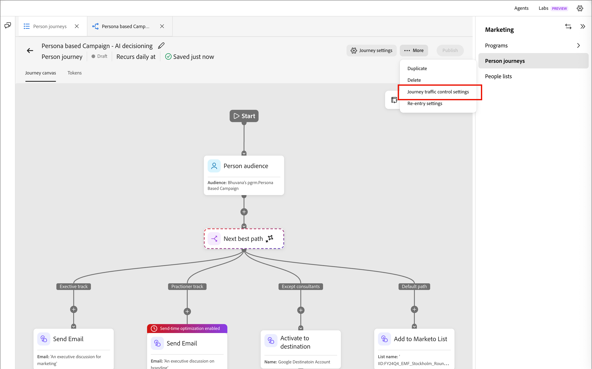
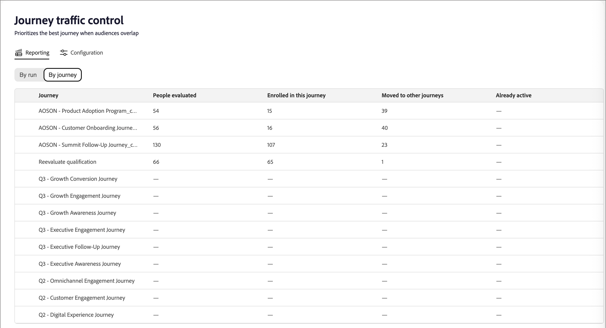

# Jornada controle de tráfego

O controle de tráfego de jornada (JTC) prioriza a melhor jornada para uma pessoa quando os públicos-alvo se sobrepõem. Quando uma pessoa se qualifica para várias jornadas habilitadas para JTC, um modelo de IA as avalia em relação a cada candidato e as adiciona à jornada mais adequada, mantendo-as fora das outras.

>[!NOTE]
>
>O controle de tráfego de jornada funciona da mesma maneira para [!DNL Journey Optimizer B2B Ultimate] e [!DNL Journey Optimizer B2B Prime]. A capacidade e a lógica são idênticas; existem apenas pequenas diferenças na interface do usuário entre os níveis. As informações nesta página refletem a experiência [!DNL Journey Optimizer B2B Prime].

Depois que a pessoa conclui a jornada, ela é reavaliada para as jornadas restantes para as quais permanece qualificada. O JTC os adiciona à próxima jornada de melhor ajuste e assim por diante. Isso impede que a mesma pessoa seja atribuída a várias jornadas sobrepostas simultaneamente e garante que cada contato receba a experiência mais relevante primeiro.

>[!NOTE]
>
>Atualmente, uma pessoa pode ser colocada em apenas uma jornada selecionada pelo JTC de cada vez. Uma opção de configuração do administrador para permitir que uma pessoa seja inscrita em mais de uma jornada simultaneamente está planejada para uma versão futura.

## Dimensões de pontuação {#scoring-dimensions}

O modelo avalia cada combinação de jornadas de pessoa em sete dimensões de pontuação. Cada dimensão é pontuada de maneira independente e depois combinada, de acordo com os pesos configurados, para produzir uma probabilidade de correspondência final para essa pessoa e jornada. A jornada com a correspondência mais forte é selecionada.

| Dimensão | O que ele avalia |
|---|---|
| Alinhamento de intenção | Sinais de intenção comportamental: pesquisas por palavras-chave, visitas a páginas de produtos, downloads de conteúdo, aberturas/click-throughs por email e atividade de página de preços. |
| Ajuste de público | A qualidade da correspondência da pessoa com o [público-alvo](./person-audience-node.md) da jornada. |
| Ajuste pessoal | Alinhamento entre a função/[persona](../audiences/personas.md) da pessoa e a jornada. |
| Ajuste firme | Atributos no nível da empresa (como setor, tamanho e receita). |
| Correspondência demográfica | Atributos demográficos de nível de pessoa. |
| Alinhamento psicográfico | Alinhamento baseado em atitude/preferência. |
| Envolvimento adequado | Recenticidade e profundidade do [engajamento](../audiences/engagement-scores.md) da pessoa. |

As dimensões para as quais uma pessoa não tem dados são ignoradas automaticamente, portanto, a pontuação nunca é penalizada por atributos ausentes.

>[!IMPORTANT]
>
>Pelo menos duas jornadas devem ter o JTC habilitado para que o recurso faça qualquer coisa significativa. Habilitá-lo em uma única jornada é ineficaz, pois não há jornada concorrente para arbitrar. Somente quando duas ou mais jornadas são habilitadas para JTC o modelo começa a resolver conflitos.

## Pré-requisitos {#prerequisites}

Antes que o controle de tráfego do jornada possa produzir resultados, lembre-se do seguinte:

* **Os relatórios exigem uma jornada publicada habilitada para JTC.** A guia _[!UICONTROL Relatórios]_ não mostra dados até que pelo menos uma jornada seja publicada com o controle de tráfego de jornada habilitado.
* **A simulação requer pelo menos uma jornada publicada na instância.** A simulação avalia [perfis](../audiences/people-lists.md) que já estão em jornadas ativas, portanto, ela requer pelo menos uma jornada publicada na instância da qual desenhar perfis. A simulação em si não requer que o JTC esteja habilitado (consulte [_Simular pontuação_](#simulate-scoring)).

## Introdução {#get-started}

Selecione **[!UICONTROL controle de tráfego de Jornada]** na navegação à esquerda. A página exibida tem duas guias:

* **[!UICONTROL Relatórios]** — Exiba os resultados das execuções de controle de tráfego (populadas somente após a execução do JTC no Live jornada).
* **[!UICONTROL Configuração]** — Ajuste as dimensões de pontuação, simule resultados e escolha quais jornadas participam.

>[!IMPORTANT]
>
>Para um cliente totalmente novo que nunca usou o controle de tráfego do jornada, a guia _[!UICONTROL Relatórios]_ está vazia. Os relatórios refletem apenas jornadas que tiveram controle de tráfego aplicado e em execução. Inicie na guia _[!UICONTROL Configuração]_.

## Guia Configuração {#configuration-tab}

A guia _[!UICONTROL Configuração]_ tem duas seções: **[!UICONTROL Ajustar pontuação de dimensão]** e **[!UICONTROL Selecionar jornadas]**.

### Ajustar pontuação de dimensão {#adjust-dimension-scoring}

Esta seção é onde você define o quanto cada uma das sete dimensões contribui para a pontuação de correspondência final. Cada dimensão pode ser definida como **[!UICONTROL Desativada]**, **[!UICONTROL Baixa]**, **[!UICONTROL Medium]** ou **[!UICONTROL Alta]** importância. A porcentagem mostrada em cada cartão é a contribuição normalizada dessa dimensão após combinar todas as suas seleções — os sete pesos sempre somam 100%. Elevar uma dimensão normaliza automaticamente as outras para que o total permaneça em 100%.

Clique em **[!UICONTROL Redefinir para ser igual]** para retornar todas as dimensões para um peso uniforme.

{width="800" zoomable="yes"}

### Simular pontuação {#simulate-scoring}

Antes de confirmar pesos para produção, você pode simular como o controle de tráfego se comportaria com essas alterações. A simulação não requer que o controle de tráfego do jornada seja habilitado. Ele avalia os perfis que já estão em suas jornadas ativas e aplica a lógica de controle de tráfego a eles, para que você possa avaliar se os resultados são adequados para os pesos escolhidos.

1. Escolha quantos perfis simular.

1. Clique em **[!UICONTROL Simular pontuação]**.

O cabeçalho de resultados resume a execução:

* **Perfis avaliados** — quantos perfis foram pontuados e em quantas jornadas.
* **Média de conflitos/perfil** — o número médio de jornadas concorrentes por perfil.
* **Pontuação média de correspondência** — a confiança média das jornadas selecionadas.

{width="700" zoomable="yes"}

Abaixo do resumo, cada perfil avaliado aparece como um cartão mostrando a jornada selecionada, o raciocínio principal, os sinais de intenção e a pontuação de correspondência. Selecione um perfil para abrir uma exibição detalhada:

* **Pontuação de correspondência** — A correspondência geral, com um detalhamento codificado por cores por dimensão.
* **Decisão** — As jornadas para as quais essa pessoa se qualificou, quais foram selecionadas e o porquê.
* **Pontuações do Dimension por peso** — As pontuações por dimensão que determinaram a decisão, expansíveis para mostrar os sinais subjacentes.

{width="450" zoomable="yes"}

Quando estiver satisfeito com o resultado, você poderá:

* Ajuste os pesos da dimensão e clique em **[!UICONTROL Executar novamente]** para executar a simulação novamente.

* Clique em **[!UICONTROL Aplicar à produção]** para confirmar os pesos.

  As novas decisões de controle de tráfego usam as novas configurações imediatamente; as decisões anteriores não são afetadas. Os pesos que você testou aparecem na guia _[!UICONTROL Configuração]_ principal e são usados para qualquer controle de tráfego do jornada que esteja avaliando em seu ambiente ativo.

Também é possível sair da página sem aplicar os pesos.

<!--

This section does not appear in the staging environment

### Select journeys {#select-journeys}

The _[!UICONTROL Select journeys]_ section is where you choose which journeys participate in traffic control.

>[!IMPORTANT]
>
>Only draft journeys are available for selection. Traffic control cannot be enabled for a journey that is already live. When JTC is enabled for a journey and then that journey is published, it cannot be disabled.

-->

## Habilitar o controle de tráfego para o jornada {#enable-traffic-control-journey}

Quando duas ou mais jornadas têm o controle de tráfego de jornada ativado e são publicadas:

* Qualquer pessoa qualificada para uma ou mais dessas jornadas é avaliada com base em seu perfil e nos metadados da jornada.
* Se uma pessoa se qualificar para várias jornadas ativadas para JTC de uma só vez (por exemplo, cinco), o modelo determinará qual é a melhor jornada nesse momento e inscreverá a pessoa nessa jornada apenas. Eles são mantidos fora dos outros.
* A pessoa passa por essa jornada até que ela seja concluída.
* Após a conclusão, elas são reavaliadas em relação às jornadas restantes para as quais ainda estão qualificadas e adicionadas à próxima melhor, repetindo até que nenhuma jornada qualificada permaneça.

### Ativar o JTC para uma jornada de rascunho {#enable-traffic-control-draft-journey}

O controle de tráfego de jornada pode ser habilitado diretamente em uma jornada individual quando está no status _Rascunho_. <!-- This is the same setting surfaced from the admin/configuration flow — enabling it in either place keeps the two in sync. -->

1. Na navegação à esquerda, expanda **[!UICONTROL Gerenciamento de marketing]**.

1. À direita na lista de recursos de **[!UICONTROL Marketing]**, selecione **[!UICONTROL jornadas de pessoas]**.

1. Clique no nome da jornada da pessoa de rascunho para abri-la.

1. Clique em **[!UICONTROL ... Mais]** no canto superior direito e escolha **[!UICONTROL configurações de controle de tráfego de Jornada]**.

   {width="700" zoomable="yes"}

1. Na caixa de diálogo, habilite a opção **[!UICONTROL Habilitar controle de tráfego de jornada]**.

   A caixa de diálogo de configurações explica o comportamento: quando ativada, a jornada se torna um candidato e o modelo avalia e recomenda a jornada mais adequada para uma pessoa qualificada para várias jornadas ativas.

   {width="380"}

1. Clique em **[!UICONTROL Salvar]**.

>[!IMPORTANT]
>
>A opção pode ser alterada a qualquer momento enquanto a jornada permanece no status _Rascunho_. <!-- If it was already enabled from the admin section (or previously enabled by someone else), the toggle appears on. --> Depois de publicar a jornada com o JTC ativado, o controle de tráfego avalia a entrada nessa jornada e você não pode mais desativar a configuração.

### Otimizar a descrição da jornada {#optimize-journey-description}

O agente de controle de tráfego pode usar efetivamente os metadados de uma jornada — os nós na jornada, o nome do público-alvo e sinais estruturais semelhantes — para informar sua decisão. No entanto, ela se beneficia muito de uma descrição de jornada rica e descritiva que afirma claramente o propósito e os objetivos da jornada.

Uma descrição forte dá ao modelo o contexto de que ele precisa para tomar uma decisão mais bem informada sobre se uma pessoa pertence a essa jornada ou a uma concorrente. Isso é mais importante quando uma jornada é muito básica. Por exemplo, uma jornada com poucos nós oferece contexto limitado, portanto, uma descrição clara de sua meta e público-alvo ajuda o modelo a escolher corretamente.

>[!TIP]
>
>Trate a descrição da jornada como uma entrada para o modelo de decisão, não apenas como documentação interna. Descreva o propósito da jornada (o que ela está tentando alcançar), suas metas e o público-alvo para o qual ela se destina. Quanto mais explícita for a descrição, mais preciso será o controle de tráfego que poderá arbitrar quando uma pessoa se qualificar para várias jornadas sobrepostas — especialmente para jornadas leves com poucos nós.

## Guia Relatórios {#reporting-tab}

Depois que o controle de tráfego é habilitado para duas ou mais jornadas com execuções concluídas, a guia _[!UICONTROL Relatórios]_ exibe os resultados. Há dois modos de exibição: **[!UICONTROL Por execução]** e **[!UICONTROL Por jornada]**.

### Por execução {#by-run}

A exibição _[!UICONTROL Por execução]_ lista cada execução de controle de tráfego. Para cada execução, você pode ver a hora, o acionador (Programado ou Manual), as jornadas ativas avaliadas, as pessoas avaliadas, as decisões de controle de tráfego, o tempo de processamento e o status. Selecione uma execução para abrir um painel de detalhes com essas métricas principais para a execução, juntamente com a lista de jornadas avaliadas nessa execução.

{width="700" zoomable="yes"}

### Por jornada {#by-journey}

Use a exibição _Por jornada_ para inspecionar como o controle de tráfego afetou qualquer jornada fornecida. A tabela mostra, por jornada, o número de pessoas avaliadas, inscritas nesta jornada, movidas para outras jornadas e já ativas.

{width="700" zoomable="yes"}

<!--
Selecting a journey opens a detail panel:

* **Summary** — Total people evaluated, broken down into _Enrolled in this journey_, _Moved to other journeys_, and _Already active_.
* **Competing journeys** — Every journey that had people competing with this one, and how many were enrolled in each.
* **People evaluated** — The individual people, each with an outcome (_Enrolled_, _Moved_, or _Already active_), competing journeys, and match score.

>[!TIP]
>
>The sum of enrolled people across all competing journeys always equals the _Moved to other journeys_ count in the summary. _Already active_ means the person was already in the journey when the evaluation occurred.

Selecting an individual person shows the same detail view as in simulation: the match score, the decision (competing journeys and which journey was selected and why), and the full dimension breakdown behind the selection.
-->
