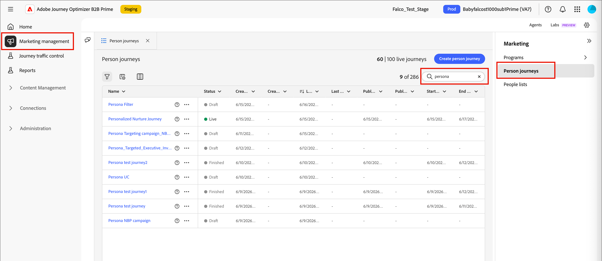
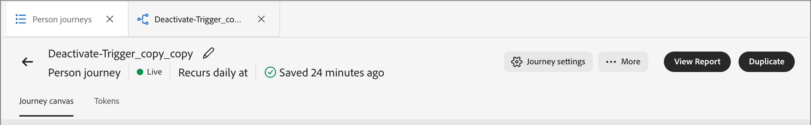

# Jornadas de pessoas

No [!DNL Adobe Journey Optimizer B2B Edition Prime], as jornadas pessoais são planos de marketing automatizados, baseados em clientes potenciais em várias etapas, que orquestram experiências personalizadas entre canais. Essas jornadas usam dados do Marketo Engage para executar esses planos de marketing em resposta a engajamento, eventos comerciais ou campanhas programadas.

>[!NOTE]
>
>Cada jornada reside em um [programa](./programs.md) definido. Você deve ter pelo menos um programa para usar como pai antes de criar uma jornada.

_Para criar uma nova jornada de pessoa :_

1. Crie a jornada de pessoa.
1. Adicione os nós e defina o fluxo da jornada na tela de jornada.
1. [Publique a jornada](#publish-a-journey).

## Acessar e procurar jornadas de pessoas {#access-and-browse-person-journeys}

1. Na navegação à esquerda, expanda **[!UICONTROL Gerenciamento de marketing]**.

1. À direita na lista de recursos de **[!UICONTROL Marketing]**, selecione **[!UICONTROL jornadas de pessoas]**.

   A lista _jornadas de pessoas_ é exibida como uma página com guias no espaço de trabalho principal.

   Você pode digitar texto na ferramenta _Pesquisa_ na parte superior da lista para filtrar a lista exibida por nome.

   {width="800" zoomable="yes"}

1. Use as ferramentas de lista para personalizar a lista exibida:

   * Clique no ícone _Filtro_ (  ) para filtrar a lista por status.
   * Clique no ícone _Personalizar tabela_ (  ) para controlar as colunas exibidas.
   * Clique no ícone _Redefinir colunas_ (  ) para redefinir as larguras da coluna.

### Jornada colunas da lista {#journey-list-columns}

A página Lista de jornadas inclui as seguintes colunas:

* [!UICONTROL Nome] (clique no nome para abrir a tela de jornada para edição)
* [!UICONTROL Status]
* [!UICONTROL Data de criação]
* [!UICONTROL Criado por]
* [!UICONTROL Última atualização]
* [!UICONTROL Última atualização por]
* [!UICONTROL Publicado em]
* [!UICONTROL Publicado por]
* [!UICONTROL Data de início]
* [!UICONTROL Data final]

Você pode classificar a lista por _[!UICONTROL Status]_, _[!UICONTROL Data de criação]_ ou _[!UICONTROL Última atualização]_ clicando no cabeçalho da coluna. Você pode segurar e arrastar as bordas de cabeçalho para alterar as larguras de coluna exibidas. Na caixa de diálogo _Personalizar tabela_, marque ou desmarque as caixas de seleção e clique em **[!UICONTROL Aplicar]**.

### Status da jornada {#journey-status}

O status de uma jornada pode mudar com base nas ações que você aplica. Com base no status de uma jornada, determinadas ações estão disponíveis no lado direito do cabeçalho.

| Status | Descrição | Ações disponíveis |
| ------ | ----------- | ----------------- |
| _**Rascunho**_ | Uma jornada não publicada que é editável. | [Publicar](#publish-a-journey), [Duplicar](#duplicate-a-journey), [Excluir](#delete-a-journey) |
| _**Ativa**_ | O status da jornada muda de _Rascunho_ para _Ao vivo_ quando você publica uma jornada. Nesse estado, ela não é mais editável. | [Duplicar](#duplicate-a-journey), [Fechar para novas entradas](#close-to-new-entries), [Anular](#abort-a-journey) |
| _**Fechada para novas entradas**_ | O status da jornada muda de _Ativo_ para _Fechado para novas entradas_ quando você clica em **[!UICONTROL Fechar para novas entradas]** no cabeçalho da jornada. | [Duplicar](#duplicate-a-journey), [Anular](#abort-a-journey) |
| _**Abortada**_ | O status muda para _Ativa_ ou _Fechada para novas entradas_ quando você aborta uma jornada. Uma jornada cancelada não pode ser reiniciada. | [Duplicar](#duplicate-a-journey), [Excluir](#delete-a-journey) |
| _**Concluída**_ | Quando todos os membros do público-alvo de uma jornada concluírem a jornada, o status mudará de _Ativo_ ou _Fechado para novas entradas_ para _Concluído_. | [Duplicar](#duplicate-a-journey), [Excluir](#delete-a-journey) |

## Criar uma jornada de pessoa {#create-a-person-journey}

1. Clique em **[!UICONTROL Criar Jornada]** no canto superior direito da lista de jornadas.

1. Na caixa de diálogo, selecione o programa **[!UICONTROL Pai]** para a jornada de pessoa.

1. Insira um **[!UICONTROL Nome]** exclusivo (obrigatório) e uma **[!UICONTROL Descrição]** (opcional).

   {width="400"}

1. Clique em **[!UICONTROL Criar]**.

   A tela de jornada é aberta com o nó inicial de público-alvo Pessoa.

   {width="600" zoomable="yes"}

### Jornada cabeçalho {#journey-header}

O cabeçalho de cada tela de jornada inclui o nome, o status e a programação da jornada.

{width="600" zoomable="yes"}

* Clique no ícone _Editar_ (  ) para alterar o nome da jornada ou as informações de descrição.
* Clique em **[!UICONTROL Configurações de Jornada]** para alterar o início e a recorrência da jornada.
* Clique em **[!UICONTROL ... Mais]** para aplicar uma ação de jornada ou para habilitar/desabilitar o controle de tráfego e a reentrada.
* Se todos os erros forem resolvidos e você quiser ativar a jornada, clique em **[!UICONTROL Publicar]**.

### Design da jornada {#journey-design}

A _tela de jornada_ é a zona central no espaço de trabalho de jornada. É aqui que você pode adicionar nós de jornada e configurá-los. Clique em um nó para abrir suas propriedades no painel à direita do layout e defina-as de acordo com seu design. Uma jornada de pessoa sempre começa com um nó [_[!UICONTROL Audiência de pessoa ]_](./person-audience-node.md), onde é possível definir a entrada da jornada.

Depois de criar uma jornada de pessoa e definir o público-alvo de pessoa, crie a jornada usando nós. A tela de jornada fornece um espaço de design visual em que você pode criar seus casos de uso de marketing B2B em várias etapas usando os seguintes tipos de nó para criar a jornada:

* [Realizar uma ação](./action-nodes.md)
* [Acompanhar um evento](./listen-for-event-nodes.md)
* [Aguardar](./wait-nodes.md)
* [Dividir caminhos](./split-merge-paths-nodes.md)
* [Próximo caminho recomendado](./next-best-path.md)
* [Mesclar caminhos](./split-merge-paths-nodes.md)

## Gerenciamento de jornadas {#journey-management}

Abra a lista jornadas para revisar o status da jornada, fazer alterações e realizar ações.

### Jornada ações {#journey-actions}

A página Lista de jornadas inclui todas as jornadas de pessoas na instância do Journey Optimizer B2B Prime. Na página da lista, é possível aplicar várias ações a uma jornada.

#### Publicar uma jornada {#publish}

Você pode publicar uma jornada se não houver erros de bloqueador. Quando publicado, o status da jornada muda para _Ativo_. Se a jornada tiver erros, o botão **[!UICONTROL Publicar]** ficará esmaecido com a mensagem `Resolve errors before publishing`.

1. Abra a jornada de rascunho na lista _[!UICONTROL jornadas de pessoas]_.

1. Na parte superior direita da tela de jornada, clique em **[!UICONTROL Publicar]**.

1. Na caixa de diálogo _[!UICONTROL Revisar configurações da jornada]_, defina as opções de início da jornada.

   Se você já definiu um agendamento em **[!UICONTROL configurações do Jornada]**, verifique as configurações.

   Se precisar definir a ativação do jornada, escolha um tipo de agendamento:

   * Para ativar a jornada no momento da publicação, escolha **[!UICONTROL Imediatamente]**.
   * Para ativar a jornada em uma data futura, escolha **[!UICONTROL Em uma data específica]** e clique no ícone _Calendário_ para selecionar a data.

1. Se necessário, especifique a **[!UICONTROL Data final]** para a jornada.

   {width="400" zoomable="no"}

   Pode ser um máximo de três anos a partir da data de início. Este campo é necessário para publicar.

1. Clique em **[!UICONTROL Next]**.

1. No diálogo de confirmação, clique em **[!UICONTROL Publicar]**.

#### Anular uma jornada {#abort-a-journey}

Se você abortar (interromper) uma jornada em tempo real ou uma jornada programada para uma data de início futura, as pessoas na jornada interromperão imediatamente seu progresso e nenhuma entrada adicional na jornada poderá ocorrer. Uma jornada cancelada não pode ser reiniciada.

1. Abra a jornada na lista _[!UICONTROL jornadas de pessoas]_.

1. Clique em **[!UICONTROL ... Mais]** no canto superior direito e escolha **[!UICONTROL Anular]**.

   {width="600" zoomable="yes"}

1. Na caixa de diálogo de confirmação, clique em **[!UICONTROL Cancelar]**.

#### Fechar para novas entradas {#close-to-new-entries}

Se você fechar uma jornada em tempo real a novas entradas, as pessoas que estão atualmente na jornada continuarão seu caminho nessa jornada e nenhuma outra entrada de jornada poderá ocorrer. Uma jornada fechada não pode ser reiniciada. É possível duplicar uma jornada fechada.

1. Abra a jornada na lista _[!UICONTROL jornadas de pessoas]_.

1. Clique em **[!UICONTROL ... Mais]** no canto superior direito e escolha **[!UICONTROL Fechar para novas entradas]**.

1. Na caixa de diálogo de confirmação, clique em **[!UICONTROL Fechar para novas entradas]**.

#### Duplicar uma jornada {#duplicate-a-journey}

Uma ação duplicada é semelhante a uma função de clone, mas uma jornada duplicada não inclui nenhum ativo de conteúdo de jornada criado. Você pode duplicar os detalhes da jornada ou apenas um esqueleto simples da estrutura de fluxo e caminho.

1. Na lista _[!UICONTROL jornadas da Pessoa]_, clique no ícone _Mais_ ( **...** ) ao lado do nome da jornada e escolha **[!UICONTROL Duplicar]**.

   {width="400"}

   Dependendo do status da jornada, você também pode acessar a ação duplicar a partir dos detalhes da jornada ou da tela de jornada:

   * Para uma jornada de rascunho, clique em **[!UICONTROL ... Mais]** no canto superior direito e escolha **[!UICONTROL Duplicar]**.
   * Para todos os outros status de jornada, clique em **[!UICONTROL Duplicar]** na parte superior direita.

1. Na caixa de diálogo, selecione o programa **[!UICONTROL Pai]** para a jornada duplicada.

1. Insira um **[!UICONTROL Nome]** exclusivo (obrigatório) e uma **[!UICONTROL Descrição]** (opcional).

   Por padrão, a caixa de diálogo usa o nome da jornada de origem anexada com `_copy`. Insira um nome exclusivo diferente para a jornada, conforme necessário.

   {width="370"}

1. Selecione o **[!UICONTROL tipo]** de duplicação:

   * **[!UICONTROL Duplicação parcial de conteúdo]**: use este tipo para copiar tudo na jornada, excluindo emails ou mensagens SMS criados. Os nós que fazem referência a um email ou mensagem SMS do Marketo Engage ficam totalmente intactos.

   * **[!UICONTROL Duplicar sem detalhes]** - Use este tipo para copiar somente a estrutura e os caminhos do nó. Todas as configurações de nó e condições de caminho ficam indefinidas (padrão), de modo que você pode reutilizar o fluxo básico com diferentes configurações de público-alvo, ações e segmentação de caminho. Todos os nós de espera usam o padrão de cinco dias.

1. Clique em **[!UICONTROL Duplicar]**.

   A jornada duplicada é aberta na tela de jornada, onde você pode definir os detalhes e criar conteúdo da jornada conforme necessário.

#### Excluir uma jornada {#delete-a-journey}

Use uma ação de exclusão para excluir uma jornada permanentemente. Não é possível excluir uma jornada em tempo real ou uma jornada agendada para uma data de início futura.

>[!WARNING]
>
>A exclusão de uma jornada é permanente e não pode ser desfeita.

1. Na lista _[!UICONTROL jornadas de pessoas]_, clique no ícone _Mais_ ( **...** ) ao lado do nome da jornada e escolha **[!UICONTROL Excluir]**.

   Dependendo do status da jornada, você também pode acessar a ação de exclusão no cabeçalho da jornada:

   * Para uma jornada de rascunho, clique em **[!UICONTROL ... Mais]** no canto superior direito e escolha **[!UICONTROL Excluir]**.
   * Para outros status de jornada, como _Concluído_ ou _Cancelado_, clique em **[!UICONTROL Excluir]** no canto superior direito.

1. Na caixa de diálogo de confirmação, clique em **[!UICONTROL Excluir]**.
