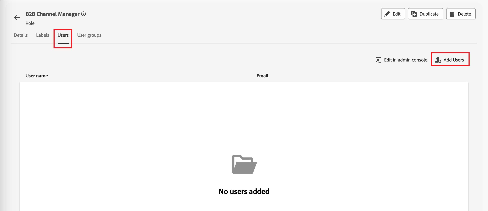

# Acesso e permissões do usuário

Após a conclusão do provisionamento e a vinculação das sandboxes, conclua as etapas a seguir para fornecer acesso ao Adobe Journey Optimizer B2B edition para sua equipe e usuários.

1. [Crie um perfil de produto do Adobe Journey Optimizer B2B edition](#ajo-b2b-profile) no Admin Console (apenas uma vez/configuração inicial).
1. [Adicionar um grupo de usuários](#add-user-group) na Admin Console.
1. [Edite as funções internas](#edit-roles-for-product-permissions) ou [crie uma função personalizada](#create-a-custom-role) com permissões do Journey Optimizer B2B edition em permissões do Adobe Experience Platform.
1. [Adicionar usuários](#add-users-to-a-role) ou [grupos](#add-user-groups-to-a-role) a funções no Adobe Experience Platform.

Como administrador, você pode concluir essas tarefas no Adobe Admin Console, que é um local central para administrar e gerenciar licenças e usuários de produtos da Adobe. No Admin Console, é possível criar e gerenciar usuários em um único local em vez de em várias soluções individuais. Para saber mais sobre suas funções e recursos, consulte a página [visão geral do Admin Console](https://helpx.adobe.com/br/enterprise/using/admin-console.html).

## Acessar o Admin Console

Antes de usar o Admin Console para administrar os usuários da sua equipe, é necessário garantir que você possa acessar o Admin Console e ter as permissões apropriadas.

1. Como administrador do sistema, você deve receber vários emails do Adobe como parte do processo de integração.

   Procure o email de boas-vindas que fornece informações sobre o nome da organização à qual você recebeu acesso.

1. Clique no link **[!UICONTROL Introdução]** no email de boas-vindas para navegar até a Admin Console.

   Se não conseguir localizar o email, abra um navegador diretamente na Admin Console em [https://adminconsole.adobe.com](https://adminconsole.adobe.com).

1. Faça logon usando sua Adobe ID.

   Depois de fazer logon, você verá a página _Visão geral_ da Adobe Admin Console.

1. Se você tiver acesso a várias organizações, verifique se fez logon na organização correta.

   Para alterar a organização, clique no nome dela no canto superior direito e escolha a organização que você precisa acessar.

1. Selecione **[!UICONTROL Administradores]** no cartão _[!UICONTROL Usuários]_ para verificar se você é um administrador do sistema.

   {width="800" zoomable="yes"}

1. Pesquise inserindo seu email, nome de usuário, nome ou sobrenome do Adobe ID.

   * Se o acesso estiver configurado corretamente, a pesquisa retornará seu registro.

   * Se o valor na coluna **[!UICONTROL FUNÇÃO DE ADMINISTRADOR]** mostrar `System`, isso quer dizer que você (ou o usuário mostrado) é um administrador do sistema.

## Criar o perfil de produto do Adobe Journey Optimizer B2B edition {#ajo-b2b-profile}

Ao conceder aos usuários acesso a uma solução da Adobe, você pode não pretender conceder acesso total a eles. Os perfis de produto permitem que cada solução tenha seu próprio conjunto de permissões do usuário. Use o Admin Console para atribuir perfis de produto.

Para obter mais informações sobre como usar perfis de produtos para direitos de usuário, consulte [_Gerenciar perfis de produto para usuários corporativos_](https://helpx.adobe.com/br/enterprise/using/manage-product-profiles.html){target="_blank"} na documentação do Admin Console.

{width="30"} Um administrador do sistema ou administrador de produto do Adobe Journey Optimizer B2B edition pode executar as seguintes etapas.

1. Faça logon em [https://adminconsole.adobe.com](https://adminconsole.adobe.com).

1. Selecione a guia **[!UICONTROL Produtos]**.

1. Abra a instância do Adobe Journey Optimizer B2B edition na qual deseja adicionar o perfil e clique em **[!UICONTROL Novo perfil]**.

   {width="600" zoomable="yes"}

1. Insira um nome de perfil de produto, como _Usuários B2B_.

1. Clique em **[!UICONTROL Avançar]** e depois em **[!UICONTROL Salvar]**.

## Adicionar um grupo de usuários {#add-user-group}

Um grupo de usuários é uma coleção de usuários aos quais é concedido um conjunto compartilhado de permissões. Você pode adicionar ou remover usuários em seu grupo de usuários. As permissões do grupo permanecem as mesmas enquanto os usuários no grupo são alterados.

Para obter mais informações sobre como os grupos de usuários são usados para gerenciar permissões, consulte [Gerenciar grupos de usuários](https://helpx.adobe.com/br/enterprise/using/user-groups.html){target="_blank"} na documentação do Admin Console.

{width="30"} Um administrador do sistema pode executar as etapas a seguir.

1. Faça logon em [https://adminconsole.adobe.com](https://adminconsole.adobe.com).

1. Selecione a guia **[!UICONTROL Usuários]**.

1. Escolha **[!UICONTROL Grupos de Usuários]** na navegação à esquerda.

1. Clique em **[!UICONTROL Novo grupo de usuários]** na parte superior direita.

1. Insira um nome para o grupo de usuários, como _usuários do jornada B2B_ e clique em **[!UICONTROL Salvar]**.

   {width="600" zoomable="yes"}

## Adicionar usuários ao novo grupo {#add-users}

Para obter informações sobre o gerenciamento de usuários, consulte [_usuários do Adobe Admin Console_](https://helpx.adobe.com/br/enterprise/using/users.html){target="_blank"} na documentação do Admin Console.

{width="30"} Um administrador de sistema ou administrador de produto pode executar as seguintes etapas. Um administrador de produto pode adicionar somente usuários que já existem em sua organização.

1. Ir para [https://adminconsole.adobe.com](https://adminconsole.adobe.com).

1. Em _[!UICONTROL Links rápidos]_, clique em **[!UICONTROL Adicionar usuários]**.

1. Adicionar cada usuário:

   * Insira o endereço de email, o nome e o sobrenome do usuário.

     {width="600" zoomable="yes"}

   * Para **[!UICONTROL Grupos de usuários]**, clique em **+**.

   * Selecione o grupo de usuários criado anteriormente.

   * Clique em **[!UICONTROL Aplicar]**.

1. Clique em **[!UICONTROL Salvar]**.

## Atribuir o perfil de produto {#assign-profile}

>[!IMPORTANT]
>
>Ao configurar grupos de usuários, sempre adicione usuários ao grupo antes de atribuir o perfil de produto ao grupo. Atribuir um perfil de produto a um grupo de usuários vazio e adicionar usuários posteriormente não propaga o acesso corretamente. Para garantir que as permissões do sejam aplicadas, preencha o grupo de usuários com membros primeiro e, em seguida, atribua os perfis de produto.

{width="30"} Um administrador de produto pode executar as etapas a seguir.

1. Clique no grupo de usuários ao qual você adicionou usuários.

1. Selecione a guia **[!UICONTROL Perfis de produto atribuídos]** e clique em **[!UICONTROL Atribuir perfil]**.

1. Clique em **+** e adicione cada instância dos seguintes produtos:

   * [!UICONTROL Adobe Journey Optimizer B2B edition - Perfil de Usuários]
   * [!UICONTROL Adobe Experience Platform - AEP-Padrão-Todos-Usuários]
   * [!UICONTROL Coleta de Dados do Adobe Experience Platform - Acesso Total à Coleta de Dados Padrão]
   * [!UICONTROL Adobe Experience Platform - Todo o Acesso à Produção Padrão]

   {width="600" zoomable="yes"}

1. Clique em **[!UICONTROL Salvar]**.

## Editar funções para permissões de produto {#edit-roles-for-product-permissions}

As permissões são direitos unitários que permitem definir as autorizações atribuídas a um perfil de produto. Cada permissão é agrupada em um recurso, como jornadas ou grupos de compras, representando funcionalidades no Journey Optimizer B2B edition.

A área _Permissões_ do Adobe Experience Platform é onde os administradores podem definir funções de usuário e políticas de acesso para gerenciar permissões de acesso para recursos e objetos em um aplicativo de produto. Neste aplicativo, você pode criar e gerenciar funções, bem como atribuir as permissões de recurso desejadas para essas funções. As permissões também permitem gerenciar sandboxes e usuários associados a uma função específica.

Para obter mais informações sobre permissões de função no Experience Platform, consulte [Gerenciar permissões de uma função](https://experienceleague.adobe.com/pt-br/docs/experience-platform/access-control/abac/permissions-ui/permissions){target="_blank"} na documentação do Experience Platform.

<!--

### B2B product permissions {#b2b-product-permissions}

The following permissions govern access to Journey Optimizer B2B Edition capabilities:

| Category | Description | Permissions |
| -------- | ----------- | ---------- |
| B2B Account Lists | Configure, manage, view, and publish permissions for B2B account lists. These permissions include actions such as add, remove, import, and delete accounts from account lists. | <li>Manage B2B Account Lists |
| B2B Admin Configurations | Configure, manage, and view permissions for B2B administrative configurations. These permissions include digital asset management connections, asset repositories, and events. | <li>Manage B2B Admin Configurations |
| B2B Assets | Configure, manage, and view permissions for B2B assets. These permissions include emails, SMS, landing pages, fragments, templates, and images. | <li>Manage B2B Assets <li>Manage B2B Templates <li>Manage B2B Fragments <li>Manage B2B Emails |
| B2B Buying Groups | Configure, manage, and view permissions for B2B buying groups. These permissions include solution interests, roles templates, and buying group status. | <li>Manage B2B Buying Groups <li>Manage B2B Solution Interests <li>Manage B2B Role Templates <li>Manage B2B Stages <li>View B2B Buying Groups |
| B2B Channel Configurations | Configure, manage, and view permissions for B2B channel configurations. These permissions include settings for communication limits, API credentials, and security settings. | <li>Manage B2B Channels Configurations |
| B2B Dashboards | Configure and view permissions for B2B dashboards. These permissions include account engagement, buying group stages, surging accounts, and contact coverage. | <li>View B2B Engagement Dashboard |
| B2B Journeys | Configure, manage, view, and publish permissions for B2B journeys. These permissions include account and person actions, event listeners, and split paths. | <li>Manage B2B Account Journeys |
| Journey Optimizer Rules | Access and configure frequency rules (communication limits). These permissions should be limited to product administrators. | <li>View Frequency Rules <li>Manage Frequency Rules |
-->

### Funções integradas B2B {#b2b-built-in-roles}

Quando sua organização tem o produto Journey Optimizer B2B edition provisionado, o Experience Platform inclui um conjunto de funções integradas (padrão) que você pode usar para gerenciar o acesso aos recursos do produto:

| Função | Permissões |
| ---- | ----------- |
| Gerenciador de Jornada B2B | <li>Gerenciar Jornadas B2B <li>Gerenciar grupos de compra B2B <li>Gerenciar listas de contas B2B <li>Exibir painel do compromisso B2B <li>Exibir painel de insights B2B |
| Gerenciador de canal B2B | <li>Gerenciar Assets B2B <li>Gerenciar modelos B2B <li>Gerenciar fragmentos B2B |
| Administrador de sistema B2B | <li>Gerenciar configurações de canais B2B <li>Gerenciar configurações de administrador B2B |
| Usuário de vendas B2B | <li>Exibir painel do compromisso B2B <li>Exibir grupos de compra B2B <li>Acessar Insights no CRM |

### Editar permissões de função {#edit-role-permissions}

Para funções integradas ou personalizadas, é possível decidir adicionar ou excluir permissões a qualquer momento. Se você modificar uma função padrão ou personalizada, isso afetará cada usuário atribuído à função.

No exemplo a seguir, você deseja adicionar permissões relacionadas ao recurso Jornada B2B para usuários atribuídos à função Gerenciador de canal B2B. Essa alteração permite que os usuários dessa função também gerenciem jornadas de conta.

>[!NOTE]
>
>Um administrador de sistema do Admin Console pode executar essas etapas.

_Para alterar as permissões de uma função :_

1. Vá para [experience.adobe.com](https://experience.adobe.com/).

1. No painel _[!UICONTROL Acesso rápido]_, selecione **[!UICONTROL Permissões]**.

   >[!NOTE]
   >
   >Se você não vir _[!UICONTROL Permissões]_, talvez precise clicar em **[!UICONTROL Exibir tudo]** e selecioná-lo nos aplicativos disponíveis.

   {width="700" zoomable="yes"}

1. Selecione **[!UICONTROL Funções]** na navegação à esquerda.

1. Clique no nome da função **_Gerenciador de canal B2B_**.

1. Na página de detalhes, clique em **[!UICONTROL Editar]** na parte superior direita.

   {width="700" zoomable="yes"}

   No editor de funções, o menu _[!UICONTROL Recursos]_ exibe a lista de recursos que se aplicam aos produtos de aplicativos habilitados pela Experience Cloud - Platform.

   Você pode digitar _B2B_ na ferramenta de pesquisa para filtrar a lista de permissões de produtos B2B.

1. Clique no ícone _Adicionar_ (**+**) para o recurso B2B do Jornada.

   {width="700" zoomable="yes"}

1. No cartão de permissões _[!UICONTROL Jornada B2B]_, selecione **[!UICONTROL Gerenciar Jornadas de Conta B2B]**.

1. Clique em **[!UICONTROL Salvar]**.

   <!-- {width="700" zoomable="yes"} -->

1. Clique em **[!UICONTROL Fechar]** para retornar à página de detalhes.

### Adicionar usuários a uma função {#add-users-to-a-role}

{width="30"} Um administrador do sistema ou administrador de produto do AEP pode executar as seguintes etapas.

1. Abra os detalhes da função e selecione a guia **[!UICONTROL Usuários]**.

   Esta guia exibe uma lista de todos os usuários atribuídos à função.

1. Clique em **[!UICONTROL Adicionar usuários]**.

   {width="700" zoomable="yes"}

1. Na caixa de diálogo _[!UICONTROL Adicionar usuários]_, localize e selecione os usuários que deseja adicionar à função.

   * Você pode usar a ferramenta Search para filtrar a lista de usuários.

   * Marque a caixa de seleção de cada usuário.

   {width="600" zoomable="yes"}

1. Clique em **[!UICONTROL Salvar]** quando tiver selecionado todos os usuários que deseja adicionar.

### Adicionar grupos de usuários a uma função {#add-user-groups-to-a-role}

Para obter informações sobre o gerenciamento de usuários, consulte [_usuários do Adobe Admin Console_](https://helpx.adobe.com/br/enterprise/using/users.html){target="_blank"} na documentação do Admin Console.

{width="30"} Um administrador do sistema ou administrador de produto do AEP pode executar as seguintes etapas.

1. Abra os detalhes da função e selecione a guia **[!UICONTROL Grupos de usuários]**.

   Esta guia exibe uma lista de todos os grupos de usuários atribuídos à função.

1. Clique em **[!UICONTROL Adicionar grupos]**.

   {width="700" zoomable="yes"}

1. Na caixa de diálogo _[!UICONTROL Adicionar grupos]_, localize e selecione os grupos que deseja adicionar à função.

   * Você pode usar a ferramenta Pesquisar para filtrar a lista de grupos de usuários.

   * Marque a caixa de seleção para cada grupo de usuários.

   {width="600" zoomable="yes"}

1. Clique em **[!UICONTROL Salvar]** quando tiver selecionado todos os grupos que deseja adicionar.

## Criar uma função personalizada {#create-a-custom-role}

{width="30"} Um administrador do sistema ou administrador de produto do AEP pode executar as seguintes etapas.

1. Selecione **[!UICONTROL Funções]** na navegação à esquerda e selecione **[!UICONTROL Criar função]**.

1. Na caixa de diálogo _[!UICONTROL Criar nova função]_, digite um nome para a função, como _Profissionais de marketing B2B_, e uma descrição (opcional).

1. Clique em **[!UICONTROL Confirmar]**.

1. Selecione suas sandboxes.

   {width="700" zoomable="yes"}

1. Adicionar permissões de produto B2B:

   <!-- To determine which product capabilities that you want for the role, refer to the list of [B2B product permissions](#b2b-product-permissions). -->

   Na lista _[!UICONTROL Recursos]_ à esquerda, localize os itens B2B e clique no ícone _Adicionar_ (**+**) para adicionar cada atributo que você deseja habilitar para a função.

   Você pode digitar _B2B_ na ferramenta de pesquisa para filtrar a lista de permissões de produtos B2B.

   {width="700" zoomable="yes"}

1. Clique em **[!UICONTROL Salvar]** na parte superior direita.

1. Vá para os detalhes da função e selecione a guia **[!UICONTROL Grupos de usuários]**.

1. Clique em **[!UICONTROL Adicionar grupos]**.

   {width="700" zoomable="yes"}

1. Marque a caixa de seleção ao lado do grupo de usuários criado anteriormente na Admin Console.

1. Clique em **[!UICONTROL Salvar]**.

Sua função personalizada está configurada e os usuários no grupo atribuído agora podem acessar os recursos do Journey Optimizer B2B edition selecionados.
