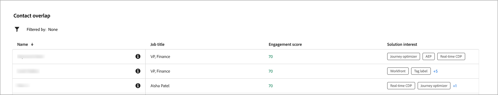

# Detalhes da conta

Ao clicar em um nome de conta em qualquer lugar no Journey Optimizer B2B edition, os detalhes da conta são exibidos. Essas informações fornecem informações úteis sobre a conta, incluindo resumos gerais de IA.

{width="700" zoomable="yes"}

{{intent-data-note}}

A página de detalhes da conta é composta por três seções principais:

## Visão geral da conta

{zoomable="yes"}

A seção de visão geral da conta inclui as seguintes informações da conta:

* Nome da conta
* Número de pessoas na conta
* Setor
* Oportunidades abertas
* As três jornadas de conta mais recentes nas quais a conta está em uso no momento (clique no nome para abrir os detalhes da jornada)
* Resumo da conta da IA geral, que inclui informações sobre os principais grupos de compras envolvidos.

## Cobertura do contato

{width="800" zoomable="yes"}

A seção _[!UICONTROL Cobertura do contato]_ exibe o número de contatos da conta com uma função específica associada a um interesse de solução. A atribuição de função e interesse de solução é baseada no modelo de funções de grupo de compra. Clique em uma célula para exibir informações detalhadas:

* Descrição, no seguinte formato: _x pessoas têm y função para z interesse da solução_
* Colunas
* Nome
* Conta
* Nome do cargo
* Grupo de compra
* Pontuação de engajamento da pessoa
* Última atividade
* Detalhes

Clique no ícone _Filtro_ (  ) na parte superior esquerda para filtrar a exibição de dados usando qualquer um destes atributos:

* Interesse na solução
* Período

## Sobreposição de contato

{width="800" zoomable="yes"}

A seção _[!UICONTROL Sobreposição de contatos]_ exibe os contatos da conta que fazem parte de mais de um grupo de compras como resultado de estarem associados a vários interesses de solução. Essas informações estão no formato de uma tabela com as seguintes colunas:

* Nome
* Nome do cargo
* Conta
* Interesse na solução

Clique no ícone _Informações_ (  ) ao lado do nome do contato para exibir uma tabela com os seguintes detalhes:

* Grupo de compras (clique no nome para abrir os detalhes do grupo de compras)
* Função
* Interesse na solução
* Tentativa do produto (se configurado)
* Produto

Clique no ícone _Filtro_ (  ) na parte superior esquerda para filtrar a exibição de dados usando qualquer um destes atributos:

* Interesse na solução
* Funções
