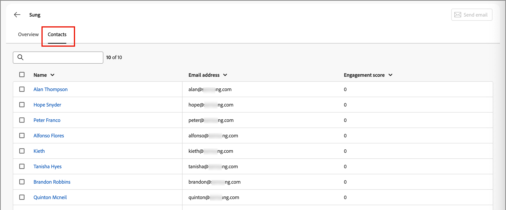
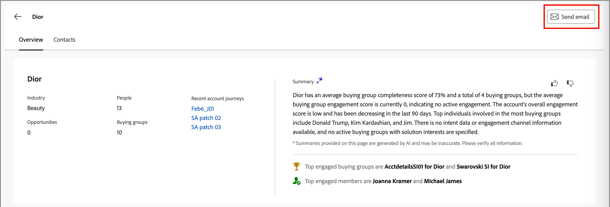

# Detalhes da conta

Ao clicar em um nome de conta em qualquer lugar no Journey Optimizer B2B edition, a página _Detalhes da conta_ é exibida. Esta página fornece informações úteis sobre a conta, incluindo resumos gerais de IA. Também há [ações](#account-actions) que você pode executar para contatos associados à conta.

{width="700" zoomable="yes"}

Use a guia **[!UICONTROL Visão geral]** para revisar informações sobre a conta, e a guia **[!UICONTROL Contatos]** para acessar uma lista de contatos da conta.

## Guia [!UICONTROL Visão geral]

A página de detalhes da conta é composta por três seções principais:

### Visão geral da conta

{zoomable="yes"}

A seção de visão geral da conta inclui as seguintes informações da conta:

* Nome da conta
* Número de pessoas na conta
* Setor
* Oportunidades abertas
* As três jornadas de conta mais recentes nas quais a conta está em uso no momento (clique no nome da jornada para abrir a [visão geral da jornada](../journeys/journey-overview.md))
* Resumo da conta da IA geral, que inclui informações sobre os principais grupos de compras envolvidos.

### Dados de intenção

No Journey Optimizer B2B edition, o modelo de Detecção de intenções prevê uma solução/produto de interesse com alta confiança suficiente com base na atividade de contato da conta. A intenção dos contatos da conta pode ser interpretada como a probabilidade de ter interesse em um produto.

{{intent-data-note}}

{width="700" zoomable="yes"}

* Níveis de intenção
* Tipos de sinal de intenção - Palavras-chave, produto e solução

### Cobertura do contato

{width="800" zoomable="yes"}

A seção _[!UICONTROL Cobertura do contato]_ exibe o número de contatos da conta com uma função específica associada a um interesse de solução. A atribuição de função e interesse de solução é baseada no modelo de funções de grupo de compra. Clique em uma célula para exibir os seguintes detalhes:

* Descrição, no seguinte formato: _x pessoas têm y função para z interesse da solução_
* Colunas
* Nome
* Conta
* Nome do cargo
* Grupo de compra
* Pontuação de engajamento da pessoa
* Última atividade
* Detalhes

Clique no ícone _Filtro_ (  ) na parte superior esquerda para filtrar a exibição de dados usando qualquer um destes atributos:

* Interesse na solução
* Período

### Sobreposição de contato

{width="800" zoomable="yes"}

A seção _[!UICONTROL Sobreposição de contatos]_ exibe os contatos da conta que fazem parte de mais de um grupo de compras como resultado de estarem associados a vários interesses de solução. Essas informações estão no formato de uma tabela com as seguintes colunas:

* Nome
* Nome do cargo
* Conta
* Interesse na solução

Clique no ícone _Informações_ (  ) ao lado do nome do contato para exibir uma tabela com os seguintes detalhes:

* Grupo de compras (clique no nome para abrir os [detalhes do grupo de compras](../buying-groups/buying-group-details.md))
* Função
* Interesse na solução
* Tentativa de produto (se [configurado](../admin/intent-data.md))
* Produto

Clique no ícone _Filtro_ (  ) na parte superior esquerda para filtrar a exibição de dados usando qualquer um destes atributos:

* Interesse na solução
* Funções

## Guia [!UICONTROL Contatos]

Selecione a guia **[!UICONTROL Contatos]** para exibir uma lista de todas as pessoas associadas à conta, que é sincronizada com o Experience Platform. Cada contato listado inclui o nome, endereço de email e pontuação de engajamento.

{width="700" zoomable="yes"}

## Enviar email

É possível enviar um email aprovado pelo profissional de marketing para um ou mais contatos selecionados (até 50 por vez) ou para todos os contatos da conta. A lista de emails disponíveis é limitada aos emails aprovados da instância conectada do Marketo Engage.

>[!BEGINTABS]

>[!TAB Todos os contatos da conta]

1. Na guia _[!UICONTROL Visão geral]_, clique em **[!UICONTROL Enviar email]** na parte superior direita.

   {width="700" zoomable="yes"}

1. Na caixa de diálogo _[!UICONTROL Enviar email]_, selecione o espaço de trabalho do Marketo Engage e marque a caixa de seleção do email que deseja enviar.

   {width="700" zoomable="yes"}

1. Clique em **[!UICONTROL Enviar]**.

>[!TAB Contatos selecionados]

1. Na guia _[!UICONTROL Contatos]_, marque as caixas de seleção dos contatos para os quais deseja receber o email.

1. Na parte superior direita ou na barra de seleção na parte inferior, clique em **[!UICONTROL Enviar email]**.

   {width="700" zoomable="yes"}

1. Na caixa de diálogo _[!UICONTROL Enviar email]_, selecione o espaço de trabalho do Marketo Engage e marque a caixa de seleção do email que deseja enviar.

   {width="700" zoomable="yes"}

1. Clique em **[!UICONTROL Enviar]**.

>[!ENDTABS]
