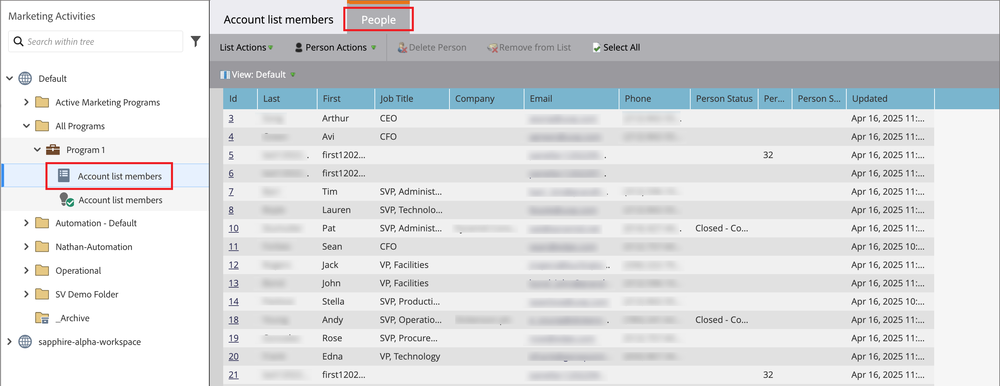

# Usar listas de contas em jornadas e programas

Há várias maneiras de incorporar listas de contas Ativas (publicadas) nas jornadas de conta.

## Nó de público-alvo da conta

Todas as jornadas de conta começam com um nó [_Audiência da conta_](../journeys/account-audience-nodes.md). Quando você define este nó para usar uma lista de contas, as contas do membro se movem pela jornada quando ela fica ativa (publicada).

1. Selecione a opção **[!UICONTROL Lista de contas]** para o nó _Público-alvo da conta_ inicial.

   {width="500"}

1. Clique em **[!UICONTROL Adicionar lista de contas]**.

1. Marque a caixa de seleção da lista de contas e clique em **[!UICONTROL Salvar]**.

   {width="600" zoomable="yes"}

## Executar um nó de ação - Adicionar à conta

**_Somente listas de contas estáticas_**

Em uma jornada de conta, adicione contas a uma lista de contas estática usando o nó [a _Realizar uma Ação_](../journeys/action-nodes.md).

Por exemplo, você pode ter um caminho de jornada para enviar um email e uma conta realizar várias ações como uma resposta. Você considera essa atividade um ponto de qualificação na jornada. Com a qualificação, você deseja adicioná-las a uma lista de contas usada como o público-alvo de outra jornada com um fluxo diferente para contas qualificadas.

>[!NOTE]
>
>Se uma conta já estiver na lista quando o nó for executado, a ação será ignorada.

1. Selecione a opção _[!UICONTROL Ação em]_ **[!UICONTROL Contas]**.

1. Para _[!UICONTROL Ação nas contas]_, escolha **[!UICONTROL Adicionar à lista de contas]**.

   {width="500"}

1. Para **[!UICONTROL Selecionar lista de contas estáticas em tempo real]**, escolha a lista de contas à qual deseja adicionar contas.

   {width="500"}

## Executar um nó de ação - Remover da conta

**_Somente listas de contas estáticas_**

Em uma jornada de conta, remova contas de uma lista de contas estáticas usando o nó [a _Realizar uma Ação_](../journeys/action-nodes.md).

Por exemplo, você pode ter um caminho de jornada para enviar um email e uma conta realizar várias ações como uma resposta. Você considera essa atividade um ponto de qualificação na jornada. Com essa qualificação, você deseja removê-los de uma lista de contas usada para o como público-alvo de outra jornada que envia emails adicionais para que você não duplique suas comunicações de qualificação.

>[!NOTE]
>
>Se uma conta não estiver na lista onde está agendada para remoção, a ação será ignorada.

1. Selecione a opção _[!UICONTROL Ação em]_ **[!UICONTROL Contas]**.

1. Para _[!UICONTROL Ação em contas]_, escolha **[!UICONTROL Remover da lista de contas]**.

   {width="500"}

1. Para **[!UICONTROL Selecionar lista de contas estáticas em tempo real]**, escolha a lista de contas para a qual deseja remover as contas.

   {width="500"}

## Programa Marketo Engage - Lista de membros da conta

Como profissional de marketing, talvez você queira suprimir programas no Marketo Engage para pessoas que fazem parte de listas de contas no Journey Optimizer B2B edition.

Na instância do Marketo Engage conectada ao Journey Optimizer B2B edition, você pode usar o filtro _[!UICONTROL Lista de Membros da Conta]_ em suas Smart Lists para identificar esses clientes potenciais de acordo com sua estratégia de campanha. Para obter mais informações sobre Smart Lists, consulte a [documentação do Marketo Engage](https://experienceleague.adobe.com/en/docs/marketo/using/product-docs/core-marketo-concepts/smart-lists-and-static-lists/understanding-smart-lists){target="_blank"}.

### Adicionar o filtro a uma lista inteligente

1. No Marketo Engage, selecione uma campanha e clique na guia **[!UICONTROL Smart List]**.

1. Na lista de filtros exibida à direita, insira `Member` e localize o filtro **[!UICONTROL Membro da Lista de Contas]**.

1. Arraste o filtro até a tela Smart List.

1. Na tela Smart List, defina o valor da lista **[!UICONTROL Member of account]**.

   Clique na seta para baixo para exibir todas as listas de contas ou digite parte do nome da lista de contas para ajudar a localizar a lista de contas necessária.

   {width="800" zoomable="yes"}

1. No fluxo de campanha, adicione a etapa **[!UICONTROL Adicionar à lista]** e escolha a lista onde deseja preencher as pessoas da lista de contas do Journey Optimizer B2B edition.

   Consulte _[Adicionar uma etapa de Fluxo a uma campanha inteligente](https://experienceleague.adobe.com/en/docs/marketo/using/product-docs/core-marketo-concepts/smart-campaigns/flow-actions/add-a-flow-step-to-a-smart-campaign){target="_blank"}_ na documentação do Marketo Engage para obter informações detalhadas sobre como adicionar etapas a um fluxo.

### Revisar os membros

Depois que o fluxo for executado, é possível exibir a lista de pessoas preenchidas na lista. Abra a lista e selecione a guia Pessoas.

{width="800" zoomable="yes"}
