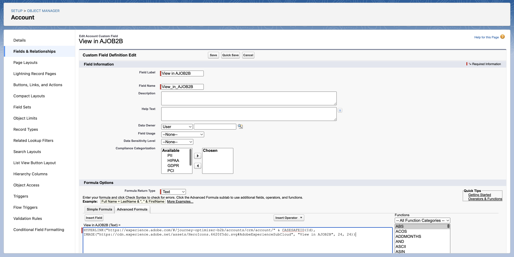
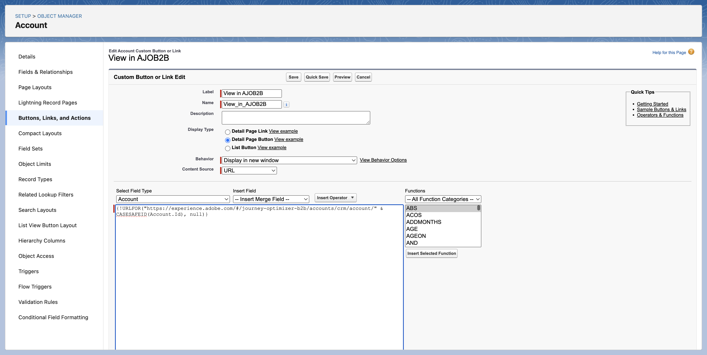
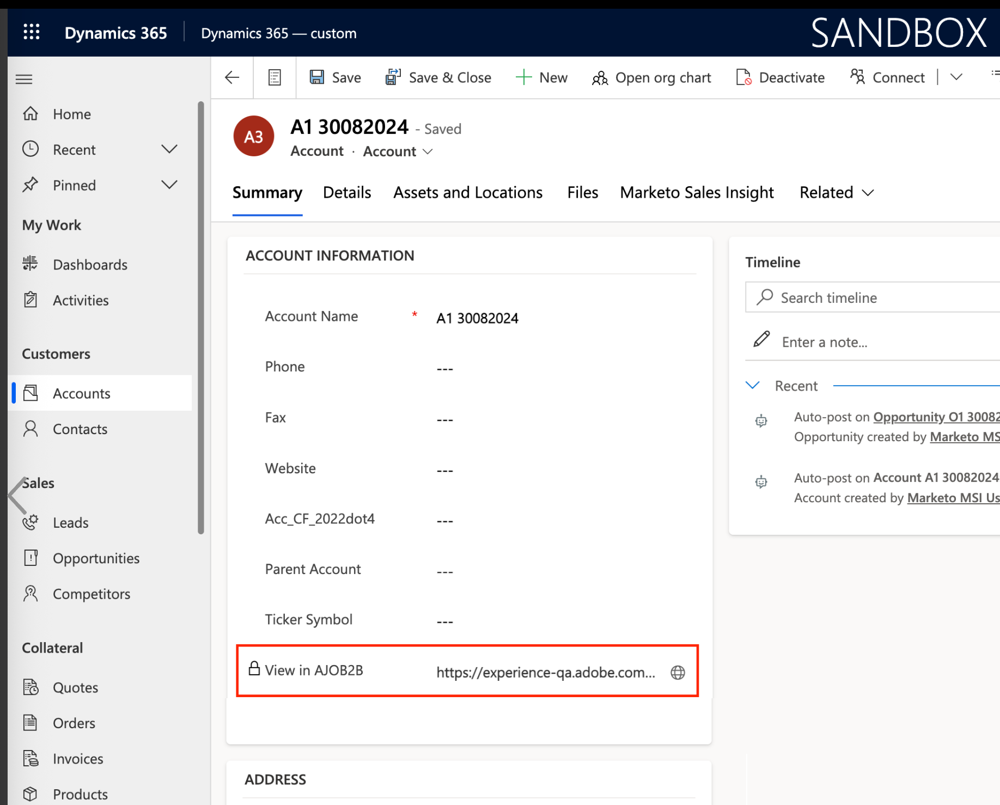

# Acesso no CRM às páginas de detalhes

O Adobe Journey Optimizer B2B edition permite que os membros da equipe de vendas e os gerentes de conta acessem páginas detalhadas para informações de conta e grupo de compras diretamente da ferramenta de CRM (relacionamento com o cliente), como Salesforce ou Microsoft Dynamics. Com essa integração, os representantes de vendas podem acessar rapidamente os insights da conta e do grupo de compras em tempo real, como o histórico de engajamento, os sinais de intenção e as recomendações geradas por IA. Essa capacidade capacita a equipe de vendas para um alcance mais rápido, uma priorização mais inteligente e um melhor alinhamento com o Marketing.

Para permitir que os membros da equipe de Vendas exibam [detalhes da conta](account-details.md) e [detalhes da pessoa](person-details.md) páginas no Journey Optimizer B2B edition a partir do CRM, o administrador do Salesforce ou do Dynamics pode adicionar um link do Journey Optimizer B2B edition a partir da exibição da conta, do contato ou do cliente potencial.

Quando um membro da equipe de vendas usa o link da instância do CRM, a sandbox deve ser _Prod_ e a organização IMS é determinada de acordo com a seguinte lógica ordenada:

1. A organização mais recente que o usuário acessou
1. O primeiro na lista com uma classificação alfabética
1. A organização selecionada em suas preferências

## Links do Salesforce

Um administrador do Salesforce com a permissão _Personalizar Aplicativo_ pode configurar o link no layout Conta, Contato ou Cliente Potencial. Os links configurados permitem que os usuários de Vendas acessem a página de detalhes da conta ou detalhes pessoais correspondente no Adobe Journey Optimizer B2B edition.

No Salesforce, adicione o link personalizado como um botão, hiperlink ou ícone vinculado e personalize-o de acordo com as preferências da equipe.

{width="800" zoomable="yes"}

Para obter informações detalhadas sobre como adicionar um link personalizado no Salesforce, consulte [Definir botões e links personalizados](https://help.salesforce.com/s/articleView?id=platform.defining_custom_links.htm&type=5) na documentação do Salesforce.

Ao definir o URL de destino para o link, você pode usar o layout da conta, do contato ou do cliente potencial e vinculá-lo à página de detalhes correspondente no Journey Optimizer B2B edition:

* **Conta** - `https://experience.adobe.com/#/journey-optimizer-b2b/accounts/crm/account/[18-character ID of account]`

* **Contato** - `https://experience.adobe.com/#/journey-optimizer-b2b/accounts/crm/contact/[18-character ID of contact]`

* **Cliente Potencial** - `https://experience.adobe.com/#/journey-optimizer-b2b/accounts/crm/lead/[18-character ID of lead]`

Use o objeto `Account` para buscar a ID de 18 caracteres da conta, como `CASESAFEID(Account.Id)` ou `CASESAFEID(Id)`.

**_Exemplos:_**

+++Link de campo

1. No Salesforce, vá para **[!UICONTROL Configuração]** > **[!UICONTROL Gerenciador de Objetos]** > **[!UICONTROL Conta]**/**[!UICONTROL Contato]**/**[!UICONTROL Lead]** > **[!UICONTROL Campos e Relações]**.
1. Clique em **[!UICONTROL Novo]** para criar um campo de fórmula (texto) e adicioná-lo ao layout _Conta_, _Contato_ ou _Cliente Potencial_.

   Para a fórmula, use os exemplos a seguir como guia.

   Hiperlink de **_texto:_**

   * Conta - `HYPERLINK("https://experience.adobe.com/#/journey-optimizer-b2b/accounts/crm/account/" & CASESAFEID(Id), "View in AJO B2B")`
   * Contato - `HYPERLINK("https://experience.adobe.com/#/journey-optimizer-b2b/accounts/crm/contact/" & CASESAFEID(Id), "View in AJO B2B")`
   * Cliente em potencial - `HYPERLINK("https://experience.adobe.com/#/journey-optimizer-b2b/accounts/crm/lead/" & CASESAFEID(Id), "View in AJO B2B")`

   Hiperlink **_Ícone:_**

   * Conta - `HYPERLINK("https://experience.adobe.com/#/journey-optimizer-b2b/accounts/crm/account/" & CASESAFEID(Id), IMAGE("https://cdn.experience.adobe.net/assets/HeroIcons.6620f5dc.svg#AdobeExperienceSubCloud", "View in AJO B2B", 24, 24))`
   * Contato - `HYPERLINK("https://experience.adobe.com/#/journey-optimizer-b2b/accounts/crm/contact/" & CASESAFEID(Id), IMAGE("https://cdn.experience.adobe.net/assets/HeroIcons.6620f5dc.svg#AdobeExperienceSubCloud", "View in AJO B2B", 24, 24))`
   * Contato - `HYPERLINK("https://experience.adobe.com/#/journey-optimizer-b2b/accounts/crm/lead/" & CASESAFEID(Id), IMAGE("https://cdn.experience.adobe.net/assets/HeroIcons.6620f5dc.svg#AdobeExperienceSubCloud", "View in AJO B2B", 24, 24))`

   {width="800" zoomable="yes"}

1. Atualize a página para que as alterações de layout sejam exibidas. Vá para **[!UICONTROL Perfil]** e selecione uma opção diferente em **[!UICONTROL DENSIDADE DE EXIBIÇÃO]**.

   {width="450" zoomable="yes"}

+++

+++Link da página de detalhes

1. No Salesforce, vá para **[!UICONTROL Configuração]** > **[!UICONTROL Gerenciador de Objetos]** > **[!UICONTROL Conta]**/**[!UICONTROL Contato]**/**[!UICONTROL Lead]** > **[!UICONTROL Botões, Links e Ações]**.
1. Clique em **[!UICONTROL Novo Botão ou Link]** no canto superior direito e crie o link da página de detalhes.

   Para a fórmula, use os exemplos a seguir como guia.

   * Conta - `{!URLFOR("https://experience.adobe.com/#/journey-optimizer-b2b/accounts/crm/account/" & CASESAFEID(Account.Id), null)}`
   * Contato - `{!URLFOR("https://experience.adobe.com/#/journey-optimizer-b2b/accounts/crm/contact/" & CASESAFEID(Contact.Id), null)}`
   * Cliente em potencial - `{!URLFOR("https://experience.adobe.com/#/journey-optimizer-b2b/accounts/crm/lead/" & CASESAFEID(Lead.Id), null)}`

   {width="800" zoomable="yes"}

1. Vá para **[!UICONTROL Layouts de Página]** na navegação à esquerda.

1. Arraste o link de **[!UICONTROL Links Personalizados]** e solte-o na seção _Links Personalizados_ do layout.

+++

+++Botão de página Detalhes

1. No Salesforce, vá para **[!UICONTROL Configuração]** > **[!UICONTROL Gerenciador de Objetos]** > **[!UICONTROL Conta]**/**[!UICONTROL Contato]**/**[!UICONTROL Lead]** > **[!UICONTROL Botões, Links e Ações]**.
1. Clique em **[!UICONTROL Novo Botão ou Link]** no canto superior direito e crie o botão de página detalhada.

   Para o **[!UICONTROL Tipo de Exibição]**, escolha **[!UICONTROL Link de Página de Detalhes]**.

   Para a fórmula, use os exemplos a seguir como guia.

   * Conta - `{!URLFOR("https://experience.adobe.com/#/journey-optimizer-b2b/accounts/crm/account/" & CASESAFEID(Account.Id), null)}`
   * Contato - `{!URLFOR("https://experience.adobe.com/#/journey-optimizer-b2b/accounts/crm/contact/" & CASESAFEID(Contact.Id), null)}`
   * Cliente em potencial - `{!URLFOR("https://experience.adobe.com/#/journey-optimizer-b2b/accounts/crm/lead/" & CASESAFEID(Lead.Id), null)}`

   {width="800" zoomable="yes"}

1. Vá para **[!UICONTROL Layouts de Página]** na navegação à esquerda.

1. Arraste o botão de **[!UICONTROL Ações para Dispositivos Móveis e Relâmpagos]** e solte-o na seção **[!UICONTROL Ações para Dispositivos Móveis e para Experiências Relâmpagos]** do Salesforce no layout.

   {width="800" zoomable="yes"}

+++

## Links do Microsoft Dynamics

Um desenvolvedor do Dynamics pode estender a entidade Conta, Contato ou Cliente Potencial para adicionar um campo de link. Os links configurados permitem que os usuários de Vendas acessem a página de detalhes da conta ou detalhes pessoais correspondente no Adobe Journey Optimizer B2B edition.

Adicione o link personalizado como um botão, um hiperlink ou um link de ícone vinculado e personalize-o de acordo com as preferências da equipe.

{width="800" zoomable="yes"}

Use o Power Apps para personalizar aplicativos orientados por modelo do Microsoft, como componentes do Dynamics. Para obter informações detalhadas sobre como usar o Power Apps para adicionar um link personalizado no Dynamics, consulte a [documentação do PowerApps](https://learn.microsoft.com/en-us/power-apps/maker/model-driven-apps/create-edit-web-resources).

Ao definir o URL de destino para o link, você pode usar a visualização de conta, contato ou cliente potencial e vinculá-la à página de detalhes correspondente no Journey Optimizer B2B edition:

* **Conta** - `https://experience.adobe.com/#/journey-optimizer-b2b/accounts/crm/account/[Account ID]`

* **Contato** - `https://experience.adobe.com/#/journey-optimizer-b2b/accounts/crm/contact/[Contact ID]`

* **Cliente Potencial** - `https://experience.adobe.com/#/journey-optimizer-b2b/accounts/crm/lead/[Lead ID]`

**_Exemplos:_**

+++Campo URL

Siga esta sequência de tarefas para adicionar o link personalizado como um campo de URL:

**1 - Configurar o campo de solução**

1. Vá para **[!UICONTROL Configurações Avançadas]** > **[!UICONTROL Personalizar o sistema]** e selecione a guia **[!UICONTROL Solução]**.
1. Selecione **[!UICONTROL Entidades]** > **[!UICONTROL Conta]**/**[!UICONTROL Contato]**/**[!UICONTROL Líder]** > **[!UICONTROL Campos]**.
1. Clique em **[!UICONTROL Novo]** e configure o novo campo.

   {width="800" zoomable="yes"}

1. Salve a configuração do campo.
1. Na guia _[!UICONTROL Solução]_, selecione **[!UICONTROL Recursos da Web]**.
1. Clique em **[!UICONTROL Novo]** e configure o seguinte recurso da Web de Script (JScript):

   ```js
   function setViewInAjoB2b(executionContext) {
    var url = "https://experience.adobe.com/#/journey-optimizer-b2b/accounts/crm";
   
    var formContext = executionContext.getFormContext();
   
    // Get the entity ID (GUID)
    var id = formContext.data.entity.getId();
   
    // Get the entity type (account, lead, contact)
    var type = formContext.data.entity.getEntityName().toLowerCase();
   
    if (id && type) {
        // Remove curly braces
        id = id.replace(/[{}]/g, "").toLowerCase();
   
        // Set the value in the custom field (Ensure this field exists on the form)
        formContext.getAttribute("new_viewinajob2b").setValue(url + "/" + type + "/" + id);
       }
   }
   ```

   {width="800" zoomable="yes"}

1. Na parte superior da página, clique em **[!UICONTROL SALVAR]** e depois em **[!UICONTROL PUBLICAR]**.

**2 - Configurar o formulário**

1. Na guia _Solução_, selecione **[!UICONTROL Entidades]** > **[!UICONTROL Conta]**/**[!UICONTROL Contato]**/**[!UICONTROL Lead]** > **[!UICONTROL Forms]** > **[!UICONTROL Conta]**/**[!UICONTROL Contato]**/**[!UICONTROL Lead]**.
1. Arraste o novo campo criado na primeira tarefa do **[!UICONTROL Explorador de Campos]** para a seção **[!UICONTROL Resumo]**.

   {width="800" zoomable="yes"}

1. Clique duas vezes no campo na seção _Resumo_ e configure suas propriedades.

   {width="800" zoomable="yes"}

   Quando a configuração da propriedade estiver concluída, clique em **[!UICONTROL OK]**.

1. Na faixa de opções na parte superior da página, clique em **[!UICONTROL Salvar]** e em **[!UICONTROL Publicar]**.

**3 - Adicionar o recurso da Web JS às bibliotecas de formulários**

1. Na guia _[!UICONTROL Página inicial]_ na parte superior, clique em **[!UICONTROL Propriedades do Formulário]**.
1. Clique em **[!UICONTROL Adicionar]**.

   {width="500" zoomable="yes"}

1. Localize o recurso, selecione-o e clique em **[!UICONTROL Adicionar]**.

   {width="500" zoomable="yes"}

1. Com o recurso adicionado selecionado, clique em **[!UICONTROL Adicionar]** em _[!UICONTROL Manipuladores de eventos]_.
1. Adicione a função `setViewInAjoB2b` em **[!UICONTROL Manipuladores de Eventos]**.
1. Com a função selecionada na lista _[!UICONTROL Manipuladores de Eventos]_, defina **[!UICONTROL Controle]** como `Form` e **[!UICONTROL Evento]** como `OnLoad`.

   {width="500" zoomable="yes"}

1. Clique em **[!UICONTROL OK]**.

1. Na guia _[!UICONTROL Página Inicial]_ na parte superior, clique em **[!UICONTROL Salvar]** e em **[!UICONTROL Publicar]**.

**4 - Verificar o link**

Para verificar o link, verifique o modo de exibição Conta, Contato ou Cliente Potencial no Dynamics.

{width="500" zoomable="yes"}

Se o link não for exibido, tente acessar Contas, Contatos ou Clientes potenciais em **[!UICONTROL Clientes]** na home page do Dynamics. Em seguida, volte para a exibição específica da conta, do contato ou do cliente potencial. Você também pode tentar sair e entrar novamente.

+++

+++Recurso da Web do HTML

Siga esta sequência de tarefas para adicionar o link personalizado como um recurso da Web do HTML:

>[!NOTE]
>
>Este exemplo depende de como o Dynamics usa os recursos da Web da página da Web.

**1 - Configurar os recursos da Web da solução**

1. Vá para **[!UICONTROL Configurações Avançadas]** > **[!UICONTROL Personalizar o sistema]** e selecione a guia **[!UICONTROL Solução]**.

1. Na guia _[!UICONTROL Solução]_, selecione **[!UICONTROL Recursos da Web]**.

1. Clique em **[!UICONTROL Novo]** e configure o seguinte recurso da Web de Script (JScript) usando a seguinte função:

   ```js
   function getFormContext(executionContext) {
       window.top["formContext"] = executionContext.getFormContext();
   }
   ```

   {width="800" zoomable="yes"}

1. Clique em **[!UICONTROL Novo]** para criar outro recurso da Web e configurar um recurso da Web de página da Web (HTML) usando a seguinte HTML:

   ```html
   <html>
   <head>
       <script>
       function onLoad(){
           // Adobe URL
           var url = "https://experience.adobe.com/#/journey-optimizer-b2b/accounts/crm";
   
           // Get the entity ID (GUID)
           var id = window.top.formContext.data.entity.getId();
   
           // Get the entity type (account, lead, contact)
           var type = window.top.formContext.data.entity.getEntityName().toLowerCase();
   
           if (id && type) {
               // Remove curly braces
               id = id.replace(/[{}]/g, "").toLowerCase();
               var url = url + "/" + type + "/" + id;
   
               // Find the hyperlink and set the href value
               var link = document.getElementById("link");
               link.href = url;
           }
       }
       </script>
   </head>
   <body onload="onLoad()" style="margin-left: 0;">
       <a id="link" style="text-decoration: none; font-family: sans-serif; font-size: 13px;" target="_blank">
           
           <span style="vertical-align: middle;">View in AJOB2B</span>
       </a>
   </body>
   </html>
   ```

1. Na parte superior da página, clique em **[!UICONTROL SALVAR]** e depois em **[!UICONTROL PUBLICAR]**.

**2 - Adicionar os recursos da Web JS às bibliotecas de formulários**

1. Na guia _Solução_, selecione **[!UICONTROL Entidades]** > **[!UICONTROL Conta]**/**[!UICONTROL Contato]**/**[!UICONTROL Lead]** > **[!UICONTROL Forms]** > **[!UICONTROL Conta]**/**[!UICONTROL Contato]**/**[!UICONTROL Lead]**.

1. Na guia _Página inicial_ na parte superior, clique em **[!UICONTROL Propriedades do Formulário]**.

1. Clique em **[!UICONTROL Adicionar]**.

1. Localize o recurso da Web JScript (`new_getFormContext`) que você criou, selecione-o e clique em **[!UICONTROL Adicionar]**.

   {width="500" zoomable="yes"}

1. Com o recurso adicionado selecionado, clique em **[!UICONTROL Adicionar]** em _[!UICONTROL Manipuladores de eventos]_.
1. Adicione a função `getFormContext` em **[!UICONTROL Manipuladores de Eventos]**.
1. Com a função selecionada na lista _[!UICONTROL Manipuladores de Eventos]_, defina **[!UICONTROL Controle]** como `Form` e **[!UICONTROL Evento]** como `OnLoad`.

   {width="500" zoomable="yes"}

1. Clique em **[!UICONTROL OK]**.

1. Na guia _[!UICONTROL Página Inicial]_ na parte superior, clique em **[!UICONTROL Salvar]** e em **[!UICONTROL Publicar]**.

**3 - Configurar o formulário**

1. Na guia **[!UICONTROL INÍCIO]** do formulário Conta, Contato ou Cliente Potencial, selecione **[!UICONTROL Corpo]** (para criar o recurso vinculado na seção _Resumo_) ou **[!UICONTROL Cabeçalho]** (para criá-lo no menu de cabeçalho).

   {width="500" zoomable="yes"}

1. Selecione a guia **[!UICONTROL INSERIR]** na parte superior e clique em **[!UICONTROL Recurso da Web]**.

1. Insira o recurso da Web criado e configure as propriedades.

   {width="500" zoomable="yes"}

   Consulte a [documentação do Power Apps](https://learn.microsoft.com/en-us/power-apps/maker/model-driven-apps/web-resource-properties-legacy) para obter informações detalhadas sobre as propriedades e a formatação dos recursos da Web.

1. Clique em **[!UICONTROL OK]**.

   Se você escolher um posicionamento Corpo/Resumo para o recurso da Web, ele será exibido no layout do formulário.

   {width="800" zoomable="yes"}

1. Na guia _[!UICONTROL Página Inicial]_ na parte superior, clique em **[!UICONTROL Salvar]** e em **[!UICONTROL Publicar]**.

**4 - Verificar o link**

Para verificar o link, verifique o modo de exibição Conta, Contato ou Cliente Potencial no Dynamics.

{width="500" zoomable="yes"}

Se o link não for exibido, tente acessar Contas, Contatos ou Clientes potenciais em **[!UICONTROL Clientes]** na home page do Dynamics. Em seguida, volte para a exibição específica da conta, do contato ou do cliente potencial. Você também pode tentar sair e entrar novamente.

+++
