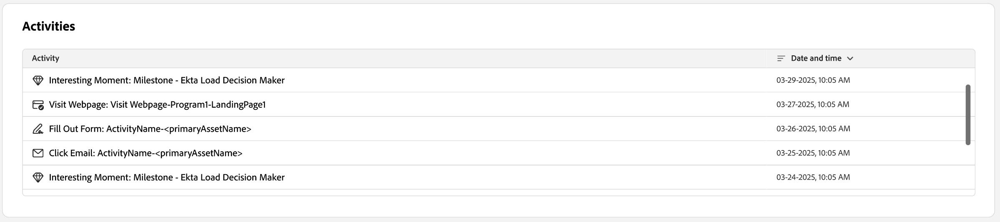

# Dados da pessoa

Ao clicar em um nome de pessoa em qualquer lugar no Journey Optimizer B2B edition, a página de detalhes da pessoa é exibida. Esta página inclui informações úteis sobre a pessoa associada a uma conta ou grupo de compras, incluindo um resumo de IA generativo de dados de destaque e intenção (se configurado). <!-- There are also [actions](#person-actions) that you can execute for the person. -->

{width="800" zoomable="yes"}

Você pode acessar esta página clicando em um nome exibido na [Página de detalhes do Painel Inteligente](../dashboards/intelligent-dashboard.md), [Página de detalhes do Grupo de Compras](../buying-groups/buying-group-details.md) ou [Página de detalhes da conta](./account-details.md).

A página de detalhes da pessoa é composta pelas quatro seções a seguir:

## Visão geral da pessoa

{zoomable="yes"}

A seção de visão geral de pessoa na parte superior da página inclui as seguintes informações:

* Nome
* Título
* Email
* Número de telefone
* Pontuação de engajamento
* Resumo

## Atividades

Esta seção fornece uma lista dos momentos mais recentes de email, Web, preenchimento de formulário e interessantes associados à pessoa (até 20). Os itens são listados como o tipo de atividade com a data e a hora.

{width="700" zoomable="yes"}

## Grupos de compras com base na pontuação de engajamento

Esta seção inclui grupos de compras dos quais a pessoa é membro e é classificada de acordo com a pontuação de engajamento. Cada cartão inclui as seguintes informações do grupo de compras:

* Nome - Clique no nome para abrir os [detalhes do grupo de compras](../buying-groups/buying-group-details.md).
* Pontuação de engajamento
* Pontuação de integridade
* Estágio
* Membros

{width="700" zoomable="yes"}

## Dados de intenção

No Journey Optimizer B2B edition, o modelo de Detecção de intenções prevê uma solução/produto de interesse com alta confiança suficiente com base na atividade de uma pessoa. Ele também aproveita as atividades de outros membros da conta, juntamente com o conteúdo marcado. A intenção de uma pessoa pode ser interpretada como a probabilidade de ter interesse em um produto.

{{intent-data-note}}

{width="700" zoomable="yes"}

* Níveis de intenção
* Tipos de sinal de intenção - Palavras-chave, produto e solução

<!-- ## Person actions -->
