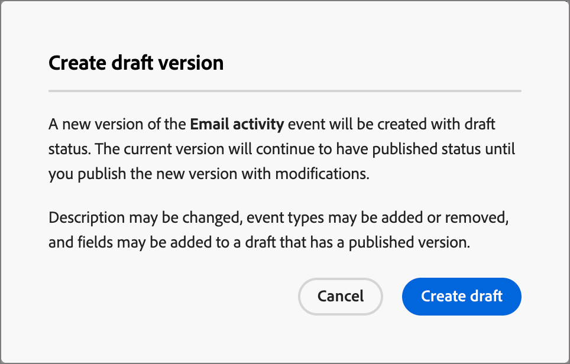

# Configurar definições de evento do Experience Platform

Os administradores podem configurar definições de evento baseadas no Adobe Experience Platform (AEP), que permitem aos profissionais de marketing criar jornadas de conta que reagem aos [Eventos de experiência do AEP](https://experienceleague.adobe.com/pt-br/docs/experience-platform/xdm/classes/experienceevent){target="_blank"}.

{width="30"} [Assista ao vídeo de visão geral](#overview-video)

O uso de eventos de experiência do AEP em jornadas de conta é um processo de duas etapas:

1. Crie e publique uma definição de evento do AEP.

2. Em uma jornada de conta, adicione um nó _Ouvir um evento_ e [selecione uma definição de evento do AEP como um evento de pessoas](../journeys/listen-for-event-nodes.md#listen-for-an-experience-event).

Cada definição de evento requer as seguintes entradas do Experience Platform:

* **_Esquema_** - esquema XDM que define a estrutura de dados do Evento de Experiência. Ele deve ser baseado em um Evento de experiência e deve ser habilitado para perfil.

  >[!NOTE]
  >
  >Para garantir que os esquemas necessários sejam definidos, fale com a equipe de engenharia. [A criação de esquemas XDM](https://experienceleague.adobe.com/pt-br/docs/experience-platform/xdm/schema/composition){target="_blank"} é um processo complexo executado por engenheiros de dados com base nos requisitos de caso de uso em sua organização.

* **_Tipos de evento_** - XDM ExperienceEvent eventType (máximo de 20 por definição de evento).

* **_Campos_** - Campos XDM presentes no esquema (máximo de 20 por definição de evento)

* **_Nome_** - Um nome exclusivo para a definição de evento.

* **_Descrição_** - Uma descrição para a definição de evento.

## Limitações e medidas de proteção

Ao criar e gerenciar as definições de evento para atingir as metas organizacionais, lembre-se do seguinte:

* O Journey Optimizer B2B edition oferece suporte a no máximo 50 definições de eventos.

* As jornadas de conta podem ouvir os eventos da AEP Experience que são assimilados usando os recursos de transmissão do AEP, como o Web SDK ou a API HTTP.

* Somente uma definição de evento do AEP pode usar um esquema combinado e um conjunto de tipos de evento. Ao criar uma definição de evento usando um esquema (por exemplo, `My Schema`) e um tipo de evento (por exemplo, `Web Webpagedetails Page Views`), nenhuma outra definição de evento pode usar a combinação de `My Schema` e `Web Webpagedetails Page Views`.

* Uma definição de evento pode ser usada em mais de uma jornada de conta.

* Os Eventos de experiência do AEP podem ser usados para fins de decisão em uma jornada de conta, mas não são retidos. Portanto, nenhum registro histórico de eventos de experiência do AEP pode ser aproveitado no Journey Optimizer B2B edition.

* As restrições para _data de atividade_ e _número mínimo de vezes_ não são suportadas.

* Depois que uma definição de evento é publicada, o esquema e o nome não podem ser modificados. No entanto, é possível adicionar tipos de evento e campos criando uma versão de rascunho e publicando novamente.

* As definições de evento usadas em jornadas publicadas não podem ser excluídas.

## Acessar e gerenciar definições de eventos

1. Na navegação à esquerda, escolha **[!UICONTROL Administração]** > **[!UICONTROL Configurações]**.

1. Clique em **[!UICONTROL Eventos]** no painel intermediário para exibir a lista de definições de eventos.

   Nesta página, você pode [criar](#create-an-event-definition), [publicar](#publish-an-event-defintion), [editar](#edit-an-event-definition) e [excluir](#delete-an-event-definition) definições de eventos.

   {width="800" zoomable="yes"}

   A tabela é classificada pela coluna _[!UICONTROL Modificado]_, com as definições atualizadas mais recentemente na parte superior como padrão.<!-- Click the column title to change between ascending and descending.-->

1. Para acessar os detalhes de uma definição de evento, clique no nome.

### Status e ciclo de vida da definição de eventos

Na lista _[!UICONTROL Definições de evento]_, a coluna **[!UICONTROL Status]** indica o status atual de cada definição. O status determina sua disponibilidade para uso em jornadas de conta e as alterações que você pode fazer nele.

| Status | Descrição |
| -------------------- | ----------- |
| Rascunho | Ao criar uma definição de evento, ela estará no status de rascunho. Ele permanece nesse status até que você o publique para uso nas jornadas da conta. Ações disponíveis:  <li>Editar todos os detalhes<li>Publicação<li>Excluir |
| Publicado | Ao publicar uma definição de evento, ela fica disponível para uso nas jornadas da conta. Os detalhes não podem ser modificados. Ações disponíveis:  <li>Disponível para _Ouvir um nó de jornada do evento_<li>Criar versão de rascunho<li>Excluir (se não estiver em uso) |
| Publicado (com rascunho) | Ao criar um rascunho a partir de uma definição de evento publicada, a versão publicada permanece disponível para uso nas jornadas da conta e a versão rascunho pode ser modificada. Se você publicar a versão de rascunho, ela substituirá a versão publicada atual e a definição do evento será atualizada para as jornadas da conta em que ainda não foi executada. Ações disponíveis:  <li>Editar todos os detalhes<li>Publicar versão de rascunho<li>Descartar versão de rascunho<li>Excluir (se não estiver em uso) |

{zoomable="yes"}

### Filtrar a lista de definições de evento

Para procurar uma definição de evento por nome, digite uma string de texto na barra de pesquisa para uma correspondência.

{width="700" zoomable="yes"}

## Criar uma definição de evento

1. Na navegação à esquerda, escolha **[!UICONTROL Administração]** > **[!UICONTROL Configuração]**.

1. Clique em **[!UICONTROL Eventos]** no painel intermediário para exibir a lista de definições de eventos.

1. Clique em **[!UICONTROL Criar evento]** na parte superior direita.

1. Insira o **[!UICONTROL Nome]** (obrigatório) e a **[!UICONTROL Descrição]** (opcional).

   {width="600" zoomable="yes"}

1. Defina o **[!UICONTROL Esquema]** a ser usado para a definição do evento.

   O esquema selecionado determina os campos disponíveis para adição à definição. Os campos adicionados ficam disponíveis como restrições para um nó _Ouvir um evento_ em uma jornada de conta.

   * Clique em **[!UICONTROL Selecionar esquema]**.
   * Na caixa de diálogo, selecione um esquema na lista de esquemas baseados em eventos de experiência.
   * Clique em **[!UICONTROL Selecionar]**.

   {width="600" zoomable="yes"}

1. Selecione os **[!UICONTROL Tipos de evento]** a serem usados para a definição de evento.

   Os [tipos de evento](https://experienceleague.adobe.com/pt-br/docs/experience-platform/xdm/classes/experienceevent#eventType){target="_blank"} selecionados determinam os eventos que estão disponíveis como restrições para um nó _Ouvir um evento_ em uma jornada de conta.

   * Clique em **[!UICONTROL Selecionar tipos de evento]**.
   * Na caixa de diálogo, selecione um ou mais tipos de evento na lista (máximo de 20).
   * Clique em **[!UICONTROL Selecionar]**.

   {width="600" zoomable="yes"}

1. Selecione os **[!UICONTROL Campos]** a serem usados na definição do evento.

   Os campos selecionados determinam as restrições disponíveis quando o evento é usado para um nó _Ouvir um evento_ em uma jornada de conta.

   >[!NOTE]
   >
   >O campo `eventType` é obrigatório e selecionado automaticamente.

   * Clique em **[!UICONTROL Selecionar campos]**.
   * Na caixa de diálogo, selecione um ou mais campos da lista (máximo de 20).
   * Clique em **[!UICONTROL Selecionar]**.

   {width="600" zoomable="yes"}

1. Quando o esquema, os tipos de evento e os campos estiverem completos, clique em **[!UICONTROL Criar]**.

   Após a criação, a página da lista é exibida e o novo evento está no topo da lista com um status _Rascunho_.

   {width="700" zoomable="yes"}

## Publicar uma definição de evento

Quando estiver satisfeito com a definição completa e correta do evento de rascunho para suas necessidades, você poderá publicá-la. A definição de evento publicada estará disponível para uso nas jornadas da conta. Depois que a definição do evento for publicada, você poderá criar uma versão de rascunho se precisar fazer alterações nela. No entanto, não é possível alterar o esquema e você só pode adicionar tipos de evento e campos (não é possível excluí-los).

1. Na navegação à esquerda, escolha **[!UICONTROL Administração]** > **[!UICONTROL Configuração]**.

1. Clique em **[!UICONTROL Eventos]** no painel intermediário para exibir a lista de definições de eventos.

1. Na lista _[!UICONTROL Definições de evento]_, clique no nome da definição de evento de rascunho para abrir a página de detalhes.

   {width="600" zoomable="yes"}

   Se necessário, revise as configurações antes de publicar. Você pode [editar o rascunho](#edit-an-event-definition) se ele não atender aos seus requisitos.

1. Clique em **[!UICONTROL Publicar]** na parte superior direita.

1. No diálogo de confirmação, clique em **[!UICONTROL Publicar]**.

   {width="300"}

   O status da definição de evento é alterado para _Publicado_ e agora está [disponível para uso nas jornadas da conta](../journeys/listen-for-event-nodes.md#listen-for-an-experience-event).

   {width="700" zoomable="yes"}

## Editar uma definição de evento

1. Na navegação à esquerda, escolha **[!UICONTROL Administração]** > **[!UICONTROL Configuração]**.

1. Clique em **[!UICONTROL Eventos]** no painel intermediário para exibir a lista de definições de eventos.

   As edições em uma definição de evento dependem do status atual:

   * Quando uma definição de evento estiver no status _Rascunho_, você poderá editar qualquer um de seus detalhes.
   * Quando uma definição de evento está no status _Publicado_, não é possível editá-la. Você pode criar uma versão de rascunho editável e substituir a versão publicada.
   * Quando uma definição de evento está no status _Publicado (com rascunho)_, é possível alterar a versão de rascunho (editar a descrição e adicionar tipos de evento e campos).

   {width="700" zoomable="yes"}

1. Na página de listagem _[!UICONTROL Definições de evento]_, clique no nome da definição de evento para abri-la.

Siga as etapas de acordo com o status:

>[!BEGINTABS]

>[!TAB Rascunho]

1. Altere qualquer um dos detalhes de definição do evento, conforme necessário.

   {width="600" zoomable="yes"}

   Siga as mesmas diretrizes usadas para [criar uma definição de evento](#create-an-event-definition).

   As alterações são salvas automaticamente no rascunho.

1. Quando a definição de evento atender aos seus critérios e você desejar disponibilizá-la para jornadas de conta de usuário, clique em **[!UICONTROL Publicar]**.

1. No diálogo de confirmação, clique em **[!UICONTROL Publicar]**.

   O status da definição de evento muda para _Publicado_ e agora está disponível para uso em jornadas de conta.

>[!TAB Publicado]

1. Para atualizar a definição do evento, clique em **[!UICONTROL Criar versão de rascunho]** na parte superior direita.

   {width="600" zoomable="yes"}

1. Na caixa de diálogo de confirmação, clique em **[!UICONTROL Criar rascunho]** para abrir a versão de rascunho.

   {width="300"}

   Esta ação cria a versão de rascunho e retorna à página da lista, onde a definição do evento agora está no status _Publicado (com rascunho)_.

1. Clique no nome da definição de evento para abri-la.

   Para uma definição de evento _Publicado (com rascunho)_, a guia de versão _[!UICONTROL Publicado]_ é selecionada como padrão.

1. Selecione a guia de versão **[!UICONTROL Rascunho]**.

   {width="600" zoomable="yes"}

1. Altere os detalhes editáveis (**[!UICONTROL Descrição]**, **[!UICONTROL Tipos de evento]** e **[!UICONTROL Campos]**) conforme necessário.

   Siga as mesmas diretrizes usadas para [criar uma definição de evento](#create-an-event-definition).

   As alterações são salvas automaticamente no rascunho.

1. Quando a definição do evento de rascunho atender aos seus critérios e você quiser substituir a versão publicada atual para uso nas jornadas da conta, clique em **[!UICONTROL Publicar rascunho]**.

1. No diálogo de confirmação, clique em **[!UICONTROL Publicar]**.

   {width="300"}

   Ao publicar a versão de rascunho, ela substitui a versão publicada atual e a definição do evento é atualizada para jornadas da conta em que já está em uso, mas ainda não é executada.

>[!TAB Publicado (com rascunho)]

Ao abrir uma definição de evento _Publicado (com rascunho)_, a guia de versão _[!UICONTROL Publicado]_ é selecionada como padrão.

1. Selecione a guia de versão **[!UICONTROL Rascunho]**.

   {width="600" zoomable="yes"}

1. Altere os detalhes editáveis (**[!UICONTROL Descrição]**, **[!UICONTROL Tipos de evento]** e **[!UICONTROL Campos]**) conforme necessário.

   Siga as mesmas diretrizes usadas para [criar uma definição de evento](#create-an-event-definition).

   As alterações são salvas automaticamente no rascunho.

1. Quando a definição do evento de rascunho atender aos seus critérios e você quiser substituir a versão publicada atual para uso nas jornadas da conta, clique em **[!UICONTROL Publicar rascunho]**.

1. No diálogo de confirmação, clique em **[!UICONTROL Publicar]**.

   {width="300"}

   Ao publicar a versão de rascunho, ela substitui a versão publicada atual e a definição do evento é atualizada para jornadas da conta em que já está em uso, mas ainda não é executada.

>[!ENDTABS]

## Excluir uma definição de evento

É possível excluir uma definição de evento se ela não estiver sendo usada por uma jornada de conta publicada.

>[!CAUTION]
>
>Use essa ação com cuidado. A remoção de uma definição de evento não pode ser revertida.

1. Na navegação à esquerda, escolha **[!UICONTROL Administração]** > **[!UICONTROL Configuração]**.

1. Clique em **[!UICONTROL Eventos]** no painel intermediário para exibir a lista de definições de eventos.

1. Localize a definição de evento na lista e clique no ícone _Excluir_ (  ) à direita do nome.

1. Na caixa de diálogo de confirmação, clique em **[!UICONTROL Excluir]**.

   {width="300"}

## Vídeo de visão geral

>[!VIDEO](https://video.tv.adobe.com/v/3448637/?learn=on)