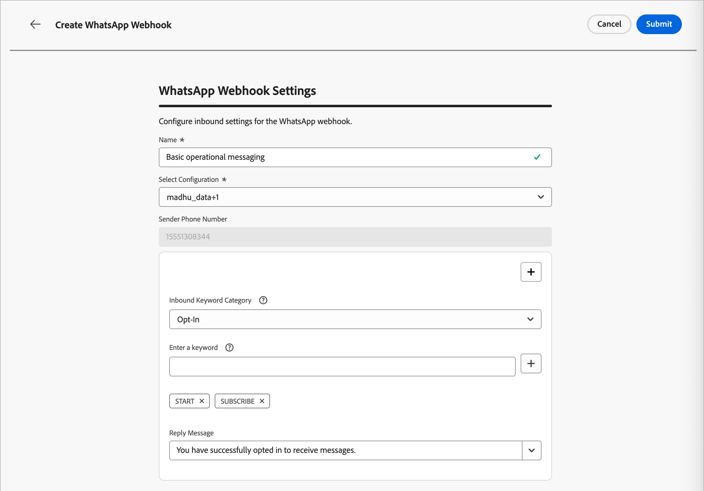

# Configuração de canal do WhatsApp

O Adobe Journey Optimizer B2B edition envia mensagens de WhatsApp por meio da API de nuvem da Meta. Antes que os profissionais de marketing possam criar mensagens do WhatsApp para jornadas de conta, um administrador de produto deve configurar um canal do WhatsApp.

## Pré-requisitos

Antes de configurar o canal do WhatsApp, verifique se você tem o seguinte:

* [Uma conta do Meta Business Manager](https://business.facebook.com/)
* [Uma Conta de Negócios do WhatsApp com nome de remetente e número de telefone verificados](https://developers.facebook.com/docs/whatsapp/overview/business-accounts/)
* [Um token de autorização de usuário do Meta com as permissões apropriadas](https://developers.facebook.com/blog/post/2022/12/05/auth-tokens/)
* [Modelos de mensagem aprovados em sua conta de negócios do WhatsApp](https://developers.facebook.com/docs/whatsapp/message-templates/guidelines/)

>[!IMPORTANT]
>
>Seu uso dos serviços de mensagens do WhatsApp está sujeito aos termos e condições do Meta. Ao acessar mensagens do WhatsApp por meio do Journey Optimizer B2B edition, você reconhece que revisou e concorda em cumprir as [políticas de Negócios do Meta WhatsApp](https://www.whatsapp.com/legal/business-policy/).

## Limitações {#limitations}

Os seguintes limites se aplicam ao canal do WhatsApp:

* O Adobe Journey Optimizer B2B edition **não é compatível com HIPAA e não está preparado para HIPAA**. Além disso, os fornecedores terceirizados não são cobertos pela BAA da Adobe. Os clientes são responsáveis por sua própria conformidade e validação do fornecedor.

* As mensagens de resposta automatizadas ou predefinidas ainda não são compatíveis.

* A partir de abril de 2025, o Meta suspendeu temporariamente a entrega de todas as mensagens de template de marketing para usuários do WhatsApp que têm um número de telefone dos Estados Unidos (um número composto por um código de discagem +1 e um código de área dos EUA). [Saiba mais na documentação do Meta](https://developers.facebook.com/documentation/business-messaging/whatsapp/templates/marketing-templates/per-user-limits/)

* A funcionalidade de integração nativa não permite a integração com um provedor de serviços comerciais (BSP) terceirizado.

## Concluir a configuração do canal

Antes de enviar a mensagem do WhatsApp, você deve configurar o ambiente do Journey Optimizer B2B edition e conectá-lo à sua conta do WhatsApp.

Conclua as seguintes tarefas:

1. [Criar as credenciais da API do WhatsApp](#create-whatsapp-api-credentials)
1. [Adicionar os webhooks do WhatsApp](#configure-webhooks)
1. [Criar a configuração do canal do WhatsApp](#create-channel-configuration)

### Criar credenciais da API do WhatsApp

>[!NOTE]
>
>As configurações descritas podem ser acessadas somente por usuários com privilégios de Administrador.

1. Na navegação à esquerda, expanda a seção **[!UICONTROL Administração]** e clique em **[!UICONTROL Canais]**.

1. No painel, expanda **[!UICONTROL Configurações do WhatsApp]** e selecione **[!UICONTROL Credenciais da API]**.

   {width="800" zoomable="yes"}

1. Clique em **[!UICONTROL Criar novas credenciais de API]** na parte superior direita.

1. Configure suas credenciais de API, conforme detalhado abaixo:

   * **[!UICONTROL Nome]** - Insira um nome exclusivo para as credenciais
   * **[!UICONTROL Token de API]** - Insira seu token de API. Para obter informações, consulte a [Documentação do Meta](https://developers.facebook.com/blog/post/2022/12/05/auth-tokens/).
   * **[!UICONTROL ID da Conta Comercial]** - Insira o número exclusivo relacionado ao seu portfólio comercial. Para obter informações, consulte a [Documentação do Meta](https://www.facebook.com/business/help/1181250022022158?id=180505742745347).

   {width="500" zoomable="yes"}

1. Clique em **[!UICONTROL Continuar]**.

1. Escolha a **[!UICONTROL Conta Comercial do WhatsApp]** que você deseja conectar às suas credenciais da API do WhatsApp.

   {width="500" zoomable="yes"}

1. Selecione o **[!UICONTROL Nome do remetente]** a ser usado para enviar mensagens do WhatsApp.

   As configurações de número de telefone são preenchidas automaticamente:

   * **Classificação de qualidade** - reflete o feedback do cliente para mensagens enviadas nas últimas 24 horas.
      * Verde: alta qualidade
      * Amarelo: qualidade do Medium
      * Vermelho: baixa qualidade

     Para obter mais informações, consulte [_Classificação de qualidade_](https://www.facebook.com/business/help/766346674749731#) na documentação do Meta.

   * **Taxa de transferência** - indica a taxa à qual seu número de telefone pode enviar mensagens.

1. Clique em **[!UICONTROL Enviar]** quando terminar de configurar suas credenciais de API.

Ao clicar em _[!UICONTROL Enviar]_, as credenciais são imediatamente validadas e salvas, redirecionando você para a página de listagem _[!UICONTROL credenciais de API]_.

Se as credenciais enviadas forem inválidas, o sistema exibirá uma mensagem de erro HTTP 500. Nesse caso, você pode optar por cancelar a configuração ou atualizá-la e enviar novamente.

+++Solução de problemas de erro HTTP 500

Se você encontrar um erro HTTP 500 ao configurar as credenciais da API do WhatsApp, siga estas etapas de solução de problemas:

1. Verifique seus direitos da Adobe - Confirme se sua organização tem o direito _cjm_ whatsapp_ provisionado. Sem esse direito, o canal do WhatsApp não pode ser configurado.

1. Validar os campos da conta de negócios - Verifique se todos os campos obrigatórios estão corretos:

   * Token de API - Deve ser um [token de acesso Meta válido com permissões apropriadas](https://developers.facebook.com/blog/post/2022/12/05/auth-tokens/).
   * ID da Conta Comercial - deve corresponder exatamente à sua [ID da Conta Comercial da Meta](https://www.facebook.com/business/help/1181250022022158?id=180505742745347).

1. Testar as credenciais externamente - Verifique suas credenciais diretamente com a API do Meta para confirmar se o problema está relacionado às credenciais ou ao manuseio de credenciais do Journey Optimizer B2B edition.

<!--
 1. Enable advanced logging - To identify internal server or authentication misconfigurations, enable advanced logs in your Journey Optimizer B2B Edition environment to provide detailed information about the API call failures.
do we have advanced logs? How are they enabled?
-->

1. Entre em contato com a Adobe - Se o ambiente e os direitos forem confirmados válidos, mas o erro HTTP 500 persistir, entre em contato com o representante da Adobe.

+++

### Adicionar os webhooks do WhatsApp {#configure-webhooks}

>[!CONTEXTUALHELP]
>id="ajo_b2b_admin-whatsapp-webhook-inbound-keyword-category"
>title="Categoria de palavra-chave de entrada"
>abstract="<b>Aceitar</b>: envia a resposta automática definida quando um usuário assina.  <b>Recusar</b>: envia a resposta automática definida quando um usuário cancela a assinatura.  <b>Ajuda</b>: envia a resposta automática definida quando um usuário solicita ajuda ou suporte.  <b>Padrão</b>: envia sua resposta automática de fallback quando nenhuma palavra-chave é correspondente."

>[!CONTEXTUALHELP]
>id="ajo_b2b_admin_whatsapp-webhook-inbound-keyword"
>title="Insira as palavras-chave"
>abstract="É possível definir palavras-chave para acionar respostas automáticas específicas com base no texto dos usuários. As palavras-chave não diferenciam maiúsculas de minúsculas (stop e STOP são tratados da mesma forma)."

>[!CONTEXTUALHELP]
>id="ajo_b2b_admin-whatsapp-webhook-webhook-url"
>title="URL de retorno de chamada"
>abstract="A solicitação de validação e as notificações do webhook para este objeto são enviadas para o URL especificado."

>[!CONTEXTUALHELP]
>id="ajo_b2b_admin-whatsapp-webhook-verify-token"
>title="Verificar token"
>abstract="O token que a Meta retorna para confirmar e verificar o URL de retorno de chamada durante o processo de verificação."

Os webhooks permitem que o Journey Optimizer B2B edition receba mensagens de entrada, respostas de consentimento e notificações de entrega da sua conta comercial do WhatsApp. Configure webhooks para garantir o gerenciamento de consentimento e o rastreamento de mensagens adequados.

>[!NOTE]
>
>Sem palavras-chave de aceitação ou recusa especificadas, as mensagens de consentimento padrão não são ativadas.

Quando as credenciais da API do WhatsApp forem criadas com êxito, você poderá configurar os webhooks.

1. No painel de navegação, selecione **[!UICONTROL Webhooks do WhatsApp]**.

1. Clique em **[!UICONTROL Criar Webhook]**.

1. Digite um **[!UICONTROL Nome]** para a configuração de webhook.

1. Para **[!UICONTROL Configuração]**, selecione as credenciais de API (criadas na tarefa anterior) para associar ao webhook.

1. Para a **[!UICONTROL categoria de palavra-chave de entrada]**, escolha uma categoria para definir palavras-chave e a mensagem de resposta:

   * **[!UICONTROL Opt-in]** - Os usuários devem concordar ativamente em receber mensagens do WhatsApp, geralmente gerenciadas por meio de formulários em seu site ou aplicativo.
   * **[!UICONTROL Recusar]** - Configure seu webhook para ouvir frases como `Stop` ou `No Message` para marcar automaticamente os usuários como recusados.
   * **[!UICONTROL Ajuda]** - Permite que os sistemas automatizados detectem quando um usuário envia `HELP` (ou palavras-chave semelhantes, como `Unknown`) e respondam automaticamente com informações específicas, como instruções de serviço.
   * **[!UICONTROL Padrão]** - Manipula mensagens de entrada que não correspondem especificamente às palavras-chave definidas. Ela serve como uma categoria de fallback para ativar os eventos de rastreamento (como aberturas e relatórios de delivery) nos conjuntos de dados do Adobe Experience Platform.

   Quando você seleciona a categoria de palavra-chave, as palavras-chave padrão são preenchidas.

1. Para **[!UICONTROL Inserir uma palavra-chave]**, você pode inserir uma palavra-chave personalizada e clicar em _Adicionar_ ( **+** ).

   É possível adicionar várias palavras-chave por categoria.

   >[!NOTE]
   >
   >Palavras-chave não diferenciam maiúsculas de minúsculas (`stop` e `STOP` são tratados da mesma forma).

1. Digite a **[!UICONTROL Mensagem de resposta]** para enviar automaticamente quando uma mensagem recebida corresponder a uma palavra-chave nesta categoria.

   {width="500" zoomable="yes"}

1. Para cada categoria de palavra-chave adicional que você deseja configurar, clique em _Adicionar_ (**+**) no canto superior direito e repita as etapas de 5 a 7.

1. Clique em **[!UICONTROL Enviar]** para salvar a configuração do webhook.

### Copie o token e o URL

Depois que o webhook for enviado, você poderá recuperar o token e os valores de URL e registrá-los no Meta.

1. Na lista **[!UICONTROL Webhooks do WhatsApp]**, clique no ícone editar (  ) do webhook criado.

1. Copie os valores de **[!UICONTROL Verificar Token]** e **[!UICONTROL URL do Webhook]**.

   {width="500" zoomable="yes"}

1. No [portal Meta para desenvolvedores](https://developers.facebook.com/), navegue até as configurações do aplicativo WhatsApp e configure o webhook usando os valores copiados.

### Criar configuração de canal {#create-channel-configuration}

Uma configuração de canal define as configurações de entrega usadas ao enviar mensagens do WhatsApp de um nó de ação de jornada.

1. No painel de navegação, em _[!UICONTROL Configurações gerais]_, selecione **[!UICONTROL Configurações de canal]**.

   {width="600" zoomable="yes"}

1. Clique em **[!UICONTROL Criar configuração de canal]** na parte superior direita.

1. Insira um **[!UICONTROL Nome]** e uma **[!UICONTROL Descrição]** (opcional) para a configuração.

   >[!NOTE]
   >
   >O nome deve começar com uma letra (A-Z) e pode conter apenas caracteres alfanuméricos, sublinhados (`_`), pontos (`.`) e hifens (`-`).

1. Para **[!UICONTROL Selecionar canal]**, escolha `WhatsApp`.

   <!-- 1. For **[!UICONTROL Marketing action]**, select one or more marketing actions to associate consent policies with this configuration. -->

   <!-- Make sure to include all applicable marketing actions to ensure compliance with customer preferences. -->

   Todas as políticas de consentimento associadas a uma ação de marketing selecionada são aproveitadas automaticamente para respeitar as preferências dos clientes. Por exemplo, qualquer mensagem de WhatsApp usando essa configuração em uma jornada só é enviada aos perfis que consentiram em receber mensagens de WhatsApp. Os perfis que não consentiram em receber essas comunicações são excluídos.

   <!-- All consent policies associated with a selected marketing action are automatically leveraged in order to respect the preferences of your customers. For example, any WhatsApp message using that configuration in a journey is only sent to the profiles who have consented to receive WhatsApp messages from you. Profiles who have not consented to receive these communications are excluded. -->

1. Em _[!UICONTROL Configurações do WhatsApp]_, selecione a **[!UICONTROL Configuração do WhatsApp]** (credenciais de API) que você criou na tarefa anterior.

1. Digite o **[!UICONTROL número de telefone do remetente]** a ser usado para a entrega de mensagens.

   {width="500" zoomable="yes"}

1. (Não aplicável no momento para o Journey Optimizer B2B edition) Para o **[!UICONTROL Campo de Execução do WhatsApp]**, selecione o atributo de perfil a ser usado como o número de telefone de prioridade quando vários números de telefone estiverem disponíveis para um destinatário.

1. Clique em **[!UICONTROL Enviar]** para salvar ou **[!UICONTROL Salvar como rascunho]** para concluir e enviar a configuração posteriormente.

A configuração é exibida inicialmente com um status _Processando_ enquanto as verificações de validação são executadas. Quando todas as verificações forem aprovadas, o status será alterado para **_Ativo_** e a configuração estará pronta para ser selecionada quando os profissionais de marketing criarem mensagens do WhatsApp em ações de jornada.
