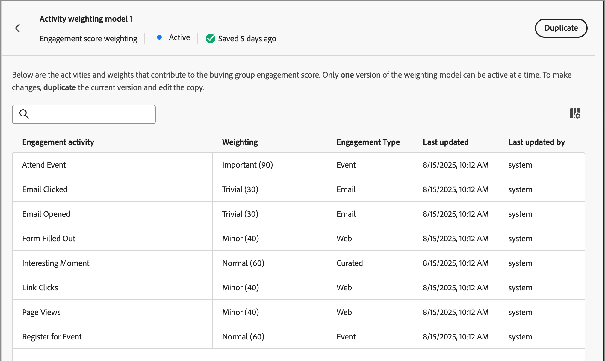
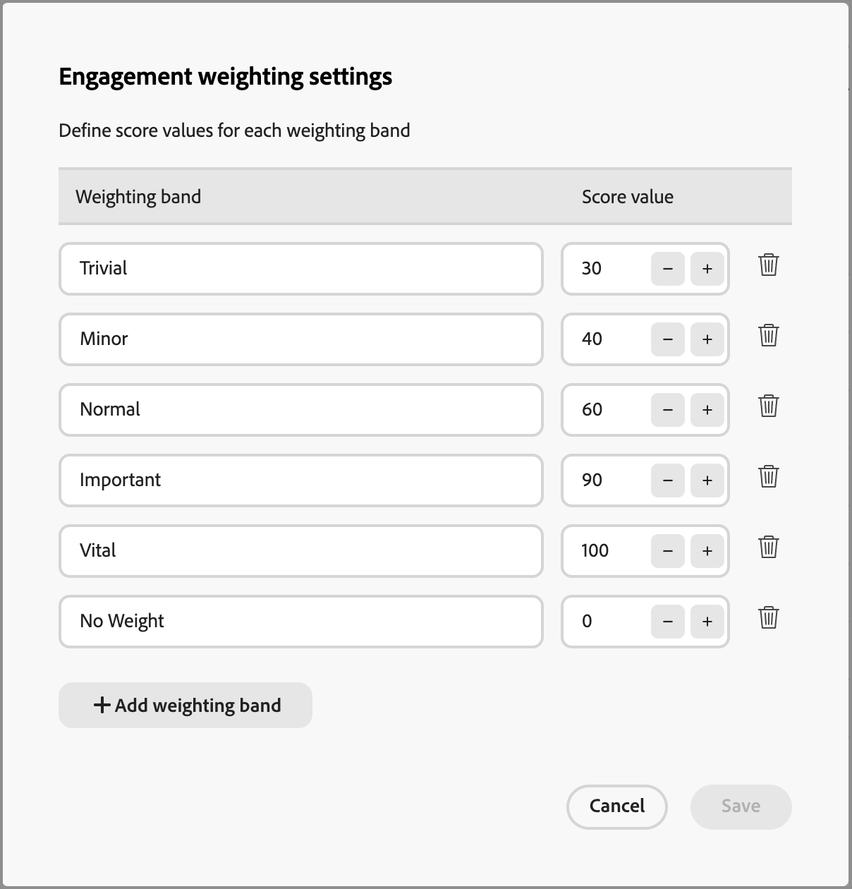

# Configurar ponderação de pontuação de engajamento personalizada

Uma pontuação de engajamento do grupo de compra reflete o nível de engajamento avaliando várias atividades registradas para membros do grupo de compra. Com a ponderação de pontuação personalizada, as equipes de operações de marketing têm a flexibilidade de definir seus próprios modelos para ponderar as atividades mais significativas para o envolvimento. Um modelo de pontuação personalizado produz um reflexo mais preciso do pipeline, priorizando os comportamentos que sinalizam com mais precisão a intenção de compra em seu processo de vendas.

Como administrador, você pode definir vários modelos de pontuação de engajamento para sua organização, mas somente um modelo pode estar ativo a qualquer momento. Você define um modelo de pontuação de acordo com o peso aplicado a cada atividade de pontuação de envolvimento.

## Acessar os modelos de ponderação de pontuação de engajamento

1. Na navegação à esquerda, escolha **[!UICONTROL Administração]** > **[!UICONTROL Configurações]**.

1. Clique em **[!UICONTROL Ponderação de pontuação do engajamento]** no painel intermediário para exibir a lista de modelos de pontuação.

   Nesta página, você pode [criar (duplicar)](#create-an-engagement-score-model), [ativar](#activate-a-score-model) e [editar](#change-the-engagement-weighting-settings) modelos de pontuação de engajamento.

   {width="800" zoomable="yes"}

   A tabela exibe os modelos atualizados mais recentemente na parte superior (classificados por _[!UICONTROL Última atualização]_) e inclui a capacidade de pesquisar por _[!UICONTROL Nome]_. Você pode personalizar a tabela exibida ao clicar no ícone _Configurações de coluna_ (  ) no canto superior direito e marcar ou desmarcar as caixas de seleção da coluna.

{width="300"}

1. Para acessar os detalhes de um modelo de pontuação de engajamento, clique no nome.

### Modelo de pontuação padrão

O sistema cria um modelo de pontuação de envolvimento inicial chamado _Modelo de ponderação de atividade 1_, que é o modelo ativo até que você crie seu próprio modelo personalizado e o ative. Quando você ativa seu modelo personalizado, o modelo padrão muda para um status _Arquivado_. Você pode duplicá-lo se decidir reverter para o modelo de pontuação de engajamento padrão ou usá-lo como ponto de partida para outro modelo personalizado.

{width="600" zoomable="yes"}

### Excluir um modelo de rascunho

Você pode excluir um modelo de pontuação de envolvimento de rascunho se decidir que não deseja ativá-lo no futuro. Clique no ícone _Mais menu_ (***...***) ao lado do nome do modelo de pontuação de rascunho na lista e escolha **[!UICONTROL Excluir]**.

{width="350"}

Na caixa de diálogo de confirmação, clique em **[!UICONTROL Excluir]**.

## Criar um modelo de pontuação de envolvimento personalizado

Para criar um modelo de pontuação de engajamento personalizado, duplique o modelo padrão ou outro modelo personalizado já criado. Você pode duplicar o modelo _Ativo_ atual, um modelo _Rascunho_ ou um modelo _Arquivado_. Em seguida, edite o modelo duplicado de acordo com suas necessidades.

1. Clique no nome do modelo para abrir a página de detalhes do modelo e clique em **[!UICONTROL Duplicar]** na parte superior direita.

   {width="600" zoomable="yes"}

   Você também pode clicar no ícone _Mais menu_ (***...***) ao lado do nome do modelo de pontuação na lista e escolher **[!UICONTROL Duplicar]**.

   {width="325"}

1. Na caixa de diálogo _Duplicar_, digite um nome exclusivo para o modelo duplicado e clique em **[!UICONTROL Duplicar]**.

   {width="500"}

   O modelo duplicado é exibido na lista com o status _Rascunho_. Clique no nome para abrir os detalhes do modelo de pontuação e fazer as alterações.

### Alterar as configurações de ponderação de engajamento

As configurações de peso definem as faixas que podem ser atribuídas a cada atividade no modelo. Você pode alterar as faixas para refletir as estratégias de sua organização para avaliar o engajamento. Por exemplo, você pode ajustar a faixa de ponderação _Normal_ para um valor de 65 se desejar atribuir um valor maior a atividades normais. Ou você pode adicionar uma faixa de ponderação projetada para capturar atividades que ficam entre _Normais_ e _Importantes_. Nesse caso, você poderia adicionar uma faixa e rotulá-la como _Significativa_ e atribuir um valor de faixa de peso de 75.

1. Na página de detalhes do modelo de pontuação, clique em **[!UICONTROL Configurações de peso da participação]** na parte superior.

   {width="600" zoomable="yes"}

1. Para cada faixa de peso, ajuste o nome ou os valores de acordo com suas necessidades:

   * Altere o nome no campo _[!UICONTROL Faixa de ponderação]_.
   * Insira um novo valor. Você também pode clicar em **&amp;plus;** ou **-** para aumentar ou diminuir o valor.

   {width="500"}

1. Se necessário, acrescentar outra banda de ponderação:

   Clique em **[!UICONTROL + Adicionar faixa de ponderação]** na parte inferior da lista. Esta ação insere uma faixa de ponderação em branco na parte inferior da lista.

   Insira o nome e defina o valor da faixa. Certifique-se de usar um nome e valor exclusivos.

1. Se necessário, remova uma faixa de ponderação, clique no ícone _Excluir_ (  ) da linha da faixa de ponderação.

1. Quando as alterações forem concluídas, clique em **[!UICONTROL Salvar]**.

### Alterar a ponderação da atividade

Cada modelo de pontuação inclui a lista completa de atividades de pontuação de engajamento compatíveis:

{{engagement-activities}}

Para cada atividade na lista, defina o valor que deseja atribuir a cada ocorrência de atividade. Clique na seta para baixo no campo **[!UICONTROL Ponderação]** e escolha a faixa de ponderação conforme definido nas configurações de ponderação do envolvimento.

{width="500"}

Se não quiser que o cálculo da pontuação de engajamento use uma atividade, defina a ponderação para um valor zero (0).

Suas alterações são salvas automaticamente.

## Ativar um modelo de pontuação

Quando você ativa um modelo de pontuação de rascunho, ele substitui o modelo ativo no momento. O modelo ativo no momento é arquivado automaticamente.

1. Abra um modelo de pontuação de rascunho para exibir a página de detalhes.

1. Clique em **[!UICONTROL Ativar]**.

1. No diálogo de confirmação, clique em **[!UICONTROL Ativar]**.

   {width="400"}
