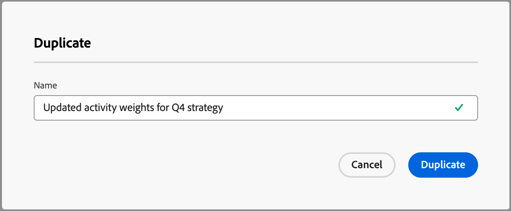

# Configurar ponderação de pontuação de engajamento personalizada

Uma [pontuação de engajamento do grupo de compras](../buying-groups/engagement-scores.md) reflete o nível de engajamento avaliando várias atividades registradas para membros do grupo de compras. Com a ponderação de pontuação personalizada, as equipes de operações de marketing têm flexibilidade para definir seus próprios modelos para ponderar as atividades. Um modelo de pontuação personalizado produz um reflexo mais preciso do pipeline, priorizando os comportamentos que sinalizam com mais precisão a intenção de compra em seu processo de vendas.

Como administrador, você pode definir vários modelos de pontuação de engajamento para sua organização, mas somente um modelo pode estar ativo a qualquer momento. Você define um modelo de pontuação de acordo com o peso aplicado a cada atividade de pontuação de envolvimento.

>[!PREREQUISITES]
>
>Para definir e ativar um modelo de ponderação de pontuação de envolvimento, você deve ter a _[!UICONTROL Gerenciar configurações de administrador B2B]_ [permissão de produto](./user-management.md#b2b-product-permissions).

## Acessar os modelos de ponderação de pontuação de engajamento

Abra a lista _[!UICONTROL Ponderação de pontuação do engajamento]_ para exibir modelos ativos, rascunhos e arquivados:

1. Na navegação à esquerda, escolha **[!UICONTROL Administração]** > **[!UICONTROL Configurações]**.

1. Clique em **[!UICONTROL Ponderação de pontuação do engajamento]** no painel intermediário para exibir a lista de modelos de pontuação.

   Nesta página, você pode [criar (duplicar)](#create-an-engagement-score-model), [ativar](#activate-a-score-model) e [editar](#change-the-engagement-weighting-settings) modelos de pontuação de engajamento.

   {width="800" zoomable="yes"}

   A lista exibe os modelos atualizados mais recentemente na parte superior (classificados por _[!UICONTROL Última atualização]_) e inclui a capacidade de pesquisar por _[!UICONTROL Nome]_.

   Você pode personalizar a tabela exibida ao clicar no ícone _Configurações de coluna_ (  ) no canto superior direito e marcar ou desmarcar as caixas de seleção da coluna.

   {width="300"}

1. Para acessar os detalhes de um modelo de pontuação de engajamento, clique no nome.

### Modelo de pontuação padrão

O sistema cria um modelo de pontuação de envolvimento inicial chamado _Modelo de ponderação de atividade 1_. O status do modelo e as atividades de envolvimento dependem da arquitetura de dados do seu ambiente [!DNL Journey Optimizer B2B Edition]:

* **Arquitetura simplificada** (Beta) - Se o seu ambiente usa a [arquitetura simplificada](../simplified-architecture.md), as atividades de envolvimento serão baseadas em eventos Experience Platform padrão e personalizados. Os pesos em todas as atividades são 0 por padrão.

  {width="600" zoomable="yes"}

* **Arquitetura padrão** - Se seu ambiente usa a arquitetura padrão, a instância [!DNL Marketo Engage] conectada é a fonte dos dados da atividade de envolvimento. O modelo padrão fica ativo até que você crie uma versão personalizada e a ative.

  {width="600" zoomable="yes"}

Quando você ativa um modelo personalizado, o modelo ativo muda para um status _Arquivado_. Se você decidir reverter para o modelo de pontuação de engajamento padrão, poderá duplicar o modelo padrão original e ativá-lo ou usá-lo como ponto de partida para outro modelo personalizado.

### Excluir um modelo de rascunho

Você pode excluir um modelo de pontuação de envolvimento de rascunho se decidir que não deseja ativá-lo no futuro. Clique no ícone _Mais menu_ (***...***) ao lado do nome do modelo de pontuação de rascunho na lista e escolha **[!UICONTROL Excluir]**.

{width="350"}

Na caixa de diálogo de confirmação, clique em **[!UICONTROL Excluir]**.

## Criar um modelo de pontuação de envolvimento personalizado

Para criar um modelo de pontuação de engajamento personalizado, duplique o modelo padrão ou outro modelo personalizado já criado. Você pode duplicar o modelo _Ativo_ atual, um modelo _Rascunho_ ou um modelo _Arquivado_. Em seguida, edite o modelo duplicado de acordo com suas necessidades.

1. Clique no nome do modelo para abrir a página de detalhes do modelo e clique em **[!UICONTROL Duplicar]** na parte superior direita.

   {width="600" zoomable="yes"}

   Você também pode clicar no ícone _Mais menu_ (***...***) ao lado do nome do modelo de pontuação na lista e escolher **[!UICONTROL Duplicar]**.

   {width="325"}

1. Na caixa de diálogo _Duplicar_, digite um nome exclusivo para o modelo duplicado e clique em **[!UICONTROL Duplicar]**.

   {width="500"}

   O modelo duplicado é exibido na lista com o status _Rascunho_. Clique no nome para abrir os detalhes do modelo de pontuação e fazer as alterações.

### Alterar as configurações de ponderação de engajamento

As configurações de peso definem as faixas que podem ser atribuídas a cada atividade no modelo. Você pode alterar as faixas para refletir as estratégias de sua organização para avaliar o engajamento. Por exemplo, você pode ajustar a faixa de ponderação _Normal_ para um valor de 65 se desejar atribuir um valor maior a atividades normais. Ou você pode adicionar uma faixa de ponderação projetada para capturar atividades que ficam entre _Normais_ e _Importantes_. Nesse caso, você poderia adicionar uma faixa e rotulá-la como _Significativa_ e atribuir um valor de faixa de peso de 75.

1. Na página de detalhes do modelo de pontuação, clique em **[!UICONTROL Configurações de peso da participação]** na parte superior.

   {width="600" zoomable="yes"}

1. Para cada faixa de peso, ajuste o nome ou os valores de acordo com suas necessidades:

   * Altere o nome no campo _[!UICONTROL Faixa de ponderação]_.
   * Insira um novo valor. Você também pode clicar em **&amp;plus;** ou **-** para aumentar ou diminuir o valor.

   {width="500"}

1. Se necessário, acrescentar outra banda de ponderação:

   Clique em **[!UICONTROL + Adicionar faixa de ponderação]** na parte inferior da lista. Esta ação insere uma faixa de ponderação em branco na parte inferior da lista.

   Insira o nome e defina o valor da faixa. Certifique-se de usar um nome e valor exclusivos.

1. Para remover uma faixa de ponderação, clique no ícone _Excluir_ (  ) da linha da faixa de ponderação.

1. Quando as alterações forem concluídas, clique em **[!UICONTROL Salvar]**.

### Alterar a ponderação da atividade

Cada modelo de pontuação inclui a lista completa de atividades de pontuação de engajamento compatíveis.

+++Atividades para uma arquitetura simplificada

O modelo padrão para a arquitetura simplificada inclui as atividades rastreadas do Experience Platform. Cada atividade tem um peso zero (0) (não usado) até que você atribua um peso a ela. Todas as atividades também têm uma frequência diária máxima de 20, que não pode ser alterada.

<table style="table-layout: fixed; width: 100%; border: 0;">
<tbody>
<tr style="border: 0;">
<td>
<ul><li>Cliques do Advertising </li><li>Advertising Conclui </li><li>Conversões do Advertising </li><li>Advertising Federated </li><li>Advertising First Quartiles </li><li>Impressões do Advertising </li><li>Pontos médios do Advertising </li><li>Advertising inicia </li><li>Terceiro quartil do Advertising </li><li>Tempo de reprodução no Advertising </li><li>Fechamento do aplicativo </li><li>Inicialização do aplicativo </li><li>Alterar cadência da campanha de engajamento </li><li>Aviso de Crédito do Commerce Backoffice Emitido </li><li>Pedido do Commerce Backoffice cancelado </li><li>Pedido feito no Commerce Backoffice </li><li>Commerce Backoffice OrderItems Entregues </li><li>Remessa do Commerce Backoffice concluída </li><li>Check-outs do Commerce </li><li>Adições à lista de produtos (carrinho) do Commerce </li><li>Aberturas de lista de produtos (carrinho) do Commerce </li><li>Remoções da lista de produtos (carrinho) do Commerce </li><li>Reaberturas de lista de produtos (carrinho) do Commerce </li><li>Visualizações da lista de produtos (carrinho) do Commerce </li><li>Visualizações de produto do Commerce </li><li>Compras no Commerce </li><li>Commerce Salvar para mais tarde </li><li>Descarte de apresentação de decisão </li><li>Exibição da apresentação de decisão </li><li>Interação de apresentação de decisão </li></ul>
</td>
<td>
<ul><li>Envio de apresentação de decisão </li><li>Acionador da apresentação de decisão </li><li>Feedback da entrega </li><li>Email de marketing direto rejeitado </li><li>Email de marketing direto rejeitado suave </li><li>Email de marketing direto clicado </li><li>Email de marketing direto entregue </li><li>Email de marketing direto aberto </li><li>Email de marketing direto enviado </li><li>Email de marketing direto cancelado </li><li>A mensagem no aplicativo foi descartada </li><li>A mensagem no aplicativo foi exibida </li><li>A mensagem no aplicativo teve interação com </li><li>Operação de lead adicionada à campanha </li><li>Webhook de chamada de operação de lead </li><li>Fluxo de Campanha de Alteração da Operação de Cliente Potencial </li><li>Lead da Operação de Conversão </li><li>Momento interessante da operação de lead </li><li>Operação de Cliente Potencial para Mesclagem de Clientes Potenciais </li><li>Operação de Lead Novo Lead </li><li>Estágio de Receita da Operação de Cliente Potencial alterado </li><li>Pontuação de Operação de Cliente Potencial Alterada </li><li>Status da Operação de Cliente Potencial na Progressão da Campanha Alterado </li></ul>
</td>
<td>
<ul><li>Adicionar à Lista de Operações de Cliente Potencial </li><li>Operação de Cliente Potencial Remover da Lista </li><li>Saída do local </li><li>Media adBreakComplete </li><li>Media adBreakStart </li><li>Mídia adComplete </li><li>Media adSkip </li><li>Media adStart </li><li>Media bitrateChange </li><li>Media bufferStart </li><li>Media chapterComplete </li><li>Mídia chapterSkip </li><li>Mídia chapterStart </li><li>Rastreamento personalizado de mídia </li><li>Conteúdo de mídia baixado </li><li>Erro de mídia </li><li>Media pauseStart </li><li>Ping de mídia </li><li>Reprodução de mídia </li><li>Sessão de mídia concluída </li><li>Fim da sessão da mídia </li><li>SessionStart de mídia </li><li>Atualização de estados da mídia </li><li>Feedback da mensagem </li><li>Dados de renderização da mensagem </li><li>Rastreamento de mensagens </li><li>Adicionar evento de oportunidade à oportunidade </li><li>Oportunidade Evento Oportunidade Atualizada </li><li>Evento De Oportunidade Remover Da Oportunidade </li><li>Aplicativo de rastreamento de push aberto </li><li>Ação personalizada de rastreamento de push </li><li>Formulário Web Preenchido </li><li>Cliques de link de interação na Web </li><li>Exibições de Página de Detalhes da Página da Web</li></ul>
</td>
</tbody>
</table>

+++

+++Atividades para arquitetura padrão

O modelo padrão da arquitetura padrão inclui as [!DNL Marketo Engage] atividades rastreadas com um peso padrão associado. Ao duplicar esse modelo, você pode alterar a ponderação de acordo com suas necessidades. Não é possível alterar a frequência diária máxima.

{{engagement-activities-me}}

+++

Para cada atividade na lista, defina o valor que deseja atribuir a cada ocorrência de atividade. Clique na seta para baixo no campo **[!UICONTROL Ponderação]** e escolha a faixa de ponderação conforme definido nas configurações de ponderação do envolvimento.

{width="600" zoomable="yes"}

Se não quiser que o cálculo da pontuação de engajamento use uma atividade, defina a ponderação para um valor zero (0).

Suas alterações são salvas automaticamente.

## Ativar um modelo de pontuação

Quando você ativa um modelo de pontuação de rascunho, ele substitui o modelo ativo no momento. O modelo ativo no momento é arquivado automaticamente.

1. Abra um modelo de pontuação de rascunho para exibir a página de detalhes.

1. Clique em **[!UICONTROL Ativar]**.

1. No diálogo de confirmação, clique em **[!UICONTROL Ativar]**.

   {width="400"}
