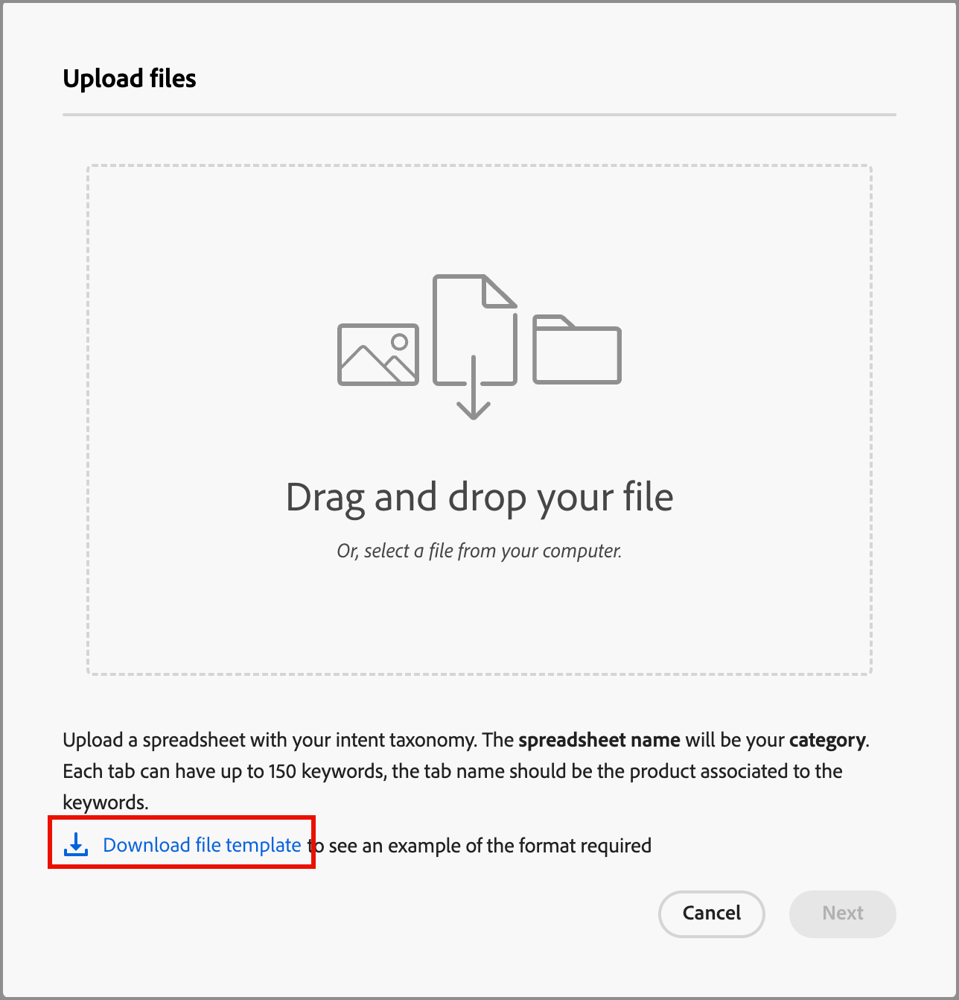

# Dados de intenção

No Journey Optimizer B2B edition, o modelo de Detecção de intenções prevê uma solução/produto de interesse com alta confiança suficiente com base na atividade de um lead. Ele também aproveita as atividades de outros membros da conta, juntamente com o conteúdo marcado. A intenção de uma pessoa pode ser interpretada como a probabilidade de ter interesse em um produto.

* Níveis de intenção - Disponível em nível de lead, conta e grupo de compras conhecido.
* Tipos de sinal de intenção - Palavras-chave, produto e solução

Os dados de intenção são usados no [_Painel Inteligente_](../dashboards/intelligent-dashboard.md), [_página Detalhes da conta_](../accounts/account-details.md), [_página Detalhes do grupo de compras_](../buying-groups/buying-group-details.md) e [_página Detalhes da pessoa_](../accounts/person-details.md).

{width="700" zoomable="yes"}

## Preparar os dados de mapeamento de intenção

Para ativar esse recurso, crie uma planilha, como um arquivo do Microsoft Excel, usando guias para definir a taxonomia de intenção. Toda a planilha é carregada como uma categoria que pode ter vários produtos e cada produto pode ter várias palavras-chave. Use as seguintes definições para a planilha de mapeamento de intenção para cada categoria que você deseja definir:

* Nome da planilha = _Nome da categoria_
* Cada guia = nome do produto
* Cada guia inclui uma coluna = palavras-chave do produto (máximo de 150)

É possível baixar um arquivo do Excel para usar como modelo para preparar seus dados de mapeamento. Para baixar o modelo:

1. Na navegação à esquerda, escolha **[!UICONTROL Administração]** > **[!UICONTROL Configuração]**.

1. Clique em **[!UICONTROL Mapeamento de intenções]** no painel intermediário.

1. Clique em **[!UICONTROL Criar categoria]**.

1. Na caixa de diálogo, clique no link **[!UICONTROL Baixar modelo de arquivo]**.

   {width="500"}

1. Clique em **[!UICONTROL Cancelar]**.

   Você pode retornar para fazer upload do arquivo preparado quando ele estiver concluído.

1. Use o modelo para definir os dados de mapeamento de intenção:

   * Renomeie o arquivo para refletir seu nome de categoria, como _Personalization em escala_.
   * Renomeie cada guia de acordo com seus nomes de produtos, como _Journey Optimizer B2B_, _Marketo Engage_ e _Experience Manager_.
   * Adicione as palavras-chave do produto (Product Key) para cada guia, como _Marketing B2B_, _Reconhecimento de Marca_ e _Participação de Cliente Potencial_.

   {width="600" zoomable="yes"}

## Carregar um arquivo de categoria

Quando a planilha estiver pronta, retorne à página de configuração _[!UICONTROL Mapeamento de Intenção]_ e carregue o arquivo.

1. Clique em **[!UICONTROL Criar categoria]**.

1. Arraste e solte o arquivo na caixa de diálogo _[!UICONTROL Carregar arquivos]_ ou clique em **[!UICONTROL Selecionar um arquivo]** para localizar e selecionar o arquivo no sistema.

1. Clique em **[!UICONTROL Avançar]**.

   O pré-processamento é executado para agrupar palavras-chave semelhantes, o que melhora a detecção de intenção e evita a diluição de palavras-chave. Uma notificação de pulso é exibida assim que esse pré-processamento é concluído (até 15 minutos, dependendo dos dados).

   {width="500"}

   O resultado é exibido na página _Mapeamento de Intenção_.

   {width="600" zoomable="yes"}

## Aprovar ou rejeitar a categoria

Revise a lista de categorias e clique em **[!UICONTROL Aprovar]** para ativar as palavras-chave para uso no Painel Inteligente, na página de detalhes da conta, na página de detalhes do grupo de compra e na página de detalhes da pessoa. Clique em **[!UICONTROL Exibir tudo]** para exibir a lista completa para cada produto ou clique em **[!UICONTROL Baixar]** para exibir a lista completa como um arquivo do Excel.

Se você não estiver satisfeito com a lista, clique em **[!UICONTROL Excluir]** para remover a categoria. Você pode fazer ajustes no arquivo da planilha antes de iniciar o processo de upload novamente para definir essa categoria.

>[!IMPORTANT]
>
>Você deve aprovar ou rejeitar (excluir) a nova categoria antes de adicionar outra categoria ou editar uma categoria.

Se você adicionar outra categoria e sua taxonomia impactar uma categoria existente, um aviso será exibido. Considere esse impacto ao decidir aprovar ou rejeitar a categoria. O mapeamento de produto para palavra-chave deve ser o mesmo em todas as categorias se o produto for usado em mais de uma categoria.

{width="600" zoomable="yes"}
