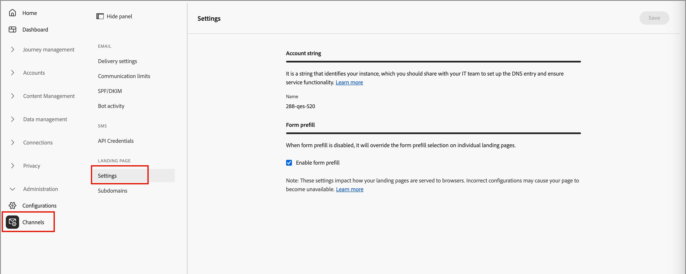

# Configuração da landing page

Os administradores devem garantir que as configurações de página de aterrissagem sejam definidas para profissionais de marketing que criam e publicam essas páginas.

## Configurações

Para revisar a configuração da página de aterrissagem, vá para **[!UICONTROL Administração]** > **[!UICONTROL Canais]**. Em _[!UICONTROL Páginas de Aterrissagem]_ no painel de navegação, selecione **[!UICONTROL Configurações]**.

{width="800" zoomable="yes"}

### String da conta {#account-string}

>[!CONTEXTUALHELP]
>id="ajo-b2b_landing_pages_account_string"
>title="String de conta das páginas de destino"
>abstract="A string da conta identifica a instância do Adobe Journey Optimizer B2B Edition que hospeda as páginas de destino."

A cadeia de caracteres da conta identifica a instância do Adobe Journey Optimizer B2B edition que hospeda as páginas de aterrissagem. Certifique-se de que a equipe de Sistemas adicione e configure a entrada de DNS.

### Preenchimento prévio do formulário {#form-prefill}

>[!CONTEXTUALHELP]
>id="ajo-b2b_landing_pages_form_prefill"
>title="Configurações de preenchimento prévio de formulário de página de destino"
>abstract="Você pode habilitar a opção de preenchimento prévio do formulário para permitir que os formulários em suas páginas de destino usem informações preenchidas previamente para usuários conhecidos."

Habilite a opção **[!UICONTROL Preenchimento prévio do formulário]** para permitir que os formulários em suas páginas de aterrissagem usem informações preenchidas previamente para usuários conhecidos. Quando essa opção está desativada, os autores de landing page não podem incluir campos de formulário pré-preenchidos.

### Sequência de dados {#datastream}

>[!CONTEXTUALHELP]
>id="ajo-b2b_landing_pages_datastream"
>title="Requisito da sequência de dados"
>abstract="A sequência de dados é necessária para coletar eventos de página das páginas de destino neste domínio."

>[!CONTEXTUALHELP]
>id="ajo-b2b_landing_pages_missing_datastream"
>title="ID de sequência de dados ausente"
>abstract="O subdomínio não tem uma ID de sequência de dados, que é necessária para o roteamento adequado. Configure-a em Configurações para continuar"

Defina a opção **[!UICONTROL Datastream]** para configurar uma sequência de dados para a coleção de eventos de página de aterrissagem.

## Subdomínios {#add-subdomain}

>[!CONTEXTUALHELP]
>id="ajo-b2b_landing_pages_add_subdomain"
>title="Adicionar subdomínio da página de destino"
>abstract="É possível adicionar no máximo 50 subdomínios. Configure um novo subdomínio para cada URL de marca único que você deseja hospedar no Adobe Journey Optimizer B2B Edition."

>[!CONTEXTUALHELP]
>id="ajo-b2b_landing_pages_configure_subdomain"
>title="Configurar subdomínio de página de destino"
>abstract="Um subdomínio configurado é necessário para publicar páginas de destino. Você pode usar um subdomínio já delegado à Adobe ou criar um novo subdomínio."

Um subdomínio de página de aterrissagem deve ajudar a identificar o tipo de conteúdo, o nome do produto ou a campanha e reforçar a autenticidade da página. Antes de configurar os subdomínios, defina um ou mais CNAMEs para usar nas landing pages. Por exemplo:

* **produto**.[DomínioDaEmpresa].com
* **vá**.[DomínioDaEmpresa].com
* **inscrição**.[DomínioDaEmpresa].com

Nesses exemplos, a primeira parte (em negrito) é o `LandingPageCNAME`.

Adicione um novo subdomínio para cada URL de marca exclusiva que você deseja hospedar no Adobe Journey Optimizer B2B edition. É possível adicionar no máximo 50 subdomínios.

>[!IMPORTANT]
>
>Não é permitido delegar um subdomínio inválido à Adobe. Insira um subdomínio válido de propriedade da sua organização, como _marketing.yourcompany.com_.

Para revisar seus subdomínios e adicionar novos, vá para **[!UICONTROL Administração]** > **[!UICONTROL Canais]**. Em _[!UICONTROL Páginas de aterrissagem]_ no painel de navegação, selecione **[!UICONTROL Subdomínios]**.

{width="800" zoomable="yes"}

_Para adicionar um subdomínio de página de aterrissagem :_

1. Clique em **[!UICONTROL Adicionar subdomínio]** na parte superior direita.

1. Em _[!UICONTROL Detalhes do subdomínio]_, insira as informações do subdomínio:

   * **[!UICONTROL Subdomínio]** - A URL de subdomínio a ser usada, como `marketing.yourcompany.com`
   * **[!UICONTROL Página padrão]** - A URL da página de subdomínio padrão, como `marketing.yourcompany.com/products`
   * **[!UICONTROL Página de fallback]** - A URL da página de fallback a ser usada se uma página de aterrissagem no subdomínio não estiver ativa, como `marketing.yourcompany.com/expired`

   {width="700" zoomable="yes"}

1. Clique em **[!UICONTROL Salvar]**.
