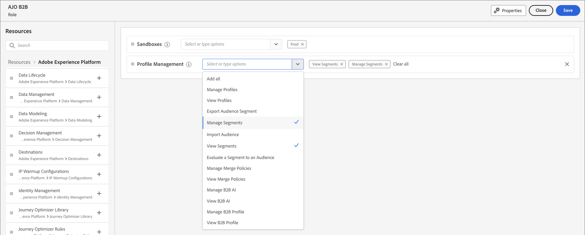

# Gerenciamento de usuários

Após a conclusão do provisionamento e a vinculação das sandboxes, conclua as etapas a seguir para fornecer acesso ao Adobe Journey Optimizer B2B edition para sua equipe e usuários.

1. [Crie um perfil de produto do Marketo Engage](#marketo-engage-profile) no Admin Console (somente nova instância do Marketo Engage).
1. [Criar um grupo de usuários](#create-user-group) na Admin Console.
1. [Edite as funções internas](#edit-roles) ou [crie uma função personalizada](#create-a-custom-role) com permissões do Journey Optimizer B2B edition.
1. [Adicionar usuários](#add-users) ou [grupos](#add-user-groups-to-a-role) às funções.

Como administrador, você pode concluir essas tarefas no Adobe Admin Console, que é um local central para administrar e gerenciar licenças e usuários de produtos da Adobe. No Admin Console, é possível criar e gerenciar usuários em um único local em vez de em várias soluções individuais. Consulte a página [Visão geral do Admin Console](https://helpx.adobe.com/br/enterprise/using/admin-console.html) para saber mais sobre suas funções e recursos.

## Acessar o Admin Console

Antes de usar o Admin Console para administrar os usuários da sua equipe, é necessário garantir que você possa acessar o Admin Console e ter as permissões apropriadas.

1. Como administrador do sistema, você deve receber vários emails do Adobe como parte do processo de integração.

   Procure o email de boas-vindas que fornece informações sobre o nome da organização à qual você recebeu acesso.

1. Clique no link **[!UICONTROL Introdução]** no email de boas-vindas para navegar até a Admin Console.

   Se não conseguir localizar o email, abra um navegador diretamente na Admin Console em [https://adminconsole.adobe.com](https://adminconsole.adobe.com).

1. Faça logon usando sua Adobe ID.

   Depois de fazer logon, você verá a página _Visão geral_ da Adobe Admin Console.

1. Se você tiver acesso a várias organizações, verifique se fez logon na organização correta.

   Para alterar a organização, clique no nome dela no canto superior direito e escolha a organização que você precisa acessar.

1. Selecione **[!UICONTROL Administradores]** no cartão _[!UICONTROL Usuários]_ para verificar se você é um administrador do sistema.

   {width="700" zoomable="yes"}

1. Pesquise inserindo seu email, nome de usuário, nome ou sobrenome do Adobe ID.

   * Se o acesso estiver configurado corretamente, a pesquisa retornará seu registro.

   * Se o valor na coluna **[!UICONTROL FUNÇÃO DE ADMINISTRADOR]** mostrar `System`, isso quer dizer que você (ou o usuário mostrado) é um administrador do sistema.

## Criar o perfil de produto do Marketo Engage {#marketo-engage-profile}

Ao conceder aos usuários acesso a uma solução da Adobe, você pode não pretender conceder acesso total a eles. Os perfis de produto permitem que cada solução tenha seu próprio conjunto de permissões do usuário. Use o Admin Console para atribuir perfis de produto.

Para obter mais informações sobre como usar perfis de produtos para direitos de usuário, consulte [Gerenciar perfis de produto para usuários corporativos](https://helpx.adobe.com/br/enterprise/using/manage-product-profiles.html){target="_blank"} na documentação do Admin Console.
<!--
>[!BEGINSHADEBOX]

When you add a user to the Marketo Engage product profile, they are subsequently added to the _Standard User_ role within the Default workspace of the Marketo Engage subscription. This role grants them all _Standard User_ permissions for Marketo Engage in that workspace. Currently, all Journey Optimizer B2B Edition users are required to be Marketo Engage users. A Marketo Engage administrator can restrict access by updating the permissions for the _Standard User_ role or by moving the user to a different Marketo Engage user role with more restrictive permissions.

For more information about managing these permissions within Marketo Engage, see [Managing User Roles and Permissions](https://experienceleague.adobe.com/en/docs/marketo/using/product-docs/administration/users-and-roles/managing-user-roles-and-permissions){target="_blank"} in the Marketo Engage documentation.

>[!ENDSHADEBOX]-->

{width="30"} Um administrador do sistema ou administrador de produto do Marketo Engage pode executar as seguintes etapas.

1. Faça logon em [https://adminconsole.adobe.com](https://adminconsole.adobe.com).

1. Selecione a guia **[!UICONTROL Produtos]**.

1. Abra a instância do Marketo Engage na qual deseja adicionar o perfil e clique em **[!UICONTROL Novo perfil]**.

   {width="700" zoomable="yes"}

1. Insira um nome de perfil de produto, como _Usuário Padrão_.

1. Clique em **Avançar** e depois em **Salvar**.

## Criar um grupo de usuários {#create-user-group}

Um grupo de usuários é uma coleção de usuários aos quais é concedido um conjunto compartilhado de permissões. Você pode adicionar ou remover usuários em seu grupo de usuários. As permissões do grupo permanecem as mesmas enquanto os usuários no grupo são alterados.

Para obter mais informações sobre como os grupos de usuários são usados para gerenciar permissões, consulte [Gerenciar grupos de usuários](https://helpx.adobe.com/br/enterprise/using/user-groups.html){target="_blank"} na documentação do Admin Console.

{width="30"} Um administrador do sistema pode executar as etapas a seguir.

1. Faça logon em [https://adminconsole.adobe.com](https://adminconsole.adobe.com).

1. Selecione a guia **[!UICONTROL Usuários]**.

1. Escolha **[!UICONTROL Grupos de Usuários]** na navegação à esquerda.

1. Clique em **[!UICONTROL Novo grupo de usuários]** na parte superior direita.

1. Insira um nome para o grupo de usuários, como _Usuários padrão_ e clique em **[!UICONTROL Salvar]**.

1. Clique no grupo de usuários que acabou de criar.

1. Selecione a guia **[!UICONTROL Perfis de produto atribuídos]** e clique em **[!UICONTROL Atribuir perfil]**.

1. Clique em **+** e adicione cada instância dos seguintes produtos:

   * [!UICONTROL Marketo Engage]
   * [!UICONTROL Adobe Experience Platform - AEP-Padrão-Todos-Usuários]
   * [!UICONTROL Coleta de dados do Adobe Experience Platform]
   * [!UICONTROL Acesso integral à Coleção de Dados]

   {width="700" zoomable="yes"}

1. Clique em **[!UICONTROL Salvar]**.

## Adicionar usuários a um grupo

Para obter informações sobre o gerenciamento de usuários, consulte [usuários do Admin Console](https://helpx.adobe.com/br/enterprise/using/user-groups.html) na documentação do Admin Console.

{width="30"} Um administrador de sistema ou administrador de produto pode executar as seguintes etapas. Um administrador de produto pode adicionar somente usuários que já existem em sua organização.

1. Ir para [https://adminconsole.adobe.com](https://adminconsole.adobe.com).

1. Em _[!UICONTROL Links rápidos]_, clique em **[!UICONTROL Adicionar usuários]**.

1. Adicionar cada usuário:

   * Insira o endereço de email, o nome e o sobrenome do usuário.

     {width="600" zoomable="yes"}

   * Para **[!UICONTROL Grupos de usuários]**, clique em **+**.

   * Selecione o grupo de usuários criado anteriormente.

   * Clique em **[!UICONTROL Aplicar]**.

1. Clique em **[!UICONTROL Salvar]**.

## Editar funções para permissões de produto {#edit-roles}

As permissões são direitos unitários que permitem definir as autorizações atribuídas a um perfil de produto. Cada permissão é coletada em um recurso, como jornadas ou grupos de compras, que representa as diferentes funcionalidades ou objetos no Journey Optimizer B2B edition.

A área _Permissões_ do Adobe Experience Platform é onde os administradores podem definir funções de usuário e políticas de acesso para gerenciar permissões de acesso para recursos e objetos em um aplicativo de produto. Neste aplicativo, você pode criar e gerenciar funções, bem como atribuir as permissões de recurso desejadas para essas funções. As permissões também permitem gerenciar sandboxes e usuários associados a uma função específica.

Para obter mais informações sobre permissões de função no Experience Platform, consulte [Gerenciar permissões de uma função](https://experienceleague.adobe.com/en/docs/experience-platform/access-control/abac/permissions-ui/permissions){target="_blank"} na documentação do Experience Platform.
<!-- 
### B2B product permissions

The following permissions govern access to Journey Optimizer B2B Edition capabilities:

| Category | Description | Permissions |
| -------- | ----------- | ---------- |
| B2B Account Lists | Configure, manage, view, and publish permissions for B2B account lists. These permissions include actions such as add, remove, import, and delete accounts from account lists. | <li>Manage B2B Account Lists |
| B2B Admin Configurations | Configure, manage, and view permissions for B2B administrative configurations. These permissions include digital asset management connections, asset repositories, and events. | <li>Manage B2B Admin Configurations |
| B2B Assets | Configure, manage, and view permissions for B2B assets. These permissions include emails, SMS, landing pages, fragments, templates, and images. | <li>Manage B2B Assets <li>Manage B2B Templates <li>Manage B2B Fragments|
| B2B Buying Groups | Configure, manage, and view permissions for B2B buying groups. These permissions include solution interests, roles templates, and buying group status. | <li>Manage B2B Buying Groups |
| B2B Channel Configurations | Configure, manage, and view permissions for B2B channel configurations. These permissions include settings for communication limits, API credentials, and security settings. | <li>Manage B2B Channels Configurations |
| B2B Dashboards |Configure and view permissions for B2B dashboards. These permissions include account engagement, buying group stages, surging accounts, and contact coverage. | <li>Manage B2B Dashboards |
| B2B Journeys | Configure manage, view, and publish permissions for B2B journeys. These permissions include account and person actions, event listeners, and split paths | <li>Manage B2B Journeys |

### B2B built-in roles

When your organization has the Journey Optimizer B2B Edition product provisioned, Experience Platform includes a set of built-in (default) roles that you can use to manage access to the product capabilities:

| Role | Permissions |
| ---- | ----------- |
| B2B Journey Manager | <li>Manage B2B Journeys <li>Manage B2B Buying Groups <li>Manage B2B Account Lists <li>View B2B Intelligent Dashboard <li>View B2B Insights Dashboard |
| B2B Channel Manager | <li>Manage B2B Assets <li>Manage B2B Templates <li>Manage B2B Fragments |
| B2B System Administrator | <li>Manage B2B Channels Configurations <li>Manage B2B Admin Configurations |
| B2B Sales User | <li>View Intelligent Dashboard |

### Edit role permissions

For built-in or custom roles, you can decide at any time to add or delete permissions. If you modify a default or custom role, it impacts every user assigned to the role.

In the following example, you want to add permissions related to the B2B Journeys resource for users assigned to the B2B Channel Manager role. This change enables users for that role to manage account journeys also.

>[!NOTE]
>
>An Admin Console system administrator can perform these steps.

_To change the permissions for a role:_

1. Go to [experience.adobe.com](https://experience.adobe.com/).

1. In the _[!UICONTROL Quick access]_ panel, select **[!UICONTROL Permissions]**.

   >[!NOTE]
   >
   >If you don't see _[!UICONTROL Permissions]_, you may need to click **[!UICONTROL View all]** and select it from the available applications.

   {width="700" zoomable="yes"}

1. Select **[!UICONTROL Roles]** in the left navigation.

1. Click the **_B2B Channel Manager_** role name.

1. In the details page, click **[!UICONTROL Edit]** at the top right.

   {width="700" zoomable="yes"}

   In the role editor, the _[!UICONTROL Resources]_ menu displays the list of resources that apply to the Experience Cloud - Platform powered applications products.

   You can enter _B2B_ in the search tool to filter the list for the B2B product permissions. 
   
1. Click the _Add_ icon (**+**) for the B2B Journeys resource.

   {width="700" zoomable="yes"}

1. In the _[!UICONTROL B2B Journeys]_ permissions card, select **[!UICONTROL Manage B2B Account Journeys]**.

1. Click **[!UICONTROL Save]**.

   {width="700" zoomable="yes"}

1. Click **[!UICONTROL Close]** to return to the details page. -->

### Adicionar usuários a uma função

{width="30"} Um administrador do sistema ou administrador de produto da AEP pode executar as seguintes etapas.

1. Abra os detalhes da função e selecione a guia **[!UICONTROL Usuários]**.

   Esta guia exibe uma lista de todos os usuários atribuídos à função.

1. Clique em **[!UICONTROL Adicionar usuários]**.

   {width="700" zoomable="yes"}

1. Na caixa de diálogo _[!UICONTROL Adicionar usuários]_, localize e selecione os usuários que deseja adicionar à função.

   * Você pode usar a ferramenta Search para filtrar a lista de usuários.

   * Marque a caixa de seleção de cada usuário.

   {width="600" zoomable="yes"}

1. Clique em **[!UICONTROL Salvar]** quando tiver selecionado todos os usuários que deseja adicionar.

### Adicionar grupos de usuários a uma função

Para obter informações sobre o gerenciamento de usuários, consulte [usuários do Admin Console](https://helpx.adobe.com/br/enterprise/using/user-groups.html) na documentação do Admin Console.

{width="30"} Um administrador do sistema ou administrador de produto da AEP pode executar as seguintes etapas.

1. Abra os detalhes da função e selecione a guia **[!UICONTROL Grupos de usuários]**.

   Esta guia exibe uma lista de todos os grupos de usuários atribuídos à função.

1. Clique em **[!UICONTROL Adicionar grupos]**.

   {width="700" zoomable="yes"}

1. Na caixa de diálogo _[!UICONTROL Adicionar grupos]_, localize e selecione os grupos que deseja adicionar à função.

   * Você pode usar a ferramenta Pesquisar para filtrar a lista de grupos de usuários.

   * Marque a caixa de seleção para cada grupo de usuários.

   {width="600" zoomable="yes"}

1. Clique em **[!UICONTROL Salvar]** quando tiver selecionado todos os usuários que deseja adicionar.

## Criar uma função personalizada

{width="30"} Um administrador do sistema ou administrador de produto da AEP pode executar as seguintes etapas.

1. Selecione **[!UICONTROL Funções]** na navegação à esquerda e selecione **[!UICONTROL Criar função]**.

1. Na caixa de diálogo _[!UICONTROL Criar nova função]_, digite um nome para a função, como _Profissionais de marketing B2B_, e uma descrição (opcional).

1. Clique em **[!UICONTROL Confirmar]**.

1. Selecione suas sandboxes.

   {width="700" zoomable="yes"}

1. Adicione as permissões de perfil:

   * Na lista _[!UICONTROL Recursos]_ à esquerda, localize o item **[!UICONTROL Gerenciamento de Perfil]** e clique no ícone _Adicionar_ (**+**) para adicionar o atributo.

   * Para o atributo, adicione as seguintes permissões:
      * [!UICONTROL Exibir segmentos]
      * [!UICONTROL Gerenciar segmentos]
      * [!UICONTROL Exibir perfis]
      * [!UICONTROL Gerenciar perfis]
      * [!UICONTROL Exibir perfil B2B]
      * [!UICONTROL Gerenciar perfil B2B]

   {width="700" zoomable="yes"}

1. Adicionar permissões de produto B2B:

   Consulte a lista de [permissões de produto B2B](#b2b-product-permissions) para determinar quais recursos de produto você deseja para a função.

   Na lista _[!UICONTROL Recursos]_ à esquerda, localize os itens **[!UICONTROL B2B]** e clique no ícone _Adicionar_ (**+**) para adicionar cada atributo que você deseja habilitar para a função.

   Você pode digitar _B2B_ na ferramenta de pesquisa para filtrar a lista de permissões de produtos B2B.

1. Clique em **[!UICONTROL Salvar]** na parte superior direita.

1. Vá para os detalhes da função e selecione a guia **[!UICONTROL Grupos de usuários]**.

1. Clique em **[!UICONTROL Adicionar grupos]**.

   {width="700" zoomable="yes"}

1. Marque a caixa de seleção ao lado do grupo de usuários criado anteriormente na Admin Console.

1. Clique em **[!UICONTROL Salvar]**.
