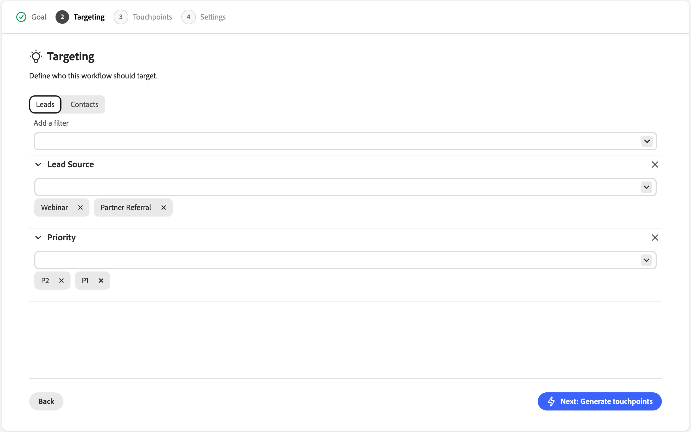
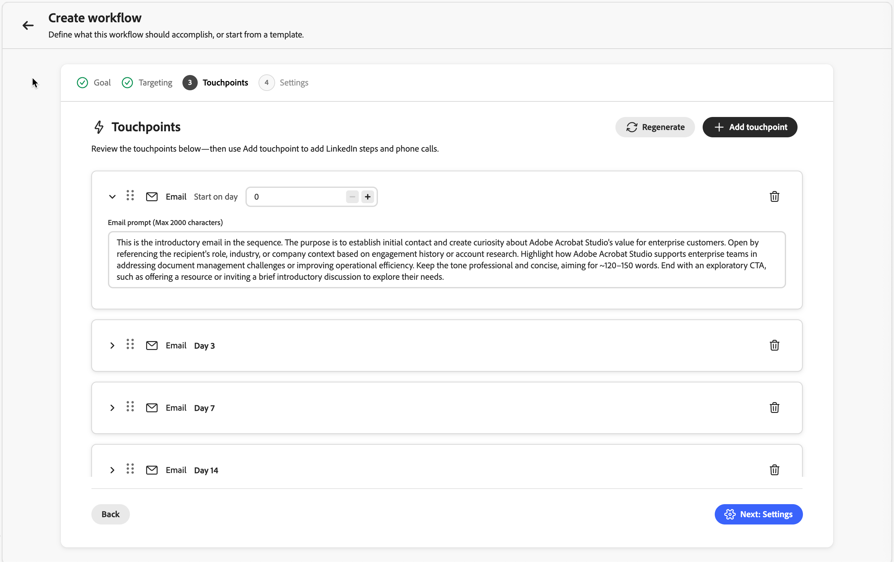
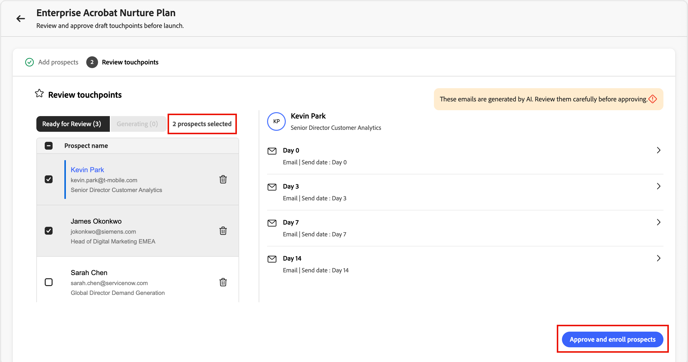

# Qualificador de Vendas

O Qualificador de vendas é um aplicativo orientado por IA que pode ser usado com o Adobe Journey Optimizer B2B edition. Ele implementa o Account Qualification Agent e foi projetado para simplificar os fluxos de trabalho dos BDRs (Business Development Representatives, representantes de desenvolvimento de negócios). O Sales Qualifier automatiza os fluxos de trabalho de qualificação de prospecto, alcance externo e envolvimento do comprador entre canais. Ele reduz a carga manual de BDR e acelera a velocidade do pipeline para empresas B2B corporativas.

Os BDRs podem usar os plug-ins de navegador e email para acessar a inteligência empresarial diretamente nos CRMs ou no Outlook. O vídeo a seguir fornece uma breve demonstração do qualificador de vendas e do Account Qualification Agent.

>[!VIDEO](https://video.tv.adobe.com/v/3476566?captions=por_br)

## Página inicial do aplicativo

O Qualificador de Vendas está incluído na [!UICONTROL Journey Optimizer B2B edition], mas é um aplicativo separado dentro da Adobe Experience Platform.

{width="800" zoomable="yes"}

### Account Qualification Agent

O Account Qualification Agent (AQA) é o coração do qualificador de vendas. O AQA usa IA para ler suas contas e determinar quais estão prontas para a próxima etapa. Ele auxilia na pesquisa, elaboração de emails e contexto informado pelo CRM quando sua organização conecta o CRM (somente leitura).

<!--
## Edit the left navigation bar

At the bottom left of the application, click the _Edit_ (  ) icon to control which elements are visible in the left navigation. You can also drag and drop them to reorder as you want.
-->

### Uso básico do agente

Os agentes do Adobe AI usam _consultas de linguagem natural_, o que significa que eles usam o mesmo idioma no prompt de texto que você usaria ao falar com uma pessoa. Quanto mais detalhado você for, melhores serão os resultados.

Usando a linguagem natural, você pode solicitar que o agente:

* `Tell me the latest financial results of Bodea`
* `Tell me more about hiring at TechNova`
* `Tell me about the new AI features in Bodea LumaSecure4`

Repita os workflows de saída refinando as solicitações para obter os resultados necessários. Por exemplo:

* _Faça um rascunho de um email de acompanhamento a partir do contexto, como chamadas de ganhos ou relatórios._ Até 120 palavras. Linha de assunto: cativante, incorporando um tema chave. Introdução: gancho com uma cotação direta de fontes de contexto. Corpo: conecte-se aos pontos problemáticos e às propostas de valor. CTA: proponha uma breve chamada para explorar mais detalhes._

* _O objetivo deste email é iniciar uma conversa e criar credibilidade._ Esboçar um e-mail com menos de 120 palavras que tenha um tom consultivo e empático. Evite uma abordagem de vendas muito familiar e não use as frases &quot;espero que você esteja bem&quot;, &quot;apenas conferindo&quot; ou &quot;por favor&quot;._

### Acesso ao produto e grupos de usuários

O acesso aos recursos do Qualificador de vendas é gerenciado por meio de grupos de usuários no Adobe Admin Console. Os administradores de produtos devem configurar os grupos de usuários apropriados antes que os usuários possam acessar o aplicativo.

#### Administradores de produto

Os administradores de produtos que precisam de acesso à funcionalidade [Integrações](#integrations) devem ser membros do grupo de usuários `Sales Qualifier Admins`.

1. No Adobe Admin Console, crie um grupo de usuários chamado `Sales Qualifier Admins`.
1. Adicione usuários que precisam definir as conexões do CRM e as configurações da Base de Dados de Conhecimento.

#### Usuários de BDR padrão

Usuários BDR padrão devem ser membros do grupo de usuários `Sales Qualifier users` para acessar o Qualificador de Vendas.

1. No Adobe Admin Console, crie um grupo de usuários chamado `Sales Qualifier users`.
1. Atribua o perfil de AEP **Acesso integral à Produção Padrão** ao grupo.
1. Adicione usuários ao grupo.

>[!NOTE]
>
>Os nomes dos grupos de usuários devem corresponder exatamente como mostrado nas etapas anteriores.

## Clientes potenciais

Selecione **[!UICONTROL Clientes potenciais]** na navegação à esquerda para ver uma lista de todos os clientes potenciais que você pode acessar. Ele fornece uma verificação rápida em itens, como status de lead e última atividade.

{width="800" zoomable="yes"}

Clique no ícone _Filtro_  para filtrar a lista exibida por status de cliente potencial.

## Fluxos de trabalho de saída

>[!NOTE]
>
>Os workflows de saída criados pelos administradores de produtos são compartilhados com todos os usuários em sua organização.

Um _fluxo de trabalho de saída_ é a estrutura que o Qualificador de Vendas usa para executar uma sequência de email orientada por metas. Você define uma meta de alcance e critérios de direcionamento, e a IA propõe uma cadência de multitoque e grava conteúdo de email personalizado para cada cliente potencial. Você revisa e aprova cada email antes que a inscrição ative a sequência para que as mensagens sejam enviadas apenas durante a janela configurada.

Um workflow de saída conecta quatro elementos:

* **Meta** - O resultado desejado do alcance externo (por exemplo, reservar uma chamada de descoberta ou conduzir o registro de evento).
* **Filtros de direcionamento** - Condições que determinam quais clientes potenciais estão qualificados.
* **Cadência de pontos de contato** - A sequência ordenada de etapas, cada uma em um dia agendado. Os pontos de contato podem ser **emails**, **telefonemas** ou **LinkedInMails**.
* **Conteúdo de email personalizado** - Para cada ponto de contato de email, a IA rascunha conteúdo usando o perfil do cliente potencial, o contexto da conta, o histórico de participação e as notícias recentes.

A meta direciona tudo para downstream: a IA o usa para sugerir filtros de direcionamento, projetar a cadência, rascunhos de prompts de ponto de contato e personalização de forma para cada email gerado.

{width="800" zoomable="yes"}

### Principais conceitos

| Conceito | Descrição |
| --- | --- |
| **Fluxo de trabalho** | Uma atividade de saída reutilizável definida por uma meta, filtros de direcionamento, cadência e configurações. |
| **Meta** | O que o alcance externo deve alcançar. |
| **Ponto de contato** | Uma etapa na sequência (email, chamada telefônica ou LinkedIn InMail), agendada em relação à inscrição. |
| **Prompt do ponto de contato** | Instruções que a IA segue ao gerar o corpo do email e o assunto de um prospecto — tom, comprimento, foco e call to action. |
| **Cadência** | A sequência completa de pontos de contato: quantos, em que ordem e em que dias. |
| **Filtro de direcionamento** | Uma condição que limita o fluxo de trabalho a um subconjunto de prospetos. |
| **Rascunho** | Um email gerado que está pronto para revisão, mas ainda não foi aprovado. |
| **Raciocínio** | A explicação da IA sobre como ela escreveu determinado email (quais sinais e fontes de dados ela usou). |
| **Inscrição** | Aprovar rascunhos de um cliente potencial, que ativa a cadência e enfileira emails a serem enviados durante a janela de envio do fluxo de trabalho. |

As seções a seguir descrevem o ciclo de vida completo: criação de um fluxo de trabalho no assistente, revisão de emails gerados, aprovação de prospetos e gerenciamento de fluxos de trabalho ao longo do tempo.

### Criar um fluxo de trabalho de saída

A criação do fluxo de trabalho é um assistente de cinco etapas: **Meta**, **Direcionamento**, **Gerar pontos de contato**, **Configurações** e **Adicionar prospetos**. Cada etapa se baseia na última; sua meta inicial molda cada decisão subsequente.

1. Na navegação à esquerda, selecione **[!UICONTROL Fluxo de trabalho de saída]**.

1. Na guia **[!UICONTROL Procurar]**, clique em **[!UICONTROL + Criar fluxo de trabalho]** no canto superior direito.

#### Etapa 1: definir sua meta

A meta é a entrada mais importante: informa à IA a aparência do sucesso e ancora o direcionamento, a cadência e a geração de email.

1. Escolha **[!UICONTROL Iniciar do zero]** para escrever sua própria meta ou **[!UICONTROL Iniciar do modelo]** para usar um modelo salvo.

   {width="700" zoomable="yes"}

1. Escolha uma das **[!UICONTROL Metas recomendadas]** como ponto de partida ou insira sua própria meta.

1. Clique em **[!UICONTROL Avançar: Direcionamento]**.

As metas funcionam melhor quando declaram um **resultado concreto**, não apenas um tópico. Por exemplo, `Book a 15-minute discovery call with marketing leaders evaluating campaign automation` dá à IA mais para trabalhar com do que `Promote campaign automation`.

#### Etapa 2: configurar filtros de direcionamento

Os filtros de direcionamento definem quais clientes potenciais são qualificados. Ao adicionar prospetos posteriormente, somente os prospetos que correspondem a esses filtros são exibidos na lista de seleção.

1. Clique na seta para baixo para exibir a lista **[!UICONTROL Adicionar um filtro]** e selecione um filtro a ser aplicado.

   {width="700" zoomable="yes"}

1. Defina valores para o filtro.

1. Adicione mais filtros se precisar restringir o público.

   {width="600" zoomable="yes"}

1. Clique em **[!UICONTROL Avançar: gerar pontos de contato]**.

#### Etapa 3: gerar e revisar pontos de contato

Depois que o direcionamento é definido, a IA cria a **_cadência_**: analisa sua meta e o direcionamento, define a sequência do ponto de contato e grava um **_prompt do ponto de contato_** para cada etapa. Você vê uma cadência de várias etapas com cada ponto de contato em um dia específico. A cadência pode misturar emails, chamadas telefônicas e etapas do LinkedIn In InMail.

{width="700" zoomable="yes"}

Expanda um ponto de contato de email para ler seu prompt. Essa instrução orienta a IA ao escrever o email de cada cliente potencial, incluindo tom, comprimento, foco e call to action.

**Regenerar a cadência**

Se a cadência não for o que você deseja, clique em **[!UICONTROL Regenerar]** e insira uma instrução de refinamento. Por exemplo:

* `Make it 3 touchpoints across 2 weeks`
* `Lead with an executive briefing offer in the first email`
* `Add a nurture touch focused on a relevant case study`

A IA reescreve a cadência completa com base em suas instruções.

Para ajustar um único ponto de contato de email sem regenerar toda a cadência, edite o texto do prompt diretamente na área de texto.

Quando a cadência e os prompts parecerem corretos, clique em **[!UICONTROL Próximo: Configurações]**.

Refinar prompts de ponto de contato antes que a geração por prospecto seja importante: esses prompts são as instruções principais que a IA usa para cada prospecto posteriormente. O tempo gasto aqui é dimensionado em todos os emails gerados.

#### Etapa 4: definir configurações de fluxo de trabalho

A etapa **Configurações** controla como o fluxo de trabalho é executado.

{width="700" zoomable="yes"}

1. Revise o **[!UICONTROL nome do fluxo de trabalho]** e altere-o se desejar um rótulo mais claro.
1. Em **[!UICONTROL Máximo de clientes potenciais por fluxo de trabalho]**, confirme o limite superior de quantos clientes potenciais o fluxo de trabalho pode gerenciar ao mesmo tempo.
1. Defina a **[!UICONTROL Janela de envio]** para as horas em que os emails de saída podem ser enviados.
1. Confirme **[!UICONTROL Incluir link para opção de não participação]** para que cada email possa incluir um link para opção de não participação.
1. Confirme se o **[!UICONTROL Fuso horário]** corresponde ao seu público-alvo.
1. Clique em **[!UICONTROL Salvar e adicionar clientes potenciais]**.

#### Etapa 5: adicionar prospetos e iniciar a geração de email

Salvar abre a visualização de seleção de cliente potencial, já filtrada pelo direcionamento da Etapa 2.

{width="700" zoomable="yes"}

1. Revise a lista.

   As linhas geralmente incluem nome do cliente potencial, conta, email, cargo, status do engajamento e status do cliente potencial.

1. Ajuste os filtros aqui se precisar expandir ou restringir a lista.
1. Selecione prospetos usando as caixas de seleção.
1. Clique em **[!UICONTROL Avançar: examine os pontos de contato]** para iniciar a geração de email **por prospecto**.

A IA gera emails personalizados para cada cliente potencial selecionado para **cada ponto de contato de email** de cada vez. Os pontos de contato do Phone e do LinkedIn In InMail permanecem na sequência como etapas programadas. A geração pode ser executada em segundo plano — use **[!UICONTROL Notificar quando estiver pronta]** se desejar continuar com outros trabalhos enquanto estiver sendo concluída.

Para cada cliente potencial, a IA combina cada prompt de ponto de contato com dados específicos do cliente potencial (pessoa, conta, histórico de engajamento, notícias recentes) para produzir a linha de assunto e o corpo.

### Revisar e refinar emails gerados

Quando a geração termina, a exibição detalhada do fluxo de trabalho mostra um banner para revisar rascunhos. A revisão é necessária e nada é enviado até que você aprove.

{width="700" zoomable="yes"}

1. Na exibição detalhada do fluxo de trabalho, clique em **[!UICONTROL Revisar rascunhos]** no banner.
1. A etapa **[!UICONTROL Pontos de contato de revisão]** tem duas guias:
   * **[!UICONTROL Pronto para Revisão]** - Emails que terminaram de ser gerados.
   * **[!UICONTROL Gerando]** - Emails ainda sendo gravados.
1. Na lista de clientes potenciais à esquerda, clique em um nome para carregar os pontos de contato desse cliente potencial à direita.
1. Use a divisa (**>**) em um ponto de contato para expandir e ler toda a linha de assunto e o corpo.

#### Leia o raciocínio sobre IA

Para cada email gerado, o **[!UICONTROL Raciocínio]** explica como a IA criou essa mensagem, incluindo os sinais, atributos e fontes que moldaram o conteúdo e o call to action. Revise essas informações para validar a personalização antes de aprovar.

{width="600" zoomable="yes"}

#### Editar emails diretamente

Para pequenas edições (texto, tom, uma única frase):

1. No ponto de contato expandido, clique no ícone _Editar_ para abrir o editor.
1. Edite a linha de assunto ou o corpo.
1. Clique em **[!UICONTROL Salvar]**.

#### Refinar emails com IA

Para alterações maiores (reestruturar, alterar a ênfase ou reenquadrar a mensagem), use **[!UICONTROL Gerar com IA]**. O agente de IA reescreve o email enquanto mantém o contexto de personalização.

1. No editor de email, clique em **[!UICONTROL Gerar com IA]**.

   {width="600" zoomable="yes"}

1. Digite uma instrução de limpeza, por exemplo:
   * `Make it shorter and more direct. Keep it under 100 words.`
   * `Focus more on the prospect's role and how the solution helps them specifically.`
   * `Change the call-to-action to suggest a 15-minute introductory call instead.`
1. Revise a revisão e ajuste manualmente se necessário.
1. Clique em **[!UICONTROL Salvar]**.

>[!TIP]
>
>Edição direta de texto e tom do terno. _[!UICONTROL Gerar com IA]_ é melhor quando você regravaria o email do zero.

### Aprovar e inscrever clientes potenciais

A aprovação ativa a cadência de um cliente potencial. Até que um cliente potencial seja aprovado e inscrito, o sistema não enviará emails para ele.

1. Na lista de prospetos à esquerda, selecione os prospetos cujos emails você analisou e estão prontos para envio.
1. Clique em **[!UICONTROL Aprovar e inscrever prospetos]** (canto inferior direito).

{width="700" zoomable="yes"}

Emails aprovados são enviados durante a **janela de envio** do fluxo de trabalho no **fuso horário** configurado, no dia agendado de cada ponto de contato em relação à inscrição. Os clientes potenciais que você não aprovar permanecerão em **[!UICONTROL Pronto para revisão]** até que você aja. Após a aprovação, o workflow é executado de acordo com a cadência definida.

### Gerenciar workflows existentes

Na página _[!UICONTROL Fluxo de trabalho de saída]_, a guia **[!UICONTROL Procurar]** lista todos os fluxos de trabalho. Cada cartão mostra a meta, os pontos de contato configurados e as métricas de desempenho. Use esta exibição para monitorar fluxos de trabalho ativos, retornar a rascunhos que ainda precisam ser revisados ou abrir um fluxo de trabalho para adicionar mais prospetos.

### Práticas recomendadas de fluxo de trabalho de saída

* **Investir na meta.** Direcionamento downstream, cadência e emails retornam ao objetivo. Metas específicas focadas em resultados superam metas vagas.
* **Finalizar prompts de ponto de contato antes da geração por cliente potencial.**&#x200B;** Após a geração em massa, as alterações normalmente são feitas um cliente potencial por vez.
* **Usar o raciocínio como uma verificação de qualidade.** Se o sinal errado for enfatizado, ou se um sinal óbvio estiver ausente, edite o email ou revisite o prompt do ponto de contato e gere novamente a cadência.
* **Corresponda a ferramenta de edição à alteração.**&#x200B;**&#x200B; Edições diretas de texto e tom; &#x200B;** [!UICONTROL Gerar com IA]** para reestruturação ou redefinição.
* **Aprove apenas o que você revisou.**&#x200B;** Expanda os pontos de contato, leia o conteúdo e refine quando necessário antes da inscrição.

## Caixa de saída de email

O painel Caixa de saída de email lista todos os emails automatizados enviados.

<!--
## Meeting bookings

This panel displays all meetings set up through automation.

## Chat inbox

This panel displays all your chat threads.


You can interact with clients, and see summaries for the contact and the thread so that you can quickly know where you are in the thread.

-->

## Tarefas

A área _Tarefas_ do Qualificador de Vendas oferece aos Representantes de Desenvolvimento Empresarial (BDRs) um espaço dedicado para gerenciar e processar suas ações de fluxo de trabalho de saída. O mecanismo de workflow de saída gera automaticamente tarefas que representam as ações específicas que um BDR precisa realizar com cada prospecto — chamadas telefônicas, LinkedIn InMails e revisões de email.

A experiência de gerenciamento de tarefas foi projetada como uma **fila de processamento**, não apenas uma lista de tarefas pendentes. Você pode abrir uma tarefa, executar uma ação, marcá-la como concluída e passar para a próxima — tudo isso sem sair da página.

Selecione **[!UICONTROL Tarefas]** na barra de navegação esquerda para abrir a página Tarefas completa. Este é o espaço de trabalho principal para o processamento de tarefas, uma por uma.

{width="800" zoomable="yes"}

<!--
**Homepage feed** - The homepage displays a running feed of your most urgent tasks, with overdue items at the top followed by today's tasks. Each item in the feed has an "Open" button that takes you directly to that task in the Tasks page with the detail panel already loaded.
-->

### Tipos de tarefa

Todas as tarefas estão vinculadas às etapas do fluxo de trabalho de saída. Há três tipos:

**Telefonema** — Criado quando uma sequência de fluxo de trabalho atinge uma etapa de telefonema. O painel de tarefas mostra pontos de tom gerados pelo agente e um campo de notas em linha para capturar notas de chamada.

**LinkedIn InMail** — Criado quando uma sequência atinge uma etapa do LinkedIn InMail. O painel de tarefas mostra o conteúdo do InMail sugerido que você pode copiar e enviar para fora do produto.

**Revisão de Email** — Criada quando o sistema termina de gerar emails personalizados para um cliente potencial inscrito em um fluxo de trabalho. Você revisa e aprova os emails antes do início da saída desse cliente potencial. Cada cliente potencial recebe uma tarefa de Revisão por email separada; se você inscrever 10 clientes potenciais em um fluxo de trabalho, verá até 10 tarefas de Revisão por email quando a geração for concluída.

### Gerenciamento de tarefas

A página Tarefas é dividida em dois painéis:

* **Esquerda — Lista de tarefas:** sua fila de tarefas, ordenadas e filtradas com base nas configurações de exibição e classificação selecionadas.
* **Direita — Painel de trabalho da tarefa:** detalhes da tarefa selecionada, incluindo informações de prospecto, contexto de fluxo de trabalho, conteúdo específico da tarefa (pontos de apresentação, cópia sugerida, rascunhos de email) e controles de ação.

Selecionar qualquer tarefa no painel esquerdo carrega seus detalhes no painel direito sem sair da página.

#### Controles de fila

O painel de trabalho inclui os controles **Avançar** e **Anterior** para percorrer a fila de tarefas em ordem. A fila respeita qualquer classificação e configurações de filtro aplicadas à lista. Portanto, se você estiver trabalhando em tarefas de chamada telefônica vencidas classificadas por data de vencimento, _Próximo_ e _Anterior_ percorrerão exatamente esse conjunto.

Quando você marca uma tarefa como concluída, o painel avança automaticamente para a próxima tarefa na fila.

#### Observações

Para tarefas de Telefonema e do LinkedIn In InMail, um campo de anotações em linha está disponível no painel de trabalho. As notas são salvas automaticamente ao clicar, de modo que não sejam perdidas ao navegar para outra tarefa antes de marcar a tarefa atual como concluída.

#### Ações da tarefa

Use as seguintes ações para gerenciar suas tarefas:

* **[!UICONTROL Marcar como Concluída]** - A ação principal. Use esta ação depois de executar a tarefa — fez a chamada, enviou o InMail ou revisou e aprovou os emails. Na conclusão, a tarefa é registrada como **Concluída** e a fila avança automaticamente.

* **[!UICONTROL Ignorar ponto de contato]** - Disponível no menu de estouro no painel de trabalho. Use essa opção quando não for possível concluir essa etapa, mas o cliente potencial permanecerá um público alvo válido no fluxo de trabalho.
   * O cliente potencial avança para a próxima etapa da sequência. Tarefas futuras ainda são geradas de acordo com o agendamento.
   * Selecione um motivo: *Informações de contato incorretas*, *Tempo incorreto*, *Conteúdo não relevante* ou *Outros* (com um campo de texto livre).
   * O status da tarefa está definido como **Ignorado** e registrado com o motivo e o carimbo de data/hora.
   * Se esta foi a última etapa do fluxo de trabalho, a execução do fluxo de trabalho do cliente potencial termina. A tarefa ainda é registrada como Ignorada (não Removida).

* **[!UICONTROL Remover do Fluxo de Trabalho]** - Disponível no menu de estouro no painel de trabalho. Use esta opção quando o cliente potencial não estiver mais neste fluxo de trabalho.

  Ao remover um cliente potencial de um fluxo de trabalho:
   * Todas as tarefas pendentes e futuras desse cliente potencial dentro deste fluxo de trabalho são canceladas.
   * O status da inscrição do cliente potencial muda para **Removido pelo BDR**.
   * Selecione um motivo: *Empresa à esquerda*, *Duplicado*, *Ajuste incorreto*, *Já convertido* ou *Outros* (com um campo de texto).
   * Uma caixa de diálogo de confirmação é exibida: *&quot;Esta ação cancelará todos os pontos de contato restantes para [Prospecto] em [Nome do Fluxo de Trabalho]. Continuar?&quot;*
   * O status da tarefa está definido como **Removido**. Todas as tarefas irmãs canceladas também são marcadas como **Removidas**.

>[!NOTE]
>
>Os dados de motivo de Ignorar e Remover informam a análise, incluindo a taxa de salto por canal, a taxa de remoção por fluxo de trabalho e os principais motivos. Isso ajuda a melhorar a qualidade do fluxo de trabalho e informa a análise de desempenho ao longo do tempo.

### Status da tarefa

Cada tarefa passa pelos seguintes estados:

| Status | Descrição |
|---|---|
| **Pendente** | Criada, mas a etapa de fluxo de trabalho anterior ainda não foi concluída. Não visível na sua lista de tarefas. |
| **Próximos** | A etapa anterior está concluída, mas a data de vencimento está no futuro. Visível e acionável — você pode concluí-lo antes, se o momento estiver certo. |
| **Abrir** | Com prazo para hoje. Visível e acionável. |
| **Vencido** | Vencida, ainda não concluída. Visível, acionável e visualmente sinalizado. |
| **Concluído** | Você executou e marcou a tarefa como concluída. |
| **Ignorado** | Você ignorou este ponto de contato. O cliente potencial avança no fluxo de trabalho. |
| **Removido** | Você removeu o cliente potencial do fluxo de trabalho. Todas as tarefas irmãs são canceladas. |
| **Cancelado** | Cancelado pelo sistema devido a uma alteração no fluxo de trabalho ou remoção de cliente potencial. |

### Exibições de lista

Use as guias na parte superior da lista de tarefas para alternar entre exibições:

* **Hoje** *(padrão)* — Tarefas com vencimento hoje que não foram concluídas.

* **Vencidas** — Tarefas cuja data de conclusão já passou e ainda estão abertas. Resolva essas tarefas primeiro.

* **Próximos** — Tarefas com data de vencimento futura em que a etapa anterior do fluxo de trabalho já foi concluída. Essas tarefas são visíveis com antecedência, portanto você pode planejar com antecedência ou agir com antecedência se o cronograma estiver certo (por exemplo, se já estiver lidando com um cliente potencial). A data de vencimento agendada é exibida para que você saiba o tempo pretendido.

* **Concluídas** — Um registro de tarefas que você concluiu, ignorou ou removeu. Útil para fins de revisão e auditoria.

### Filtragem e pesquisa

Há várias maneiras de filtrar a lista de tarefas:

* Filtrar por tipo de tarefa usando uma lista de seleção múltipla. Selecionar vários tipos mostra tarefas correspondentes a *qualquer* dos tipos selecionados (Telefonema **ou** Revisão de Email, por exemplo).

* Filtrar por status de tarefa. Selecionar vários status mostra tarefas que correspondem a qualquer um dos status selecionados.

* Filtrar grupos usando a lógica **AND**. Por exemplo, `Type = Phone Call and Status = Overdue` mostra somente tarefas de chamada vencidas.

Use a barra de pesquisa para localizar tarefas por nome de cliente potencial, nome de empresa ou nome de envolvimento. A pesquisa se aplica ao lado de qualquer filtro ativo. Somente correspondência de texto — correspondências parciais exatas, sem pesquisa difusa.

### Classificação

Use o controle **Classificar por** para escolher como a lista de tarefas será ordenada. A classificação também determina a ordem em que o Próximo e o Anterior se movem pela fila.

| Opção de classificação | Comportamento |
|---|---|
| **Data de vencimento (em ordem crescente)** *(padrão)* | Data de vencimento mais antiga primeiro. Tarefas atrasadas aparecem antes das tarefas de hoje. |
| **Data de Conclusão (Decrescente)** | Última data de vencimento primeiro. |
| **Data de Criação (Mais Recente)** | Tarefas criadas mais recentemente primeiro. |
| **Data De Criação (Mais Antiga)** | Tarefas criadas mais antigas primeiro. |
| **Tipo de tarefa** | Agrupado por tipo em ordem: Telefonema → LinkedIn InMail → Revisão por email. Em cada grupo, classificado por data de vencimento em ordem crescente. |

### Tarefas atrasadas

Uma tarefa se torna vencida no dia seguinte à data de vencimento se não tiver sido concluída. Tarefas atrasadas:

* Aparecer no modo de exibição **Vencido** e na parte superior do feed da página inicial.
* São visualmente sinalizados com um selo &quot;Vencido&quot; na lista de tarefas.
* Permanecer totalmente acionável — você pode concluí-los, ignorá-los ou removê-los.

### Próximas tarefas

As tarefas futuras serão criadas no momento em que um cliente potencial concluir uma etapa do fluxo de trabalho, mesmo que a próxima etapa ainda esteja no futuro. Essa visibilidade oferece um insight antecipado no pipeline, para que você possa planejar com antecedência ou agir antecipadamente quando a oportunidade surgir.

As tarefas futuras terão seus prazos agendados, para que você sempre saiba quando devem ser resolvidas. A conclusão antecipada de uma tarefa futura é totalmente suportada — o mecanismo de workflow registra a data de conclusão real e avança o cliente potencial normalmente.

### Conclusão da tarefa

A conclusão da tarefa não está limitada à página Tarefas.

**Exibição de cliente potencial envolvido:** As visualizações de ponto de contato na página de um cliente potencial envolvido incluem uma ação _Marcar como concluída_ junto com uma visualização de conteúdo e um campo de anotações opcionais. Concluir uma tarefa aqui atualiza seu status na página Tarefas imediatamente. Essa visualização não aciona o comportamento de avanço automático — é uma superfície de visualização e ação, não uma superfície de processamento de filas.

**Salesforce (Plug-in CRM):** o plug-in Qualificador de Vendas no Salesforce exibe o status da tarefa (futura, pendente, concluída, vencida, ignorada) no cartão de fluxo de trabalho de saída. Na versão atual, o cartão CRM é **somente leitura** — você pode ver o status da tarefa, mas deve concluir as tarefas no Qualificador de Vendas.

### Estados vazios

* **Hoje sem tarefas:** Você vê uma mensagem de _Hoje você está em dia_. Se existirem tarefas futuras, um prompt será exibido como _Você tem [N] tarefas futuras — exibir futuras_.
* **Tarefas vencidas presentes:** um prompt incentiva você a resolver as tarefas vencidas primeiro.

## Integrações

Com integrações, o Sales Qualifier pode usar seu CRM para que o Account Qualification Agent (AQA) e os fluxos de trabalho de saída compartilhem uma exibição consistente de clientes potenciais, contas, contatos, atividades e proprietários no Salesforce ou Microsoft Dynamics 365. As integrações do CRM se conectam com o acesso **somente leitura** para que o AQA possa recuperar dados e atividades de vendas do CRM (por exemplo, emails, chamadas, tarefas e compromissos) para enriquecer insights. Os dados do CRM são usados para insights e eficiência operacional no aplicativo. Ela não é usada para modificar seus registros do CRM por meio dessa conexão.

>[!IMPORTANT]
>
>O acesso às integrações no Qualificador de Vendas requer a associação ao grupo de usuários `Sales Qualifier Admins`.

### Escopo de acesso do CRM

A conexão do CRM é **_somente leitura_**. As entidades típicas usadas incluem usuários, contatos, mapeamentos de proprietários, clientes potenciais, contas, oportunidades e atividades. Seu administrador de CRM prepara o acesso à API no Salesforce ou Dynamics. Em seguida, você conecta o Qualificador de vendas e mapeia os campos de entrada no aplicativo.

### Preparar credenciais no seu CRM

Trabalhe com seu administrador de CRM antes de conectar o Qualificador de Vendas. A seguir é apresentado um resumo do que é geralmente criado em cada sistema.

#### Microsoft Dynamics 365 (Dataverse/Plataforma de alimentação)

1. No Azure Ative Diretory, registre um aplicativo (**[!UICONTROL registros de aplicativos]**).

   Anote a **ID do Cliente** e a **ID do Locatário** e crie um **Segredo do Cliente**.

1. No **[!UICONTROL Centro de administração da Plataforma Avançada]**, abra o ambiente e vá para **[!UICONTROL Configurações]** > **[!UICONTROL Usuários + permissões]** > **[!UICONTROL Usuários de aplicativos]**.

1. Crie um usuário de aplicativo vinculado a esse aplicativo do Azure AD.

1. Atribua uma função de segurança que conceda acesso de **leitura** às necessidades do Qualificador de Vendas das entidades (por exemplo, clientes potenciais, contatos, contas, oportunidades e atividades).

   O aplicativo requer uma função de segurança com acesso de leitura aos dados de leitura.

**Informações a serem fornecidas ao conectar o Dynamics:**

* ID do cliente
* Segredo do cliente
* ID do locatário
* URL da instância do Dynamics (URL da organização)

#### Salesforce

No Salesforce, [crie um Aplicativo Cliente Externo](https://help.salesforce.com/s/articleView?id=xcloud.create_a_local_external_client_app.htm&type=5) (ou um _Aplicativo Conectado_) com OAuth habilitado e escopos que permitam o acesso da API à identidade e aos dados, seguindo os padrões de segurança da organização. O usuário que está integrando (por exemplo, ao usar uma configuração de estilo de credenciais de cliente) deve ter acesso de leitura a objetos como clientes potenciais, contas, contatos, tarefas, eventos, oportunidades e objetos de oportunidade relacionados. As tarefas administrativas geralmente exigem um usuário com **[!UICONTROL Gerenciar Aplicativos Conectados]** (entre outras permissões) para exibir uma chave do consumidor e um segredo após a criação.

>[!PREREQUISITES]
>
>Para criar um aplicativo cliente externo, você deve ser um Administrador do sistema e verificar se tem o seguinte ativado (a partir do Perfil ou do Conjunto de permissões):
>
>* Personalizar aplicativo
>* Exibir instalação e configuração
>* Modificar Todos os Dados
>* Gerenciar aplicativos conectados (importante)
>
>   Se _Gerenciar Aplicativos Conectados_ não estiver habilitado, talvez você não consiga exibir a ID do cliente e o segredo do cliente depois de criar o Aplicativo de Cliente Externo.

Ao criar o aplicativo de cliente externo, ative o OAuth e conceda permissões. Ative também as seguintes credenciais de cliente:

* Acessar o serviço de URL de identidade (id, perfil, email, endereço, telefone)
* Gerenciar dados do usuário por meio das APIs (api)
* Acessar identificadores de usuário exclusivos (openid)

Depois de criar o aplicativo, habilite o fluxo de credenciais do cliente novamente e use o email de contato como o nome de usuário.  Quando as credenciais do cliente estiverem habilitadas, configure um usuário para _Executar como_.

Certifique-se de que o usuário configurado tenha acesso de leitura aos seguintes objetos:

* Leads
* Contas
* Contatos
* Tarefas
* Eventos
* Oportunidade
* OpportunityContactRoles
* ItensDeLinhaDaOportunidade

**Informações a serem fornecidas ao conectar o Salesforce no Qualificador de Vendas:**

* ID do cliente (Consumer Key)
* Segredo do cliente (Segredo do consumidor)
* URL de retorno (conforme configurado no aplicativo conectado)
* URL da instância do Salesforce

>[!IMPORTANT]
>
>Não envie segredos do cliente por email. Use o canal seguro aprovado da sua organização para compartilhar credenciais com quem quer que as insira no Qualificador de vendas.

### Conectar ao seu CRM

1. Faça logon em Sales Qualifier e confirme se a sandbox ou o ambiente correto está selecionado.

1. Na navegação à esquerda, expanda **[!UICONTROL Administração]** e selecione **[!UICONTROL Integrações]**.

   Você deve ver cartões para o Salesforce e o Microsoft Dynamics.

   {width="800" zoomable="yes"}

1. Clique em **[!UICONTROL Conectar]** para o CRM que você usa.

1. Insira a ID do cliente, os segredos, os valores de locatário ou de retorno de chamada e a **URL da instância** do administrador do CRM.

1. Após uma conexão bem-sucedida, o cartão mostra **[!UICONTROL Conectado]**.

### Diretrizes de URL da instância

A **URL da instância** deve ser a URL de base do ambiente que seu CRM usa para a configuração da API e da integração, não um nome de host somente para interface do usuário.

**Salesforce**

1. Entre e anote seu subdomínio da organização _Meu Domínio_ na barra de endereços do navegador (o valor `{{mydomain}}`).

1. Para o Qualificador de Vendas, use o formato canônico: `https://{{mydomain}}.my.salesforce.com` .

   **não** usar uma URL `lightning.force.com` como a URL da instância.

**Microsoft Dynamics 365**

1. Abra o CRM no navegador e copie o URL básico da barra de endereços.

   Normalmente está no formato `https://{{org}}.crm.dynamics.com`.

### Mapear campos do CRM (mapeamento de entrada)

Depois que o CRM estiver conectado, abra **[!UICONTROL Gerenciar]** na integração para trabalhar com o **[!UICONTROL mapeamento de entrada do CRM]**.

1. Clique em **[!UICONTROL Adicionar Seção]** e insira um nome, uma descrição opcional e um tipo de entidade (por exemplo, cliente potencial).

1. Selecione os campos do CRM que serão importados, visualize o mapeamento e salve.

   A seção é exibida na guia mapeamento de entrada.

1. Os campos de cliente potencial mapeados aparecem na guia **[!UICONTROL Pessoa]** para clientes potenciais:
   * Campos de conta na exibição de conta.
   * Campos relacionados à oportunidade nas áreas de oportunidade da experiência da conta.

### Referência: amostra de parâmetros da API

Sua equipe de CRM pode usar esses exemplos para confirmar os retornos de acesso de leitura dos campos de cliente potencial esperados.

**Dinâmica (trecho de estilo OData)**

```text
$select=fullname,_ownerid_value,leadid,emailaddress1,jobtitle,statuscode,createdon,modifiedon,statecode
$filter=_ownerid_value eq '<crmUserId>' [AND additional filters]
$expand=Lead_ActivityPointers(...),parentaccountid(...)
$orderby=modifiedon desc
```

**Salesforce (trecho SOQL)**

```sql
SELECT Id, Salutation, FirstName, LastName, Name, Title, Company, Email,
  LeadSource, Status, OwnerId, LastModifiedDate, LastActivityDate, CreatedDate,
  (SELECT Id, Subject, ActivityDate, Status FROM Tasks ORDER BY ActivityDate DESC LIMIT 1),
  (SELECT Id, Subject, ActivityDateTime FROM Events ORDER BY ActivityDateTime DESC LIMIT 1)
FROM Lead
WHERE OwnerId = '<crmUserId>' AND IsDeleted = false
ORDER BY LastModifiedDate DESC
```

### Centro de conhecimento

O _[!UICONTROL Centro de Conhecimento]_ dá ao AQA acesso a documentos do cliente e conhecimento vinculado, de modo que o Qualificador de Vendas possa gerar melhores insights de pesquisa e qualificação usando seus próprios materiais. Faça upload do conteúdo e dos recursos informativos que deseja usar para gerar emails.

{width="700" zoomable="yes"}

## Configurações do perfil

As configurações de perfil especificam informações sobre você, incluindo detalhes pessoais, configurações de email e calendário e disponibilidade de chat.

### Configurações de email

Na guia **[!UICONTROL Configurações de email]**, configure suas conexões de email.


* **[!UICONTROL Conexões de email]** - Clique em **[!UICONTROL Conectar]** e siga o procedimento de logon do Microsoft.

* **[!UICONTROL Assinatura de email]** - Configure a assinatura de email usada em emails gerados automaticamente.

### Configuração do calendário

Na guia **[!UICONTROL Configuração do calendário]**, defina o fuso horário e a disponibilidade.

<!-- 

-->

* **[!UICONTROL Conexão do calendário]** - Clique em **[!UICONTROL Conectar]** e siga o procedimento de logon do Microsoft para integrar seu calendário.

* **[!UICONTROL Email de confirmação da reunião]** - Quando um cliente confirma uma reunião com você, ele recebe o email de confirmação como resposta. Use essas configurações para definir o assunto e o corpo do email.

* **[!UICONTROL Preferências]** - Defina a duração da reunião padrão e o tempo que você deseja entre reuniões consecutivas.

Se você desconectar seu calendário:

* Os links de reserva ativos são efetivamente desativados.
* A página de reserva mostra um estado amigável e temporariamente indisponível.
* A reconexão preserva as configurações.

### Disponibilidade do calendário

A disponibilidade do seu calendário no Qualificador de Vendas é baseada em duas entradas:

* Seu calendário de trabalho conectado (Outlook ou Gmail)
* Suas regras de disponibilidade + timeslot configuradas em _Configurações do calendário_.

O Qualificador de Vendas lê o status de disponibilidade do calendário conectado, não o conteúdo completo do evento, e usa isso junto com as regras configuradas para decidir quais slots de reserva um cliente potencial pode ver.

Você pode configurar:

* Horas de trabalho por dia da semana
* Vários blocos por dia (exemplo: 9:00-12:00 e 1:00-5:00)
* Seu fuso horário
* Duração da reunião
* Buffer antes/depois de reuniões
* Aviso mínimo
* Janela de reserva

<!-- 
### Chat settings

In the **[!UICONTROL Chat settings]** tab, set your Timezone Live chat availability.


## Representative management

The _[!UICONTROL Representative management]_ panel displays the defined representatives and their calendar status.

## Meeting performance

This panel presents analytics around your completed meetings.
-->

<!--
 SHPHR-24341 remove section
## Set up the Chrome plugin

The AI Assistant Chrome plugin is available on the [Google Store](https://chromewebstore.google.com/detail/ai-assistant/hancbabllcmckehonngbdkhilocpdfji?authuser=0&hl=en).

When the plugin is installed in Chrome, the Adobe logo appears on the middle right when you are on an integrated site:

* Adobe web applications
* Salesforce
* Outlook
* Microsoft Dynamics and web applications
* Google applications 
-->
