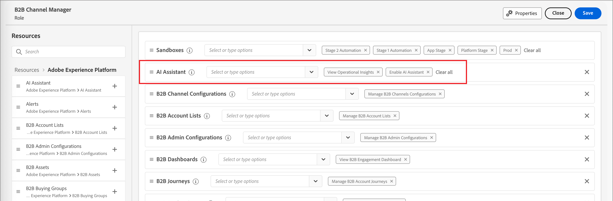

# Habilitar o acesso ao Assistente de IA

>[!IMPORTANT]
>
>Se você receber uma mensagem na interface de permissões para informá-lo de que sua organização deve primeiro concordar com termos legais adicionais para obter acesso ao Assistente de IA, entre em contato com a equipe de conta da Adobe para obter orientação.

Os parâmetros a seguir controlam o acesso ao Assistente de IA no Journey Optimizer B2B edition:

* **Acessar o aplicativo:** Você pode acessar o Assistente de IA no Adobe Journey Optimizer B2B edition.

* **Permissões:** Use a [Interface do usuário de permissões](https://experienceleague.adobe.com/en/docs/experience-platform/access-control/abac/permissions-ui/permissions){target="_blank"} para conceder ou revogar acesso ao Assistente de IA em sua organização. Para usar o Assistente de IA, um determinado usuário deve pertencer a uma função configurada com as permissões _[!UICONTROL Habilitar Assistente de IA]_ e _[!UICONTROL Exibir Insights Operacionais]_.

Como administrador, você pode:

* Adicione a permissão **[!UICONTROL Habilitar Assistente de IA]** a uma determinada função e adicione um usuário a essa função. Essa permissão fornece acesso ao Assistente de IA para usuários em sua organização.

* Adicione a permissão **[!UICONTROL Exibir Insights Operacionais]** a uma determinada função e adicione um usuário a essa função. Essa permissão possibilita que o usuário use os recursos de insights operacionais do Assistente de IA.

{width="800" zoomable="yes"}

Use a interface de permissões para conceder permissões para usar o Assistente de IA no Journey Optimizer B2B edition. Para obter informações sobre como acessar o Assistente de IA no Experience Platform e outros aplicativos da Experience Cloud, consulte a [documentação do Adobe Experience Platform](https://experienceleague.adobe.com/en/docs/experience-platform/ai-assistant/access){target="_blank"}.

Quando o usuário tem as permissões necessárias, ele pode acessar o Assistente de IA selecionando o ícone do _Assistente de IA_ no cabeçalho superior do aplicativo que você está usando.

{width="800" zoomable="yes"}

## Vídeo de visão geral do acesso ao Assistente de IA

Assista ao vídeo a seguir para saber como configurar o acesso ao AI Assistant para suas organizações e usuários.

>[!VIDEO](https://video.tv.adobe.com/v/3436470/?learn=on)

## Próximas etapas

Depois que os usuários têm acesso ao AI Assistant, eles podem usar o recurso durante os workflows. Consulte a seguinte documentação:

* [Orientação para perguntas](./question-guidance.md)
* [Usar o Assistente de IA](./use-ai-assistant.md)
