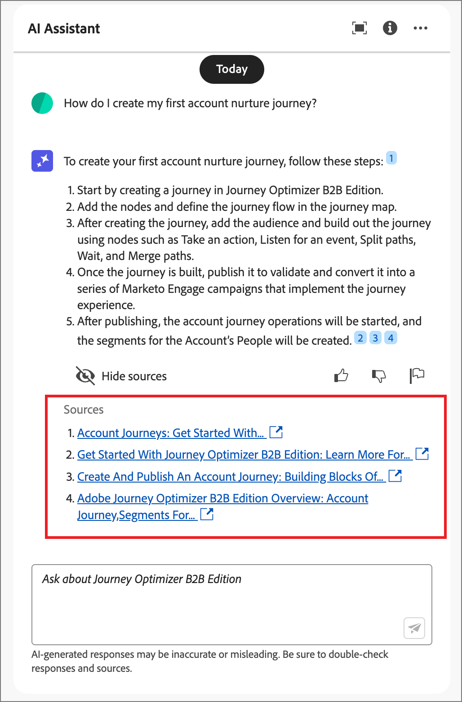

# Usar o assistente de IA no Journey Optimizer B2B edition

No Journey Optimizer B2B edition, o Assistente de IA é um recurso da interface do usuário que você pode usar para entender conceitos do produto, navegar e conhecer rapidamente os recursos do produto e obter insights operacionais para o seu ambiente. Ele também está disponível em vários produtos na Adobe Experience Cloud.

>[!IMPORTANT]
>
>É necessário um contrato para as Diretrizes de usuário da IA gerativa da Adobe Experience Cloud para que você possa usar o Assistente de IA. Para obter mais informações sobre este contrato e diretrizes de uso, consulte as [Diretrizes de usuário da IA gerativa da Adobe Experience Cloud](https://www.adobe.com/legal/licenses-terms/adobe-dx-gen-ai-user-guidelines.html).

Para acessar o Assistente de IA, clique no ícone no cabeçalho. O Assistente de IA é aberto em um painel à direita.

{width="420"}

A interface do Assistente de IA é exibida, fornecendo imediatamente informações para começar. Você pode usar as opções fornecidas em _Ideias para começar_ para responder a perguntas e comandos, como:

* Quais jornadas foram publicadas?
* Quais interesses de solução foram criados?
* Conte-me os principais benefícios do Journey Optimizer B2B edition.

No Adobe Journey Optimizer B2B edition, o Assistente de IA é compatível com os seguintes casos de uso:

## Faça perguntas sobre o conhecimento do produto

As perguntas de conhecimento do produto são sobre os conceitos e as informações práticas do Journey Optimizer B2B edition. Alguns exemplos de perguntas de conhecimento sobre produtos incluem:

* Como configurar contas do provedor de SMS?
* Como faço para enviar um email em uma jornada?
* Como posso personalizar meu conteúdo de email?

Para fazer uma pergunta sobre um produto, digite-a no campo na parte inferior do painel e pressione Enter. Por exemplo, quando você precisa aprender a usar um grupo de compras em uma jornada. Neste caso, insira _Como usar um grupo de compras em uma jornada?_ Depois de enviar a pergunta, o Assistente de IA consulta sua base de conhecimento e compila uma resposta em alguns segundos.

{width="420"}

+++Exibir um exemplo de resposta

{width="420"}

+++

## Faça perguntas sobre insights operacionais

As perguntas sobre insights operacionais são sobre os objetos do jornada na sandbox da sua organização. Você pode fazer perguntas sobre artefatos operacionais, como público-alvo da conta, jornada da conta, interesse da solução e modelo de grupo de compras. Alguns exemplos de perguntas ou prompts de insights operacionais incluem:

* Quantas jornadas ativas eu tenho no Adobe Journey Optimizer B2B edition?
* Fornecer uma lista de todas as jornadas agendadas
* Quantas jornadas foram criadas nos últimos sete dias?

Você deve estar em uma sandbox ativa para o Assistente de IA para fornecer uma resposta suficiente a uma pergunta sobre seus insights operacionais.

>[!NOTE]
>
>As únicas perguntas de insights operacionais do Adobe Journey Optimizer B2B edition com suporte pelo Assistente de IA estão listadas na [tabela de domínio de insights operacionais](./ai-assistant-overview.md#operational-insights). Ele pode acessar dados somente para a sandbox em que você está atualmente.

Para fazer uma pergunta sobre insights operacionais, insira-a no campo na parte inferior do painel e pressione Enter. Por exemplo, quando você deseja saber sobre os públicos-alvo da sandbox. Nesse caso, digite _Quantos públicos-alvo existem?_.  O Assistente de IA fornece uma contagem dos públicos-alvo na sandbox e uma explicação de como ele calculou a resposta. Na resposta de exemplo a seguir, o Assistente de IA fornece um link para acessar os públicos-alvo na interface do usuário e descreve as etapas executadas para identificar o número de públicos-alvo.

{width="420"}

Você pode seguir sua consulta inicial solicitando uma lista de artefatos, como _Listar os 5 principais por tamanho_. O Assistente de IA retorna uma tabela com os cinco itens principais na consulta e suas IDs correspondentes. Clique no ícone _Baixar_ (  ) para baixar a tabela como um arquivo CSV.

{width="420"}

Para exibir toda a tabela no Assistente de IA, clique no ícone _Maximizar_ (  ). Na exibição de tabela expandida, clique em **[!UICONTROL Baixar CSV]** para salvar as informações como um arquivo CSV.

{width="600" zoomable="yes"}

## Verificar respostas

O AI Assistant inclui ferramentas que você pode usar para verificar e validar respostas.

### Fontes de conhecimento do produto

Depois de receber uma resposta para uma pergunta de produto, selecione **[!UICONTROL Mostrar origem]** para exibir as citações da fonte de conhecimento do produto usadas para gerar a resposta do Assistente de IA.

O Assistente de IA fornece links para a documentação que confirma a resposta inicial. Também adiciona notas de rodapé à resposta para indicar as partes específicas da resposta que fazem referência às fontes de documentação vinculadas.

{width="420"}

### Fontes de insights operacionais

Depois de receber uma resposta para uma pergunta de insights operacionais, clique em **[!UICONTROL Mostrar origem]** e selecione **[!UICONTROL Exibir consulta de origem]**.

Você pode verificar cada resposta relacionada às perguntas dos insights operacionais usando uma consulta SQL fornecida pelo Assistente de IA. Quando consultado sobre uma pergunta de insights operacionais, o Assistente de IA fornece uma consulta SQL que pode ser usada para verificar o processo necessário para calcular a resposta. Esta consulta de origem é somente para fins de verificação e não tem suporte no Serviço de consulta.

{width="550" zoomable="yes"}

## Fornecer feedback

Use os ícones de _Polegar para cima_ (  ) ou _Polegar para baixo_ (  ) para classificar a utilidade e a qualidade da resposta. Preencha o breve formulário de pesquisa de acordo com sua experiência e clique em **[!UICONTROL Enviar]**. As informações fornecidas são usadas para fazer melhorias no Assistente de IA.

Se você notar algo problemático na resposta, clique no ícone _Sinalizador_ (  ). Use o formulário para descrever o problema e clique em **[!UICONTROL Enviar]** para relatar o problema.

{width="420"}

+++Exibir formulários

>[!BEGINTABS]

>[!TAB Polegar para cima]

{width="600" zoomable="yes"}

>[!TAB Polegar para baixo]

{width="600" zoomable="yes"}

>[!TAB Sinalizador]

{width="600" zoomable="yes"}

>[!ENDTABS]

+++
