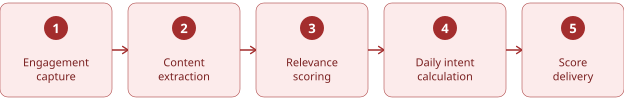

# Pontuações de intenção {#intent-scores}

Uma pontuação de intenção mede o interesse de uma pessoa ou conta em uma palavra-chave, produto ou categoria de produto. O Adobe Journey Optimizer B2B edition calcula a pontuação usando aprendizagem de máquina que mede a similaridade de significado, em vez de regras manuais ou um sistema de ponto fixo. Cada pontuação é normalizada de 0 a 1, com números mais altos indicando intenção mais forte.

A relevância do conteúdo é atualizada aproximadamente a cada 12 horas e as pontuações de intenção são recalculadas diariamente. As pontuações são agregadas de palavra-chave a produto e de pessoa a conta. As pontuações de intenção aparecem no [Painel Inteligente](../dashboards/intelligent-dashboard.md) e nas [páginas de detalhes da conta](../accounts/account-details.md), [_de detalhes do grupo de compras_](../buying-groups/buying-group-details.md) e [de detalhes da pessoa](../accounts/person-details.md).

{width="700" zoomable="yes"}

As seções a seguir explicam os conceitos principais por trás da pontuação de intenção, o processo contínuo que mantém as pontuações atualizadas, a lógica de cálculo por trás de cada pontuação e as configurações que você pode configurar.

## Conceitos principais {#core-concepts}

A detecção de intenção mede a proximidade com a qual uma pessoa se envolve e corresponde a seus produtos e palavras-chave, ponderando essa semelhança pela quantidade de participação da pessoa. Três entidades compõem esse modelo.

| Entidade | Descrição |
|--------|--------------|
| Pessoa | O indivíduo que interage com seu conteúdo abrindo emails, visitando páginas da Web e se envolvendo ao longo do tempo. |
| Conteúdo | Os emails e páginas da Web com as quais uma pessoa se envolve. Outros formatos, como webinários e campanhas, são adicionados ao longo do tempo. |
| Taxonomia | A estrutura de palavras-chave, produtos e categorias de produtos que representa os interesses que você deseja medir. |

### Taxonomia e atualizações padrão {#taxonomy}

Sua taxonomia, as palavras-chave, os produtos e as categorias em relação aos quais a intenção é medida estão disponíveis para uso sem a necessidade de configuração.

Você pode revisar e atualizar mapeamentos de taxonomia a qualquer momento na página _[!UICONTROL Mapeamento de Intenção]_. Consulte [Dados de intenção](../admin/intent-data.md) para o processo de configuração de taxonomia.

### Relevância do conteúdo {#content-relevance}

O Journey Optimizer B2B edition traduz o conteúdo e a taxonomia em uma representação matemática de seu significado e, em seguida, usa um modelo de similaridade para medir o alinhamento. O conteúdo que corresponde estreitamente a uma palavra-chave ou produto recebe uma pontuação de alta relevância. O conteúdo não relacionado recebe uma pontuação baixa.

O modelo de similaridade é pré-treinado em linguagem geral, portanto, nenhum treinamento específico do cliente é necessário para começar.

## Processo de pontuação {#scoring-process}

Um processo contínuo transforma o envolvimento bruto em uma pontuação de intenção concluída. Cada etapa se baseia no que a etapa anterior produziu.

{width="700"}

### Captura de engajamento {#engagement-capture}

Cada ponto de contato significativo de uma pessoa é capturado à medida que acontece e vinculado ao conteúdo envolvido.

* Visitas às páginas, aberturas e cliques no email, envios de formulários e atividades semelhantes são registrados como eventos de engajamento.
* Cada parte única do conteúdo também é anotada para que possa ser analisada na próxima etapa.
* **Cadência de atualização** - Contínua, conforme ocorre o engajamento.

### Extração de conteúdo {#content-extraction}

Antes que o conteúdo possa ser pontuado para relevância, o Journey Optimizer B2B edition extrai e lê seu texto.

* Para cada novo conteúdo, o sistema extrai o texto subjacente, quer ele esteja em uma página da Web ou em um e-mail.
* Alguns tipos de atividades, como preenchimentos de formulários, já apresentam seu próprio conteúdo descritivo e ignoram essa etapa.
* O conteúdo que não pode ser recuperado, como um link quebrado ou removido, é registrado e excluído a partir de agora.
* **Atualizar cadência** - Conforme novos conteúdos são descobertos.

### Pontuação de relevância {#relevance-scoring}

Cada ativo é mensurado em relação à sua taxonomia, independentemente de quem está envolvido com ele.

* Cada email e página da Web é analisado e comparado com suas palavras-chave, produtos e categorias usando o modelo de similaridade.
* O resultado é uma pontuação de relevância entre 0 e 1 para esse ativo em relação a cada palavra-chave ou produto relacionado.
* **Atualizar cadência** - A cada 12 horas.

### Cálculo diário de intenção {#daily-intent-calculation}

O engajamento e a relevância do conteúdo são combinados em uma pontuação de intenção diária por pessoa, por palavra-chave ou produto.

* Cada tipo de atividade tem um peso configurável. Por exemplo, o envio de um formulário pode contar muito mais do que uma exibição de página.
* As atividades recentes são mais importantes do que as atividades mais antigas, portanto, as pontuações favorecem o que alguém fez esta semana em relação ao que fez um mês atrás.
* Uma medida de confiança reflete o quanto o engajamento de uma pessoa tem sido consistente, não apenas o volume.
* **Atualizar cadência** - Diariamente.

### Entrega de pontuação {#score-delivery}

As pontuações diárias são agregadas, recebem um nível de intenção e são entregues ao painel.

* Cada pontuação é marcada com um nível de intenção Alto, Medium ou Baixo.
* Pontuações vinculadas à conta correta para que as equipes de vendas e marketing possam visualizar a intenção no nível da pessoa e da conta.
* Somente as pessoas cujo nível de intenção foi alterado são atualizadas, portanto, o painel reflete a última mudança significativa.
* **Atualizar cadência** - Diariamente.

## Lógica de cálculo de pontuação {#score-calculation-logic}

O cálculo consiste em cinco camadas, cada uma adicionando mais contexto aos dados brutos de relevância e engajamento.

### Relevância de conteúdo para um tópico {#relevance-to-topic}

Cada parte do conteúdo e cada tópico, ou seja, uma palavra-chave, produto ou categoria, é traduzido em uma representação matemática do seu significado. Conteúdo com significado semelhante a um tópico fica mais próximo nessa representação. Relevância é uma medida de proximidade no significado, não uma correspondência exata de palavras.

### Ponderação de engajamento diário {#engagement-weighting}

Em um determinado dia, a pontuação de uma pessoa é uma média ponderada da relevância de tudo com o que ela se envolveu. Atividades de valor mais alto contam para mais.

>[!BEGINSHADEBOX &quot;Exemplo&quot;]

Uma pessoa se envolve com três conteúdos em um dia. As exibições de página têm um peso de um e os envios de formulário têm um peso de cinco.

Como o envio de um formulário conta cinco vezes mais do que uma exibição de página, ele influencia significativamente a pontuação diária deles, mesmo que tenham interagido com três itens no total.

A pontuação diária resultante para esse tópico é de aproximadamente 0,70 em uma escala de 0 a 1.

>[!ENDSHADEBOX]

### Decaimento de recenticidade {#recency-decay}

A pontuação de uma pessoa reflete uma mistura dos últimos dias, com a atividade recente ponderada muito mais do que a atividade mais antiga. Após aproximadamente uma semana, a atividade mais antiga tem impacto mínimo, de modo que a pontuação sempre reflete o interesse atual. Na prática, uma visita hoje supera uma de ontem, que supera uma de 10 dias atrás.

### Normalização de pontuação e níveis de intenção {#normalization-intent-levels}

Cada pontuação ajustada é colocada em uma escala consistente de 0 a 1 em relação a outras pessoas na sua instância e, em seguida, classificada em um nível de intenção.

| Pontuação final | Nível de intenção |
|-------------|--------------|
| Acima de 0,6 | Alto |
| 0,2 a 0,6 | Meio |
| Abaixo de 0,2 | Baixo |

### Agregação de pontuação {#score-aggregation}

As pontuações individuais são agregadas para que você possa analisar a intenção no nível que é importante para uma decisão, não apenas no nível mais granular.

* **Palavra-chave para produto** - Pontuações calculadas na agregação em nível de palavra-chave para mostrar interesse em um produto, não apenas em um único termo de pesquisa.
* **Pessoa para conta** - Uma pontuação de conta agrega todas as pontuações de pessoas, para que você possa ver quando todo um grupo de compras está mostrando a intenção.

{width="500"}

Use a exibição de nível de produto para ver quais produtos estão aumentando em interesse geral, em vez de quais palavras-chave individuais estão em tendência. Use a exibição no nível da conta para ver quando um grupo de compras inteiro está mostrando maior interesse em conjunto, em vez de reagir a uma única pessoa envolvida.

## Configurações configuráveis {#configurable-settings}

A maior parte da lógica de pontuação é fixa para manter os resultados confiáveis e comparáveis ao longo do tempo. Um administrador de produto pode personalizar duas configurações para atender aos seus requisitos:

* **Pesos da atividade** - Para aplicar maior impacto às pontuações de intenção, aumente o peso de atividades de alto valor, como uma solicitação de demonstração ou uma visita a uma página de preços. Para excluir uma atividade completamente, defina seu peso como zero, o que é útil para ações como cancelamentos de assinatura que não contribuem para a intenção. Os pesos da atividade para o cálculo de intenção usam o mesmo modelo de ponderação que também orienta as [pontuações de engajamento](../buying-groups/engagement-scores.md). Consulte [_Configurar ponderação de pontuação de envolvimento_](../admin/engagement-score-weighting.md) para alterar os pesos da atividade.

* **Mapeamentos de taxonomia** - As palavras-chave, os produtos e as categorias em que a pontuação se baseia estão disponíveis para uso. Revise e atualize-os a qualquer momento na página _[!UICONTROL Mapeamento de intenções]_. Consulte [_Dados de intenção_](../admin/intent-data.md) para o processo de configuração.

Todo o restante, incluindo relevância de conteúdo, declínio de atividade e limites de _Alto_, _Medium_ e _Baixo_, é corrigido para que as pontuações permaneçam consistentes e comparáveis ao longo do tempo.

## Princípios de pontuação {#scoring-principles}

Lembre-se dos seguintes princípios ao revisar e agir de acordo com as pontuações de intenção.

### Pontuação orientada pelo modelo {#model-driven}

Não há atribuições de ponto ou regras de palavra-chave a serem mantidas. O modelo aprende relevância diretamente do seu conteúdo e taxonomia, o que mantém a pontuação consistente à medida que sua biblioteca de conteúdo cresce e muda, sem configuração contínua.

### Pontuação relativa {#relative-scoring}

Uma pontuação reflete onde uma pessoa ou conta está entre seus outros contatos hoje, e o sistema recalcula diariamente com base na população atual. Use pontuações para comparar pessoas e contas na sua própria instância, em vez de usar um número fixo e universal. As pontuações não são diretamente comparáveis de uma empresa para outra.

### Atualização de dados {#data-freshness}

A relevância do conteúdo é atualizada aproximadamente a cada 12 horas à medida que o novo conteúdo aparece. As pontuações de intenção são recalculadas uma vez por dia, de modo que o painel reflita a atividade do dia anterior todas as manhãs.
