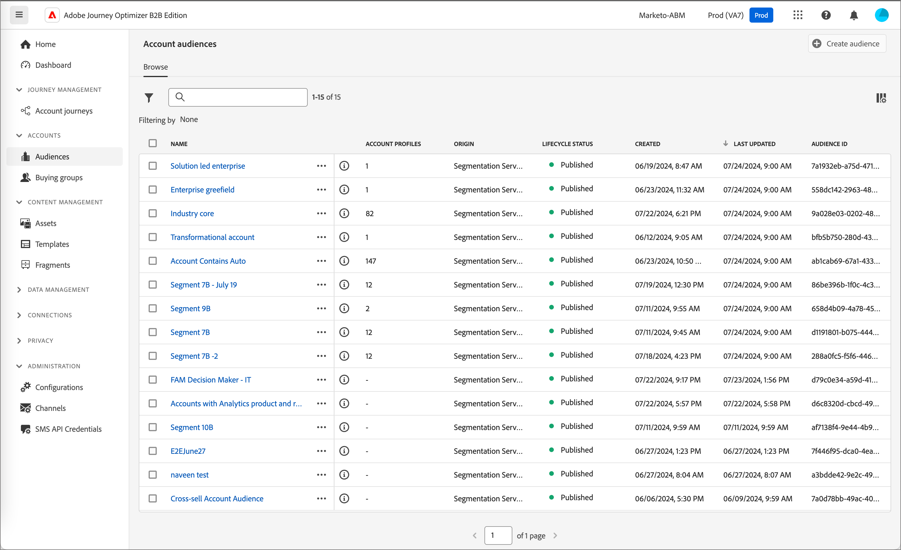
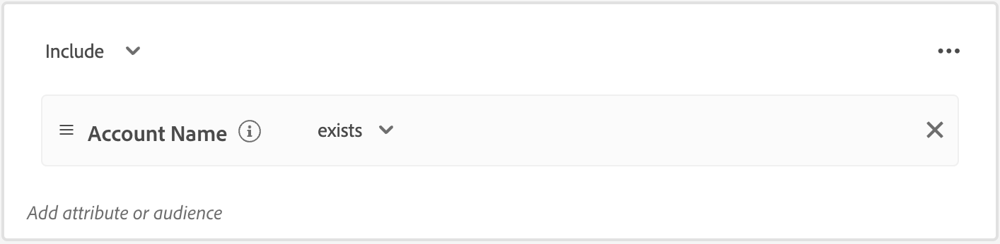

# Públicos-alvos da conta

Um público-alvo é um conjunto de pessoas que compartilham comportamentos e/ou características semelhantes. O Journey Optimizer B2B Edition usa as funcionalidades de segmentação de conta encontradas nas edições B2B e B2P da Adobe Real-Time Customer Data Platform. Com a segmentação de conta, os usuários podem gerar públicos-alvos da conta aproveitando dados de qualquer uma das entidades B2B no sistema. Esses públicos-alvos da conta servem como entradas para jornadas de conta do Journey Optimizer B2B Edition, facilitando a ativação contínua e o recurso de personalização.

Saiba mais sobre públicos-alvos da conta e como defini-los na [documentação do serviço de segmentação da Adobe Experience Platform](https://experienceleague.adobe.com/pt-br/docs/experience-platform/segmentation/types/account-audiences){target="_blank"}.

## Fluxo de trabalho do público-alvo da conta

Pense no Journey Optimizer B2B Edition como um destino da Experience Platform (AEP) que não aparece no catálogo de destinos. Ative públicos-alvos da conta para o Journey Optimizer B2B Edition seguindo estas etapas:

1. Crie esquemas para seus dados na AEP.
1. Assimile os dados na AEP.
1. Crie um segmento de conta para avaliar os dados.
1. Ative os dados avaliados no Journey Optimizer B2B Edition.

No Journey Optimizer B2B Edition, os públicos-alvos da conta são usados como uma entrada para jornadas baseadas em conta, permitindo direcionar as pessoas nessas contas. Por exemplo, você pode usar os públicos-alvos da conta para recuperar registros de todas as contas que não têm informações de contato de uma pessoa com o título Diretor(a) de operações (COO) ou Diretor(a) de marketing (CMO).

O Journey Optimizer B2B Edition permite criar públicos-alvos da conta da Adobe Experience Platform (AEP) diretamente da navegação à esquerda e incorporá-los às jornadas da conta.

{width="800" zoomable="yes"}

## Criar um público-alvos da conta

Defina o público-alvo da conta criando uma segmentação de conta. Crie a segmentação de conta diretamente no aplicativo Journey Optimizer B2B Edition ou utilize a [interface do Construtor de segmentos](https://experienceleague.adobe.com/pt-br/docs/experience-platform/segmentation/ui/segment-builder){target="_blank"}. Veja a seguir as etapas que podem ser usadas para criar uma segmentação de conta no Journey Optimizer B2B Edition.

1. Na navegação à esquerda, escolha **[!UICONTROL Contas]** > **[!UICONTROL Públicos-alvo]**.

1. Clique em **[!UICONTROL Criar público-alvo]** na parte superior direita.

1. Crie a definição do segmento.

   Os atributos e os públicos-alvo da conta são exibidos na barra de navegação esquerda. Na guia _[!UICONTROL Atributos]_, é possível adicionar atributos personalizados e criados pela plataforma. Arraste cada atributo para criar a lógica do segmento.

   >[!TIP]
   >
   >Ao criar um público-alvo da conta, observe que os eventos são listados em _[!UICONTROL Pessoas]_, porque esses atributos são associados a pessoas. 
   >
   >Na guia _[!UICONTROL Públicos-alvos]_, é possível adicionar públicos-alvos baseados em pessoas criados anteriormente como referência para criar seu próprio público-alvo da conta.

   O exemplo a seguir define o público-alvo criado por meio de `Country Code`, `Revenue Amount` e `Market segment`. A consulta em inglês seria “I want all accounts in the US who are in the Finance Segment whose revenue exceeds $1M.” (Busco todas as contas do segmento de Finanças nos EUA cuja receita exceda US$ 1 milhão).

   {width="700" zoomable="yes"}
    

   >[!IMPORTANT]
   >
   >O atributo `Account Name` para registros de conta deve conter um valor a ser incluído nas jornadas de conta. Se este atributo estiver vazio (nulo), o registro da conta será excluído. 
   >Para garantir que apenas contas com um Nome de Conta não vazio sejam incluídas, adicione o atributo **[!UICONTROL Nome de Conta]** e selecione _[!UICONTROL existe]_ como condição de correspondência. 
   >{width="600"}
   > Se você estiver usando um atributo personalizado como nome da conta, use seu nome de atributo personalizado no lugar de _[!UICONTROL Nome da conta]_.

1. Clique em **[!UICONTROL Salvar e fechar]** na parte superior direita.

Para ativar o público-alvo da conta para o Journey Optimizer B2B Edition, você deve [adicioná-lo a uma jornada de conta](../journeys/journeys-overview.md#add-the-account-audience-for-your-journey) e [publicar a jornada](../journeys/journeys-overview.md).
