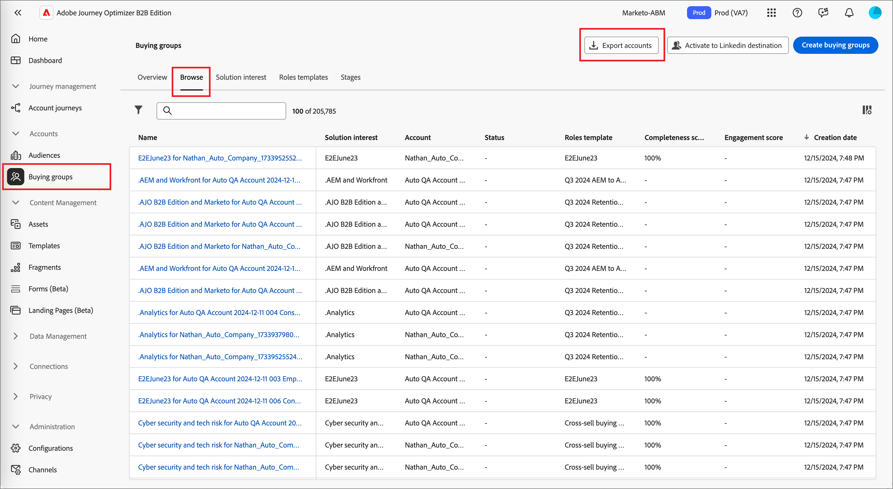
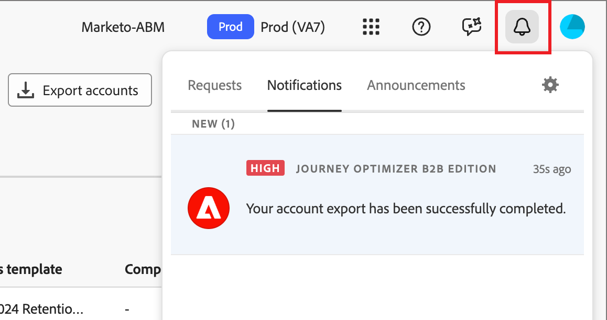

# Exportar lista de contas

Use o recurso _Exportar lista de contas_ para exportar todas as contas ou um conjunto de contas com base na filtragem que você definiu. O processo de exportação produz um arquivo CSV e envia o URL do arquivo armazenado em uma notificação de pulso. Você pode usar esse recurso para mover contas para plataformas de terceiros quando necessário.

1. No Journey Optimizer B2B Edition, acesse **[!UICONTROL Contas]** > **[!UICONTROL Grupos de compra]** na navegação à esquerda.

1. Selecione a guia **[!UICONTROL Navegar]**.

1. Clique em **[!UICONTROL Exportar contas]** na parte superior direita.

   {width="800" zoomable="yes"}

1. Na caixa de diálogo, defina os parâmetros dos públicos-alvo da conta que serão exportados.

   {width="400"}

   Na **[!UICONTROL Pontuação de engajamento]**, o operador `Between` é inclusivo, assim como os intervalos de porcentagem. Por exemplo, 5,1 e 5 estão ambos _entre_ 5 e 6.

   Parâmetros de filtragem vazios são tratados como `Is Any`.

1. Clique em **[!UICONTROL Exportar contas]** para gerar o arquivo CSV usando os filtros especificados.

1. Ao receber a notificação de que a exportação foi concluída, clique no link de notificação para acessar o arquivo CSV.

   {width="425"}

   >[!NOTE]
   >
   >Se você tiver uma assinatura de recebimento de notificações por email configurada nas preferências da conta de usuário da Adobe, está pode ser uma notificação por email.

   A página do aplicativo redireciona para a guia de navegação _Grupo de compra_, e uma caixa de diálogo solicita que você salve o arquivo no sistema. Se precisar compartilhar os dados, você pode usar o sistema de compartilhamento de arquivos da sua equipe.
