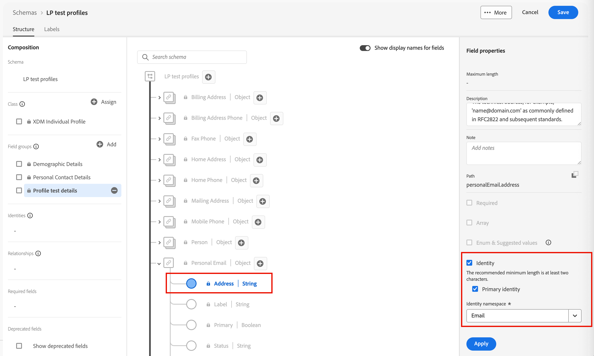

# Perfis de teste {#test-profiles}

Os perfis de teste são necessários para [visualizar e testar o conteúdo da página de aterrissagem](../content/landing-pages-create-publish.md#test-landing-page) no Journey Optimizer B2B edition. Você pode definir um conjunto de perfis de teste criando um esquema, criando o conjunto de dados e fazendo upload de um arquivo CSV.

<!--
>[!NOTE]
>
>[!DNL Journey Optimizer B2B Edition] allows testing different variants of your content by previewing it and sending proofs using sample input data uploaded from a CSV or JSON file, or added manually. 
-->

Criar um perfil de teste é semelhante a criar perfis comuns no [!DNL Adobe Experience Platform]. Para obter mais informações, consulte a [documentação de Perfil do cliente em tempo real](https://experienceleague.adobe.com/docs/experience-platform/profile/home.html?lang=pt-BR){target="_blank"}.


## Criar um esquema {#create-schema}

Para criar perfis, primeiro é necessário criar um esquema no [!DNL Journey Optimizer B2B Edition].

1. Expanda **[!UICONTROL Gerenciamento de dados]** na navegação à esquerda, selecione **[!UICONTROL Esquemas]** e clique em **[!UICONTROL Criar esquema]** na parte superior direita.

   {width="800" zoomable="yes"}

1. Selecione **[!UICONTROL Padrão]** como a opção de criação do esquema.

1. Selecione um tipo de esquema, por exemplo **[!UICONTROL Manual]**, e clique em **[!UICONTROL Selecionar]**.

   {width="500"}

1. Selecione um tipo de esquema, por exemplo **[!UICONTROL Perfil Individual]**, e clique em **[!UICONTROL Próximo]**.

   {width="700" zoomable="yes"}

1. Insira um nome (obrigatório) e uma descrição (opcional) para o esquema e clique em **[!UICONTROL Concluir]**.

   {width="700" zoomable="yes"}

   A estrutura do esquema é exibida, com o painel _[!UICONTROL Composição]_ à esquerda.

1. Na seção **[!UICONTROL Grupos de campos]**, clique em **[!UICONTROL Adicionar]** e selecione os grupos de campos apropriados.

   Use a ferramenta de pesquisa para localizar e selecionar o grupo de campos **[!UICONTROL Detalhes do teste de perfil]**.

   {width="700" zoomable="yes"}

   Quando terminar, clique em **[!UICONTROL Adicionar grupos de campos]** e a lista de grupos de campos será exibida na tela de visão geral do esquema.

   Repita esta etapa para adicionar outros grupos de campos que você deseja usar para perfis de teste, como **[!UICONTROL Detalhes de Contato da Pessoa]** e **[!UICONTROL Detalhes de Contato Comercial]**.

1. Na lista de campos, clique no campo que você deseja definir como a identidade principal.

1. No painel direito _[!UICONTROL Propriedades do campo]_, verifique as opções **[!UICONTROL Identidade]** e **[!UICONTROL Identidade primária]** e selecione um namespace.

   Se você quiser que a identidade principal seja um endereço de email, escolha o namespace **[!UICONTROL Email]**.

   {width="700" zoomable="yes"}

   Clique em **[!UICONTROL Aplicar]**.

1. Selecione o esquema e habilite a opção **[!UICONTROL Perfil]** no painel **[!UICONTROL Propriedades do esquema]**.

   {width="700" zoomable="yes"}

1. Clique em **[!UICONTROL Salvar]**.

Para obter mais informações sobre a criação de esquemas, consulte a [documentação XDM](https://experienceleague.adobe.com/docs/experience-platform/xdm/ui/resources/schemas.html#prerequisites){target="_blank"}.

>[!IMPORTANT]
>
>Ao criar ou substituir um conjunto de dados para assimilação de perfil de teste, verifique se o esquema tem o descritor de identidade correto aplicado ao campo de identidade principal (`/personID`) para o namespace pretendido. Se o descritor de identidade estiver ausente ou configurado incorretamente, os perfis assimilados neste conjunto de dados podem não ser sinalizados como perfis de teste (`testProfile = true`), mesmo que o processo de assimilação seja concluído com êxito.
>
>Se os perfis de teste não forem sinalizados corretamente após a assimilação:
>
>1. Revise o esquema associado ao seu conjunto de dados.
>1. Confirme se o campo de identidade principal tem o descritor de identidade correto para o namespace.
>1. Se o descritor estiver ausente, atualize o esquema para adicionar o descritor de identidade e assimilar novamente seus dados.

## Criar um conjunto de dados {#create-dataset}

Depois de criar o esquema, crie o conjunto de dados usado para importar os perfis. Para obter mais informações sobre a criação do conjunto de dados, consulte a [documentação do Serviço de Catálogo](https://experienceleague.adobe.com/docs/experience-platform/catalog/datasets/user-guide.html#getting-started){target="_blank"}.

1. Em _[!UICONTROL Gerenciamento de dados]_, na navegação à esquerda, selecione **[!UICONTROL Conjuntos de dados]**.

1. Na parte superior direita, clique em **[!UICONTROL Criar conjunto de dados]**.

   {width="800" zoomable="yes"}

1. Escolha **[!UICONTROL Criar conjunto de dados do esquema]**.

   {width="500"}

1. Selecione o esquema criado anteriormente e clique em **[!UICONTROL Próximo]**.

1. Escolha um nome e clique em **[!UICONTROL Concluir]**.

   {width="700" zoomable="yes"}

1. No painel direito, habilite a opção **[!UICONTROL Perfil]**.

## Criar perfis de teste usando um arquivo CSV {#create-test-profiles-csv}

No [!DNL Adobe Experience Platform], é possível criar perfis carregando um arquivo CSV contendo os diferentes campos de perfil no conjunto de dados. Esse é o método mais fácil.

1. Crie um arquivo CSV simples usando um software de planilha.

1. Adicione uma coluna para cada campo obrigatório.

   Adicione o campo de identidade primário (`personID`, por exemplo) e o campo `testProfile` definidos como `true`.

1. Adicione uma linha por perfil e os valores de cada campo.

   {width="600" zoomable="yes"}

1. Salve a planilha como um arquivo csv, certificando-se de que as vírgulas sejam usadas como separadores.

1. Em [!DNL Adobe Experience Platform], navegue até **[!UICONTROL Workflows]**.

1. Escolha **[!UICONTROL Mapear CSV para esquema XDM]** e clique em **[!UICONTROL Iniciar]**.

   {width="800" zoomable="yes"}

1. Selecione o conjunto de dados a ser usado para a importação e clique em **[!UICONTROL Avançar]**.

   {width="700" zoomable="yes"}

1. Clique em **[!UICONTROL Escolher arquivos]** e selecione o arquivo CSV ou arraste e solte o arquivo do seu sistema.

   Após concluir o carregamento do arquivo, clique em **[!UICONTROL Avançar]**.

   {width="700" zoomable="yes"}

1. Mapeie os campos csv de origem para os campos de esquema e clique em **[!UICONTROL Concluir]**.

   {width="700" zoomable="yes"}

   A importação de dados é iniciada. O status muda de _Processando_ para _Sucesso_.

1. Na parte superior direita, clique em **[!UICONTROL Visualizar conjunto de dados]** e verifique se os perfis de teste adicionados ao conjunto de dados estão corretos.

   {width="700" zoomable="yes"}

   Os perfis de teste podem ser usados para [testar o conteúdo da página de aterrissagem](../content/landing-pages-create-publish.md#test-landing-page).

>[!NOTE]
>
>Para obter mais informações sobre a importação de dados CSV, consulte a [documentação de Assimilação de dados](https://experienceleague.adobe.com/docs/experience-platform/ingestion/tutorials/map-a-csv-file.html#tutorials){target="_blank"}.

<!--
## Create test profiles using API calls {#create-test-profiles-api}

You can also create test profiles via API calls. Learn more in [[!DNL Adobe Experience Platform] documentation](https://experienceleague.adobe.com/docs/experience-platform/profile/home.html){target="_blank"}.

You must use a Profile schema that contains the **[!UICONTROL Profile test details]** field group. The `testProfile` flag is part of this field group.
When creating a profile, make sure you pass the value: `testProfile = true`.

You can also update an existing profile to change its `testProfile` flag to `true`.

Here is an example of an API call to create a test profile:

```bash
curl -X POST \
'https://dcs.adobedc.net/collection/xxxxxxxxxxxxxx' \
-H 'Cache-Control: no-cache' \
-H 'Content-Type: application/json' \
-H 'Postman-Token: xxxxx' \
-H 'cache-control: no-cache' \
-H 'x-api-key: xxxxx' \
-H 'x-gw-ims-org-id: xxxxx' \
-d '{
"header": {
"msgType": "xdmEntityCreate",
"msgId": "xxxxx",
"msgVersion": "xxxxx",
"xactionid":"xxxxx",
"datasetId": "xxxxx",
"imsOrgId": "xxxxx",
"source": {
"name": "Postman"
},
"schemaRef": {
"id": "https://example.adobe.com/mobile/schemas/xxxxx",
"contentType": "application/vnd.adobe.xed-full+json;version=1"
}
},
"body": {
"xdmMeta": {
"schemaRef": {
"contentType": "application/vnd.adobe.xed-full+json;version=1"
}
},
"xdmEntity": {
"_id": "xxxxx",
"_mobile":{
"ECID": "xxxxx"
},
"testProfile":true
}
}
}'
```
-->
