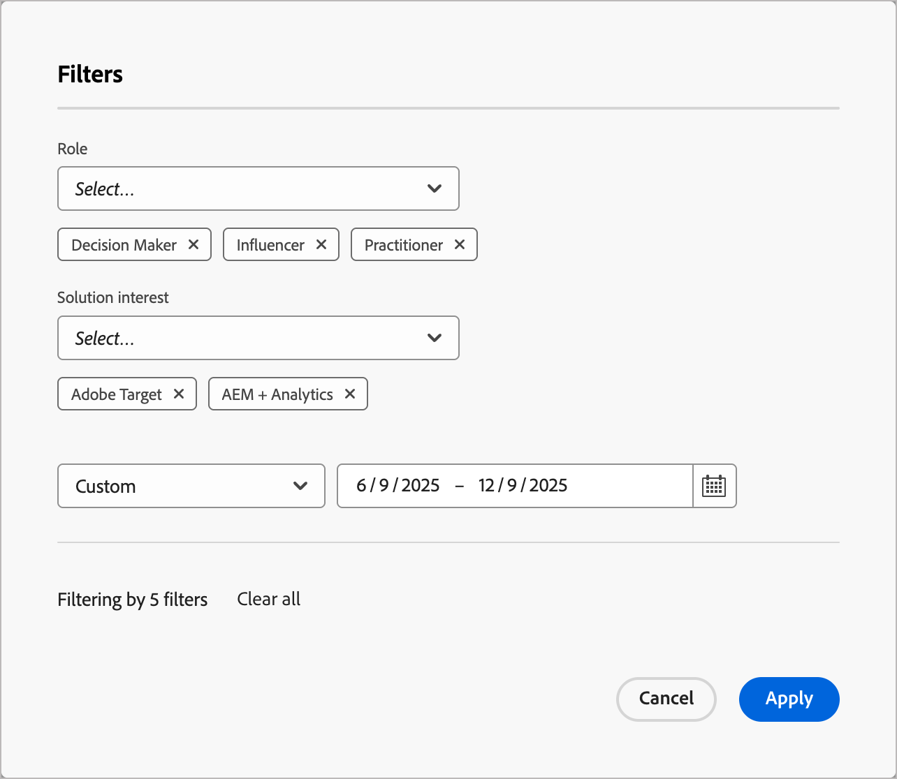
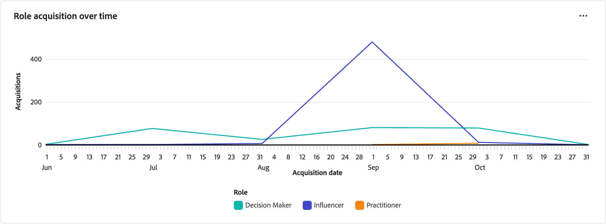

# Painel de insights da função

O painel de Insights da função fornece visibilidade sobre como as funções de grupo de compra evoluem e se envolvem ao longo do tempo. Isso ajuda os profissionais de marketing a entender as tendências de aquisição de funções, os padrões de envolvimento e como as campanhas recentes impulsionam o envolvimento em diferentes funções nos grupos de compra.

Para acessar este painel, expanda **[!UICONTROL Contas]** na navegação à esquerda e selecione **[!UICONTROL Grupos de compras]**. Selecione a guia **[!UICONTROL Role insights]**.

{width="800" zoomable="yes"}

O painel inclui três visualizações:

| Exibir | Descrição |
| ---- | ----------- |
| [!UICONTROL Aquisição de função ao longo do tempo] | Visualiza o número de membros adicionados aos grupos de compra ao longo do tempo, segmentados por função e agrupados por mês. |
| [!UICONTROL Envolvimento por função] | Exibe a contagem total de atividades de engajamento (como aberturas de email, cliques e envios de formulários) por função de grupo de compra. |
| [!UICONTROL Participação por função ao longo do tempo] | Rastreia as atividades de envolvimento de grupo de compras ao longo do tempo, mostrando tendências de envolvimento mensais por função. |

## Filtrar os dados

Clique no ícone _Filtro_ (  ) na parte superior esquerda para filtrar os dados exibidos usando qualquer um destes atributos:

* **[!UICONTROL Função]** - Filtra os dados por uma ou mais funções de grupos de compras selecionadas.
* **[!UICONTROL Interesse da solução]** - Filtra os dados de acordo com um ou mais interesses da solução selecionada para se concentrar em linhas ou ofertas de produtos específicas.
* **[!UICONTROL Intervalo de datas]** - Restringe os dados a um período específico (o padrão é o ano passado).

{width="400"}

Para cada atributo, selecione os valores que deseja usar para filtrar os dados e clique em **[!UICONTROL Aplicar]**.

## [!UICONTROL Aquisição de função ao longo do tempo]

À medida que as equipes de marketing e vendas adquirem novas pessoas, impulsionam o engajamento e enriquecem dados, novos membros do grupo de compras se tornam qualificados. Este relatório mostra como esses esforços se traduzem em membros recém-qualificados do grupo de compra, divididos por função. Cada vez que alguém é adicionado a um grupo de compra, o relatório registra essa adição na função correspondente.

{width="600" zoomable="yes"}

Cada linha no gráfico representa uma função. Passe o mouse sobre um ponto de plotagem na linha para ver os detalhes, incluindo:

* Data da aquisição
* Contagem de aquisições

Para exibir informações mais detalhadas, clique no ícone de menu **...** na parte superior direita.

## [!UICONTROL Envolvimento por função]

Este relatório resume o volume total de atividades de engajamento por função de grupo de compras durante o período selecionado. Use este relatório para obter visibilidade sobre como cada função está se envolvendo em resposta aos seus esforços de marketing.

{width="500" zoomable="yes"}

Cada barra no gráfico representa uma função. Passe o mouse sobre uma barra para ver os detalhes sobre as contagens exibidas, incluindo:

* Nome da função
* Contagem de envolvimentos

Para exibir informações mais detalhadas, clique no ícone de menu **...** na parte superior direita.

## [!UICONTROL Participação por função ao longo do tempo]

Este relatório rastreia as atividades de grupo de compras ao longo do tempo, ajudando você a entender como campanhas recentes impulsionam o engajamento em diferentes funções. Use essas informações para otimizar suas estratégias de marketing e direcionar funções específicas com mais eficiência.

{width="500" zoomable="yes"}

Cada linha no gráfico representa uma função. Passe o mouse sobre um ponto de plotagem na linha para ver os detalhes, incluindo:

* Data
* Contagem de envolvimentos

Para exibir informações mais detalhadas, clique no ícone de menu **...** na parte superior direita.

## Interagir com os dados

Para se envolver com os dados, use _Mais_ (**...**) no canto superior direito de cada gráfico.

### [!UICONTROL Drill-through]

Para _[!UICONTROL Envolvimento por função]_, escolha **[!UICONTROL Detalhar]** para obter uma análise detalhada dos compromissos por função e interesse de solução.

Os filtros globais aplicados ao painel são transferidos. Clique no ícone _Filtro_ (  ) na parte superior esquerda para [alterar os filtros de atributo](#filter-the-data) para a exibição de drill-through.

### [!UICONTROL Exibir mais]

Escolha **[!UICONTROL Exibir mais]** para exibir dados e insights estendidos.

O pop-up exibido inclui um gráfico e uma tabela que mostram o detalhamento dos dados.

<!-- To download the data, click **[!UICONTROL Download CSV]** at the top right of the data table. -->
