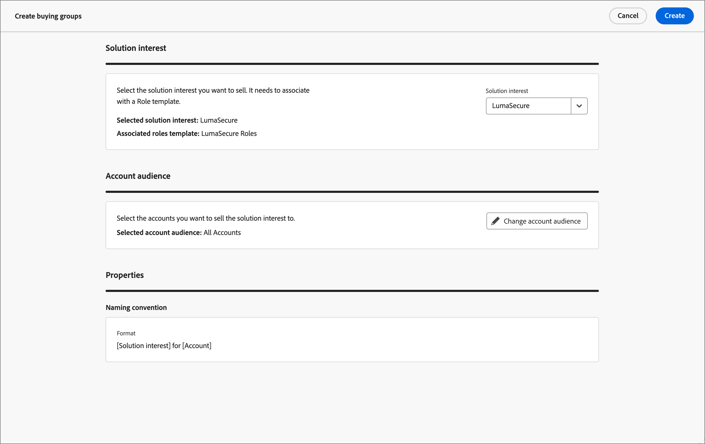

# Criar grupos de compra

Após a criação do grupo de compras, ele estará disponível para uso em uma jornada de conta por meio do [interesse de solução](./solution-interests.md).

1. Na navegação à esquerda, clique em **[!UICONTROL Grupos de compra]**.

1. Na página _[!UICONTROL Grupos de compras]_, clique em **[!UICONTROL Criar grupos de compras]** no canto superior direito da página.

   {width="700" zoomable="yes"}

1. Siga os prompts em cada página e clique em **[!UICONTROL Avançar]** para continuar.

{width="30"} [Assista ao vídeo explicativo](#how-to-video)

## Página de orientação

A primeira página fornece orientação sobre os pré-requisitos/componentes necessários para a criação de grupos de compras. Se você souber que possui os componentes necessários, clique em **[!UICONTROL Avançar]**.

## Componentes

1. Selecione cada componente que deseja usar:

   * **[!UICONTROL Interesse da solução]** - Selecione o interesse da solução na lista.

   * **[!UICONTROL Público-alvo da conta]** - Clique em # e selecione um público-alvo da conta na lista.

   Em _[!UICONTROL Propriedades]_, o nome dos grupos de compra é gerado automaticamente (somente leitura) como &lt; Nome de interesse da solução > para &lt; nome da conta >.

   {width="700" zoomable="yes"}

1. Após selecionar o interesse da solução e o público da conta, clique em **[!UICONTROL Criar]**.

## Confirmação

A caixa de diálogo de confirmação fornece um resumo do processo de grupos de compra e um tempo estimado para conclusão. Para confirmar e iniciar o processo, clique em **[!UICONTROL Criar]**.

{width="400" zoomable="yes"}

## Trabalhos de criação de grupo de compra

O trabalho de criação cria automaticamente grupos de compra para cada nova conta no público-alvo da conta. Você pode navegar até a guia _[!UICONTROL Interesse na solução]_, que exibe a contagem de trabalhos de criação criados para cada interesse na solução. Clique no número na coluna **[!UICONTROL Trabalhos de criação de grupo de compra]** para exibir a lista de trabalhos de criação.

{width="700" zoomable="yes"}

<!-- Other buying group activities:

Member of buying group.
Assign a member of the buying group.
Remove a member of the buying group. -->

## Vídeo tutorial

>[!VIDEO](https://video.tv.adobe.com/v/3433081/?learn=on)
