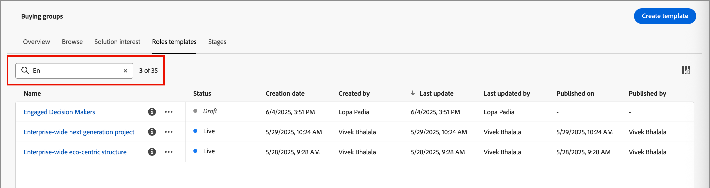

# Comprando modelos de função do grupo

Em um mercado B2B, as decisões de compra geralmente são tomadas por vários indivíduos. Essas pessoas participam do processo de tomada de decisões de acordo com sua função na organização. Crie modelos de função do Grupo de compras que contenham essas definições de função de acordo com cada tipo de oferta de produto ou caso de uso de conta.

## Acessar e procurar modelos de função

1. Na página inicial do Adobe Experience Platform, clique em Adobe Journey Optimizer B2B Edition.

1. Na navegação à esquerda, clique em **[!UICONTROL Grupos de compra]**.

1. Na página _[!UICONTROL Grupos de compras]_, selecione a guia **[!UICONTROL Modelos de Funções]**.

   {width="700" zoomable="yes"}

   A guia fornece uma lista de inventário de todos os modelos de funções existentes com as seguintes colunas:

   * [!UICONTROL Nome]
   * [!UICONTROL Status]
   * [!UICONTROL Data de criação]
   * [!UICONTROL Criado por]
   * [!UICONTROL Última atualização]
   * [!UICONTROL Última atualização por]
   * [!UICONTROL Publicado em]
   * [!UICONTROL Publicado por]

   Por padrão, a lista é classificada pela coluna _[!UICONTROL Última atualização]_.

   O número de modelos de funções _online_ (publicados) é exibido na parte superior direita da página. Todos os modelos de funções têm status de `Draft` ou `Live`.

1. Para filtrar a lista por nome, use o campo de pesquisa na parte superior da lista.

   Insira os primeiros caracteres do nome para reduzir a lista exibida aos itens correspondentes.

   {width="700" zoomable="yes"}

## Criar um modelo de funções

1. Na guia _[!UICONTROL Modelos de Funções]_, clique em **[!UICONTROL Criar modelo]** no canto superior direito.

1. Na caixa de diálogo, insira um **[!UICONTROL Nome]** (obrigatório) e uma **[!UICONTROL Descrição]** (opcional) exclusivos para o modelo.

   {width="400"}

1. Adicione uma regra para cada função que você deseja definir para o modelo.

   * Escolha a **[!UICONTROL Função do grupo de compra]** na lista.

     Na versão atual, há seis funções: `Decision Maker`, `Influencer`, `Practitioner`, `Executive Steering Committee`, `Champion` e `Other`.

     {width="700" zoomable="yes"}

   * Defina a **[!UICONTROL Ponderação]** da função, que é usada para calcular a pontuação de engajamento.

     O valor de cada opção é convertido em uma porcentagem para o cálculo de pontuação: [!UICONTROL Trivial] = 20, [!UICONTROL Menor] = 40, [!UICONTROL Normal] = 60, [!UICONTROL Importante] = 80 e [!UICONTROL Vital] = 100.

     Por exemplo, um modelo de função com funções que usam Vital, Importante e Normal é convertido como 100/240, 80/240, 60/240.

   * **[!UICONTROL Adicionar condições para atribuição automática]** - marque esta caixa de seleção para adicionar condições para atribuir automaticamente membros ao grupo de compras que correspondem à condição. Se a caixa de seleção não estiver marcada, a adição de condições NÃO será necessária.

   * **[!UICONTROL Obrigatório para pontuação de integridade]** - Marque esta caixa de seleção para a função se desejar que ela seja um requisito para o cálculo de uma pontuação de integridade.

   * Clique em **[!UICONTROL Adicionar Condição]**.

      * Na caixa de diálogo de condição, expanda a lista de **[!UICONTROL atributos de pessoa]** e localize um atributo que você deseja usar para corresponder à função. Arraste-o para a direita e solte-o no espaço de filtro.

        {width="700" zoomable="yes"}

      * Use o atributo para criar um filtro correspondente usando um ou mais valores.

        No exemplo a seguir, o atributo Cargo é usado para identificar uma correspondência do Tomador de decisão. Qualquer valor de título que comece com `Director` ou `Sr Director` é avaliado como verdadeiro para a condição.

        {width="700" zoomable="yes"}

      * Se necessário, adicione outro atributo e condição que refine ainda mais os critérios para uma correspondência à função.

      * Clique em **[!UICONTROL Concluído]**.

   Para cada função adicional que você deseja incluir no modelo, clique em **[!UICONTROL Adicionar outra função]** e defina uma ou mais condições para corresponder à função.

   {width="700" zoomable="yes"}

1. Se o modelo estiver pronto para uso, clique em **[!UICONTROL Publish]** no canto superior direito.

   A publicação do modelo o define como um status _Live_ e o disponibiliza para associação com um Interesse na Solução. Deve haver pelo menos uma função definida para publicar o modelo de funções.

   Suas alterações são salvas automaticamente no status _Rascunho_. Se você não estiver pronto para publicar o modelo de funções, clique na seta para a esquerda (voltar) na parte superior da página e retorne à lista Modelos de funções.

## Editar um modelo de funções de rascunho

Quando um modelo de funções está em um estado de _Rascunho_, você pode continuar a editar as funções definidas. Todas as alterações feitas são salvas automaticamente.

Altere qualquer uma das configurações no cabeçalho do cartão de função, incluindo a função do grupo de compra, ponderação, atribuição automática e requisito de pontuação de integridade.

{width="600"}

### Modificar os filtros de uma função

Para alterar a lógica de filtragem de qualquer uma das funções, clique no ícone _Editar_ (lápis) na parte superior direita do cartão de funções. Esta ação abre o espaço de trabalho _[!UICONTROL Condições]_, no qual você pode modificar um filtro existente, adicionar outro filtro, remover um filtro ou alterar a lógica do filtro.

### Excluir um cartão de função

Se quiser remover uma função do modelo, clique no ícone _Excluir_ (lixeira) no cartão de função.

### Definir a prioridade de funções

É possível reordenar as funções no modelo, o que determina a prioridade para atribuir leads a uma função. Há um controlador de **[!UICONTROL Prioridade]** exibido à direita de cada cartão de função. Clique na seta _Para cima_ ou _Para baixo_ à direita para mover a placa de função para cima ou para baixo em prioridade.

{width="700"}

## Excluir um modelo de funções

Você pode excluir um modelo de funções se ele estiver no status _Rascunho_.

1. Selecione o modelo de funções na lista para abri-lo.

1. Clique em **[!UICONTROL Excluir]** na parte superior direita.

   {width="700"}

1. Na caixa de diálogo, clique em **[!UICONTROL Excluir]** para confirmar.
