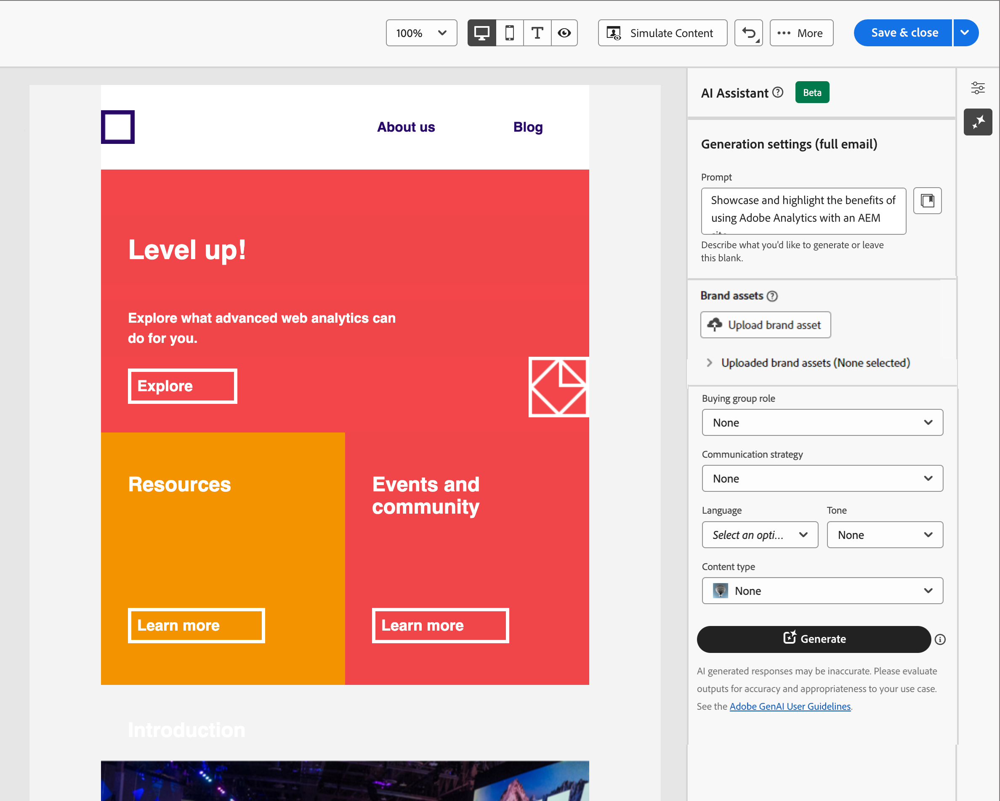

# Assistente de IA para criação de email

À medida que o setor de marketing se torna mais competitivo, as marcas buscam maneiras eficientes de gerar conteúdo impactante de forma rápida e eficiente. O Assistente de IA para criação de email no Adobe Journey Optimizer B2B Edition é um recurso de geração de conteúdo alimentado por IA de Adobe que revoluciona a forma como os profissionais de marketing criam conteúdo de email profissional e consistente com a marca. Com modelos avançados de GenAI e profunda compreensão das diretrizes da marca, o Assistente de IA gera automaticamente conteúdo personalizado, envolvente e eficaz com base no objetivo de marketing com conteúdo otimizado para estilos, layouts, tom e muito mais. O AI Assistant torna a criação e a execução de campanhas de marketing por email intuitivas, simples e sem complicações. Adicionar esse recurso aos workflows pode economizar tempo, melhorar a eficiência e gerar melhores resultados.

Esse novo recurso fornece uma geração de texto com base em prompts, geração de email completo e geração de conteúdo nas estruturas de email. As imagens não são geradas, mas são recomendadas no catálogo de imagens no ativo de marca de entrada para o modelo. Você também pode usar esse recurso para gerar linhas de assunto e pré-cabeçalhos ideais para afetar a taxa de abertura.

>[!NOTE]
>
>Esse recurso está disponível na versão para Beta e está sujeito a alterações sem aviso prévio.

## Diretrizes e limitações

Antes de começar a usar o Assistente de IA no Adobe Journey Optimizer B2B Edition para geração de conteúdo de email, revise estas diretrizes:

* O objetivo/prompt de marketing definido por você é um fator determinante da qualidade do conteúdo gerado. Use um prompt bem definido para que o modelo GenAI seja interpretado com precisão.
* Faça upload dos ativos da marca para ter informações precisas sobre o conteúdo da marca. Sem esses ativos, o conteúdo é baseado em informações disponíveis publicamente.
   * Os ativos carregados podem estar nos seguintes formatos: arquivos PDF, JPEG, PNG ou ZIP (contendo formatos de arquivo compatíveis).
   * O tamanho máximo para um ativo de marca carregado é de 50 MB. Arquivos maiores ou grandes quantidades de imagens podem funcionar, mas o tempo de processamento é aumentado.
* Use modelos de email criados no Adobe Journey Optimizer B2B Edition, de preferência os modelos integrados ou de amostra, um modelo específico da marca ou um modelo personalizado para criar seu conteúdo de email. São recomendados modelos de e-mail com até oito a dez imagens.
* Relate qualquer saída problemática usando os ícones de miniatura ou sinalizador contra uma variante gerada.
* Seu uso do AI Assistant está sujeito às [Diretrizes de usuário da IA de geração de Adobe](https://www.adobe.com/br/legal/licenses-terms/adobe-gen-ai-user-guidelines.html).

As seguintes limitações se aplicam ao Assistente de IA no Adobe Journey Optimizer B2B Edition para geração de conteúdo de email:

* O único idioma suportado é o inglês.
* Ele só está disponível para o canal de email.
* O conteúdo da GenAI pode não ser preciso — compartilhe seu feedback para que os engenheiros de Adobe possam refinar os modelos.
* Você pode fazer upload de vários ativos de marca, mas pode aproveitar apenas um para uma geração específica.

>[!BEGINSHADEBOX]

## Biblioteca de Prompts

Um prompt eficaz é essencial para gerar o melhor conteúdo possível. Se precisar de ajuda para criar seu prompt, acesse a _Biblioteca de Prompts_. Essa biblioteca fornece uma variedade diversa de ideias rápidas para melhorar a geração de conteúdo.

{width="500" zoomable="no"}

Selecione o prompt que melhor reflete suas metas pretendidas e adicione os valores necessários que especificam sua marca, oferta, campanha e casos de uso.

>[!ENDSHADEBOX]

## Comprando funções de grupo

O Adobe Journey Optimizer B2B Edition oferece cinco funções padrão de grupo de compra B2B prontas para uso. Cada função de grupo de compras tem um foco de mensagem distinto:

| Função | Foco da mensagem |
| ---- | --------------- |
| Comitê Diretor Executivo | Informações do produto  Preços  Detalhes da integração técnica  Recursos e funções do produto |
| Influenciador | Prova de qualidade  Facilidade de implementação  Experiência no assunto  Vantagens competitivas |
| Tomador de decisão | Retorno do investimento  Valor financeiro (ROI)  Histórias de clientes |
| Profissional | Facilidade de uso  Recursos e funcionalidade do produto  Compatibilidade do produto  Facilidade de integração do produto |
| Campeão | Conteúdo educacional  Conteúdo de liderança de pensamento  Histórias de clientes |

Escolher uma dessas funções de grupo de compras personaliza automaticamente a saída com base nas características e nos tópicos de interesse para cada uma dessas funções.

## Gerar propriedades de email com o Assistente de IA

Ao [adicionar uma ação de email](./email-authoring.md#add-an-email-action-in-an-account-journey) a uma jornada de conta, você define um conjunto de propriedades de email que são usadas para enviar o email. O Assistente de IA pode ajudar a melhorar o engajamento no email, gerando o conteúdo recomendado para o email **linha de assunto** e **pré-cabeçalho**.

1. Crie um email com base em uma jornada de conta ou abra um email existente com base em um nó do jornada.

   A página de visualização de email é exibida com as _[!UICONTROL Propriedades de email]_ à direita.

1. Selecione qualquer uma das guias a seguir para saber como usar o Assistente de IA na criação de propriedades de email.

>[!BEGINTABS]

>[!TAB Geração da linha de assunto]

As etapas a seguir descrevem a sequência de tarefas para usar o Assistente de IA a fim de gerar uma linha de assunto otimizada para seu email:

1. Nas _[!UICONTROL Propriedades de email]_, clique no ícone do Assistente de IA ( {width="30" zoomable="no"} ) à direita do campo **[!UICONTROL Linha de assunto]**.

   {width="600" zoomable="yes"}

   O pop-up do Assistente de IA é aberto com as configurações de geração para a linha de assunto do email.

   Dependendo do conteúdo de email associado ao email ou de como você deseja usar a linha de assunto para se adequar à sua finalidade, há algumas opções para gerar o texto da linha de assunto:

   * Você pode clicar imediatamente em **[!UICONTROL Gerar]** sem um prompt ou um ativo de marca para usar o corpo do email existente como o contexto para a geração da linha de assunto.

   * (Recomendado) Você pode fornecer um prompt, um ativo de marca e outros valores de configuração para fornecer contexto para gerar o texto de linha de assunto mais adequado às suas necessidades. (Etapas 2 a 7)

1. No campo **[!UICONTROL Prompt]**, insira uma descrição do que você deseja gerar.

   Use a [Biblioteca de Prompts](#prompt-library) se precisar de ajuda para criar um prompt eficaz.

1. Especifique um ativo de marca que contenha conteúdo para servir como fonte para a geração de texto.

   * Selecione o ativo no catálogo.

   * Clique em **[!UICONTROL Carregar ativo de marca]** para adicionar o arquivo de ativo de marca.

   {width="600" zoomable="yes"}

1. Role a tela, se necessário, e selecione a **[!UICONTROL Função do grupo de compra]** a ser usada como público-alvo para o texto gerado.

1. Se necessário, use as opções de mensagens para adaptar seu conteúdo:

   * **[!UICONTROL Estratégia de comunicação]** - Escolha o estilo de comunicação mais adequado para o texto gerado.
   * **[!UICONTROL Idioma]** - Selecione o idioma em que deseja que o conteúdo seja gerado.
   * **[!UICONTROL Tom]** - Escolha um tom que repercuta com seu público-alvo. Se você especificar que deseja soar informativo, divertido ou persuasivo, o Assistente de IA poderá adaptar a mensagem de acordo.

1. Se necessário, use o controle deslizante para definir o comprimento desejado do texto a ser gerado.

1. Altere a opção **[!UICONTROL Usar emojis]** (ativada ou desativada) de acordo com sua preferência.

1. Quando o prompt e as configurações estiverem prontos, clique em **[!UICONTROL Gerar]**.

1. Role o painel Assistente de IA e navegue pelas variações geradas para determinar qual é o melhor ajuste.

   * Clique em **[!UICONTROL Visualizar]** para exibir uma versão em tela inteira de uma variação selecionada.

   * Forneça feedback sobre as variantes geradas clicando no ícone _Polegar para Cima_, _Polegar para Baixo_ ou _Sinalizar_ e escolha o motivo que melhor resume seu feedback.

1. Navegue até as opções _Refinar_ na janela Visualizar para acessar recursos de personalização adicionais:

   * **[!UICONTROL Usar como conteúdo de referência]** - Selecione esta opção para usar a variante como conteúdo de referência para gerar outros resultados.

   * **[!UICONTROL Refrase]** - O Assistente de IA pode reformular sua mensagem de diferentes maneiras, mantendo sua escrita atualizada e engajando públicos diversos.

   * **[!UICONTROL Usar linguagem mais simples]** - Use o Assistente de IA para simplificar sua linguagem, garantindo clareza e acessibilidade para um público-alvo maior.

   {width="600" zoomable="yes"}

1. Clique em **[!UICONTROL Selecionar]** para substituir o texto da linha de assunto pela variante selecionada e retornar às propriedades de email.

>[!TAB Geração de pré-cabeçalho]

Um pré-cabeçalho de email é o texto curto de resumo que segue a linha de assunto quando um email é visualizado na caixa de entrada. É um elemento opcional de um email, mas uma ótima oportunidade para melhorar o engajamento. As etapas a seguir descrevem a sequência de tarefas para usar o Assistente do AI para gerar um pré-cabeçalho otimizado para seu email:

1. Nas Propriedades de email, marque a caixa de seleção **[!UICONTROL Pré-cabeçalho]** e clique no ícone do Assistente de IA ( {width="30" zoomable="no"} ) à direita.

   {width="600" zoomable="yes"}

   O pop-up do Assistente de IA é aberto com as configurações de geração do pré-cabeçalho de email.

   Dependendo do conteúdo de email associado ao email ou de como você deseja direcionar o email, há algumas opções para gerar o pré-cabeçalho:

   * Você pode clicar imediatamente em **[!UICONTROL Gerar]** sem um prompt ou um ativo de marca para usar o corpo do email existente como o contexto para geração de pré-cabeçalho.

   * (Recomendado) Você pode fornecer um prompt, um ativo de marca e outros valores de configuração para fornecer contexto para gerar o pré-cabeçalho mais ideal para suas necessidades. (Etapas 2 a 7)

1. No campo **[!UICONTROL Prompt]**, insira uma descrição do que você deseja gerar.

   Use a [Biblioteca de Prompts](#prompt-library) se precisar de ajuda para criar um prompt eficaz.

1. Especifique um ativo de marca que contenha conteúdo para servir como fonte para a geração de texto.

   * Selecione o ativo no catálogo.

   * Clique em **[!UICONTROL Carregar ativo de marca]** para adicionar o arquivo de ativo de marca.

   {width="600" zoomable="yes"}

1. Role a tela, se necessário, e selecione a **[!UICONTROL Função do grupo de compra]** a ser usada como público-alvo para o texto gerado.

1. Se necessário, use as opções de mensagens para adaptar seu conteúdo:

   * **[!UICONTROL Estratégia de comunicação]** - Escolha o estilo de comunicação mais adequado para o texto gerado.
   * **[!UICONTROL Idioma]** - Selecione o idioma em que deseja que o conteúdo seja gerado.
   * **[!UICONTROL Tom]** - Escolha um tom que repercuta com seu público-alvo. Se você especificar que deseja soar informativo, divertido ou persuasivo, o Assistente de IA poderá adaptar a mensagem de acordo.

1. Se necessário, use o controle deslizante para definir o comprimento desejado do texto a ser gerado.

1. Altere a opção **[!UICONTROL Usar emojis]** (ativada ou desativada) de acordo com sua preferência.

1. Quando o prompt e as configurações estiverem prontos, clique em **[!UICONTROL Gerar]**.

1. Role o painel Assistente de IA e navegue pelas variações geradas para determinar qual é o melhor ajuste.

   * Clique em **[!UICONTROL Visualizar]** para exibir uma versão em tela inteira de uma variação selecionada.

   * Forneça feedback sobre as variantes geradas clicando no ícone _Polegar para Cima_, _Polegar para Baixo_ ou _Sinalizar_ e escolha o motivo que melhor resume seu feedback.

1. Navegue até as opções _Refinar_ na janela Visualizar para acessar recursos de personalização adicionais:

   * **[!UICONTROL Usar como conteúdo de referência]** - Selecione esta opção para usar a variante como conteúdo de referência para gerar outros resultados.

   * **[!UICONTROL Refrase]** - O Assistente de IA pode reformular sua mensagem de diferentes maneiras, mantendo sua escrita atualizada e engajando públicos diversos.

   * **[!UICONTROL Usar linguagem mais simples]** - Use o Assistente de IA para simplificar sua linguagem, garantindo clareza e acessibilidade para um público-alvo maior.

   {width="600" zoomable="yes"}

1. Clique em **[!UICONTROL Selecionar]** para substituir o pré-cabeçalho pela variante selecionada e retornar às propriedades de email.

>[!ENDTABS]

## Gerar conteúdo do corpo do email com o Assistente de IA

Depois de [criar e personalizar seu email](./email-authoring.md#create-the-email-content), use o Assistente de IA no Adobe Journey Optimizer B2B Edition, viabilizado pela IA generativa, para elevar seu conteúdo de corpo de email ao próximo nível.

No designer de email, o Assistente de IA pode ajudar você a otimizar o impacto de suas entregas, gerando o corpo completo do email, o conteúdo de texto direcionado e as recomendações de imagens que refletem no seu público-alvo. Essa otimização de suas campanhas de email foi projetada para produzir um melhor engajamento.

1. Crie um email com base em uma jornada de conta e clique em **[!UICONTROL Abrir Designer de Email]** ou **[!UICONTROL Adicionar Conteúdo de Email]**.

1. Selecione e abra um modelo de email no designer de email visual.

1. Personalize o email conforme necessário para o nó do jornada.

1. Selecione qualquer uma das guias a seguir para saber como usar o Assistente de IA na criação de conteúdo do corpo do email.

>[!BEGINTABS]

>[!TAB Geração de email completa]

As etapas a seguir descrevem a sequência de tarefas para usar o Assistente de IA para refinar um modelo de email existente:

1. No designer de email, acesse o menu do Assistente do AI clicando no ícone ( {width="30" zoomable="no"} ) à direita.

   {width="600" zoomable="yes"}

   As configurações do Assistente de IA à direita refletem _configurações de geração (email completo)_.

1. No campo **[!UICONTROL Prompt]**, insira uma descrição do que você deseja gerar.

   Use a [Biblioteca de Prompts](#prompt-library) se precisar de ajuda para criar um prompt eficaz.

   {width="600" zoomable="yes"}

1. Especifique um ativo de marca que tenha conteúdo que possa fornecer contexto adicional para o Assistente de IA.

   * Selecione o ativo no catálogo.

   * Clique em **[!UICONTROL Carregar ativo de marca]** para adicionar o arquivo de ativo de marca.

   Esse ativo de entrada serve como origem para a geração de conteúdo e a recomendação de imagem no email.

1. Selecione a **[!UICONTROL Função do grupo de compra]** para usar como público-alvo para a comunicação por email.

1. Se necessário, use as opções de mensagens para adaptar seu conteúdo:

   * **[!UICONTROL Estratégia de comunicação]** - Escolha o estilo de comunicação mais adequado para o texto gerado.
   * **[!UICONTROL Idioma]** - Selecione o idioma em que deseja que o conteúdo seja gerado.
   * **[!UICONTROL Tom]** - Escolha um tom que repercuta com seu público-alvo. Se você especificar que deseja soar informativo, divertido ou persuasivo, o Assistente de IA poderá adaptar a mensagem de acordo.
   * **Tipo de conteúdo** - Escolha uma opção que reflita a natureza dos elementos visuais. Essa configuração distingue entre diferentes formas de representação visual, como fotos, gráficos ou arte.

1. Quando o prompt estiver pronto, clique em **[!UICONTROL Gerar]**.

1. Role o painel Assistente de IA e navegue pelas variações geradas para determinar qual é o melhor ajuste.

   * Clique em **[!UICONTROL Visualizar]** para exibir uma versão em tela inteira de uma variação selecionada.

   * Forneça feedback sobre as variantes geradas clicando no ícone _Polegar para Cima_, _Polegar para Baixo_ ou _Sinalizar_ e escolha o motivo que melhor resume seu feedback.

     {width="600" zoomable="yes"}

1. Clique em **[!UICONTROL Selecionar]** para substituir o conteúdo do modelo pela variante selecionada e retornar ao designer de email.

   No designer de email, você pode usar as ferramentas de edição e formatação da tela para alterar o conteúdo, bem como as opções _[!UICONTROL Configurações]_ e _[!UICONTROL Estilo]_ à direita.

>[!TAB Geração de texto]

As etapas a seguir descrevem a sequência de tarefas para usar o Assistente do AI para refinar ou aprimorar o conteúdo de texto de um email existente:

1. No designer de email, acesse o menu do Assistente do AI clicando no ícone ( {width="30" zoomable="no"} ) à direita.

   {width="600" zoomable="yes"}

1. Selecione um componente de _Texto_ para direcionar o conteúdo específico.

   As configurações do Assistente de IA à direita refletem _configurações de Geração (texto)_.

1. No campo **[!UICONTROL Prompt]**, insira uma descrição do que você deseja gerar.

   {width="600" zoomable="yes"}

   Use a [Biblioteca de Prompts](#prompt-library) se precisar de ajuda para criar um prompt eficaz.

1. Especifique um ativo de marca que contenha conteúdo para servir como fonte para a geração de texto.

   * Selecione o ativo no catálogo.

   * Clique em **[!UICONTROL Carregar ativo de marca]** para adicionar o arquivo de ativo de marca.

1. Selecione a **[!UICONTROL Função do grupo de compra]** para usar como público-alvo para o texto gerado.

1. Se necessário, use as opções de idioma e mensagens para adaptar o conteúdo:

   * **[!UICONTROL Estratégia de comunicação]** - Escolha o estilo de comunicação mais adequado para o texto gerado.
   * **[!UICONTROL Idioma]** - Selecione o idioma em que deseja que o conteúdo seja gerado.
   * **[!UICONTROL Tom]** - Escolha um tom que repercuta com seu público-alvo. Se você especificar que deseja soar informativo, divertido ou persuasivo, o Assistente de IA poderá adaptar a mensagem de acordo.

1. Se necessário, use o controle deslizante para definir o comprimento desejado do texto a ser gerado.

1. Quando o prompt estiver pronto, clique em **[!UICONTROL Gerar]**.

1. Navegue pelas _Variações_ geradas e clique em **[!UICONTROL Visualizar]** para exibir uma versão em tela inteira da variação selecionada.

1. Navegue até as opções _Refinar_ na janela Visualizar para acessar recursos de personalização adicionais:

   * **[!UICONTROL Usar como conteúdo de referência]** - Selecione esta opção para usar a variante como conteúdo de referência para gerar outros resultados.

   * **[!UICONTROL Elaborar]** - O Assistente de IA pode ajudá-lo a expandir tópicos específicos, fornecendo detalhes adicionais para melhor compreensão e engajamento.

   * **[!UICONTROL Resumir]** - Informações extensas podem sobrecarregar destinatários de email. Use o Assistente de IA para condensar os pontos principais em resumos claros e concisos que chamem a atenção e os incentivem a ler mais.

   * **[!UICONTROL Refrase]** - O Assistente de IA pode reformular sua mensagem de diferentes maneiras, mantendo sua escrita atualizada e engajando públicos diversos.

   * **[!UICONTROL Usar linguagem mais simples]** - Use o Assistente de IA para simplificar sua linguagem, garantindo clareza e acessibilidade para um público-alvo maior.

   {width="700" zoomable="yes"}

1. Quando tiver o conteúdo desejado, clique em **[!UICONTROL Selecionar]** para substituir o texto pela variante selecionada e retornar ao designer de email.

   No designer de email, você pode usar as ferramentas de edição e formatação da tela para alterar o texto, bem como as opções _[!UICONTROL Configurações]_ e _[!UICONTROL Estilo]_ à direita.

>[!TAB Recomendações de imagem]

Você pode usar o Assistente de IA para otimizar e melhorar seus ativos e garantir uma experiência mais amigável. As etapas a seguir descrevem a sequência de tarefas para usar o Assistente do AI para aprimorar o conteúdo de imagem do email:

1. Acesse o menu do Assistente de IA clicando no ícone ( {width="30" zoomable="no"} ) à direita.

   {width="600" zoomable="yes"}

1. Selecione um componente _Imagem_ para direcionar o conteúdo específico e acessar o menu do Assistente de IA.

   As configurações à direita refletem _[!UICONTROL configurações de Geração (imagem)]_.

1. Para ajustar o ativo, insira uma descrição do que você deseja no campo **[!UICONTROL Prompt]**.

   {width="600" zoomable="yes"}

   Use a [Biblioteca de Prompts](#prompt-library) se precisar de ajuda para criar um prompt eficaz.

1. Clique em **[!UICONTROL Carregar ativo de marca]** para adicionar qualquer ativo de marca com conteúdo que possa fornecer contexto adicional para o Assistente de IA.

   Se o ativo necessário já estiver disponível, expanda **[!UICONTROL Ativos de marca carregados]** e selecione o ativo.

   Seu prompt deve estar sempre vinculado a um ativo existente.

1. Use as configurações de imagem para refinar seu prompt:

   * **[!UICONTROL Taxa de proporção]** - Esta configuração determina a largura e a altura do ativo. Você tem a opção de escolher entre taxas comuns, como 16:9, 4:3, 3:2 ou 1:1, ou pode inserir um tamanho personalizado.
   * **[!UICONTROL Cor e tom]** - Essa configuração influencia a aparência geral das cores dentro de uma imagem e o humor ou atmosfera que ela transmite.
   * **[!UICONTROL Tipo de conteúdo]** - Essa configuração categoriza a natureza do elemento visual, distinguindo entre diferentes formas de representação visual, como fotos, elementos gráficos ou arte.
   * **[!UICONTROL Iluminação]** - Esta configuração ajusta os relâmpagos presentes em uma imagem, que moldam sua atmosfera e realçam elementos específicos.
   * **[!UICONTROL Composição]** - Esta configuração determina a disposição dos elementos dentro do quadro de uma imagem.

1. Quando estiver satisfeito com a configuração do prompt, clique em **[!UICONTROL Gerar]**.

   O Assistente de IA processa a solicitação e recomenda as imagens mais adequadas no ativo de marca de entrada e com base no prompt e em outras entradas.

   >[!IMPORTANT]
   >
   >Se não houver imagens no ativo de marca de entrada ou se não houver imagens relevantes para o prompt de entrada, a saída estará vazia.

1. Navegue pelas _[!UICONTROL Variações]_ e selecione aquela que melhor se adapta ao email.

   Para exibir uma versão em tela inteira da variação selecionada, clique em **[!UICONTROL Visualizar]**.

1. Realce a imagem desejada e clique em **[!UICONTROL Selecionar]** para substituir a imagem ou o espaço reservado pelo item selecionado e retornar ao designer de email.

   No designer de email, você pode usar as ferramentas de edição e formatação da tela para alterar o conteúdo, bem como as opções _[!UICONTROL Configurações]_ e _[!UICONTROL Estilo]_ à direita.

>[!ENDTABS]
