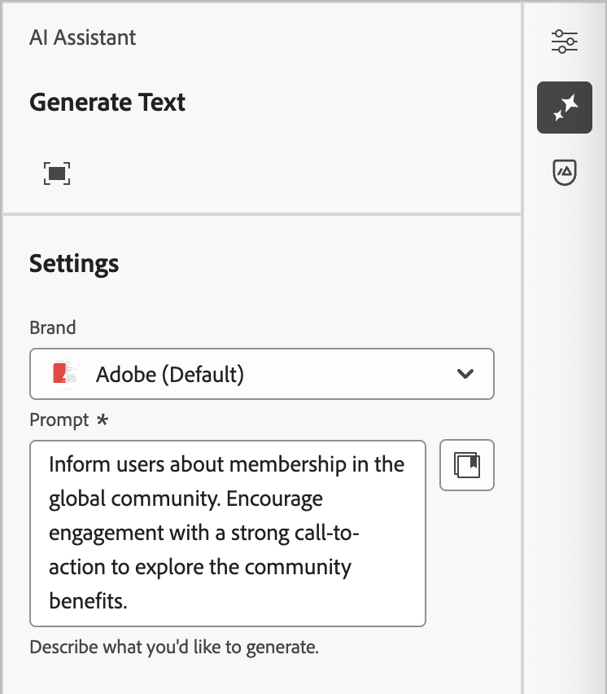
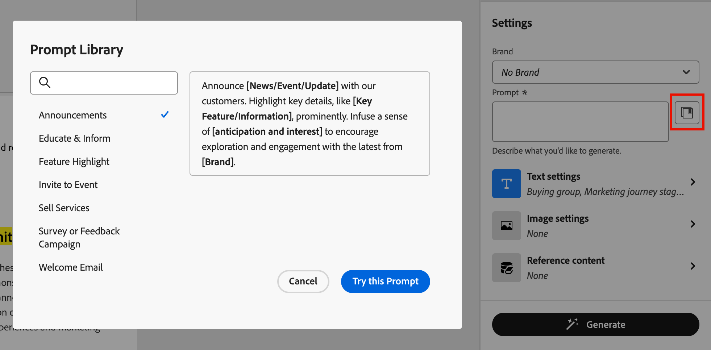
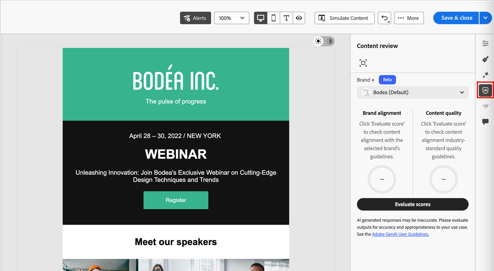

# Assistente de IA para conteúdo de página inicial {#generative-full-content}

O Assistente de IA para conteúdo de página de aterrissagem no [!DNL Adobe Journey Optimizer B2B Edition] usa os recursos de geração de conteúdo alimentados por IA da Adobe e revoluciona a forma como os profissionais de marketing criam conteúdo de página de aterrissagem profissional e consistente com a marca. Com modelos avançados de IA gerativa e profunda compreensão das diretrizes da marca, o Assistente de IA gera automaticamente conteúdo personalizado, envolvente e eficaz. Ele usa seu objetivo de marketing e otimiza o conteúdo para estilos, layouts, tons e muito mais. O Assistente de IA torna a criação e execução de campanhas e programas mais intuitivas, simples e simples. Adicionar esse recurso aos workflows pode economizar tempo, melhorar a eficiência e gerar melhores resultados.

Você pode gerar experiências completas de conteúdo para suas páginas de aterrissagem, incluindo texto e imagens. Essa funcionalidade robusta ajuda você a criar conteúdo atraente e sobre a marca que se conecta com seu público-alvo.

>[!NOTE]
>
>Esse recurso está disponível na versão para Beta e está sujeito a alterações sem aviso prévio.

>[!IMPORTANT]
>
>Para acessar esses recursos em [!DNL Journey Optimizer B2B Edition], você deve ter a permissão _[!UICONTROL Assistente de IA]_ > _[!UICONTROL Gerar conteúdo]_. Para obter mais informações sobre como um administrador de produto pode conceder permissões de recursos, consulte [Editar funções para permissões de produto](../admin/user-management.md#edit-roles-for-product-permissions).

## Diretrizes e limitações

Antes de começar a usar esse recurso, reveja as [diretrizes e limitações](../ai-assistant/generative-ai-content.md#general-guidelines-and-limitations). A aceitação do [Contrato de usuário](https://www.adobe.com/legal/licenses-terms/adobe-dx-gen-ai-user-guidelines.html){target="_blank"} também é necessária para que você possa usar os recursos de IA no [!DNL Journey Optimizer B2B Edition]. Para obter mais informações, entre em contato com o seu representante da Adobe.

Com o compromisso da Adobe de promover a transparência no uso de ferramentas de IA gerativa na criação de mídia, a Adobe aplica [credenciais de conteúdo](https://helpx.adobe.com/firefly/web/get-started/learn-the-basics/content-credentials-overview.html){target="_blank"} para qualquer conteúdo ou projeto que inclua um ativo gerado pela Firefly quando ele for baixado ou exportado.

As limitações e diretrizes a seguir se aplicam aos recursos do Assistente de IA usados para gerar conteúdo da página de aterrissagem no [!DNL Journey Optimizer B2B Edition]:

* O único idioma suportado é o inglês.
* O conteúdo gerado pode não ser preciso — compartilhe seu feedback para que os engenheiros da Adobe possam refinar os modelos.
* Você pode fazer upload de vários ativos de referência de conteúdo, mas pode aproveitar apenas um para uma geração específica.
* Use um modelo específico da marca ou personalizado para gerar conteúdo para uma página de aterrissagem completa. São recomendados modelos de landing page com até 8 a 10 imagens.
* Relate quaisquer saídas problemáticas usando a miniatura para cima, a miniatura para baixo ou os ícones de sinalizador ao selecionar variantes geradas.

## Entrada e configurações para geração de conteúdo

Você pode gerar conteúdo completo para uma página de aterrissagem ou para componentes selecionados na página. Ao usar as ferramentas do Assistente de IA para gerar o conteúdo necessário, você fornece a entrada, incluindo prompts e conteúdo de referência, e as configurações para texto e imagens.

### Prompts

Use prompts bem definidos para que o modelo de IA gerativa seja interpretado com precisão. O objetivo/prompt de marketing fornecido afeta a qualidade do conteúdo gerado.

{width="320"}

Para obter mais informações sobre como criar prompts efetivos, consulte _[Práticas recomendadas para prompts](../ai-assistant/generative-ai-content.md#generative-ai-prompting-guide)_.

>[!BEGINSHADEBOX]

**Biblioteca de Prompts**

Um prompt eficaz é essencial para gerar o melhor conteúdo possível. Se quiser ajuda para criar seu prompt, clique no ícone da _Biblioteca de Prompts_  para acessar uma biblioteca de ideias de prompt organizadas de acordo com os objetivos. Digite texto no campo de pesquisa para localizar um prompt com base em uma string de palavra-chave.

{width="600" zoomable="no"}

Selecione o prompt que melhor reflete suas metas e clique em **[!UICONTROL Tentar este Prompt]**. No campo _[!UICONTROL Prompt]_, substitua todos os espaços reservados (como `[Key Feature/Information]`) pelos valores necessários que especificam sua marca, oferta, campanha e casos de uso.

>[!ENDSHADEBOX]

### Configurações de texto

Expanda as **[!UICONTROL Configurações de texto]** no painel direito e defina as opções para o texto gerado.

* **[!UICONTROL Grupo de compras]** - Escolha a [função de grupo de compras](../buying-groups/buying-groups-role-templates.md) a ser usada para direcionar suas mensagens.
* **[!UICONTROL Estágio da jornada de marketing]** - Escolha o [estágio de grupo de compras](../buying-groups/buying-group-stages.md) para usar para direcionar as mensagens.
* **[!UICONTROL Estratégia de comunicação]** - Escolha o estilo de comunicação mais adequado para o texto gerado.
* **[!UICONTROL Idioma]** - Escolha o idioma do conteúdo gerado.
* **[!UICONTROL Tom]** - O tom deve repercutir junto ao seu público-alvo. Por exemplo, você pode ajustar a mensagem para soar informativa, divertida ou persuasiva.

{width="350" zoomable="yes"}

Clique na seta à esquerda para retornar às _[!UICONTROL Configurações]_ principais.

### Configurações da imagem

Para incluir imagens em seu conteúdo gerado, expanda as **[!UICONTROL Configurações de imagem]** no painel direito e defina as opções.

A opção **[!UICONTROL Gerar imagens usando IA]** está desabilitada por padrão. Habilite esse recurso e defina as seguintes opções para incluir imagens geradas nas variações de conteúdo propostas:

* **[!UICONTROL Modelo gerativo]**: selecione entre o modelo pronto para uso fornecido pela Adobe, o modelo de parceiro para recursos especializados ou modelos personalizados configurados e treinados nos ativos da sua marca. Para obter mais informações sobre modelos gerativos, consulte _[Modelos de IA gerativa para alinhamento de marca](generative-ai-models.md)_.
* **[!UICONTROL Taxa de proporção]**: quando um componente de imagem é selecionado, esta configuração determina a largura e a altura do ativo. Você tem a opção de escolher entre taxas comuns, como 16:9, 4:3, 3:2 ou 1:1, ou pode inserir um tamanho personalizado.
* **[!UICONTROL Tipo de conteúdo]**: o tipo categoriza a natureza do elemento visual, distinguindo entre diferentes formas de representação visual, como fotos, gráficos ou arte.
* **[!UICONTROL Intensidade visual]**: controle o impacto da imagem ajustando sua intensidade. Uma configuração mais baixa (como 2) cria uma aparência mais suave e restrita, enquanto uma configuração mais alta (como 10) torna a imagem mais vibrante e visualmente poderosa.
* **[!UICONTROL Cor e tom]**: a aparência geral das cores em uma imagem e o humor ou atmosfera que ela transmite.
* **[!UICONTROL Iluminação]**: o estilo de iluminação usado para a imagem, que molda sua atmosfera e realça elementos específicos.
* **[!UICONTROL Composição]**: a disposição dos elementos dentro do quadro de uma imagem.

{width="350" zoomable="yes"}

Clique na seta à esquerda para retornar às _[!UICONTROL Configurações]_ principais.

### Conteúdo de referência

Faça upload de ativos de conteúdo de referência para gerar conteúdo preciso sobre a marca. Caso contrário, o conteúdo gerado será baseado em informações publicamente disponíveis. O conteúdo de referência serve como fonte para a geração de conteúdo e recomendações de imagem. Para obter diretrizes e práticas recomendadas, consulte _[Conteúdo de referência otimizado](../ai-assistant/generative-ai-content.md#reference-content)_.

Nas configurações de **[!UICONTROL Conteúdo de referência]**, clique em **[!UICONTROL Carregar arquivo]** para adicionar qualquer ativo que contenha conteúdo que você deseja usar para contexto adicional.

{width="350" zoomable="yes"}

O arquivo a ser carregado pode estar nos seguintes formatos: PDF, JPEG, PNG ou ZIP (contendo formatos de arquivo compatíveis). O tamanho máximo para um ativo de marca carregado é de 50 MB. Arquivos maiores ou um grande número de imagens podem funcionar, mas isso aumenta o tempo de processamento.

Se quiser selecionar um arquivo carregado anteriormente, expanda a lista **[!UICONTROL Conteúdo de referência carregado]** e habilite o ativo que deseja usar para a geração de conteúdo.

{width="350" zoomable="yes"}

## Usar as ferramentas de IA gerativas {#gen-ai-tools}

Para começar a gerar seu conteúdo, abra o editor de conteúdo da página de aterrissagem e acesse as ferramentas de IA gerativas no painel externo do painel direito. Selecione o _Assistente de IA_ ( {width="25" zoomable="no"} ) para exibir as ferramentas de geração de conteúdo disponíveis para a seleção de conteúdo atual.

Use as seguintes etapas de acordo com o tipo de geração de conteúdo de página de aterrissagem que deseja usar:

>[!BEGINTABS]

>[!TAB Página inteira]

Siga estas etapas para usar o AI Assistant para a geração completa da landing page, refinando um template de landing page existente:

1. Depois de [criar a página de aterrissagem](./landing-pages.md#create-a-landing-page), clique em **[!UICONTROL Editar página de aterrissagem]**.

1. Selecione um modelo.

   A geração de conteúdo completo requer um modelo. Pode ser um modelo padrão fornecido pelo Adobe ou um modelo salvo. Você também pode usar a opção _[!UICONTROL Importar HTML]_ para importar um modelo.

   Para obter mais informações sobre como usar um modelo de página de aterrissagem, consulte _[Selecionar um modelo salvo ou de amostra](./landing-pages.md#select-a-saved-or-sample-template)_.

1. No painel externo do painel direito, selecione o ícone do _Assistente de IA_ ( {width="25" zoomable="no"} ).

   {width="600" zoomable="yes"}

   As configurações do Assistente de IA à direita refletem as configurações de geração da página de aterrissagem completa.

1. (Beta) Selecione sua **[!UICONTROL Marca]** para garantir que o conteúdo gerado pela IA esteja alinhado às especificações da sua marca.

   Se não houver marcas publicadas, clique em **[!UICONTROL Criar uma marca]** para definir suas [diretrizes de marca reutilizáveis](./brands-overview.md).

1. No campo **[!UICONTROL Prompt]**, insira uma descrição do que você deseja gerar.

   Use a [Biblioteca de Prompts](#prompt-library) se precisar de ajuda para criar um prompt eficaz.

   {width="600" zoomable="yes"}

   >[!TIP]
   >
   >Se você nunca solicitou o conteúdo gerado, reveja as _[Práticas recomendadas de solicitação](../ai-assistant/generative-ai-content.md#generative-ai-prompting-guide)_.

1. Complete as configurações de orientação de conteúdo para adaptar o conteúdo gerado:

   * [**[!UICONTROL Configurações de texto]**](#text-settings) - Fornece orientação para o conteúdo de texto gerado.
   * [**[!UICONTROL Configurações de imagem]**](#image-settings) - Se quiser incluir imagens no conteúdo gerado, habilite a geração de imagens e forneça orientações.
   * [**[!UICONTROL Conteúdo de referência]**](#reference-content) - Forneça o ativo de conteúdo que serve como fonte para a geração de conteúdo.

1. Quando o prompt e as configurações estiverem prontos, clique em **[!UICONTROL Gerar]**.

1. Role para baixo no painel Assistente de IA e navegue pelas variações geradas para determinar qual é o melhor ajuste.

   * Clique no ícone _Tela cheia_ (  ) para abrir a caixa de diálogo _[!UICONTROL Gerar página de aterrissagem]_

   * Se necessário, use as [ações de refinamento](#refine-a-variation) para ajustar a variação e garantir que elas atendam aos seus requisitos exatos.

   * [Envie seus comentários](#submit-variation-feedback) para as variantes geradas clicando no ícone de _Polegar para Cima_, _Polegar para Baixo_ ou _Sinalizar_ e escolha o motivo que melhor resume seus comentários.

1. Clique em **[!UICONTROL Selecionar]** para substituir o conteúdo do modelo pela variante selecionada e retornar ao espaço de design da página de destino.

   Você pode usar as ferramentas de edição e formatação na tela para alterar o conteúdo gerado, bem como as opções _[!UICONTROL Configurações]_ e _[!UICONTROL Estilo]_ à direita.

>[!TAB Somente texto]

Siga estas etapas para usar o AI Assistant para refinar ou aprimorar o conteúdo de texto de uma landing page existente:

1. No espaço de design da página de aterrissagem, selecione um componente _Texto_ para direcionar o conteúdo específico.

1. No painel externo do painel direito, selecione o ícone do _Assistente de IA_ ( {width="25" zoomable="no"} ).

   {width="600" zoomable="yes"}

   As configurações à direita refletem as configurações de geração de conteúdo para o componente de texto.

1. (Beta) Selecione sua **[!UICONTROL Marca]** para garantir que o conteúdo gerado pela IA esteja alinhado às especificações da sua marca.

   Se não houver marcas publicadas, clique em **[!UICONTROL Criar uma marca]** para [definir suas diretrizes de marca reutilizáveis](./brands-overview.md).

1. No campo **[!UICONTROL Prompt]**, insira uma descrição do que você deseja gerar.

   {width="600" zoomable="yes"}

   Use a [Biblioteca de Prompts](#prompt-library) se precisar de ajuda para criar um prompt eficaz.

1. Complete as configurações de orientação de conteúdo para adaptar o conteúdo gerado:

   * [**[!UICONTROL Configurações de texto]**](#text-settings) - Fornece orientação para o conteúdo de texto gerado.

   * [**[!UICONTROL Conteúdo de referência]**](#reference-content) - Forneça os ativos de conteúdo que servem como origem para a geração de conteúdo.

1. Quando o prompt e as configurações estiverem prontos, clique em **[!UICONTROL Gerar]**.

1. Role para baixo no painel Assistente de IA e navegue pelas variações geradas para determinar qual é o melhor ajuste.

   * Clique no ícone _Tela cheia_ (  ) para abrir a caixa de diálogo _[!UICONTROL Gerar texto]_

   * Se necessário, use as [ações de refinamento](#refine-a-variation) para ajustar a variação e garantir que elas atendam aos seus requisitos exatos.

   * [Envie seus comentários](#submit-variation-feedback) para as variantes geradas clicando no ícone de _Polegar para Cima_, _Polegar para Baixo_ ou _Sinalizar_ e escolha o motivo que melhor resume seus comentários.

1. Quando tiver o conteúdo desejado, clique em **[!UICONTROL Selecionar]** para substituir o texto pela variante selecionada e retornar ao espaço de design da página de aterrissagem.

   Você pode usar as ferramentas de edição e formatação da tela para alterar o texto, bem como as opções de _[!UICONTROL Configurações]_ e _[!UICONTROL Estilo]_ à direita.

>[!TAB Somente imagem]

Siga estas etapas para usar o Assistente de IA para refinar ou aprimorar o conteúdo de imagem de uma página de aterrissagem existente:

1. No espaço de design da página de aterrissagem, selecione um componente _Imagem_ para direcionar o conteúdo específico.

1. No painel externo do painel direito, selecione o ícone do _Assistente de IA_ ( {width="25" zoomable="no"} ).

   {width="600" zoomable="yes"}

   As configurações do Assistente de IA à direita refletem as configurações de geração do componente de imagem.

1. (Beta) Selecione sua **[!UICONTROL Marca]** para garantir que o conteúdo gerado pela IA esteja alinhado às especificações da sua marca.

   Se não houver marcas publicadas, clique em **[!UICONTROL Criar uma marca]** para [definir suas diretrizes de marca reutilizáveis](./brands-overview.md).

1. Insira uma descrição do que você deseja no campo **[!UICONTROL Prompt]**.

   {width="600" zoomable="yes"}

   Use a [Biblioteca de Prompts](#prompt-library) se precisar de ajuda para criar um prompt eficaz.

1. Complete as configurações de orientação de conteúdo para adaptar o conteúdo gerado:

   * [**[!UICONTROL Configurações de imagem]**](#image-settings) - Se quiser incluir imagens no conteúdo gerado, habilite a geração de imagens e forneça orientações.

   * [**[!UICONTROL Conteúdo de referência]**](#reference-content) - Forneça os ativos de conteúdo que servem como origem para a geração de conteúdo.

1. Quando estiver satisfeito com seu prompt e suas configurações, clique em **[!UICONTROL Gerar]**.

   O Assistente do AI processa a solicitação e gera imagens mais adequadas com base no prompt e em outras entradas.

   >[!IMPORTANT]
   >
   >Se não houver imagens no conteúdo de referência ou se não houver imagens relevantes para o prompt de entrada, a saída estará vazia.

1. Navegue pelas variações geradas ou clique no ícone _Tela cheia_ (  ) para abrir a caixa de diálogo _[!UICONTROL Gerar imagem]_.

   A caixa de diálogo fornece espaço adicional para comparar as variações, ajustar a imagem e as configurações de conteúdo de referência (se necessário) e gerar novamente as variações.

   Você pode selecionar uma variação e clicar em **[!UICONTROL Gerar semelhante]** para gerar imagens adicionais semelhantes à variante selecionada. Ou clique em **[!UICONTROL Editar no Adobe Express]** para fazer suas próprias alterações na imagem. Consulte [Ações rápidas no Adobe Express](./image-edit-adobe-express.md#quick-actions-in-adobe-express) para obter mais informações sobre como usar o Adobe Express para refinar suas imagens.

   {width="700" zoomable="yes"}

   Você também pode [enviar comentários](#submit-variation-feedback) sobre as variações geradas.

1. Realce a imagem desejada e clique em **[!UICONTROL Selecionar]** para substituir a imagem ou o espaço reservado pelo item selecionado e retornar ao espaço de design da página de aterrissagem.

   Você pode usar as ferramentas de edição e formatação da tela para alterar a imagem, bem como as opções de _[!UICONTROL Configurações]_ e _[!UICONTROL Estilo]_ à direita.

>[!ENDTABS]

## Pré-visualização e refinamento de conteúdo {#refine-finalize}

Depois de gerar variações de conteúdo, você pode ajustar os resultados para garantir que eles atendam aos seus requisitos exatos. Revise o alinhamento da marca, ajuste o tom e o idioma e prepare o conteúdo para um rascunho revisável. Você também pode enviar feedback para uma variação para ajudar a treinar o Assistente de IA e melhorar a saída futura.

### Abrir o modo de exibição de tela inteira

1. Após a geração inicial do conteúdo, navegue pelas **[!UICONTROL Variações]**.

1. Identifique a variação que é a melhor correspondência para suas metas e clique no ícone _Tela cheia_ (  ) para abrir a caixa de diálogo.

   {width="700" zoomable="yes"}

1. Quando estiver satisfeito com a variação selecionada, clique em **[!UICONTROL Selecionar]** para aplicá-la à tela.

### Refinar uma variação

Clique na opção **[!UICONTROL Refinar]** para acessar recursos de personalização adicionais para variações de página de aterrissagem e texto:

* **[!UICONTROL Elaborar]** - O Assistente de IA pode ajudá-lo a expandir tópicos específicos, fornecendo detalhes adicionais para melhor compreensão e engajamento.

* **[!UICONTROL Resumir]** - Informações extensas podem sobrecarregar os visualizadores da página. Use o Assistente de IA para condensar os pontos principais em resumos claros e concisos que chamem a atenção e os incentivem a ler mais.

* **[!UICONTROL Refrase]** - Reescreva a mensagem preservando seu significado. Essa opção ajuda a gerar texto alternativo, melhorar o fluxo ou ajustar o estilo sem alterar a mensagem principal.

* **[!UICONTROL Usar linguagem mais simples]** - Simplifique a linguagem, garantindo clareza e acessibilidade para um público-alvo maior.

* **[!UICONTROL Traduzir]** - Traduza o texto para outro idioma. (Atualmente, o único idioma suportado é o inglês.)

* **[!UICONTROL Alterar tom]** - Ajuste o tom da mensagem para alinhá-la ao seu estilo de comunicação, tornando-a mais amigável, profissional, urgente ou inspiradora.

* **[!UICONTROL Alterar estratégia de comunicação]** - Modifique a abordagem de mensagens com base em seus objetivos, como criar urgência ou enfatizar um apelo interessante.

<!-- * **[!UICONTROL Use as reference content]** - Select this option to use the variant as the reference content for generating other results. -->

{width="700" zoomable="yes"}

### Enviar feedback sobre variações

Forneça feedback sobre as variantes geradas clicando no ícone _Polegar para Cima_, _Polegar para Baixo_ ou _Sinalizar_ e escolha o motivo que melhor resume seu feedback.

{width="700" zoomable="yes"}

### Verifique o alinhamento da marca (Beta)

<!-- Are we surfacing scoring here in the future, or will it be a separate post-creation task? 1. Click the percentage icon to view your **[!UICONTROL Brand Alignment Score]** and identify any misalignments with your brand. -->

A avaliação e a pontuação do alinhamento da marca ajudam a garantir a consistência no tom, nas mensagens e na identidade visual em todas as campanhas, além de servir como uma verificação de qualidade antes do conteúdo ser publicado. Quando o conteúdo da página de aterrissagem for concluído, clique no ícone de _Alinhamento da marca_ (  ) à direita para abrir o painel direito _Alinhamento da marca_ no espaço de design da página de aterrissagem.

{width="600" zoomable="yes"}

Para obter informações detalhadas, consulte [Validar o alinhamento da sua marca](./brand-alignment.md#validate-your-brand-alignment)
