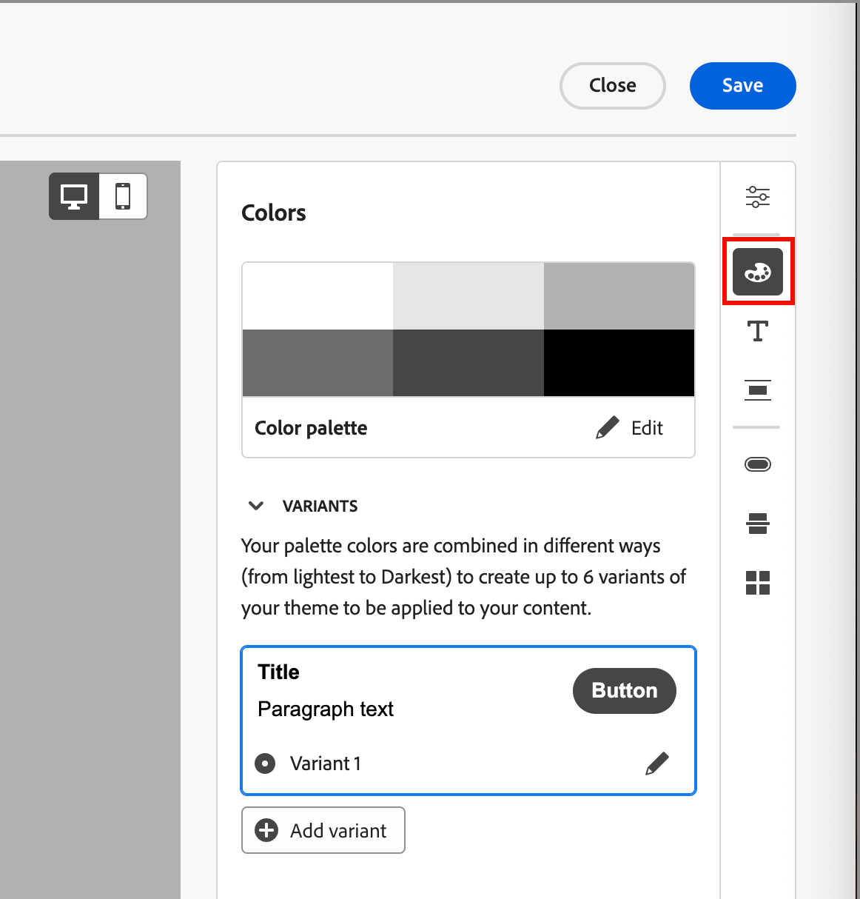
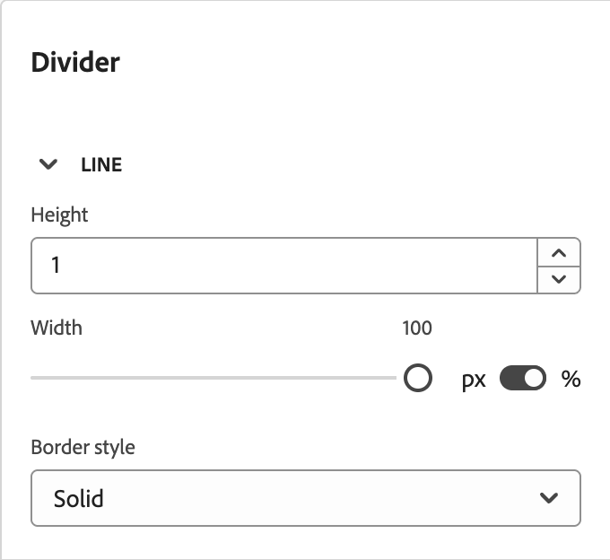

# Usar temas de marca para o conteúdo do email {#email-brand-themes}

>[!CONTEXTUALHELP]
>id="ajo-b2b_email_brand_theme"
>title="Aplicar um tema da marca ao email ou modelo de email"
>abstract="Selecione um tema para o e-mail ou o modelo de e-mail para aplicar um estilo específico que se ajuste à marca e ao design."

Com temas, os designers não técnicos têm a capacidade de criar diretrizes reutilizáveis de design de conteúdo de email que se alinham a uma marca e um estilo específicos. Os temas permitem que os profissionais de marketing aproveitem emails visualmente atraentes e consistentes com a marca de forma mais rápida e com menos esforço, além de fornecer opções avançadas de personalização para necessidades de design exclusivas.

## Diretrizes e limitações de tema {#themes-guidelines}

Ao trabalhar com temas, lembre-se das seguintes diretrizes e limitações:

* Ao criar um modelo de email ou de email a partir de uma tela em branco (_criar do zero_), você pode escolher o _Modo de tema_ para começar a criar seu conteúdo usando um tema para aplicar um estilo específico que se ajuste à sua marca e ao seu design. Se você escolher o _Modo manual_, não poderá aplicar um tema, a menos que redefina o design do modelo de email ou de email.

* [Fragmentos](./fragments.md) não são compatíveis entre o _Modo de tema_ e o _Modo manual_ no conteúdo do email. Para usar um fragmento no conteúdo de email no qual um tema é aplicado, ele também deve ser criado no _Modo de tema_.

* As alterações em um tema personalizado não são aplicadas automaticamente em cascata a todos os emails ou modelos de email que já o utilizam. Edite o conteúdo de cada para atualizar o tema.

* Se você excluir um tema, ele não afetará nenhum email ou template de email no qual já foi aplicado.
<!-- 
* If using a content created in HTML, you will be in [compatibility mode](existing-content.md) and you cannot apply themes to this content.
-->

## Criar um tema de marca {#create-theme}

Defina o tema da sua própria marca que poderá ser aplicado ao conteúdo do seu email e do seu modelo de email no conteúdo de email futuro.

1. Acesse as ferramentas de tema usando um dos seguintes métodos:

   * [Crie um novo modelo de email](./email-templates.md#create-an-email-template) e clique em **[!UICONTROL Editar modelo de email]** para iniciar a página _[!UICONTROL Criar seu modelo]_.

   * Clique em **[!UICONTROL ... Mais]** na parte superior direita do espaço de design de conteúdo de email e escolha **[!UICONTROL Alterar seu design]**.

     {width="700" zoomable="yes"}

     Na caixa de diálogo de confirmação, clique em **[!UICONTROL Alterar modelo]** para abrir a página de design.

1. Na página de design, escolha **[!UICONTROL Criar ou editar temas]**.

   {width="800" zoomable="yes"}

1. Selecione o tema padrão ou use qualquer um dos temas do Adobe para usar como ponto de partida.

   >[!NOTE]
   >
   >Se quiser usar um de seus temas personalizados (_[!UICONTROL Meus temas]_) como ponto de partida, você poderá [duplicá-lo](#delete-or-duplicate-a-theme) e alterar o nome do tema ao [editar o tema](#edit-a-theme).

1. Clique em **[!UICONTROL Criar]**.

   {width="750" zoomable="yes"}

   A página _[!UICONTROL Criar um tema]_ fornece uma tela com os elementos existentes de todos os tipos de texto, botões e contêineres do tema inicial.

1. Use a navegação correta para acessar as diferentes guias de estilo de tema e alterar as configurações do tema:

   * [Configurações gerais](#general-settings)
   * [Cores](#colors)
   * [Configurações de texto](#text-settings)
   * [Espaçamento e borda](#spacing-and-border)
   * [Botão](#button)
   * [Divisor](#divider)
   * [Grade](#grid)

   Os elementos visuais são alterados na tela de desenho à medida que você define as novas configurações de tema. Se o resultado não for o que você deseja, clique no ícone _Desfazer_ ( {width="16"} ) na parte inferior do painel direito. Clique no ícone _Refazer_ ( {width="16"} ) para reaplicar a alteração.

1. Quando a definição do tema estiver concluída, clique em **[!UICONTROL Salvar]**.

1. Clique em **[!UICONTROL Fechar]** para retornar à página _[!UICONTROL Criar um tema]_ e em **[!UICONTROL Cancelar]** para retornar à página de design.

   Você pode então escolher **[!UICONTROL Criar do zero]** para abrir o espaço de design visual e [usar o tema](#use-your-theme-for-email-content-authoring) para o email ou modelo.

### Configurações gerais

Na guia **[!UICONTROL Configurações gerais]**, defina os parâmetros básicos para o seu tema:

* Insira um **[!UICONTROL Nome do tema]** exclusivo.

* Ajuste a **[!UICONTROL Largura da janela de visualização]** para o conteúdo (corpo) do email. Use as setas para cima e para baixo para aumentar ou diminuir a largura ou insira o valor (em pixels).

{width="450"}
<!--  and also export the current theme to [share it across sandboxes](../configuration/copy-objects-to-sandbox.md).-->

### Cores

Selecione a guia **[!UICONTROL Cores]** e use as configurações para definir a paleta de cores do tema.

{width="450"}

* Clique em **[!UICONTROL Editar]** para exibir a paleta de cores que inclui as cores do tema.

  Escolha uma **[!UICONTROL Predefinição]** para usar um esquema de cores para o tema ou ajuste cada cor no conjunto. Você também pode usar uma combinação de ambos.

  {width="350"}

  Para o quadrado colorido selecionado na parte superior, é possível definir a cor inserindo um valor RGB, HSL, HSB ou hexadecimal conhecido. Ou você pode usar o controle deslizante de cores e o campo de cores para selecionar a cor.

  Clique na seta _Voltar_ para fechar as ferramentas da paleta de cores.

* Clique em **[!UICONTROL Adicionar variante]** para criar várias variantes de cores, como o modo _light_ e _dark_, em que cada variante tem sua própria paleta de cores e controles de nuance. Você pode ter até seis variantes.

  Para cada variante, clique no ícone _Editar_ (  ). É possível usar a paleta padrão ou qualquer cor personalizada.

  {width="450"}

  Para cada cor que você deseja alterar para a variante, mova o botão para a esquerda ou direita para desativá-la ou ativá-la. Para uma configuração de cor ativada, clique no quadrado de cor para escolher a cor.

  {width="450"}

  +++Configurações de cor variante

  As configurações são agrupadas por tipo:

  | Tipo | Configurações | Descrição |
  | ---- | -------- | ----------- |
  | [!UICONTROL Geral] | {width="300"} | Essas configurações permitem definir cores para corpo, estruturas, contêineres, planos de fundo, links, grades e bordas. |
  | [!UICONTROL Títulos] | {width="300"} | Essas configurações se aplicam aos elementos `Heading`, onde é possível definir cores de texto e de borda para cada um dos seis níveis de cabeçalho. Expanda cada nível de cabeçalho que você deseja definir para a variante. |
  | [!UICONTROL Parágrafos] | {width="300"} | Essas configurações se aplicam aos elementos `Paragraph`, onde é possível definir cores de texto e de borda para cada um dos três tipos de parágrafo. Expanda cada tipo de parágrafo que você deseja definir para a variante. |
  | [!UICONTROL Botões] | {width="300"} | As configurações se aplicam aos elementos de botão, onde é possível definir a cor de preenchimento, a cor da borda e a cor do texto para cada uma das três predefinições de botão: _Primário_, _Secundário_ e _Terciário_. |

  +++

### Configurações de texto

Na guia **[!UICONTROL Configurações de texto]**, é possível definir os tipos de fontes, estilos e tamanhos globais que deseja usar para o tema. Para obter um controle mais granular, também é possível editar esses parâmetros para tipos de cabeçalho e parágrafo.

{width="450"}

+++Configurações de texto por tipo

| Tipo | Configurações | Descrição |
| ---- | -------- | ----------- |
| [!UICONTROL Global] | {width="300"} | Defina a **[!UICONTROL Biblioteca de fontes]** como _[!UICONTROL Padrão]_ ou _[!UICONTROL Fontes do Google]_. Em seguida, escolha a família de fontes que deseja usar. Essas configurações de texto global são aplicadas em todo o, a menos que você defina estilos de texto diferentes para os níveis de cabeçalho e tipos de parágrafo. |
| [!UICONTROL Títulos] | {width="300"} | Para o nível de cabeçalho que você deseja definir, selecione **[!UICONTROL H1]**, **[!UICONTROL H2]** e assim por diante. Defina a **[!UICONTROL Biblioteca de fontes]** como _[!UICONTROL Padrão]_ ou _[!UICONTROL Fontes do Google]_. Em seguida, escolha a família, o tamanho e o estilo da fonte. Escolha o **[!UICONTROL Alinhamento do texto]**: _Esquerda_, _Centralizada_, _Direita_ ou _Justificada_. |
| [!UICONTROL Parágrafos] | {width="300"} | Para o nível de cabeçalho que você deseja definir, selecione **[!UICONTROL P1]**, **[!UICONTROL HP]** e assim por diante. Defina a **[!UICONTROL Biblioteca de fontes]** como _[!UICONTROL Padrão]_ ou _[!UICONTROL Fontes do Google]_. Em seguida, escolha a família, o tamanho e o estilo da fonte. Ajuste a **[!UICONTROL Altura da linha]** conforme necessário. Escolha o **[!UICONTROL Alinhamento do texto]**: _Esquerda_, _Centralizada_, _Direita_ ou _Justificada_. |

+++

### Espaçamento e borda

Na guia **[!UICONTROL Espaçamento]**, é possível definir o preenchimento e a margem para os diferentes tipos de elementos. Para **[!UICONTROL Selecionar tipo]**, escolha o tipo de conteúdo. Em seguida, defina o preenchimento, as margens, os cantos e as bordas aplicáveis a esse tipo de elemento.

{width="450"}

+++Configurações de espaçamento

| Tipo | Configurações | Descrição |
| ---- | -------- | ----------- |
| [!UICONTROL Margens] | {width="300"} | Escolha o ícone _Margem_ para exibir configurações que replicam o parâmetro CSS `margin`, que controla o espaço fora da borda de um componente e o separa de outros componentes/elementos. Ele cria uma lacuna ao redor do componente para influenciar seu posicionamento e o layout do conteúdo ao redor. Defina os valores de margem em pixels de acordo com suas necessidades de design. É possível definir a margem de todos os lados, de cima para baixo, da esquerda para a direita ou de cada lado do componente separadamente. Clique nos ícones _Bloquear_ e _Desbloquear_ para sincronizar ou dessincronizar os valores das margens superior, inferior e esquerda, direita. |
| [!UICONTROL Preenchimentos] | {width="300"} | Escolha o ícone _Preenchimento_ para exibir configurações que replicam o parâmetro CSS `padding`, que é o espaço entre o conteúdo de um componente/elemento e sua borda. O preenchimento fornece espaçamento interno que pode ser usado para controlar a distância entre o conteúdo e a borda do componente. Defina os valores de preenchimento em pixels de acordo com suas necessidades de design. É possível definir o preenchimento de todos os lados, do botão superior, da esquerda para a direita ou de cada lado do componente separadamente. Clique nos ícones _Bloquear_ e _Desbloquear_ para sincronizar ou dessincronizar os valores de preenchimento superior-inferior e esquerdo-direito. |
| [!UICONTROL Cantos] | {width="300"} | Escolha o ícone _Cantos_ para exibir configurações que replicam o parâmetro CSS `border-radius`, que define o raio dos cantos do componente/elemento. Defina o valor numérico de acordo com a curva desejada para os cantos. Um valor de 0 (padrão) produz um canto quadrado. |

+++

+++Configurações da borda

Mova o botão **[!UICONTROL Borda]** para a direita para habilitar as opções de exibição de borda e defina-as de acordo com seus critérios de design:

* Para definir o **[!UICONTROL Tamanho da borda]** (largura da linha), clique nos ícones de seta para cima e para baixo para aumentar ou diminuir o número de pixels.

* Para definir o **[!UICONTROL Estilo da borda]**, escolha um valor na lista de valores CSS `border-style` padrão, como _Sólido_, _Pontilhado_ e _Tracejado_.

* Para determinar onde a borda é exibida, marque cada caixa de seleção **[!UICONTROL Posição da borda]**.

{width="250"}

+++

### Botões

Na guia **[!UICONTROL Botões]**, é possível definir atributos diferentes (diferentes da cor) para elementos de botão, como raio de borda (forma), texto e tamanho. É possível alterar as configurações de cada uma das três predefinições de botão: _[!UICONTROL Primário]_, _[!UICONTROL Secundário]_ e _[!UICONTROL Terciário]_.

{width="450"}

+++Configurações do botão

| Tipo | Configurações | Descrição |
| ---- | -------- | ----------- |
| [!UICONTROL Texto] | {width="300"} | Defina a **[!UICONTROL Biblioteca de fontes]** como _[!UICONTROL Padrão]_ ou _[!UICONTROL Fontes do Google]_. Em seguida, escolha a família, o tamanho e o estilo da fonte. Escolha o **[!UICONTROL Alinhamento do texto]**: _Esquerda_, _Centralizada_, _Direita_ ou _Justificada_. |
| [!UICONTROL Borda] | {width="300"} | Mova o botão **[!UICONTROL Borda]** para a direita para habilitar as opções de exibição da borda do botão e defina-as de acordo com seus critérios de design. Defina o **[!UICONTROL Tamanho da borda]** (largura da linha) aumentando ou diminuindo o número de pixels. Defina o **[!UICONTROL Estilo da borda]** escolhendo um valor na lista de valores CSS `border-style` padrão, como _Sólido_, _Pontilhado_ e _Tracejado_. |
| [!UICONTROL Tamanho] | {width="300"} | Na opção **[!UICONTROL Altura]**, clique nos ícones de seta para cima e para baixo para aumentar ou diminuir o número de pixels. Um valor vazio (Automático) é o padrão e dimensiona a altura do botão de acordo com seu conteúdo. Para a **[!UICONTROL Largura]**, use o botão de alternância para definir a largura por pixels ou porcentagem. Para uma largura de porcentagem, use o controle deslizante para definir o valor percentual. A porcentagem determina o tamanho do botão com base na caixa de conteúdo do bloco, o que exclui o preenchimento e as bordas. Por exemplo, um valor de 50 define a largura do botão como 50% da largura do conteúdo do bloco. Para uma largura baseada em pixels, clique nos ícones de seta para cima e para baixo para aumentar ou diminuir o número de pixels. Um valor vazio (_Auto_) é o padrão e dimensiona a largura do botão de acordo com seu conteúdo. |

+++

### Divisor

Na guia **[!UICONTROL Divider]**, é possível definir o estilo da linha e as configurações do contêiner de um componente divisor.

{width="450"}

+++Configurações do divisor

| Tipo | Configurações | Descrição |
| ---- | -------- | ----------- |
| [!UICONTROL Linha] | {width="300"} | Defina o **[!UICONTROL Estilo da borda]** escolhendo um valor na lista de valores CSS `border-style` padrão, como _Sólido_, _Pontilhado_ e _Tracejado_. |
| [!UICONTROL Tamanho do contêiner] | {width="300"} | Para a opção **[!UICONTROL Altura]**, clique nos ícones de seta para cima e para baixo para aumentar ou diminuir o número de pixels do componente/elemento. Um valor vazio (Automático) é o padrão e dimensiona a altura de acordo com seu conteúdo (estilo de linha). Para a **[!UICONTROL Largura]**, use o botão de alternância para definir a largura por pixels ou porcentagem. Para uma largura de porcentagem, use o controle deslizante para definir o valor percentual. A porcentagem determina a largura do elemento com base na caixa de conteúdo do bloco. Por exemplo, um valor de 50 define a largura do divisor como 50% da largura do conteúdo do bloco. Para uma largura baseada em pixels, clique nos ícones de seta para cima e para baixo para aumentar ou diminuir o número de pixels. Um valor vazio (_Auto_) é o padrão e dimensiona a largura do divisor de acordo com seu conteúdo. |
| [!UICONTROL Alinhamento] | {width="300"} | Escolha o alinhamento horizontal dentro do bloco contêiner: _Esquerda_, _Centralizada_ ou _Direita_. |

+++

### Grade

Na guia **[!UICONTROL Grade]**, é possível controlar lacunas de coluna e linha para um elemento de grade:

* **[!UICONTROL Lacuna da coluna]** - Clique nos ícones de seta para cima e para baixo para aumentar ou diminuir o número de pixels da lacuna entre as colunas da grade. Ou você pode inserir um número no campo.

* **[!UICONTROL Lacuna de linhas]** - Clique nos ícones de seta para cima e para baixo para aumentar ou diminuir o número de pixels da lacuna entre as linhas de grade. Ou você pode inserir um número no campo.

{width="700" zoomable="yes"}

## Editar um tema

É possível editar um tema usando o mesmo fluxo de trabalho e as mesmas ferramentas usadas ao criar um tema. A diferença é que você seleciona a guia **[!UICONTROL Meus temas]** e seleciona o tema personalizado que deseja alterar.

{width="750" zoomable="yes"}

Use o painel à direita para navegar pelas diferentes guias e alterar as configurações do tema:

* [Configurações gerais](#general-settings)
* [Cores](#colors)
* [Configurações de texto](#text-settings)
* [Espaçamento e borda](#spacing-and-border)
* [Botão](#button)
* [Divisor](#divider)
* [Grade](#grid)

{width="800" zoomable="yes"}

Os elementos visuais exibidos mudam à medida que você altera as configurações. Se o resultado na tela não for o que você deseja, clique no ícone _Desfazer_ ( {width="16"} ) na parte inferior do painel direito. Clique no ícone _Refazer_ ( {width="16"} ) para reaplicar a alteração.

Quando as alterações do tema forem concluídas, clique em **[!UICONTROL Salvar]**.

>[!NOTE]
>
>As alterações salvas não se aplicam automaticamente a todos os emails ou modelos de email que estão usando o tema no momento. Edite o conteúdo de cada para atualizar o tema e corresponder aos estilos atualizados.

## Gerenciar temas personalizados

É possível gerenciar os temas personalizados usando o mesmo fluxo de trabalho e as ferramentas usadas ao criar um tema. A diferença é que você seleciona a guia **[!UICONTROL Meus temas]** e gerencia seus temas na lista exibida.

Se você tiver uma grande lista de temas personalizados, use o campo _Pesquisar_ e outros filtros para reduzir a lista exibida. Ao gerenciar a lista de temas disponíveis, você pode editar, excluir ou duplicar um tema personalizado a qualquer momento.

{width="750" zoomable="yes"}

### Editar um tema

1. Selecione o tema que você deseja alterar e clique em **[!UICONTROL Editar]** na parte superior direita.

   {width="750" zoomable="yes"}

1. Use a navegação à direita para usar as diferentes guias de estilo e alterar as configurações do tema:

   * [Configurações gerais](#general-settings)
   * [Cores](#colors)
   * [Configurações de texto](#text-settings)
   * [Espaçamento e borda](#spacing-and-border)
   * [Botão](#button)
   * [Divisor](#divider)
   * [Grade](#grid)

   {width="800" zoomable="yes"}

   Os elementos visuais exibidos mudam à medida que você altera as configurações. Se o resultado na tela não for o que você deseja, clique no ícone _Desfazer_, na parte inferior do painel direito. Clique no ícone _Refazer_ para reaplicar a alteração.

1. Quando as alterações do tema forem concluídas, clique em **[!UICONTROL Salvar]**.

>[!NOTE]
>
>As alterações de tema salvas não se aplicam automaticamente a todos os emails ou modelos de email que estão usando o tema no momento. Edite o conteúdo de cada para atualizar o tema e corresponder aos estilos atualizados.

### Excluir ou duplicar um tema

Ao localizar o tema, clique no ícone do menu _Mais_ (**...**) no canto inferior direito do cartão de tema e escolha a ação que deseja realizar:

{width="220"}

* **[!UICONTROL Duplicar]** - Escolha esta ação para duplicar o tema. O novo tema é idêntico a _Cópia de_ anexada ao nome do original. Você pode alterar o nome ao [editar o tema](#edit-a-theme).

* **[!UICONTROL Excluir]** - Escolha esta ação para remover o tema personalizado. Na caixa de diálogo de confirmação, clique em **[!UICONTROL Excluir]**.

  >[!NOTE]
  >
  >A exclusão do tema não afeta nenhum email ou template de email no qual ele já foi aplicado.

## Usar um tema para criação de conteúdo de email {#use-email-theme}

Ao criar um novo modelo de email ou de email, você pode optar por usar um tema de marca que simplifica o processo de criação de conteúdo e garante que o design se alinhe aos padrões definidos. Para um novo fragmento, também é possível aplicar um tema antes de salvar o fragmento. O fragmento permanece no _modo de Tema_ a partir desse ponto e é compatível para adicionar a emails e modelos de email que também estão no _modo de Tema_.

1. Selecione uma das seguintes ações:

   * Selecione um modelo de email que incorpore um tema (criado no _Modo de tema_). O tema específico para cada modelo é aplicado automaticamente.

   * Use a opção _[!UICONTROL Design do zero]_ e selecione **[!UICONTROL Usar Temas]** para começar com um tema de estilo predefinido.

     {width="450"}

     >[!IMPORTANT]
     >
     >Se você escolher o modo _[!UICONTROL Estilo Manual]_, deverá redefinir o design do email para aplicar um tema.
     >
     >Se você escolher o modo _[!UICONTROL Temas]_, somente os [fragmentos](./fragments.md) criados também no modo _Temas_ estarão disponíveis para serem adicionados ao conteúdo do email.

1. No espaço de design de email, clique no ícone _Temas_ (  ) à direita.

   {width="600" zoomable="yes"}

   O tema padrão ou o tema aplicado ao modelo é exibido. Você pode alternar entre as variantes de cor deste tema.

1. Clique na seta ao lado do tema exibido para exibir a lista de temas personalizados e do Adobe disponíveis.

1. Clique em **[!UICONTROL Meus temas]** e selecione seu tema personalizado.

   {width="325"}

1. Clique fora da lista.

   O tema personalizado recém-selecionado aplica os estilos a todos os componentes de email na tela. É possível alternar entre as variantes de cor.

1. Se precisar substituir os estilos de tema de um componente selecionado, clique no ícone _Desbloquear estilos de componente_ (  ).

   {width="600" zoomable="yes"}

   No diálogo de confirmação, clique em **[!UICONTROL Desbloquear]**.

   Selecione a guia **[!UICONTROL Estilos]** no painel direito para alterar as configurações do componente.

   {width="600" zoomable="yes"}

## Alterar o tema do seu conteúdo de email

Para um modelo de email ou email criado no _Modo de tema_, você pode alterar o tema a qualquer momento. O conteúdo do email permanece inalterado, mas os estilos são atualizados para refletir o novo tema.

1. Abra o email ou o modelo de email no espaço de design.

1. Clique no ícone _Temas_ (  ) à direita.

   O tema aplicado é exibido no painel direito.

1. Clique na seta ao lado do tema exibido para exibir a lista de temas personalizados e do Adobe disponíveis.

1. Selecione outro tema.

1. Clique fora da lista.

   O tema selecionado aplica os estilos a todos os componentes de email na tela. É possível alternar entre as variantes de cor.

<!--
>[!NOTE]
> - Themes apply styles globally. Ensure your theme is finalized before applying it to multiple emails.
> - Switching themes may override custom styles applied to individual components.

>[!CAUTION]
> - When using fragments, the email's theme will override the fragment's styles. A warning will be displayed in the editor if there is a conflict.

## Example Use Cases {#example-use-cases}

### 1. Creating a New Theme
- A designer creates a theme with their brand's colors, fonts, and button styles.
- The theme is saved and reused by marketers to author multiple emails.

### 2. Switching Themes
- A marketer applies a holiday-themed design to an existing email by switching to a pre-designed holiday theme.-->
