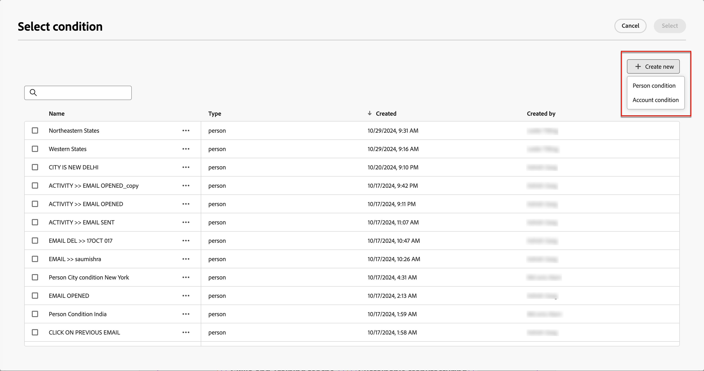

# Conteúdo condicional

O conteúdo condicional permite adaptar o conteúdo do email com base em regras condicionais. Essas regras são definidas usando atributos de perfil ou eventos contextuais. É possível criar regras condicionais no construtor de regras e armazená-las para reutilização nas jornadas de conta.

Para adicionar conteúdo condicional às suas mensagens de email, o Adobe Journey Optimizer permite aplicar regras condicionais armazenadas na biblioteca _Condições_. Aplique regras condicionais no espaço de design de email ao [criar conteúdo de email para uma jornada de conta](./email-authoring.md).

## Adicionar conteúdo condicional aos emails {#email-content}

>[!CONTEXTUALHELP]
>id="ajo-b2b_conditional_content"
>title="Conteúdo condicional"
>abstract="Use regras condicionais para criar diversas variantes de um componente de conteúdo. Se nenhuma das condições for atendida ao enviar a mensagem, o conteúdo da variante padrão será exibido."

>[!CONTEXTUALHELP]
>id="ajo-b2b_conditional_rule_select"
>title="Conteúdo condicional"
>abstract="Use uma regra condicional salva na biblioteca ou crie uma nova."

Ao criar um email para sua jornada de conta no espaço de design de email, use regras condicionais para definir várias variantes para um componente de conteúdo.

1. Selecione um componente de conteúdo e clique no ícone **[!UICONTROL Habilitar conteúdo condicional]** na barra de ferramentas do componente.

   O componente é contornado em laranja para indicar que está ativado como um componente condicional. O painel **[!UICONTROL Conteúdo Condicional]** é exibido à esquerda com a _Variante Padrão_ e a _Variante - 1.

   {width="700" zoomable="yes"}

   O conteúdo original selecionado e ativado é o padrão e se aplica quando nenhuma das regras condicionais é satisfeita para nenhuma das variantes definidas.

   Nesse painel, você pode definir várias variantes para o componente de conteúdo selecionado usando regras condicionais.

1. Passe o mouse sobre a primeira variante (_Variante - 1_) e clique no ícone _Selecionar condição_ (  ).

   {width="700" zoomable="yes"}

   A caixa de diálogo _[!UICONTROL Selecionar condição]_ é aberta e exibe a biblioteca de condições.

   Se quiser exibir detalhes de uma condição para garantir que ela seja o que você deseja, clique no ícone do _Mais menu_ (**...**) e escolha **[!UICONTROL Exibir Informações]**.

   {width="600" zoomable="yes"}

   Se a condição necessária não existir, [crie uma regra condicional](#create-condition) clicando em **[!UICONTROL Criar novo]**.

1. Selecione a regra condicional e clique em **[!UICONTROL Selecionar]** para associá-la à variante.

   Você pode revisar a condição associada clicando no ícone do _Mais menu_ (**...**) para a variante e escolhendo **[!UICONTROL Exibir condição]**.

   {width="600" zoomable="yes"}

   Clique em X na parte superior direita para fechar o pop-up.

   {width="500"}

1. Para facilitar a leitura, renomeie a variante clicando no ícone _Mais menu_ (**...**) da variante e escolhendo **[!UICONTROL Renomear]**.

   Insira um nome significativo para a variante que ajude a identificar a variante e seu propósito.

   {width="600" zoomable="yes"}

1. Com a variante selecionada no painel esquerdo, altere o componente para alterar como ele aparece na mensagem de email quando a condição for verdadeira.

   Neste exemplo, a variante do componente de texto usa uma descrição diferente com base na região do recipient.

   {width="600" zoomable="yes"}

1. Se necessário, defina outra variante clicando em **[!UICONTROL Adicionar variante]**.

   Repita as etapas 2 a 5 para selecionar uma condição, renomear a variante e alterar o componente para a variante.

   É possível adicionar quantas variantes forem necessárias para o componente de conteúdo. Altere a variante selecionada no painel esquerdo a qualquer momento para verificar como o componente de conteúdo aparece para a condição.

   >[!IMPORTANT]
   >
   >O conteúdo condicional é avaliado em relação às regras associadas na ordem em que as variantes são listadas. A primeira variante com uma condição que é avaliada como verdadeira é usada para o componente.
   >
   >Se nenhuma das condições de variante definidas for considerada verdadeira ao enviar o email, o componente de conteúdo aparecerá de acordo com a **[!UICONTROL Variante padrão]**.

1. Para excluir uma variante, clique no ícone de _Mais menu_ (**...**) da variante e escolha **[!UICONTROL Excluir]**.

   Clique em **[!UICONTROL Excluir]** no diálogo de confirmação.

## Regras condicionais

As regras condicionais são um conjunto de expressões condicionais que podem ser avaliadas como true ou false. Você pode usar essas regras para determinar qual variante de conteúdo exibir em uma mensagem de email com base em vários filtros, como atributos de perfil ou eventos contextuais.

As regras condicionais são armazenadas na biblioteca de condições, onde estão disponíveis para reutilização pelo conteúdo da jornada para sua organização.
<!-- 

>[!NOTE]
>
>You need the [Manage Library Items](../administration/ootb-product-profiles.md) permission to save or delete conditional rules. Saved conditions are available for use by all users within an organization. -->

### Filtros de condição {#condition-filters}

| Tipo de condição | Filtros | Descrição |
| -------------- | ------- | ----------- |
| **Conta** | Atributos de contas | Atributos do perfil da conta, incluindo: <li>Receita anual</li><li>Cidade</li><li>País</li><li>Tamanho do funcionário</li><li>Setor</li><li>Nome</li><li>Código SIC</li><li>Estado</li> |
| | [!UICONTROL Filtros especiais] > [!UICONTROL Tem Grupo de Compras] | A conta tem ou não membros de grupos de compra. Também podem ser avaliados em relação a um ou mais dos seguintes critérios: <li>Interesse da solução</li><li>Status do Grupo de Compras</li><li>Pontuação de integridade</li><li>Pontuação de engajamento</li> |
| **Pessoa** | [!UICONTROL Histórico de atividades] > [!UICONTROL Email] | Atividades de email associadas à jornada: <li>[!UICONTROL Link clicado no email]</li><li>E-mail aberto</li><li>O email foi entregue</li><li>O email foi enviado</li> Essas condições são avaliadas usando uma mensagem de email selecionada anteriormente na jornada. |
|  | [!UICONTROL Atributos da pessoa] | Atributos do perfil de pessoa, incluindo: <li>Cidade</li><li>País</li><li>Data de nascimento</li><li>Endereço de email</li><li>Email inválido</li><li>Email suspenso</li><li>Nome</li><li>Região inferida</li><li>Nome do cargo</li><li>Sobrenome</li><li>Número do celular</li><li>Número de telefone</li><li>Código postal</li><li>Estado</li><li>Inscrição cancelada</li><li>Motivo do cancelamento de inscrição</li> |
| | [!UICONTROL Filtros especiais] > [!UICONTROL Membro do Grupo de Compras] | A pessoa é ou não é um membro do grupo de compra avaliado em relação a um ou mais dos seguintes critérios: <li>Interesse da solução</li><li>Status do Grupo de Compras</li><li>Pontuação de integridade</li><li>Pontuação de engajamento</li><li>Função</li> |

### Criar uma regra condicional {#create-condition}

>[!CONTEXTUALHELP]
>id="ajo-b2b_conditions_rule_editor"
>title="Criar condição"
>abstract="Combine atributos e eventos contextuais para criar regras que determinem qual variante de conteúdo será exibida em mensagens de email."

Você pode acessar o construtor de regras condicionais no espaço de design de email ao selecionar uma condição para uma variante de componente.

1. Na caixa de diálogo _[!UICONTROL Selecionar condição]_, clique em **[!UICONTROL Criar novo]** e escolha o tipo de condição:

   * **[!UICONTROL Condição de pessoa]** - Escolha esse tipo para criar a regra condicional usando atributos de pessoa e eventos contextuais.
   * **[!UICONTROL Condição de conta]** - Escolha este tipo para criar a regra condicional usando atributos de conta.

   {width="600" zoomable="yes"}

1. Crie a regra condicional de acordo com suas necessidades.

   Para cada atributo ou evento que você deseja incluir na regra, arraste e solte o item na tela da regra. Expanda o filtro e conclua a expressão.

   {width="600" zoomable="yes"}

   Se você incluir mais de um filtro, defina a **[!UICONTROL Lógica do filtro]**:

   * **[!UICONTROL Aplicar todos os filtros]** - A regra é avaliada como verdadeira se **todos** os filtros forem verdadeiros.
   * **[!UICONTROL Aplicar filtros]** - A regra é avaliada como verdadeira se **qualquer** dos filtros for verdadeira.

1. À direita, digite o **[!UICONTROL Nome]** e uma **[!UICONTROL Descrição]** (opcional) para a regra.

   Use um nome significativo e uma descrição útil para ajudar outras pessoas em sua organização para que elas possam reutilizá-lo, em vez de criar outra condição duplicada.

   {width="600" zoomable="yes"}

1. Quando sua regra condicional for concluída, clique em **[!UICONTROL Salvar]**.

   A regra condicional é salva na biblioteca e você pode selecioná-la para a variante atual. Ele também está incluído na biblioteca para uso por qualquer outra variante de conteúdo dinâmico nas jornadas da conta.

### Duplicar uma regra

Regras condicionais salvas na biblioteca não podem ser modificadas. No entanto, é possível duplicar uma regra existente e alterá-la para criar uma nova regra.

1. Clique no ícone do _Mais menu_ (**...**) para a variante e escolha **[!UICONTROL Duplicar]**.

   Uma duplicata da regra é aberta no construtor de regras. Use a duplicata como ponto de partida para a regra que deseja criar.

   {width="600" zoomable="yes"}

1. No construtor de regras, altere, adicione ou exclua condições de acordo com o que precisar.

1. Altere o nome e a descrição para corresponder à finalidade ou aos itens na regra.

1. Quando sua regra condicional for concluída, clique em **[!UICONTROL Salvar]**.
