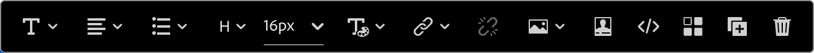
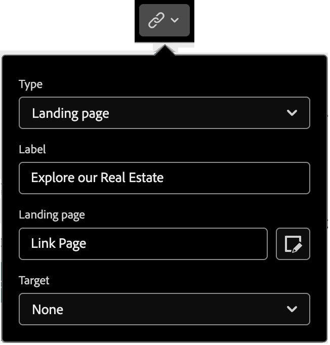

# Componentes do conteúdo {#content-components}

>[!CONTEXTUALHELP]
>id="ajo-b2b_content_components_email"
>title="Sobre os componentes do conteúdo"
>abstract="Componentes do conteúdo são espaços reservados vazios do conteúdo que podem ser usados para criar um email."

>[!CONTEXTUALHELP]
>id="ajo-b2b_content_components_landing_page"
>title="Sobre os componentes do conteúdo"
>abstract="Componentes do conteúdo são espaços reservados vazios do conteúdo que podem ser usados para criar uma página de destino."

>[!CONTEXTUALHELP]
>id="ajo-b2b_content_components_fragment"
>title="Sobre os componentes do conteúdo"
>abstract="Componentes do conteúdo são espaços reservados vazios do conteúdo que podem ser usados para criar um fragmento."

>[!CONTEXTUALHELP]
>id="ajo-b2b_content_components_template"
>title="Sobre os componentes do conteúdo"
>abstract="Componentes do conteúdo são espaços reservados vazios do conteúdo que podem ser usados para criar um modelo."

Ao criar conteúdo para emails, páginas de aterrissagem, modelos e fragmentos visuais, use os [!UICONTROL Componentes de conteúdo] para adicionar elementos de design visual. É possível adicionar quantos componentes de conteúdo forem necessários dentro de um ou mais componentes da estrutura, que definem o layout.

## Biblioteca de conteúdo

A seção **[!UICONTROL Conteúdo]**, na parte inferior da biblioteca de Componentes, exibe os componentes de conteúdo disponíveis:

| Ícone | Componente | Descrição |
| --------- | ---- | ----------- |
|  | [Contêiner](#container) | Adicione este componente ao design para incluir um contêiner retangular que pode ser usado para agrupar componentes ou aplicar o plano de fundo ou o estilo da borda a uma área. |
|  | [Botão](#button) | Adicione este componente ao design para incluir um elemento de botão clicável. |
|  | [Texto](#text) | Adicione este componente ao design para incluir um corpo de texto. |
|  | [Divisor](#divider) | Adicione esse componente ao design para incluir uma linha horizontal em áreas separadas do conteúdo. |
|  | [HTML](#html) | Adicione este componente ao design para copiar e colar as diferentes partes do HTML existente. Use esse componente para criar um bloco modular gratuito do HTML para reutilizar conteúdo externo. |
|  | [Imagem](#image) | Adicione este componente ao design para inserir um arquivo de imagem. |
|  | [Social](#social) | Adicione este componente ao design para inserir links a páginas de redes sociais. |
|  | [Formulário](#form) | **_Disponível somente para páginas de aterrissagem._** Adicione este componente ao design para inserir um formulário criado. |

## Barras de ferramentas do componente de Conteúdo

Cada tipo de componente de conteúdo exibe uma barra de ferramentas ao selecioná-la na tela. As ferramentas disponíveis, que variam de acordo com o tipo de componente, fornecem uma maneira fácil de trabalhar com o componente diretamente no conteúdo renderizado. Inclui formatação e recursos funcionais aplicáveis ao tipo de componente.

{width="450"}

### Ferramentas de formatação

+++Alterar estilo do texto

<table>
    <tr>
        <th style="width: 30%;">Ferramenta</th>
        <th style="width: 50%;">Uso</th>
        <th style="width: 20%;">Componentes</th>
    </tr>
    <tr>
        <td></td>
        <td>Aplique negrito, itálico, sublinhado ou tachado, sobrescrito ou subscrito à cadeia de texto selecionada.</td>
        <td><li>Botão <li>Texto</td>
    </tr>
</table>

+++

+++Alinhamento horizontal

<table>
    <tr>
        <th style="width: 30%;">Ferramenta</th>
        <th style="width: 50%;">Uso</th>
        <th style="width: 20%;">Componentes</th>
    </tr>
    <tr>
        <td></td>
        <td>Aplique um tipo de alinhamento horizontal ao conteúdo do componente. Escolha 'esquerda', 'centralizada', 'direita' ou 'justificada'. </td>
        <td><li>Botão <li>Texto</td>
    </tr>
</table>

+++

+++Criar lista

<table>
    <tr>
        <th style="width: 30%;">Ferramenta</th>
        <th style="width: 50%;">Uso</th>
        <th style="width: 20%;">Componentes</th>
    </tr>
    <tr>
        <td></td>
        <td>Aplique formatação de lista ordenada ou não ordenada ao texto do componente.</td>
        <td><li>Texto</td>
    </tr>
</table>

+++

+++Definir cabeçalho

<table>
    <tr>
        <th style="width: 20%;">Ferramenta</th>
        <th style="width: 60%;">Uso</th>
        <th style="width: 20%;">Componentes</th>
    </tr>
    <tr>
        <td></td>
        <td>Aplique a formatação em nível de cabeçalho ao parágrafo para o local do cursor.</td>
        <td><li>Botão <li>Texto</td>
    </tr>
</table>

+++

+++Tamanho da fonte

<table>
    <tr>
        <th style="width: 20%;">Ferramenta</th>
        <th style="width: 60%;">Uso</th>
        <th style="width: 20%;">Componentes</th>
    </tr>
    <tr>
        <td></td>
        <td>Aplicar tamanho de fonte ao texto selecionado. Clique na ferramenta e escolha o tamanho ou insira o valor px.</td>
        <td><li>Botão <li>Texto</td>
    </tr>
</table>

+++

+++Cor da fonte

<table>
    <tr>
        <th style="width: 40%;">Ferramenta</th>
        <th style="width: 40%;">Uso</th>
        <th style="width: 20%;">Componentes</th>
    </tr>
    <tr>
        <td></td>
        <td>Aplicar cor da fonte ao texto selecionado. Escolha uma cor no seletor e use o controle deslizante de cores e o campo de cores para selecionar a cor. Ou você pode inserir um valor RGB, HSL, HSB ou hexadecimal conhecido. </td>
        <td><li>Botão <li>Texto</td>
    </tr>
</table>

+++

+++Inserir link

<table>
    <tr>
        <th style="width: 40%;">Ferramenta</th>
        <th style="width: 40%;">Uso</th>
        <th style="width: 20%;">Componentes</th>
    </tr>
    <tr>
        <td></td>
        <td>Crie um link clicável (URL externo ou página de aterrissagem) para o texto ou elemento selecionado.</td>
        <td><li>Botão <li>Texto <li>Imagem </td>
    </tr>
</table>

+++

+++Remover link

<table>
    <tr>
        <th style="width: 15%;">Ferramenta</th>
        <th style="width: 60%;">Uso</th>
        <th style="width: 25%;">Componentes</th>
    </tr>
    <tr>
        <td></td>
        <td> Remova o link clicável (URL externo ou página de aterrissagem) do texto ou elemento selecionado.</td>
        <td><li>Botão <li>Texto <li>Imagem </td>
    </tr>
</table>

+++

### Ferramentas funcionais

| Ferramenta | Nome | Uso |
| ---- | ---- | ----- |
| {width="40"} | Adicionar personalização | Use o editor de personalização para inserir tokens de personalização no conteúdo do componente. [Saiba mais](./email-authoring.md#personalize-content) |
| {width="40"} | Mostrar o código-fonte | Exibir o código-fonte HTML do componente em um pop-up somente leitura.  {width="200"} |
| {width="40"} | Ativar conteúdo condicional | (Emails e fragmentos) Ative variantes condicionais para o componente. [Saiba mais](./conditional-content.md) |
| {width="40"} | Duplicar | Crie uma cópia do componente e adicione-a diretamente abaixo. |
| {width="40"} | Excluir | Remova o componente. |

## Adicionar um componente de conteúdo ao seu design

1. No espaço de design visual, use um modelo existente ou adicione os componentes de estrutura necessários em uma tela vazia para definir o layout.

1. Na biblioteca **[!UICONTROL Componentes]**, segure a _alça de arrastar_  do componente de conteúdo de sua escolha e, em seguida, arraste e solte-a nos componentes da estrutura.

   É possível adicionar vários componentes em um único componente de estrutura e em cada coluna de um componente de estrutura.

   {width="600" zoomable="yes"}

1. Ajuste a exibição do componente usando as guias **[!UICONTROL Configurações]** e **[!UICONTROL Estilo]** à direita ou a barra de ferramentas de contexto exibida na tela.

   Por exemplo, você pode alterar o estilo do texto, o preenchimento ou a margem do componente.

   {width="600" zoomable="yes"}

Como você está trabalhando com seu design, também pode [remover](#remove-a-content-component) ou [duplicar](#duplicate-a-content-component) um componente.

## Configurações e estilos do componente de Conteúdo

Depois de adicionar um componente, ele é selecionado no espaço de design visual e suas propriedades são exibidas no painel direito. Você também pode selecionar um componente a qualquer momento para alterar as configurações e os estilos. Muitas configurações e estilos são específicos para o componente, mas há algumas configurações e estilos padrão que você pode aplicar a qualquer componente de conteúdo selecionado.

### Opções de exibição

Se desejar excluir o componente da exibição de desktop ou dispositivo móvel, altere a configuração **[!UICONTROL Opções de Exibição]**. O padrão, _[!UICONTROL Mostrar em todos os dispositivos]_, habilita a exibição em todos os dispositivos. Escolha outra configuração para tornar o componente exclusivo por tipo de dispositivo:

* _[!UICONTROL Mostrar apenas em dispositivos desktop]_ - Escolha esta configuração quando desejar exibir o componente em dispositivos desktop e excluí-lo de dispositivos móveis.
* _[!UICONTROL Mostrar apenas em dispositivos móveis]_ - Escolha essa configuração quando desejar exibir o componente em dispositivos móveis, como telefones e tablets, e excluí-lo de dispositivos desktop.

{width="400" zoomable="yes"}

### Container

Use um container para aplicar um estilo específico a um grupo de componentes de conteúdo. Adicione um componente [!UICONTROL Contêiner] e adicione outros componentes de conteúdo dentro dele. Este componente é semelhante à forma como você pode usar um elemento `div` no HTML. É possível aplicar um estilo distinto ao contêiner que difere do estilo aplicado aos componentes de conteúdo que ele contém.

Por exemplo, adicione um componente _[!UICONTROL Contêiner]_ e adicione um componente _[!UICONTROL Botão]_ dentro desse contêiner. Você pode usar um estilo de área específico para o contêiner e estilizar o botão e seu plano de fundo conforme necessário.

{width="600" zoomable="yes"}

+++Histórico

{{styles-background}}

+++

+++Borda

{{styles-border}}

+++

+++Tamanho

{{styles-size}}

+++

+++Margem

{{styles-margin}}

+++

+++Preenchimento

{{styles-padding}}

+++

### Botão

Use o componente [!UICONTROL Botão] para inserir um ou vários botões clicáveis em seu conteúdo. Use botões para redirecionar visualizadores de página ou destinatários de email para conteúdo de suporte (página de aterrissagem publicada ou um link externo).

#### Adicionar o texto do botão

Quando o componente de botão é exibido na tela, a barra de ferramentas inclui opções para formatação de texto, bem como personalização e variantes condicionais. Para obter mais informações sobre as opções da barra de ferramentas do editor, consulte #.

Ao inserir o texto do rótulo do botão e definir a formatação, o botão é redimensionado para acomodar o conteúdo.

{width="500" zoomable="yes"}

#### Definir opções de link

Na guia _[!UICONTROL Configurações]_, use as opções **[!UICONTROL Link]** para definir o texto do botão, o destino do link e o comportamento do navegador para carregar a página de destino.

1. Defina o **[!UICONTROL Tipo]** para o link:

   * **[!UICONTROL Link externo]** - Escolha este tipo para usar uma URL padrão como o destino do link.

     Em **[!UICONTROL Url]**, insira a URL para o destino do link. Clique no ícone _Personalizar_ (  ) para usar um token de personalização como parâmetro na URL.

     {width="200"}

   * **Página de aterrissagem** - Escolha esse tipo para selecionar uma página de aterrissagem publicada em <!-- Journey Optimizer B2B Edition (_Beta_) or -->a instância conectada do Marketo Engage.

     Para a opção **[!UICONTROL Página de aterrissagem]**, selecione a página de aterrissagem publicada. Clique no ícone _Selecionar página_ (  ) e [selecione a página de aterrissagem publicada](./landing-pages.md#link-to-a-landing-page).

     {width="200"}

1. Para **[!UICONTROL Rótulo]**, insira o texto que deseja exibir dentro do botão.

   O dimensionamento do botão é ajustado de acordo com o texto e o estilo definidos.

1. Para **[!UICONTROL Target**], escolha como o destino vinculado será redirecionado do email ou da página:

   * _[!UICONTROL Nenhum]_ - Abre o link usando o navegador padrão ou o comportamento do cliente (padrão).
   * _[!UICONTROL Em branco]_ - Abre o link em uma nova janela ou guia.
   * _[!UICONTROL Self]_ - Abre o link no mesmo quadro.
   * _[!UICONTROL Pai]_ - abre o link no quadro pai.
   * _[!UICONTROL Superior]_ - Abre o link no corpo inteiro da janela.

#### Definir estilos

Personalize o estilo do botão na guia **[!UICONTROL Estilos]**.

+++Histórico

{{styles-background}}

+++

+++Texto

{{styles-text}}

+++

+++Borda

{{styles-border}}

+++

+++Tamanho

{{styles-size}}

+++

+++Alinhamento

+++

+++Margem do botão

+++

+++Margem do contêiner

{{styles-margin}}

+++

+++Preenchimento

{{styles-padding}}

+++

+++Avançado

{{styles-advanced}}

+++

### Texto

Use o componente de Texto para inserir um bloco de texto no conteúdo. Quando o componente de texto for selecionado na tela, insira o texto e use as opções da barra de ferramentas para adicionar formatação e opções em linha, incluindo tokens de personalização e variantes condicionais. <!-- For detailed information about crafting text, including inline styling and options, in the design space, see [Text authoring](#). -->

Personalize o estilo do componente de texto na guia **[!UICONTROL Estilos]**.

+++Histórico

{{styles-background}}

+++

+++Texto

Esses estilos são aplicados ao bloco de texto inteiro. É possível aplicar o estilo em linha a uma cadeia de caracteres de texto selecionada.

{{styles-text}}

+++

+++Borda

{{styles-border}}

+++

+++Tamanho

{{styles-size}}

+++

+++Margem

{{styles-margin}}

+++

+++Preenchimento

{{styles-padding}}

+++

+++Avançado

{{styles-advanced}}

+++

### Divisor

Adicione um componente _Divider_ para incorporar uma divisão linear entre seções do seu conteúdo.

+++Histórico

{{styles-background}}

+++

+++Linha

+++

+++Tamanho

{{styles-size}}

+++

+++Alinhamento

{{styles-alignment-h}}

+++

+++Margem

{{styles-margin}}

+++

+++Preenchimento

{{styles-padding}}

+++

+++Avançado

{{styles-advanced}}

+++

### HTML

Use o componente HTML para adicionar partes do seu HTML existente. Esse componente fornece uma maneira fácil de criar elementos modulares do HTML que reutilizam o conteúdo externo.

1. Selecione o componente na tela de desenho e clique no ícone _Mostrar o código-fonte_ na barra de ferramentas.

   [Abrir o editor de código para adicionar o HTML](./assets/content-components-html-show-code.png){width="450"}

1. Cole a HTML na caixa de texto e clique em **[!UICONTROL Salvar]**.

   [Editar caixa de diálogo do HTML](./assets/content-components-html-edit-dialog.png){width="600" zoomable="yes"}

   Se o HTML for válido, ele renderizará o elemento na tela. Se for um elemento que mapeia para um dos outros componentes de conteúdo, você poderá alterar as configurações e os estilos no painel direito de acordo com o tipo de componente. Caso contrário, permanecerá como um componente do HTML.

Para um componente do HTML, você pode definir os seguintes estilos para todo o componente do HTML no painel direito:

+++Histórico

{{styles-background}}

+++

+++Borda

{{styles-border}}

+++

+++Tamanho

{{styles-size}}

+++

+++Alinhamento

{{styles-alignment-h-v}}

+++

+++Margem

{{styles-margin}}

+++

+++Preenchimento

{{styles-padding}}

+++

+++Avançado

{{styles-advanced}}

+++

### Imagem

Use o componente [!UICONTROL Imagem] para inserir um ativo de imagem no seu conteúdo. Quando o componente _Imagem_ é selecionado na tela, você pode adicionar ou alterar o arquivo de ativo da imagem exibida.

{width="400" zoomable="yes"}

#### Adicionar o ativo de imagem

Escolha o [tipo de origem do ativo](./assets-overview.md) e selecione um arquivo de imagem:

* **[!UICONTROL Marketo Engage Assets]** - Escolha este tipo para procurar e selecionar um ativo de imagem da biblioteca Journey Optimizer B2B edition ou da instância conectada do Market Engage.

  {width="700" zoomable="yes"}

  Na caixa de diálogo, é possível escolher uma imagem do repositório selecionado. Clique em **[!UICONTROL Selecionar]** para adicionar o ativo.

  Há ferramentas disponíveis para ajudar a localizar o ativo necessário:

   * Clique no ícone _Filtro_ na parte superior esquerda para filtrar os itens exibidos de acordo com seus critérios.

   * Digite texto no campo _Pesquisa_ para filtrar os itens exibidos para uma correspondência do nome do ativo.

     {width="700" zoomable="yes"}

* **[!UICONTROL Experience Manager Assets]** - Escolha este tipo para procurar e selecionar um ativo de imagem de um [repositório configurado do Experience Manager Assets](../admin/configure-aem-repositories.md).

  Na caixa de diálogo _[!UICONTROL Selecionar Assets]_, escolha uma imagem usando as ferramentas disponíveis para localizar o ativo necessário e clique em **[!UICONTROL Selecionar]**.:

   * Altere o **[!UICONTROL Repositório]** na parte superior direita.

   * Clique em **[!UICONTROL Gerenciar ativos]** na parte superior direita para abrir o repositório do Assets em outra guia do navegador e usar as ferramentas de gerenciamento do AEM Assets.

   * Clique no seletor de _Tipo de exibição_ na parte superior direita para alterar a exibição para **[!UICONTROL Exibição de Lista]**, **[!UICONTROL Exibição de Grade]**, **[!UICONTROL Exibição de Galeria]** ou **[!UICONTROL Exibição em Cascata]**.

   * Clique no ícone _Ordem de classificação_ para alterar a ordem de classificação entre crescente e decrescente.

     {width="700" zoomable="yes"}

   * Clique na seta de menu **[!UICONTROL Classificar por]** para alterar os critérios de classificação para **[!UICONTROL Nome]**, **[!UICONTROL Tamanho]** ou **[!UICONTROL Modificado]**.

   * Clique no ícone _Filtro_ na parte superior esquerda para filtrar os itens exibidos de acordo com seus critérios.

   * Digite texto no campo _Pesquisa_ para filtrar os itens exibidos para uma correspondência do nome do ativo.

  {width="700" zoomable="yes"}

* **[!UICONTROL Importar mídia]** - Escolha esse tipo para selecionar um arquivo do seu sistema e importá-lo para a biblioteca de ativos do Journey Optimizer B2B edition.

  Na caixa de diálogo _[!UICONTROL Carregar imagem]_, arraste e solte um arquivo do seu sistema na caixa de arquivo. O tamanho máximo do arquivo é 100 MB.

  {width="450"}

  Os nomes de arquivo das imagens selecionadas são exibidos na caixa de diálogo. Os nomes dos arquivos do ativo devem ser exclusivos (em várias pastas). Se um arquivo com o nome já existir, uma mensagem será exibida. Os nomes podem ter no máximo 100 caracteres e não podem conter caracteres especiais (como `;`, `:`, `\` e `|`).

  Clique em **[!UICONTROL Importar]**.

Você pode adicionar um título de imagem e um texto alternativo para a imagem no painel direito.

{width="250"}

#### Definir opções de link

Na guia _[!UICONTROL Configurações]_, use as opções **[!UICONTROL Link]** para vincular a imagem a um destino e ao comportamento do navegador para carregar a página de destino.

1. Defina o **[!UICONTROL Tipo]** para o link:

   * **[!UICONTROL Link externo]** - Escolha este tipo para usar uma URL padrão como o destino do link.

     Em **[!UICONTROL Url]**, insira a URL para o destino do link. Clique no ícone _Personalizar_ (  ) para usar um token de personalização como parâmetro na URL.

     {width="250"}

   * **Página de aterrissagem** - Escolha esse tipo para selecionar uma página de aterrissagem publicada em <!-- Journey Optimizer B2B Edition (_Beta_) or -->a instância conectada do Marketo Engage.

     Para a opção **[!UICONTROL Página de aterrissagem]**, selecione a página de aterrissagem publicada. Clique no ícone _Selecionar página_ (  ) e [selecione a página de aterrissagem publicada](./landing-pages.md#link-to-a-landing-page).

     {width="250"}

1. Para **[!UICONTROL Rótulo]**, insira o texto que deseja exibir dentro do botão.

   O dimensionamento do botão é ajustado de acordo com o texto e o estilo definidos.

1. Para **[!UICONTROL Target**], escolha como o destino vinculado será redirecionado do email ou da página:

   * _[!UICONTROL Nenhum]_ - Abre o link usando o navegador padrão ou o comportamento do cliente (padrão).
   * _[!UICONTROL Em branco]_ - Abre o link em uma nova janela ou guia.
   * _[!UICONTROL Self]_ - Abre o link no mesmo quadro.
   * _[!UICONTROL Pai]_ - abre o link no quadro pai.
   * _[!UICONTROL Superior]_ - Abre o link no corpo inteiro da janela.

#### Definir os estilos

Defina os estilos do componente de Imagem no painel direito.

+++Histórico

{{styles-background}}

+++

+++Borda

{{styles-border}}

+++

+++Tamanho

{{styles-size}}

+++

+++Alinhamento

{{styles-alignment-h}}

+++

+++Margem

{{styles-margin}}

+++

+++Preenchimento

{{styles-padding}}

+++

+++Avançado

{{styles-advanced}}

+++

### Redes sociais

Use o componente _Social_ para inserir links para páginas de redes sociais no seu conteúdo. Ele inclui três tipos de redes sociais padrão, mas você pode adicionar ou remover os tipos de acordo com suas necessidades.

{width="600" zoomable="yes"}

* Para adicionar um tipo de rede social, clique no ícone _Adicionar_ ( **+** ) e escolha um tipo de rede social que deseja adicionar.

  {width="250"}

* Para remover um tipo de rede social, clique em **X** ao lado do ícone de rede social.

Com um tipo de rede social selecionado, defina as opções para esse tipo:

* **[!UICONTROL URL]** - Insira a URL da rede social que você deseja vincular ao gráfico ou ícone da rede social.
* **[!UICONTROL Source]** - Se você quiser usar sua própria imagem em vez do padrão, escolha e ativo de imagem. Você pode selecionar uma imagem do repositório de ativos conectado do Marketo Engage, um repositório do Experience Manager Assets (se configurado) ou importar um arquivo de imagem do seu sistema. Consulte as [informações sobre o componente de imagem](#add-the-image-asset) para obter detalhes sobre a seleção e a importação de ativos de imagem.
* **[!UICONTROL Texto alternativo]** - Digite o texto alternativo da imagem exibida.

  {width="250"}

Para definir um tamanho de exibição consistente para todos os elementos gráficos de redes sociais, defina o **[!UICONTROL Tamanho das imagens]**.

Você pode definir as seguintes opções de estilo para o componente _Social_:

+++Histórico

{{styles-background}}

+++

+++Borda

{{styles-border}}

+++

+++Tamanho

{{styles-size}}

+++

+++Alinhamento

{{styles-alignment-h}}

+++

+++Margem

{{styles-margin}}

+++

+++Preenchimento

{{styles-padding}}

+++

+++Avançado

{{styles-advanced}}

+++

### Formulário (páginas de destino)

[!BADGE Beta]{type=Informative url="/help/user/content/forms.md" tooltip="Recurso do Beta"}

Use o componente _Formulário_ para adicionar um formulário publicado a uma página de aterrissagem ou modelo de página de aterrissagem. Para obter mais informações sobre criação e publicação de formulários, consulte [Forms](./forms.md).

1. Clique na ferramenta _Formulário_ na barra de ferramentas do componente ou use as propriedades **[!UICONTROL Incorporar Formulário]** à direita para selecionar o formulário publicado.

   {width="600"}

1. Se você deseja substituir o **[!UICONTROL Tipo de acompanhamento]** padrão do formulário, altere a configuração de acordo com os requisitos da página ou do modelo.

   Esta página também é conhecida como _página de agradecimento_ do formulário e essa configuração determina o que acontece quando um visitante envia o formulário:

   * **[!UICONTROL Permanecer na página]** - Escolha essa opção para manter o visitante na mesma página quando o formulário for enviado.

   * **[!UICONTROL Página de aterrissagem]** - Escolha essa opção para selecionar qualquer página de aterrissagem do Journey Optimizer B2B edition ou do Marketo Engage como acompanhamento.

   * **[!UICONTROL URL Externa]** - Escolha esta opção para especificar qualquer URL como página de acompanhamento. Depois que o visitante envia o formulário, o navegador carrega o URL designado.

     >[!TIP]
     >
     >Se quiser que o use o formulário para baixar um arquivo, você pode especificar uma URL para o arquivo hospedado. Com essa configuração, o botão de envio funciona como um botão de download.

     {width="280"}

Se necessário, selecione a guia **[!UICONTROL Estilos]** no painel direito para definir as margens do formulário dentro do componente de estrutura.

{{styles-margin}}
