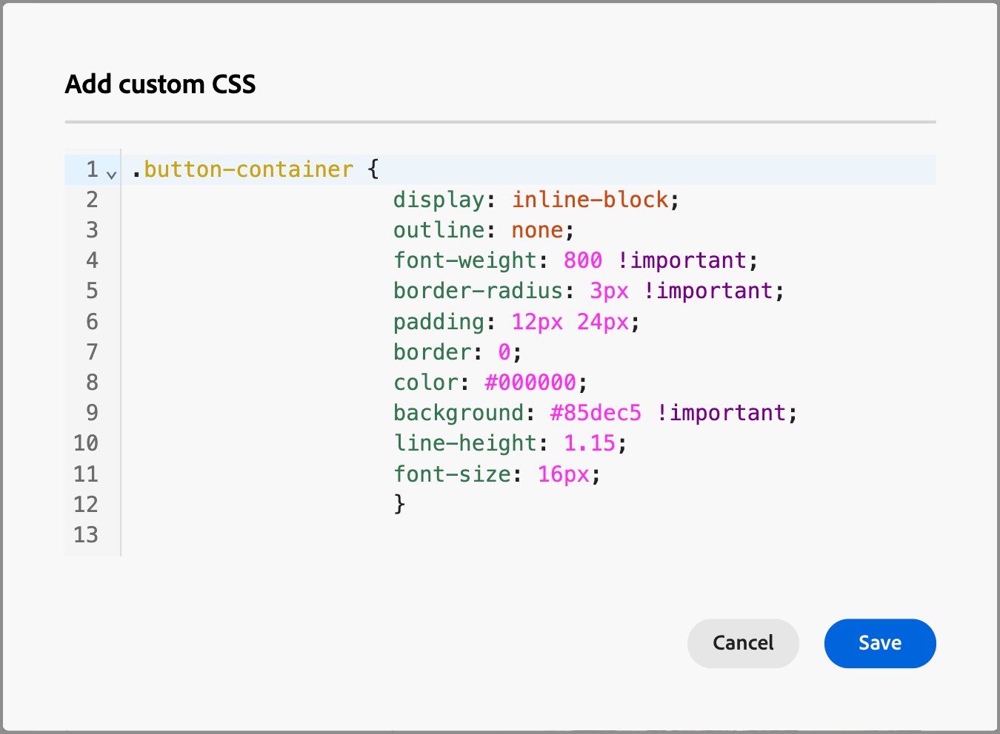

# Adicionar CSS personalizado para o seu conteúdo

Você pode adicionar seu próprio CSS personalizado diretamente no espaço de design de email ou página de aterrissagem. Use o CSS personalizado para aplicar um estilo avançado e específico, proporcionando maior flexibilidade e controle sobre a aparência do seu conteúdo.

O CSS personalizado é anexado à seção `<head>` em uma marca `<style>` usando o atributo `data-name="global-custom"`. Essa estrutura garante que os estilos personalizados sejam aplicados globalmente ao conteúdo.

+++ Exemplo de implementação

```html
<!DOCTYPE html>
<html>
  <head>
    <meta charset="utf-8">
    <meta name="content-version" content="3.3.31">
    <meta name="x-apple-disable-message-reformatting">
    <meta name="viewport" content="width=device-width,initial-scale=1.0">
    <style data-name="default" type="text/css">
      td { padding: 0; }
      th { font-weight: normal; }
    </style>
    <style data-name="grid" type="text/css">
      .acr-grid-table { width: 100%; }
    </style>
    <style data-name="acr-theme" type="text/css" data-theme="default" data-variant="0">
      body { margin: 0; font-family: Arial; }
    </style>
    <style data-name="media-default-max-width-500px" type="text/css">
      @media screen and (max-width: 500px) {
        body { width: 100% !important; }
      }
    </style>
    <style data-name="global-custom" type="text/css">
      /* Add you custom CSS here */
    </style>
  </head>
  <body>
    <!-- Minimal content -->
  </body>
</html>
```

+++

>[!NOTE]
>
>O CSS personalizado não é refletido ou validado no painel _[!UICONTROL Estilos]_ para um componente selecionado. Ela é totalmente independente e só pode ser modificada por meio da opção [!UICONTROL Adicionar CSS personalizado] no nível do componente Corpo.

## Adicionar seu CSS personalizado

1. Com pelo menos um componente de conteúdo adicionado à tela, selecione o componente **[!UICONTROL Corpo]** na navegação à esquerda.

1. Selecione a guia _Estilos_ à direita e clique em **[!UICONTROL Adicionar CSS personalizado]**.

   {width="800" zoomable="yes"}

   >[!NOTE]
   >
   >O botão _[!UICONTROL Adicionar CSS personalizado]_ está disponível somente quando o componente _[!UICONTROL Corpo]_ é selecionado. No entanto, você pode aplicar estilos CSS personalizados a todos os componentes dentro dele.

   O editor pop-up _[!UICONTROL Adicionar CSS]_ personalizado é exibido com comentários de código de espaço reservado.

1. Insira seu código CSS no editor.

   Verifique se o CSS personalizado é válido e segue a sintaxe apropriada. Se o CSS inserido for inválido, uma mensagem de erro será exibida e o CSS não poderá ser salvo. Para saber mais, consulte [validade de CSS](#css-validity).

   {width="450"}

1. Clique em **[!UICONTROL Salvar]** para salvar o CSS personalizado.

   A folha de estilos personalizada é aplicada ao conteúdo existente. Você pode verificar se o CSS personalizado é aplicado de acordo com suas necessidades. Para obter informações sobre como fazer alterações e ajustar o aplicativo da folha de estilos, consulte [Solução de problemas](#troubleshooting).

   {width="600" zoomable="yes"}

## Validade de CSS

>[!CAUTION]
>
>Os usuários são responsáveis pela segurança de seus CSS personalizados. Certifique-se de que o CSS não introduza vulnerabilidades ou conflitos com o conteúdo existente.
>
>Evite usar CSS que possa quebrar involuntariamente o layout ou a funcionalidade do conteúdo.

+++ Exemplos de CSS válido

```css
.acr-component[data-component-id="form"] {
  display: flex;
  justify-content: center;
  background: none;
}

.acr-Form {
  width: 100%;
  padding: 20px 100px;
  border-spacing: 0px 8px;
  box-sizing: border-box;
  margin: 0;
}

.acr-Form .spectrum-FieldLabel {
  width: 20%;
}

.acr-Form.spectrum-Form--labelsAbove .spectrum-FieldLabel,
.acr-Form [data-form-item="checkbox"] .spectrum-FieldLabel {
  width: auto;
}

.acr-Form .spectrum-Textfield {
  width: 100%;
}

#acr-form-error,
#acr-form-confirmation {
  width: 100%;
  padding: var(--spectrum-global-dimension-static-size-500);
  display: flex;
  align-items: center;
  flex-direction: column;
  justify-content: center;
  gap: var(--spectrum-global-dimension-static-size-200);
}

.spectrum-Form-item.is-required .spectrum-FieldLabel:after{
  content: '*';
  font-size: 1.25rem;
  margin-left: 5px;
  position: absolute;
}

/* Error field placeholder */
.spectrum-HelpText {
  display: none !important;
}

.spectrum-HelpText.is-invalid,
.is-invalid ~ .spectrum-HelpText {
  display: flex !important;
}
```

```css
@media only screen and (min-width: 600px) {
  .acr-paragraph-1 {
    width: 100% !important;
  }
}
```

+++

+++ Exemplos de CSS inválido

O uso de `<style>` tags não é aceito:

```html
<style type="text/css">
  .acr-Form {
    width: 100%;
    padding: 20px 100px;
    border-spacing: 0px 8px;
    box-sizing: border-box;
    margin: 0;
  }
</style>
```

Sintaxe inválida, como chaves ausentes, não é aceita:

```css
body {
  background: red;
```

+++

## CSS no conteúdo importado

Se você quiser usar o CSS personalizado com conteúdo importado para o espaço de design de email ou página de aterrissagem, considere o seguinte:

* Se você importar conteúdo externo do HTML, incluindo CSS, <!-- unless converting that content, -->ele será preenchido no [!UICONTROL Modo de compatibilidade] e a seção [!UICONTROL Estilos CSS] não estará disponível.

* Se você importar o conteúdo que foi criado originalmente no espaço de design de email ou página de aterrissagem com a opção [!UICONTROL Adicionar CSS personalizado], o CSS aplicado ficará visível e poderá ser editado na mesma opção.

## Solução de problemas

Se o CSS personalizado não for aplicado conforme esperado, use as ferramentas de desenvolvedor do navegador para inspecionar o conteúdo e verificar se o CSS está direcionando os seletores corretos. Ao revisar o código de estilo, considere o seguinte:

* Verifique se o CSS é válido e está livre de erros de sintaxe (como chaves ausentes, nomes de propriedades incorretos).

* Verifique se o CSS foi adicionado à tag `<style>` com o atributo `data-name="global-custom"`.

* Verifique se a marca de estilo `global-custom` tem o atributo `data-disabled` definido como verdadeiro, como:

  `<style data-name="global-custom" type="text/css" data-disabled="true"> body: { color: red; } </style>`

* Verifique se o CSS não é substituído em algum lugar no conteúdo, como no estilo em linha aplicado.

* Adicione `!important` às suas declarações para garantir que elas tenham prioridade, como:

  ```
  .acr-Form {
  background: red !important;
  }
  ```
