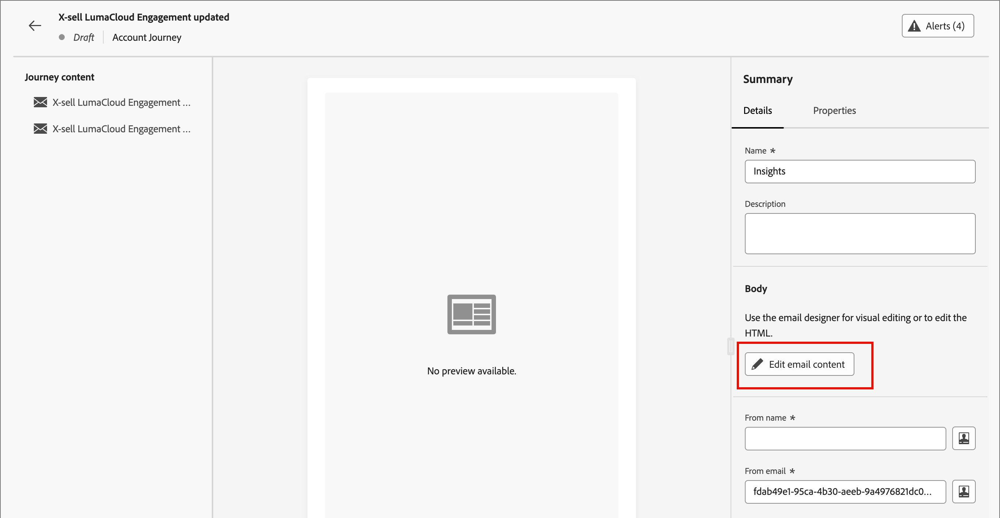

# Criação de mensagens de email

Depois de [adicionar um ativo de email a um nó de ação de jornada](./add-email.md), você pode definir o conteúdo da mensagem de email.

Clique em **[!UICONTROL Editar conteúdo do email]** na guia _[!UICONTROL Detalhes]_ no painel direito.

{width="700" zoomable="yes"}

Essa ação inicia as ferramentas de design de email, onde você pode escolher como deseja criar seu email a partir das seguintes opções:

* [Crie o email do zero](#design-your-email-from-scratch) usando a interface Designer de email.

* [Importe conteúdo existente do HTML](#import-existing-html-content) de um arquivo ou de uma pasta .zip.

* [Selecione um modelo existente](#select-a-template) em uma lista de modelos de email predefinidos ou personalizados.

Após criar e personalizar o conteúdo do email, você pode exportar o conteúdo para validação ou para uso posterior. Clique em **[!UICONTROL Exportar HTML]** para salvar o conteúdo como um arquivo .zip que inclui seu HTML e seus ativos.

>[!TIP]
>
>Use o Assistente de IA no Adobe Journey Optimizer B2B edition, viabilizado pela IA gerativa, para elevar seu conteúdo ao próximo nível. O Assistente de IA pode ajudá-lo a otimizar o impacto de seus deliveries, gerando emails inteiros, conteúdo de texto direcionado e obtendo recomendações do Assistente de IA para imagens que refletem em seu público-alvo. [Saiba mais](./ai-assistant-emails.md)

## Criar email do zero {#design-from-scratch}

Use o espaço de design de conteúdo visual para definir a estrutura e o conteúdo do email. Ao adicionar e mover componentes estruturais com ações simples de arrastar e soltar, você pode criar a forma do conteúdo de email reutilizável em segundos.

1. Na página inicial _[!UICONTROL Criar seu modelo]_, selecione a opção **[!UICONTROL Criar do zero]**.

1. Na caixa de diálogo _[!UICONTROL Criar email]_, escolha o tipo de conteúdo de email que deseja criar.

   * **[!UICONTROL Usar Temas]** - Escolha esta opção para criar o email no _Modo de Tema_. Nesse modo, é possível usar um tema de marca definido para simplificar o processo de criação de conteúdo e garantir que o design se alinhe aos padrões definidos.

   * **[!UICONTROL Estilo Manual]** - Escolha esta opção para criar o email no _Modo manual_. Nesse modo, você define manualmente o estilo de todos os componentes de estrutura e conteúdo adicionados à tela em branco.

1. [Adicionar estrutura e conteúdo](./email-authoring.md#add-structure-and-content) ao modelo.

1. [Examinar e atualizar links](#preview-and-edit-linked-urls).

1. [Testar o email](#check-and-test-the-email).

<!-- If needed, you can further personalize your email by clicking **[!UICONTROL Switch to code editor]** from the advanced menu. The code editor allows you to edit the email source code, such as adding tracking or custom HTML tags.

>[!CAUTION]
>
>You cannot revert back to the visual design space for this email after switching to the code editor. -->

Quando estiver satisfeito com o conteúdo, clique em **[!UICONTROL Salvar]**.

## Importar conteúdo existente do HTML

{{$include /help/_includes/content-design-import.md}}

{width="500"}

>[!NOTE]
>
>Usar uma marca `<table>` como a primeira camada em um arquivo do HTML pode causar perda de estilo, incluindo configurações de plano de fundo e largura na marca de camada superior.

Você pode personalizar o conteúdo importado conforme necessário com as ferramentas do editor visual de email.

## Selecione um modelo

{{$include /help/_includes/content-design-select-template.md}}

>[!NOTE]
>
> Os modelos salvos podem ter configurações de governança (bloqueio de conteúdo) aplicadas a um ou mais componentes. O espaço de design visual fornece diretrizes sobre componentes bloqueados quando você [cria um email a partir de um modelo controlado](./email-authoring-governance.md).

## Adicionar estrutura e conteúdo {#structure-content}

{{$include /help/_includes/content-design-components.md}}

### Adicionar CSS personalizado

Você pode adicionar seu próprio CSS personalizado diretamente no espaço de design de email. Use o CSS personalizado para aplicar um estilo avançado e específico, proporcionando maior flexibilidade e controle sobre a aparência do seu conteúdo. É uma prática recomendada adicionar esse estilo de mais alto nível antes de incluir componentes de conteúdo, como imagens, botões e texto.

Com pelo menos um componente de conteúdo na tela, selecione o componente **[!UICONTROL Corpo]** na árvore de navegação esquerda para acessar o editor de CSS personalizado.

>[!NOTE]
>
>Se sua mensagem de email for criada usando um [modelo com conteúdo bloqueado](./template-content-governance.md), você não poderá adicionar CSS personalizado ao seu conteúdo. O rótulo do botão é alterado para **[!UICONTROL Exibir CSS personalizado]** e qualquer CSS personalizado já presente no conteúdo é somente leitura.

{width="800" zoomable="yes"}

{{$include /help/_includes/content-design-custom-css.md}}

### Adicionar fragmentos

>[!NOTE]
>
>Os fragmentos não são compatíveis entre o _Modo de tema_ e o _Modo manual_ no conteúdo do email. Para usar um fragmento no conteúdo de email no qual um tema é aplicado, ele também deve ser criado no _Modo de tema_.

{{$include /help/_includes/content-design-use-fragments.md}}

Depois que o email for salvo, ele aparecerá na página de detalhes do fragmento ao selecionar a guia _[!UICONTROL Usado por]_ no resumo.

### Adicionar ativos de imagem

{{$include /help/_includes/content-design-assets.md}}

### Navegar pelas camadas, configurações e estilos

{{$include /help/_includes/content-design-navigation.md}}

### Personalizar conteúdo

{{$include /help/_includes/content-design-personalization-email.md}}

>[!NOTE]
>
>Se _[!UICONTROL Meus tokens]_ forem definidos para a jornada da conta, você também poderá usar esses tokens específicos da jornada para o seu conteúdo de email. Consulte [Personalizar tokens para personalização de email](./personalization-my-tokens.md) para obter mais informações.

### Editar rastreamento de URL vinculado

{{$include /help/_includes/content-design-links.md}}

### Aplicar estilo de modo escuro

Use o _Modo escuro_ para analisar a exibição de emails para ver se há um tema escuro em um cliente de email. Um modo ou tema escuro permite que um cliente ou aplicativo de email de suporte exiba emails com planos de fundo mais escuros e cores mais claras para texto, botões e outros elementos visuais. Na parte superior direita da tela de design, altere o seletor para _Modo escuro_ (  ). Em seguida, visualize e defina configurações personalizadas específicas usadas para exibição pelos clientes de email de suporte quando o tema escuro estiver habilitado.

{width="700" zoomable="yes"}

Para obter mais informações sobre o estilo e as práticas recomendadas do modo escuro, consulte [Modo escuro para conteúdo de email](./email-dark-mode.md).

### Exibir opções

Aproveite as opções de exibição e validação de conteúdo disponíveis no editor visual de email.

* Aumentar/diminuir o zoom do conteúdo nas opções de zoom predefinidas.

* Alternar a exibição do conteúdo na área de trabalho, dispositivo móvel ou somente texto/texto sem formatação.
   * Clique no ícone _Exibir_ para visualizar o conteúdo entre dispositivos.
   * Selecione um dos dispositivos prontos para uso ou insira dimensões personalizadas para visualizar o conteúdo.

## Mais opções

No menu _[!UICONTROL Mais...]_, na parte superior do espaço de design visual, você pode realizar as seguintes ações:

{width="500"}

* **[!UICONTROL Redefinir email]** - Clique nesta opção para limpar a tela de design de email em branco e reiniciar a criação do conteúdo.
* **[!UICONTROL Salvar como fragmento]** - Salve todo o email ou partes dele como um fragmento a ser reutilizado em vários emails ou modelos de email. Forneça um nome e uma descrição para o fragmento e salve-o na lista de fragmentos disponíveis.
* **[!UICONTROL Alterar seu design]** - Retorne à página _Criar seu email_. A partir daí, você pode escolher outro modelo para reiniciar o processo de design. Você também pode optar por criar o conteúdo do zero com uma tela em branco (_Modo clássico_) ou usar um [Tema da marca](./brand-themes.md) (_Modo do tema_).
* **[!UICONTROL Salvar como modelo de conteúdo]** - Salve o corpo do email como um modelo de email a ser reutilizado em vários emails ou modelos de email. Forneça um nome e uma descrição para o modelo e salve-o na lista de modelos de email salvos.
* **[!UICONTROL Exportar HTML]** - Baixe o conteúdo na tela visual para o sistema local no formato HTML empacotado como um arquivo zip.

## Verificar e testar o email {#email-testing}

Quando o conteúdo da mensagem é definido, você pode usar perfis de teste para visualizá-la, enviar provas e revisar a renderização nas taxas de proporção do desktop e dos dispositivos móveis. Se você inseriu conteúdo personalizado, é possível visualizar como esse conteúdo é exibido na mensagem usando os dados do perfil de teste.

Para [visualizar o conteúdo do email](./email-simulate-content.md), clique em **[!UICONTROL Simular conteúdo]** e selecione um perfil de teste para verificar sua mensagem usando os dados do perfil da pessoa.

{width="700" zoomable="yes"}

É possível acessar ferramentas adicionais para validar e revisar o conteúdo do email:

* [Enviar uma prova](./email-simulate-content.md#send-proofs)
* [Testar renderização em clientes de email](./email-test-rendering.md)
<!-- * Generate a spam report -->
