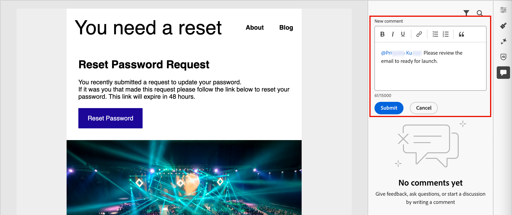
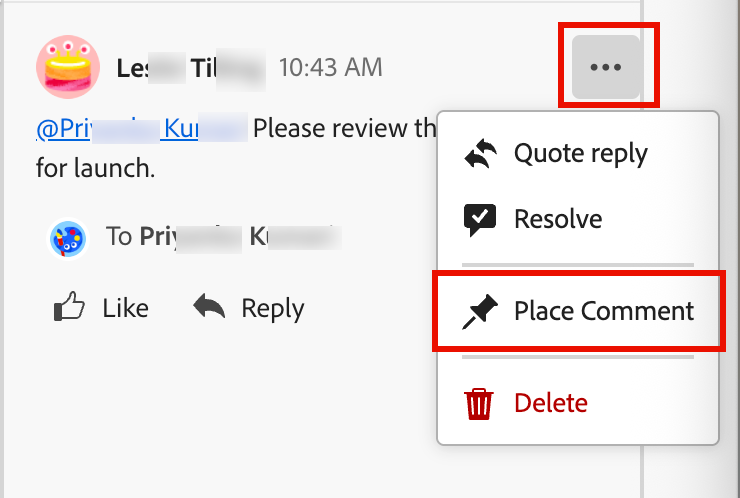
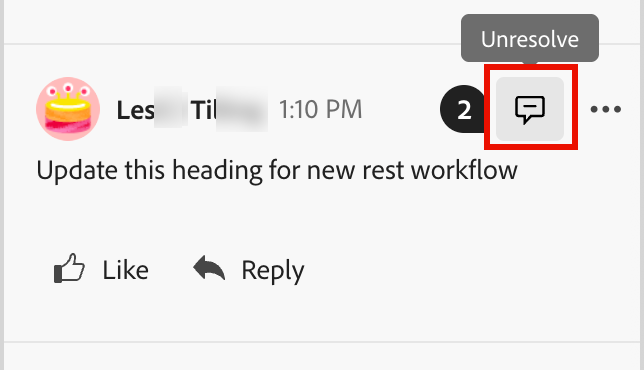

# Ferramentas de colaboração de email

O [espaço de design de email](./email-authoring.md) inclui ferramentas de colaboração para comentários e resolução, para que as equipes de marketing possam analisar, discutir e finalizar ativos de email diretamente no [!DNL Journey Optimizer B2B Edition]. Em vez de compartilhar rascunhos em ferramentas externas (como bate-papos, threads de email ou planilhas), os usuários podem comentar, sugerir edições e resolver feedbacks dentro do espaço de design de email. Use essas ferramentas para simplificar seu fluxo de trabalho, reduzir erros e garantir que as partes interessadas estejam alinhadas antes de iniciar sua campanha de email em uma jornada de conta:

* **_Feedback centralizado_** - Colete e acompanhe todos os comentários em um único local.

* **_Resenhas mais rápidas_** - Os colaboradores podem revisar a cópia do email e os ativos dentro do ambiente de criação.

* **_Precisão aprimorada_** - Reduz o risco de má comunicação ao manter todas as edições vinculadas ao próprio email.

* **_Transparência_** - Todos os comentários e resoluções permanecem registrados, deixando claro quais alterações foram sugeridas e implementadas.

* **_Collaboration no contexto_** - Revise a cópia do corpo do email, as imagens e os elementos do call-to-action (CTA) no layout.

<!-- Enable asynchronous collaboration between team members for an email asset
Allow users to attach comments to specific design elements
Provide a unified interface for viewing and managing all comments within a project
Support comment placement, editing, deleting, and navigation
Display visual indicators (badges) for elements with associated comments -->

## Habilitar ferramentas de colaboração por email para revisores

Os administradores de produtos podem habilitar o acesso às ferramentas de colaboração por email atribuindo a permissão **[!UICONTROL Gerenciar Emails B2B]** por meio da interface do usuário _Permissões_ no Adobe Experience Cloud.

+++ Ativar permissões de email

1. No aplicativo Permissões, vá para a guia **[!UICONTROL Funções]** e selecione a [função](https://experienceleague.adobe.com/pt-br/docs/experience-platform/access-control/abac/permissions-ui/roles){target="_blank"} desejada.

1. Clique em **[!UICONTROL Editar]** para modificar as permissões.

1. Adicione o recurso **[!UICONTROL Assets B2B]** e selecione **[!UICONTROL Gerenciar Emails B2B]**.

   {width="700" zoomable="yes"}

1. Clique em **[!UICONTROL Salvar]** para aplicar as alterações.

   As permissões são atualizadas automaticamente para qualquer usuário já atribuído à função.

1. Para atribuir esta função a novos usuários, selecione a guia **[!UICONTROL Usuários]** no painel _[!UICONTROL Funções]_ e clique em **[!UICONTROL Adicionar Usuário]**.

   * Insira o nome de usuário e o endereço de email ou escolha um usuário existente na lista.

     Se o usuário ainda não tiver sido criado, consulte a [documentação do Experience Platform](https://experienceleague.adobe.com/pt-br/docs/experience-platform/access-control/abac/permissions-ui/users){target="_blank"}.

   * Clique em **[!UICONTROL Salvar]** para aplicar as alterações.

+++

## Exibir comentários e ferramentas de colaboração

Ao criar, editar ou revisar conteúdo no espaço de design de email, você pode acessar o painel _Collaboration_ para adicionar ou gerenciar comentários para o conteúdo de email.

Clique no ícone do _Collaboration_ (  ) na navegação à direita.

{width="700" zoomable="yes"}

## Fluxo de trabalho do Collaboration

Você pode usar as ferramentas de colaboração para seguir um fluxo de trabalho de conteúdo padrão:

1. [Convide](#invite-collaborators-and-reviewers) seus colaboradores e revisores.
1. Revisores [adicionam comentários](#add-comments).
1. Leia comentários, [adicione respostas](#reply-to-a-comment) para discutir comentários e fazer as edições necessárias.
1. Revisores ou autores [resolvem comentários](#resolve-comments).

>[!BEGINSHADEBOX]

**Práticas recomendadas para usar as ferramentas de colaboração**

* Use a marcação `@` para que o feedback chegue rapidamente ao membro certo da equipe.

* Agrupe o feedback relacionado em uma única thread de comentário em vez de várias notas dispersas.

* Sempre resolva os comentários assim que forem endereçados, para manter um fluxo de trabalho limpo.

* Salvar uma versão final aprovada para fins de conformidade/auditoria.

>[!ENDSHADEBOX]

### Convidar colaboradores e revisores

1. Selecione o corpo do email.

1. Clique no ícone do _Collaboration_ (  ) na navegação à direita.

1. Na parte superior do painel direito, digite o texto do convite para que os usuários colaborem e forneçam feedback.

   Use o símbolo `@` para endereçar e notificar os usuários. Esses usuários recebem notificações de email e de pulsos no produto.

   Ao inserir as primeiras letras do nome após o símbolo, uma lista pop-up exibe os nomes de usuário correspondentes. Você pode inserir mais letras no nome para melhorar os resultados.

   {width="550"}

   Selecione o nome a ser adicionado para notificação.

   Adicione quantos colaboradores ou revisores você desejar incluir no convite.

   {width="700" zoomable="yes"}

1. Clique em **[!UICONTROL Enviar]**.

### Adicionar comentários

Como colaborador ou revisor de email, abra o email no espaço de design e adicione seu feedback. Você pode inserir comentários gerais no painel _Collaboration_ ou selecionar componentes na tela e adicionar um comentário específico para esse elemento de design. Adicione tags a colegas usando o `@`, como o _@John Doe Atualize a cópia do CTA_.

Cada novo comentário inicia um thread em que os colaboradores podem usar _Responder_ para continuar a discussão. Cada comentário/thread associado a um elemento de design é numerado para que você possa identificar facilmente o elemento no qual se aplica.

#### Comentários gerais e feedback

No painel _Collaboration_, use o campo de texto na parte superior para inserir um comentário geral sobre o conteúdo do email. Use o símbolo `@` para endereçar e notificar os usuários.

{width="400"}

Clique em **[!UICONTROL Enviar]** para registrar o comentário e enviar notificações a todos os usuários marcados.

#### Comentários do componente

1. Selecione uma estrutura ou um componente de conteúdo.

1. Na barra de ferramentas, clique na ferramenta _Collaboration_.

   {width="600"}

1. Insira seu comentário no campo de texto.

1. Clique em **[!UICONTROL Enviar]**.

Os colaboradores podem clicar no ícone de pino numerado na tela de email para exibir e comentar.

{width="450"}

#### Responder a um comentário

Para cada comentário, você pode usar a função _[!UICONTROL Responder]_ para continuar uma discussão ou responder a uma pergunta.

Clique em **[!UICONTROL Responder]** na parte inferior do comentário e digite o texto da sua resposta. Para incluir uma citação do comentário atual em sua resposta, clique no ícone _Mais menu_ ( **...** ) e escolha **[!UICONTROL Citar resposta]**.

{width="350"}

### Resolver comentários

Como autor ou designer, avalie o feedback dos revisores e determine quais alterações você deseja fazer. Quando as alterações forem concluídas e a solicitação for atendida, clique no ícone _Mais menu_ ( **...** ) e escolha **[!UICONTROL Resolver]**.

{width="350"}

No diálogo de confirmação, clique em **[!UICONTROL Resolver]**.

## Gerenciar comentários

Gerencie os comentários e threads para avaliar o status do seu esforço de colaboração.

### Inserir um comentário

Se um comentário não estiver associado a um elemento na tela de email, você poderá _fixar_ o comentário a um elemento, conforme necessário. Clique no ícone _Mais menu_ ( **...** ) e escolha **[!UICONTROL Inserir comentário]**. Em seguida, selecione o componente de design na tela.

{width="350"}

### Remover ou excluir comentários

Você pode limpar o registro de comentários removendo e excluindo-os. Clique no ícone _Mais menu_ ( **...** ) e escolha **[!UICONTROL Remover Comentário]** ou **[!UICONTROL Excluir]**.

{width="350"}

* Quando você remove um comentário, a ação desvincula esse comentário do elemento de design (selecionado quando o comentário foi criado). O comentário ainda faz parte do registro de comentário do email.

* Quando você exclui um comentário, a ação o exclui permanentemente do registro.

### Comentários resolvidos

Por padrão, comentários resolvidos ficam ocultos no painel _Collaboration_. É possível exibir comentários resolvidos a qualquer momento, limpando o filtro. Clique no ícone _Filtro_ (  ) e desmarque a caixa de seleção **[!UICONTROL Ocultar comentários resolvidos]**.

{width="350"}

Os comentários resolvidos incluem um ícone de _Não resolver_ (  ). Se você determinar que um comentário/thread não foi resolvido e outras alterações forem necessárias, clique no ícone para remover a designação _[!UICONTROL Resolvido]_.

{width="300"}
