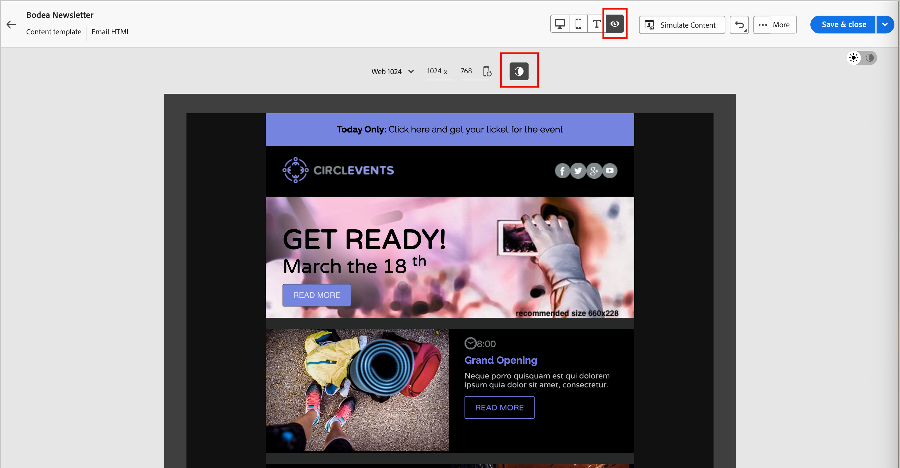
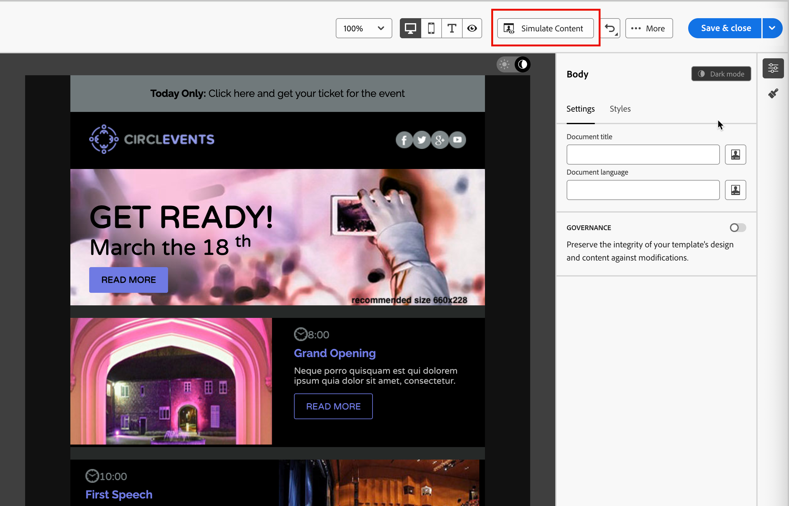

# Modo escuro para conteúdo de email {#dark-mode}

>[!CONTEXTUALHELP]
>id="ajo-b2b_dark_mode"
>title="Alternar para o modo escuro"
>abstract="Alterne para o modo escuro, onde é possível visualizar como ele pode ser renderizado e definir configurações personalizadas específicas.  A renderização final depende do cliente de email do recipient. Observe que todos os clientes de email não são compatíveis com o modo escuro personalizado."

>[!CONTEXTUALHELP]
>id="ajo-b2b_dark_mode_preview"
>title="Alternar para o modo escuro"
>abstract="Alterne para o modo escuro para visualizar como ele pode ser renderizado no suporte a clientes de email.  A renderização final depende do cliente de email do recipient. Observe que todos os clientes de email não são compatíveis com o modo escuro."

_Modo escuro_ permite que um cliente ou aplicativo de email de suporte exiba emails com planos de fundo mais escuros e cores mais claras para texto, botões e outros elementos visuais. Esse tipo de monitor pode reduzir a tensão ocular, economizar bateria e melhorar a legibilidade em ambientes com pouca luminosidade, proporcionando uma experiência de visualização mais confortável. Como uma tendência crescente nos principais sistemas operacionais e aplicativos, agora é uma consideração importante no design de email moderno para garantir que o conteúdo permaneça legível e visualmente atraente para todos os usuários.

{width="50%"}

À medida que você [cria seu conteúdo de email](./email-authoring.md) no espaço de design visual do [!DNL Journey Optimizer B2B Edition], é possível alternar para o modo de exibição _**[!UICONTROL Escuro]**_. Nesta visualização, também é possível definir configurações personalizadas específicas para oferecer suporte a clientes de email quando o modo escuro estiver ativado.

## Considerações do cliente de email

Há uma variação significativa na maneira como diferentes clientes de email e aplicativos aplicam o modo escuro. Por isso, você deve considerar as expectativas para a renderização no modo escuro com cuidado. Antes de usar o modo escuro no espaço de design de email, considere os seguintes casos de uso de cliente de email:
<!--
* Check out the list of [email clients supporting dark mode](https://www.caniemail.com/search/?s=dark){target="_blank"}

* Learn more on Dark mode in this [Litmus blog post](https://www.litmus.com/blog/the-ultimate-guide-to-dark-mode-for-email-marketers){target="_blank"}
-->

+++Clientes que não oferecem suporte ao modo escuro

Alguns clientes de email não oferecem suporte a esse recurso, como:

* [!DNL Yahoo! Mail]
* [!DNL AOL]

Se você definir configurações personalizadas de modo escuro no design de email, esses clientes de email não poderão exibir nenhuma renderização de modo escuro. <!--Regardless of whether the interface is in light or dark mode, your email will render the same.-->

+++

+++Clientes aplicando seu próprio modo escuro {#default-support}

Alguns clientes de email aplicam sistematicamente seu próprio modo escuro padrão a todos os emails recebidos. Eles ajustam automaticamente cores, planos de fundo, imagens e outros elementos de acordo com suas configurações de modo escuro e configurações externas não são possíveis. Esses clientes incluem:

* Gmail (Desktop Webmail, iOS, Android™, Mobile Webmail)
* Outlook Windows
* Outlook Windows Mail

<!--It is important to note that less than 25% of email clients offer customization options for dark mode. Clients such as Gmail implement their own dark mode rendering, which is not subject to external modification.-->
In this case, the client dark mode settings override the custom dark mode settings that you define in [!DNL Journey Optimizer B2B Edition]

+++

+++Clients that support custom dark mode

Many of the most popular email clients offer the option to render custom dark mode with the `@media (prefers-color-scheme: dark)` query, which is the method used by the [!DNL Journey Optimizer B2B Edition] email styles. This list of clients includes:

* Apple Mail macOS
* Apple Mail iOS
* Outlook macOS
* Outlook.com
* Outlook iOS
* Outlook Android™

In this case, the specific settings you define in the [!DNL Journey Optimizer B2B Edition] are rendered. However, some restrictions could apply according to each email client. For example, some clients (such as Apple Mail 16 (macOS 13)) do not generate dark mode if images are present in the email content.

For optimal results, test your content with the email clients that you are targeting. To see a simulation that comes as close as possible to the final result for each client, use the [Litmus email test rendering](./email-test-rendering.md) integration in the email design space.

+++

## Design for dark mode

As you style your email content for dark mode in [!DNL Journey Optimizer B2B Edition], the visual design space provides two types of tools:

* Use the [preview function](#preview-default-dark-mode) to review the default dark mode rendering for most supporting email clients.

* If you want to override the default settings of supporting email clients, define and apply custom dark mode settings to your email content. [Learn more](#define-custom-dark-mode)

### Visualizar modo escuro padrão {#preview-dark-mode}

<!-- Should work with templates and themes, NOT for LP and fragments - but TBC with eng. 
>[!NOTE]
>
>Currently you may not be able to switch to dark mode if you select an [email template](use-email-templates.md) or if you apply a [theme](apply-email-themes.md).-->

1. Open the email content in the email design space.

   Na parte superior direita da tela de desenho, há um seletor de claro-escuro que alterna a exibição do conteúdo entre o modo claro (padrão) e escuro.

   {width="700" zoomable="yes"}

1. Altere o seletor para _Modo escuro_ (  ).

   A tela de desenho exibe o conteúdo usando o modo escuro padrão preview.x

   Por padrão, a visualização do modo escuro aplica o esquema de cores `full color invert` a todos os elementos, exceto imagens e ícones. Esse esquema de cores detecta áreas com elementos claros e escuros e os inverte. Os planos de fundo claros se tornam escuros e o texto escuro se torna claro, ou os planos de fundo escuros se tornam claros e o texto claro se torna escuro.

   {width="700" zoomable="yes"}

>[!CAUTION]
>
>A renderização final pode variar de acordo com o cliente de email do recipient. Para ver uma simulação que se aproxime o máximo possível do resultado final para cada cliente de email, use a integração [Renderização de email de teste Litmus](./email-test-rendering.md).

### Definir configurações personalizadas do modo escuro {#custom-dark-mode}

>[!CONTEXTUALHELP]
>id="ajo-b2b_dark_mode_image"
>title="Usar uma imagem específica para o modo escuro"
>abstract="Você pode selecionar outra imagem para exibir quando o modo escuro estiver ativado.  Adicionar uma imagem específica para o modo escuro não garante que ela seja renderizada corretamente em todos os clientes de email. Observe que todos os clientes de email não são compatíveis com o modo escuro personalizado."

Depois de alternar para o modo escuro, você pode optar por editar elementos de estilo específicos do seu conteúdo, que são exibidos somente quando o modo escuro está ativado no cliente de email do recipient (desde que seja compatível com esse recurso).

>[!NOTE]
>
>A renderização final no modo escuro depende de cada cliente de email, portanto, os resultados podem variar de um para o outro. Revise as [considerações sobre o cliente de email](#email-client-considerations) para obter mais informações.

O estilo de modo escuro personalizado no espaço de design de email usa o <!-- `@media (prefers-color-scheme: dark)` method--> Consulta CSS `@media (prefers-color-scheme: dark)`, que detecta se o cliente de email está definido para o modo escuro e aplica o design de tema escuro definido no seu email.

_Para definir configurações personalizadas do modo escuro :_

1. Se necessário, mova o seletor para _Modo escuro_ (  ) na parte superior direita da tela de design.

1. Edite quaisquer atributos de cor de estilo, como texto, planos de fundo ou botões.

   {width="700" zoomable="yes"}

1. Para as imagens e ícones, defina ativos específicos somente para o modo escuro.

   Não é possível alterar as cores das imagens e dos ícones, mas você pode definir ativos alternativos a serem usados no modo escuro. Você pode experimentar diferentes combinações de cores para seus ícones ou fazer ajustes de cores e saturação para imagens fotográficas.

   {width="80%"}

   Select any image and switch to **[!UICONTROL Dark mode]** using the dedicated toggle in the **[!UICONTROL Settings]** pane. Then, select a different image asset.

   {width="700" zoomable="yes"}

   See [Add image assets](./email-authoring.md#add-image-assets) for more information about selecting an image asset.

1. At any point during your design changes, select **[!UICONTROL Switch to live view]** to check how your content might render on various device sizes.

   From this view, change the selector to _Dark mode_ (  ) to preview the dark mode version of your content across the different devices.

   {width="800" zoomable="yes"}

   >[!CAUTION]
   >
   >The live view is a generic preview designed to compare how the rendering might look across various device sizes. The final rendering could vary depending on the recipient&#39;s email client.

1. When your dark mode changes are complete, click **[!UICONTROL Simulate Content]**.

   {width="700" zoomable="yes"}

   Use the preview and proofing tools to test your email design. See [Preview and test your email content](./email-simulate-content.md) for more information.

1. If you have a Litmus Enterprise account, select **[!UICONTROL Render email]** to see the final dark mode rendering for various email clients in the Litmus .

   See [Test email rendering with Litmus](./email-test-rendering.md) for more information.

   >[!CAUTION]
   >
   >While simulation closely approximates how emails appear in dark mode, actual rendering could differ due to variations in email service providers or device-level settings.

## Práticas recomendadas {#best-practices}

As dark mode adoption increases across major email clients, it is essential to consider how your emails render in both light and dark environments - whether you are using [custom dark mode](#define-custom-dark-mode) or not.

Dark mode can alter colors, backgrounds, and images — sometimes overriding design choices. To ensure visual consistency, accessibility, and brand integrity, follow these best practices:

| Practice |            |
| -------- | ---------- |
| Optimize your images and logos | Checklist:<ul><li>Save logos and icons as PNG files with transparent backgrounds to avoid visible white boxes in dark mode. <li>Avoid images with hardcoded white or light backgrounds. <li>Se a transparência não for uma opção, coloque as imagens em um plano de fundo sólido no design para evitar inversões de cores estranhas. |
| Veja seus planos de fundo | Lista de verificação:<ul><li>Verifique se há contraste suficiente entre o texto e as cores do plano de fundo para facilitar a leitura nos modos claro e escuro. <li>Evite depender apenas das cores do plano de fundo para o conteúdo crítico. Alguns clientes substituem as cores do plano de fundo no modo escuro, portanto, verifique se as informações principais ainda estão visíveis. |
| Criar conteúdo acessível no modo escuro | Lista de verificação:<ul><li>Use combinações de cores fáceis de distinguir para pessoas com daltonismo. <li>Use uma paleta de tons médios para garantir o contraste em planos de fundo claros e escuros. <li>Use combinações de cores acessíveis com alto contraste para melhorar a legibilidade e atender aos padrões do [!DNL Web Content Accessibility Guidelines (WCAG)]. Use ferramentas como o [!DNL WebAIM Contrast Checker] para verificar o contraste de cores. <li>Evite fontes finas, pois isso pode afetar a legibilidade. Se sua marca requer uma fonte fina, coloque-a em negrito no modo escuro. <li>Ignorar branco puro em preto puro, o que pode causar tensão ocular e pode ser invertido automaticamente em alguns clientes de email. <li>Fornecer estilo de fallback acessível se o modo escuro não for compatível. |
| Testar seus emails em um ambiente no modo escuro | Lista de verificação:<ul><li>Use a [visualização de modo escuro](#preview-dark-mode) no espaço de design de email, que usa esquemas de cores invertidas para detectar problemas antecipadamente. <li>Use uma conta Litmus Enterprise com a opção [[!UICONTROL Renderizar email]](./email-test-rendering.md) para simular seus designs nos principais clientes de email (como Apple Mail, Gmail e Outlook) e ver como as cores e as imagens se comportam no modo escuro. |

<!--KEEP dark mode accessibility best practices IN ONE SINGLE LOCATION - for now listed on this page.
If needed, it can be moved to the Design accessible content page:
The best practices for designing accesible content in dark mode are listed in [this section](accessible-content.md#dark-mode).-->

<!--**Inline critical styles**

Inline CSS helps maintain more control over styling, as some clients strip external styles in dark mode.-->
