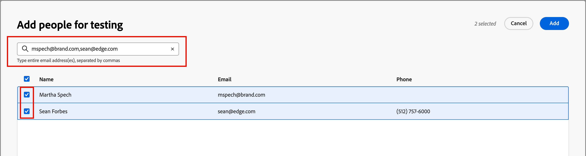

# Visualizar e testar o conteúdo do email {#preview-simulate}

>[!CONTEXTUALHELP]
>id="ajo-b2b_email_preview_simulate"
>title="Verificar como o conteúdo está sendo renderizado"
>abstract="Após o conteúdo ser definido, é possível visualizá-lo e verificar se a renderização está correta para o canal que está sendo utilizado."

Use o recurso _Simular conteúdo_ para visualizar o conteúdo do email e enviar entregas de teste para destinatários específicos. Os campos de email necessários devem ser definidos, incluindo _[!UICONTROL Do nome]_, _[!UICONTROL Do endereço]_, _[!UICONTROL Responder para endereço]_ e _[!UICONTROL Linha de assunto]_, para acessar os recursos de visualização e teste.

>[!IMPORTANT]
>
>Não é possível visualizar o email se houver erros. Verifique os _Alertas_ para garantir que nenhum erro esteja bloqueando as funções de visualização. Os avisos não bloqueiam a visualização, mas você deve endereçá-los antes de publicar a jornada que aciona o delivery de email.

## Exibir a visualização do email

Você pode acessar a visualização de renderização no [espaço de design de email](./email-authoring.md) ou no _[!UICONTROL Resumo]_ ao [abrir um email na lista de Emails](./emails-list.md#edit-emails).

1. Clique em **[!UICONTROL Simular conteúdo]** na parte superior.

   {width="800" zoomable="yes"}

   >[!NOTE]
   >
   >Esse botão não estará disponível se houver erros ou se os campos obrigatórios não estiverem definidos para o email.

1. Na página _[!UICONTROL Simular]_, selecione um perfil de pessoa na lista **[!UICONTROL Pessoas]** para usar na renderização do email.

   Na pré-visualização de conteúdo, os elementos personalizados são preenchidos de acordo com o perfil da pessoa selecionada.

   {width="800" zoomable="yes"}

   Se a lista _[!UICONTROL Pessoas]_ à esquerda estiver vazia, [adicione pessoas](#add-people-to-the-profiles-list) usando contatos da instância conectada do Marketo Engage.

   >[!TIP]
   >
   >Você também pode usar a [integração de renderização de teste Litmus](./email-test-rendering.md) para verificar a renderização de mensagens de email em clientes populares de desktop, dispositivos móveis e baseados na Web.

## Ajustar as opções de exibição

Use as ferramentas de exibição para alterar a visualização de acordo com o tipo de dispositivo ou o nível de zoom:

* Selecione o ícone da _Área de trabalho_ (  ) para exibir a visualização usando o estilo da área de trabalho e a taxa de proporção.
* Selecione o ícone _Dispositivo móvel_ (  ) para exibir a visualização usando o estilo e a taxa de proporção do dispositivo móvel.
* Clique na seta _Nível de zoom_ e selecione uma porcentagem de zoom para analisar como o conteúdo muda de acordo com o nível de zoom.

{width="600" zoomable="yes"}

## Enviar provas

Uma prova é uma mensagem de teste entregue que permite que você e os membros de sua equipe revisem uma mensagem de email antes de enviá-la aos membros de um público-alvo. Os recipients da prova podem verificar a renderização da mensagem, o conteúdo, as configurações de personalização e a configuração. É possível enviar provas usando um perfil de teste selecionado.

1. Clique em **[!UICONTROL Enviar prova]** na parte superior direita.

   {width="500"}

1. Na página _Enviar prova_, digite o endereço de email do primeiro destinatário.

1. Para cada destinatário adicional que deseja incluir na revisão, clique em **[!UICONTROL Adicionar destinatário]** e insira seu endereço de email no campo **[!UICONTROL Enviar para]**.

   Você pode adicionar até dez recipients para o delivery de prova.

1. Para cada destinatário, defina o campo **[!UICONTROL Simular como]** selecionando um perfil de teste a ser usado para personalizar o conteúdo da mensagem.

   {width="700" zoomable="yes"}

1. Clique em **[!UICONTROL Enviar prova]**.

## Adicionar pessoas à lista de perfis

1. Na parte superior da lista _[!UICONTROL Pessoas]_, clique em **[!UICONTROL Adicionar Pessoas]**.

   {width="500"}

1. Na caixa de diálogo _[!UICONTROL Adicionar pessoas para teste]_, digite o endereço de email completo do contato.

   Para adicionar vários contatos, insira vários endereços separados por vírgula.

1. Marque a caixa de seleção de cada contato correspondente que deseja adicionar à lista de perfis de teste.

   {width="700" zoomable="yes"}

1. Clique em **[!UICONTROL Adicionar]** na parte superior direita.
