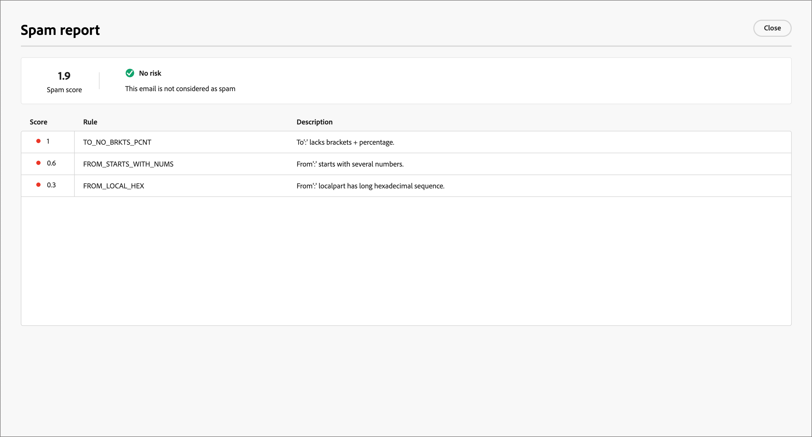

# Revisar o relatório de spam

Muitos provedores de caixa de entrada de email e a maioria dos sistemas corporativos usam um processo de filtragem de spam. O envio de emails que acionam esses filtros pode afetar seriamente a capacidade de entrega. No Journey Optimizer B2B edition, você pode verificar a pontuação de spam do conteúdo de email gerando um relatório de Spam. Este relatório usa [[!DNL SpamAssassin]](https://spamassassin.apache.org/) para testar o email e ajuda a determinar se uma mensagem pode ser considerada spam pelas ferramentas antisspam. Você pode usar as informações no relatório para realizar ações que melhoram a pontuação do conteúdo do email e a capacidade de delivery.

Ao revisar suas configurações de email ou editar o conteúdo, abra a página _[!UICONTROL Simular]_ e gere um _Relatório de spam_ para analisar a pontuação e os elementos sinalizados que podem acionar a filtragem antisspam.

1. Na página _[!UICONTROL Simular]_, clique em **[!UICONTROL Relatório de spam]** na parte superior direita.

   {width="700" zoomable="yes"}

   O processo de relatório verifica o conteúdo do email e gera uma pontuação com uma lista das regras de filtragem acionadas usadas para gerar a pontuação. Os fatores incluem layout de corpo, estrutura, tamanho da imagem, palavras de acionamento de spam e outros elementos. Para obter uma lista dos testes de avaliação da regra para os elementos de email, consulte a [[!DNL SpamAssassin] lista de testes](https://spamassassin.apache.org/old/tests_3_0_x.html).

1. Verifique as pontuações e descrições de cada item.

   >[!NOTE]
   >
   >A pontuação de spam é calculada por meio do SpamAssassin, e o Adobe não possui as regras ou a lógica de pontuação. Para obter mais detalhes sobre o projeto de código aberto [!DNL SpamAssassin], consulte a [[!DNL SpamAssassin] documentação](https://cwiki.apache.org/confluence/display/SPAMASSASSIN/).

   Quanto menor a pontuação, menos provável será que o email seja marcado como spam.

   {width="600" zoomable="yes"}

   Com uma pontuação maior que 5, o relatório inclui um aviso de que algumas mensagens podem ser bloqueadas ou marcadas como spam quando recebidas. É uma prática recomendada garantir que a pontuação seja inferior a 2.

   {width="600" zoomable="yes"}

1. Se houver elementos no conteúdo do email que possam ser melhorados, edite o conteúdo para aplicar as atualizações necessárias.

1. Quando as alterações forem concluídas, volte à página _[!UICONTROL Simular]_ e clique novamente em **[!UICONTROL Relatório de spam]** para verificar as melhorias de pontuação resultantes.

