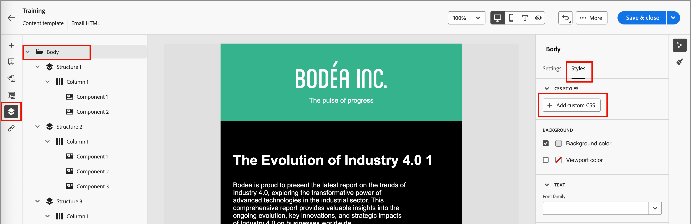

# Criação de modelo de email

Depois de [criar um modelo de email](./email-templates.md#create-an-email-template), use o espaço de design visual para criar os componentes estruturais e de conteúdo no seu modelo de email.

## Adicionar estrutura e conteúdo {#structure-content}

{{$include /help/_includes/content-design-components.md}}

### Adicionar CSS personalizado

Você pode adicionar seu próprio CSS personalizado diretamente no espaço de design do modelo de email. Use o CSS personalizado para aplicar um estilo avançado e específico, proporcionando maior flexibilidade e controle sobre a aparência do seu conteúdo. É uma prática recomendada adicionar esse estilo de mais alto nível antes de incluir componentes, como imagens, botões e texto.

Com pelo menos um componente de conteúdo na tela, selecione o componente **[!UICONTROL Corpo]** na árvore de navegação esquerda para acessar o editor de CSS personalizado.

{width="800" zoomable="yes"}

{{$include /help/_includes/content-design-custom-css.md}}

### Adicionar fragmentos

>[!NOTE]
>
>Os fragmentos não são compatíveis entre o _Modo de tema_ e o _Modo manual_ no conteúdo do email. Para usar um fragmento no conteúdo de email no qual um tema é aplicado, ele também deve ser criado no _Modo de tema_.

{{$include /help/_includes/content-design-use-fragments.md}}

Depois que o modelo é salvo, ele aparece na página de detalhes do fragmento ao selecionar a guia _[!UICONTROL Usado por]_ no resumo.

### Adicionar ativos de imagem

{{$include /help/_includes/content-design-assets.md}}

### Navegar pelas camadas, configurações e estilos

{{$include /help/_includes/content-design-navigation.md}}

### Personalizar conteúdo

{{$include /help/_includes/content-design-personalization-email.md}}

### Editar rastreamento de URL vinculado

{{$include /help/_includes/content-design-links.md}}

### Aplicar estilo de modo escuro

Use o _Modo escuro_ para analisar a exibição de emails para ver se há um tema escuro em um cliente de email. Um modo ou tema escuro permite que um cliente ou aplicativo de email de suporte exiba emails com planos de fundo mais escuros e cores mais claras para texto, botões e outros elementos visuais. Na parte superior direita da tela de design, altere o seletor para _Modo escuro_ (  ). Em seguida, visualize e defina configurações personalizadas específicas usadas para exibição pelos clientes de email de suporte quando o tema escuro estiver habilitado.

{width="700" zoomable="yes"}

Para obter mais informações sobre o estilo e as práticas recomendadas do modo escuro, consulte [Modo escuro para conteúdo de email](./email-dark-mode.md).

## Exibir opções

Aproveite as opções de exibição e validação de conteúdo disponíveis no espaço de design visual.

* Aumentar/diminuir o zoom do conteúdo nas opções de zoom predefinidas.

* Alternar a exibição do conteúdo na área de trabalho, dispositivo móvel ou somente texto/texto sem formatação.
   * Clique no ícone _Olho_ para visualizar o conteúdo entre dispositivos.
   * Selecione um dos dispositivos prontos para uso ou insira dimensões personalizadas para visualizar o conteúdo.

### Mais opções

No menu _[!UICONTROL Mais...]_, na parte superior do espaço de design de email, você pode realizar as seguintes ações:

{width="500"}

* **[!UICONTROL Redefinir modelo]** - Clique nesta opção para limpar a tela de design em branco e reiniciar a criação de conteúdo.
* **[!UICONTROL Salvar como fragmento]** - Salve todo o modelo ou partes dele como um fragmento a ser reutilizado em vários emails ou modelos de email. Forneça um nome e uma descrição para o fragmento e salve-o na lista de fragmentos disponíveis.
* **[!UICONTROL Alterar seu design]** - Retorne à página _Criar seu email_. A partir daí, você pode escolher outro modelo para reiniciar o processo de design. Você também pode optar por criar o conteúdo do zero com uma tela em branco (_Modo clássico_) ou usar um [Tema da marca](./brand-themes.md) (_Modo do tema_).
* **[!UICONTROL Exportar HTML]** - Baixe o conteúdo na tela visual para o sistema local no formato HTML empacotado como um arquivo zip.
