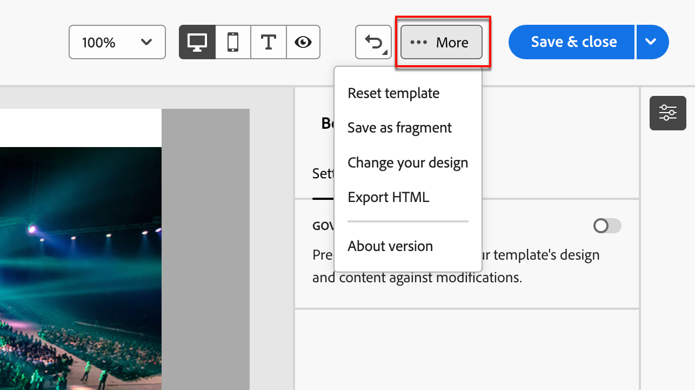
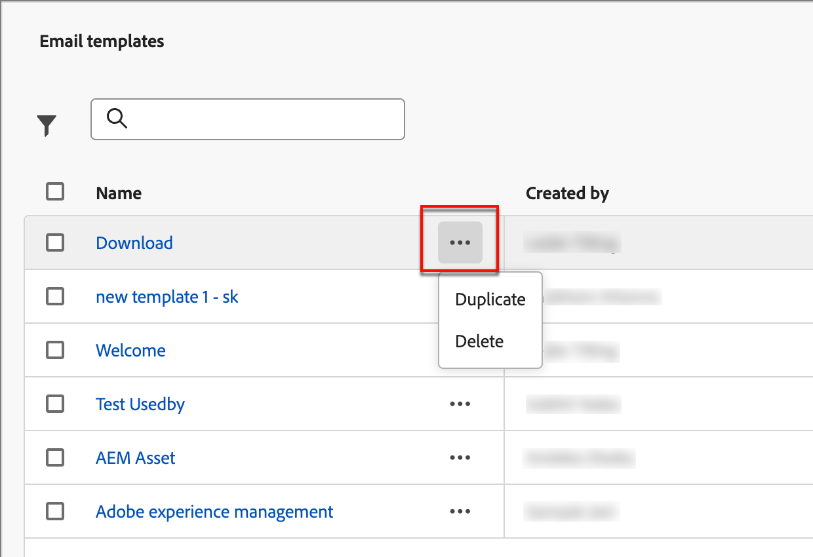

# Modelos de e-mail

Para um processo de design acelerado e aprimorado, você pode criar modelos de email independentes para reutilizar conteúdo personalizado nas jornadas de conta do Adobe Journey Optimizer B2B Edition. Por meio de modelos, os membros da equipe orientados a conteúdo podem trabalhar no conteúdo de email fora do jornada. Os estrategistas de marketing podem então reutilizar e adaptar esses modelos independentes dentro de suas jornadas de conta. Por exemplo, um membro da equipe é responsável apenas pelo conteúdo, sem acesso às jornadas da conta. No entanto, eles podem criar um template de email que os profissionais de marketing podem selecionar como ponto de partida para comunicações por email e personalizá-lo de acordo com os requisitos da jornada.

## Acessar e gerenciar modelos de email

Para acessar modelos de email na edição B2B do Adobe Journey Optimizer, vá para a navegação à esquerda e clique em **[!UICONTROL Gerenciamento de Conteúdo]** > **[!UICONTROL Modelos]**. Essa ação abre uma página de listagem com todos os templates de email criados na instância listada em uma tabela.

A tabela é classificada pela coluna _[!UICONTROL Modificado]_, com os modelos atualizados mais recentemente no topo da lista por padrão. Clique no título da coluna para alterar entre crescente e decrescente.

Para pesquisar um modelo por nome, digite uma string de texto na barra de pesquisa. Clique no ícone _Filtro_ na parte superior esquerda para filtrar a lista de acordo com as datas de criação ou modificação e os modelos que você criou ou modificou.

{width="700" zoomable="yes"}

Personalize as colunas que deseja exibir na tabela clicando no ícone _Personalizar tabela_ na parte superior direita. Selecione as colunas a serem exibidas e clique em **[!UICONTROL Aplicar]**.

Na página de listagem, você pode realizar as ações descritas nas seções a seguir.

## Criar modelos de email

Você pode criar um novo modelo de email na página de listagem de modelos de email clicando em **[!UICONTROL Criar modelo]** na parte superior direita.

1. Na caixa de diálogo, insira um **[!UICONTROL Nome]** e uma **[!UICONTROL Descrição]** úteis (opcional).

   {width="400"}

1. Defina a **[!UICONTROL origem da imagem]** inicial.

   Se você tiver uma assinatura do Experience Manager Assets as a Cloud Service junto com o Adobe Marketo Engage Design Studio padrão, poderá escolher ativos de imagem de qualquer uma das origens. Para fazer isso, você deve selecionar a fonte de imagem no momento da criação de um modelo de email ou fragmento visual. No entanto, também é possível selecionar a fonte da imagem ao editar o conteúdo.

   Para obter mais informações sobre fontes de imagem, consulte [Assets](./assets-overview.md).

1. Clique em **[!UICONTROL Criar]**.

A página _[!UICONTROL Criar seu modelo]_ é aberta e fornece várias opções para a criação do modelo: _[!UICONTROL Criar do zero]_, _[!UICONTROL Importar HTML]_ ou _[!UICONTROL Selecionar modelo de design]_.

{width="800" zoomable="yes"}

### Criar do zero

Use o designer de email para definir a estrutura do seu conteúdo de email. Ao adicionar e mover componentes estruturais com ações simples de arrastar e soltar, você pode criar a forma do conteúdo de email reutilizável em segundos.

1. Na página inicial _[!UICONTROL Criar seu modelo]_, selecione a opção **[!UICONTROL Criar do zero]**.

1. Comece a projetar seu conteúdo arrastando e soltando componentes na tela para definir o layout estrutural do email.

   As ferramentas de design disponíveis são equivalentes às ferramentas usadas para [criação de email](./email-authoring.md). A diferença é que esse conteúdo é salvo como um modelo que pode ser reutilizado em vários nós de email de envio nas jornadas da conta.

### Importar HTML

O Adobe Journey Optimizer B2B Edition permite importar conteúdo de HTML existente para criar seus modelos de email. Esse conteúdo pode ser:

* Um arquivo HTML com uma folha de estilos incorporada.
* Um arquivo .zip que inclui um arquivo HTML, a folha de estilos (.css) e imagens

  >[!NOTE]
  >
  >Não há restrições na estrutura do arquivo .zip. No entanto, as referências devem ser relativas e se encaixar na estrutura de árvore da pasta .zip.

_Para importar um arquivo com conteúdo HTML:_

1. Na página inicial _[!UICONTROL Criar seu modelo]_, selecione a opção **[!UICONTROL Importar HTML]**.

1. Arraste e solte o arquivo HTML ou .zip que contém o conteúdo HTML e clique em **[!UICONTROL Importar]**.

   Depois que o conteúdo do HTML for carregado, seu conteúdo estará no _Modo de compatibilidade_. Nesse modo, você só pode personalizar seu texto, adicionar links ou incluir ativos ao seu conteúdo.

1. Para usar os componentes de conteúdo do designer de email, clique na guia **[!UICONTROL conversor de HTML]** e clique em **[!UICONTROL Converter]**.

>[!NOTE]
>
>Usar uma marca `<table>` como a primeira camada em um arquivo de HTML pode causar perda de estilo, incluindo configurações de plano de fundo e largura na marca de camada superior.

Você pode personalizar o conteúdo importado conforme necessário com as ferramentas do editor visual de email.

### Selecionar um modelo de design

Na página inicial _[!UICONTROL Criar seu modelo]_, use a seção Selecionar modelo de design para começar a criar o conteúdo a partir de um modelo. Você pode usar um modelo de amostra ou um modelo de email salvo da instância do Journey Optimizer B2B Edition.

>[!BEGINTABS]

>[!TAB Modelos salvos]

Na página inicial _Criar seu modelo_, a guia _Modelos de amostra_ é selecionada por padrão. Para usar um modelo personalizado, selecione a guia **[!UICONTROL Modelos salvos]**.

A lista de todos os modelos de email criados na sandbox atual é exibida. Você pode classificá-los por _[!UICONTROL Nome]_, _[!UICONTROL Última modificação]_ e _[!UICONTROL Última criação]_.

{width="800" zoomable="yes"}

Selecione o template desejado na lista.

Após a seleção, é exibida uma pré-visualização do modelo. No modo de visualização, você pode navegar entre todos os modelos de uma categoria (amostra ou salva, dependendo da seleção) usando as setas para a direita e para a esquerda.

{width="800" zoomable="yes"}

Quando a exibição corresponder ao que você deseja usar, clique em **[!UICONTROL Usar este modelo]** na parte superior direita da janela de visualização.

Essa ação copia o conteúdo no designer de conteúdo visual, onde você pode editar o conteúdo conforme necessário.

>[!TAB Modelo de amostra]

O Adobe Journey Optimizer B2B Edition oferece uma seleção de modelos de email oferecidos _prontos para uso_, que podem ser usados para criar emails e modelos de email.

{width="800" zoomable="yes"}

>[!ENDTABS]

## Adicionar estrutura e conteúdo

Comece a criar o seu conteúdo arrastando e soltando estruturas do menu **[!UICONTROL Componentes]** na tela para definir o layout do seu email.

Adicione quantas estruturas forem necessárias e edite suas configurações nas propriedades do elemento à direita.

Selecione o componente _[!UICONTROL n:n coluna]_ para definir o número de colunas de sua escolha (entre três e 10). Defina a largura de cada coluna movendo as setas na parte inferior.

>[!NOTE]
>
>Cada tamanho de coluna não pode estar abaixo de 10% da largura total do componente de estrutura. Você pode remover apenas colunas vazias.

Expanda a seção **[!UICONTROL Conteúdo]** e adicione quantos elementos forem necessários em um ou mais componentes da estrutura.

Cada componente pode ser personalizado ainda mais com as guias _[!UICONTROL Configurações]_ ou _[!UICONTROL Estilo]_ no painel direito. Por exemplo, é possível alterar o estilo do texto, o preenchimento ou a margem de cada componente.

### Navegar pelas camadas, configurações e estilos

O exemplo a seguir descreve as etapas para ajustar o preenchimento e o alinhamento vertical dentro de um componente de estrutura composto por três colunas.

1. Selecione o componente de estrutura diretamente no email ou usando a Árvore de navegação disponível no menu esquerdo.

1. Na barra de ferramentas, clique em **[!UICONTROL Selecionar uma coluna]** e escolha a que deseja editar.

   Componente de coluna {width="800" zoomable="yes"}

   Também é possível selecioná-la na árvore de estrutura. Os parâmetros editáveis para essa coluna são exibidos na guia _[!UICONTROL Estilos]_.

1. Em **[!UICONTROL Alinhamento]**, selecione o ícone _Superior_, _Meio_ ou _Inferior_.

1. Em **[!UICONTROL Preenchimento]**, defina o preenchimento para todos os lados.

   Selecione **[!UICONTROL Preenchimento diferente para cada lado]** se desejar ajustar o preenchimento. Clique no ícone de bloqueio para interromper a sincronização.

1. Se necessário, ajuste o alinhamento e o preenchimento das outras colunas.

1. Salve as alterações.

### Personalizar conteúdo

O exemplo a seguir descreve as etapas para personalizar o conteúdo do modelo usando atributos de cliente potencial/conta e tokens do sistema.

1. Selecione o componente de texto e clique no ícone _Adicionar personalização_ na barra de ferramentas.

   {width="500"}

   Esta ação abre a caixa de diálogo _Editar Personalization_.

1. Clique em **+** ou **...** para adicionar um token ao espaço em branco.

   {width="700" zoomable="yes"}

1. Clique em **[!UICONTROL Salvar]**.

### Adicionar fragmentos

No editor de conteúdo visual, o ícone _Fragmentos_ é exibido à esquerda. O exemplo a seguir descreve as etapas para adicionar fragmentos ao conteúdo do modelo.

1. Para abrir a lista de fragmentos, clique no ícone _Fragmentos_.

   É possível:

   * Classifique a listagem.
   * Procurar, Pesquisar ou Filtrar a listagem.
   * Alternar entre as visualizações em Miniatura e em Lista.
   * Atualize a lista para refletir qualquer um dos fragmentos criados recentemente.

   {width="700" zoomable="yes"}

1. Arraste e solte qualquer um dos fragmentos no espaço reservado do componente de estrutura.

   O editor renderiza o fragmento na seção/elemento da estrutura de email.

O conteúdo do fragmento é atualizado dinamicamente na estrutura para renderizar um visual de como o conteúdo aparece no email.

Se quiser adicionar o fragmento para que ele ocupe o layout horizontal inteiro no email, adicione uma estrutura de coluna 1:1 e, em seguida, arraste e solte o fragmento nele.

Depois que o email for salvo, ele aparecerá na página de detalhes do fragmento ao selecionar a guia _[!UICONTROL Usado por]_ no resumo. Os fragmentos adicionados a um modelo de email não são editáveis no modelo — o conteúdo é definido pelo fragmento de origem.

### Adicionar ativos

No editor de conteúdo visual, selecione o ícone _Assets_ que é exibido à esquerda.

>[!NOTE]
>
>Se você tiver uma assinatura do Experience Manager Assets as a Cloud Service com o Adobe Marketo Engage Design Studio padrão, poderá escolher ativos de imagem da origem selecionada na página de detalhes do modelo.

O exemplo a seguir descreve as etapas para adicionar ativos ao conteúdo do modelo:

1. Para abrir a biblioteca de ativos, clique no ícone _Assets_.

   No seletor de ativos, você pode selecionar ativos diretamente armazenados na biblioteca de origem.

1. Adicione um novo ativo arrastando e soltando o ativo de imagem em um componente de estrutura.

1. Substitua um ativo de imagem selecionando-o na tela e clique em **[!UICONTROL Selecionar um ativo]** nas ferramentas de origem de imagem.

   {width="700" zoomable="yes"}

### Visualizar e editar URLs

1. Clique no ícone _[!UICONTROL Links]_ à esquerda para exibir todas as URLs do seu conteúdo a ser rastreado.

1. Se necessário, clique no ícone _Editar_ (lápis) e modifique o _Tipo de Rastreamento_ ou o _Rótulo_ e adicione _Marcas_ para um link.

{width="500"}

### Exibir opções

Aproveite as opções de exibição e validação de conteúdo disponíveis no editor visual de email.

* Aumentar/diminuir o zoom do conteúdo nas opções de zoom predefinidas.

* Alternar a exibição do conteúdo na área de trabalho, dispositivo móvel ou somente texto/texto sem formatação.
   * Clique no ícone _Olho_ para visualizar o conteúdo entre dispositivos.
   * Selecione um dos dispositivos prontos para uso ou insira dimensões personalizadas para visualizar o conteúdo.

### Mais opções

No seletor _Mais opções_, no editor de conteúdo visual, você pode realizar as seguintes ações:

{width="500"}

* **Redefinir modelo** - Clique nesta opção para limpar a tela do designer de email visual em branco e reiniciar a criação de conteúdo.
* **Salvar como fragmento** - Salva tudo ou partes dele como um fragmento a ser reutilizado em vários emails ou modelos de email. Forneça um nome e uma descrição para os fragmentos e adicione-os à lista de fragmentos disponíveis.
* **Alterar seu design** - Retorne à página _Criar seu modelo_. Aqui, você pode realizar qualquer ação conforme descrito na seção &quot;Criar modelos de email&quot;.
* **Exportar HTML** - Baixe o conteúdo na tela visual para o sistema local no formato HTML empacotado como um arquivo zip.

## Exibir detalhes do modelo de email

Na página da listagem de modelos, clique no nome de um modelo de email para abrir a página de detalhes do modelo de email. Aqui, é possível visualizar as propriedades básicas do modelo de email e acessar o editor de conteúdo visual para fazer alterações no conteúdo do modelo.

{width="700" zoomable="yes"}

* Exibir os detalhes do modelo de email, como nome e descrição. Essas configurações podem ser editadas. Clique fora da caixa de descrição para salvar as alterações automaticamente.

* Visualize as propriedades do template de email, como criado por, criado em, atualizado pela última vez em e modificado por.

* Clique em **[!UICONTROL Mais]** na parte superior direita para executar ações rápidas no modelo de email, como _Duplicar_ e _Excluir_.

* Se houver alertas ativos (erros e avisos para o modelo de email), clique em **[!UICONTROL Alertas]** na parte superior direita para exibir as informações.

  Embora esses alertas não proíbam o uso do modelo de email para criação de email, essas informações fornecem visibilidade aos profissionais de marketing em sua equipe sobre o que pode não funcionar e as atualizações necessárias antes que possam ser usadas para a entrega.

## Exibir modelo de email usado por referências

Na página de detalhes dos modelos de email, clique na guia **[!UICONTROL Usado por]** para exibir detalhes sobre onde esse modelo de email é usado em emails nas jornadas de conta.

{width="400"}

Os emails no Journey Optimizer B2B Edition são incorporados e criados no jornada, portanto, a jornada principal do email que usa o modelo é exibida nas referências.

* Ao clicar no link, você é direcionado ao email de jornada correspondente onde o template de email é usado.

* Saia da exibição a qualquer momento clicando na seta Voltar, que o levará de volta à página da listagem.

## Editar modelos de email

Esta ação pode ser tomada a partir de:

* A página de detalhes - Clique em **[!UICONTROL Editar modelo de email]**.
* A página de listagem - Clique nas reticências (**...**) ao lado de um modelo de email e escolha **[!UICONTROL Editar]**.

Esta ação direciona você à página _Criar modelo_ ou à página do editor de conteúdo visual com base no último status salvo do modelo de email. Aqui, você pode editar o conteúdo do seu modelo de email conforme necessário. Consulte [Criar modelos de email](#create-email-templates) para obter informações sobre as opções de edição.

## Modelos de email duplicados

É possível duplicar um template de email usando um dos seguintes métodos:

* Nos detalhes do modelo de email à direita, expanda **[!UICONTROL Mais]** e clique em **[!UICONTROL Duplicar]**.

  {width="400"}

* Na página de listagem _Modelos de email_, clique nas reticências (...) ao lado do modelo e escolha **[!UICONTROL Duplicar]**.

Na caixa de diálogo do, digite um nome útil (exclusivo) e uma descrição. Clique em **[!UICONTROL Duplicar]** para concluir a ação.

O (novo) modelo de email duplicado aparece na lista _Modelos de email_.

## Excluir modelos de email

A remoção de um modelo de email não pode ser desfeita, portanto, verifique antes de iniciar uma ação de exclusão. É possível excluir um template de email usando um dos seguintes métodos:

* Nos detalhes do modelo à direita, expanda **[!UICONTROL Mais]** e clique em **[!UICONTROL Excluir]**.
* Na página de listagem _Modelos de email_, clique nas reticências (...) ao lado do modelo e escolha **[!UICONTROL Excluir]**.

  {width="500"}

Essa ação abre uma caixa de diálogo de confirmação. Você pode anular o processo clicando em **[!UICONTROL Cancelar]** ou em **[!UICONTROL Excluir]** para confirmar a remoção.

## Realizar ações em massa

Na página de listagem de modelos de email, selecione vários modelos de cada vez marcando as caixas de seleção à esquerda. Um banner é exibido na parte inferior ao selecionar vários modelos.

{width="600"}

**[!UICONTROL Excluir]** — É possível excluir até 20 modelos de uma vez. Uma caixa de diálogo de confirmação permite suspender a ação ou confirmar a remoção dos modelos.

## Criação de um email a partir de um modelo salvo

Na tela _Criar seu email_, use a seção _Selecionar modelo de design_ para começar a criar o conteúdo a partir de um modelo.

Para começar a criar o conteúdo com um dos templates de email criados, siga estas etapas:

1. Acesse o Designer de email na página _Editar conteúdo_.

   Na página _Criar email_, a guia _Modelos de amostra_ é selecionada por padrão.

1. Para usar um modelo de email personalizado, selecione a guia **[!UICONTROL Modelos salvos]**.

   Essa guia exibe uma lista de todos os modelos de email criados na sandbox. Você pode classificá-los _Pelo nome_, _Última modificação_ e _Última criação_.

1. Selecione o template de sua escolha na lista.

   Após a seleção, é exibida uma pré-visualização do modelo. No modo de visualização, você pode navegar entre todos os modelos de uma categoria (amostra ou salva, dependendo da seleção) usando as setas para a direita e para a esquerda.

1. Clique em **[!UICONTROL Usar este modelo]** na parte superior direita.

1. No designer de conteúdo visual, edite seu conteúdo conforme necessário.
