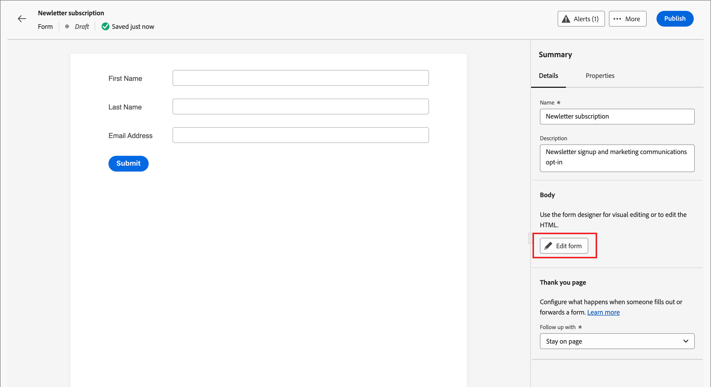
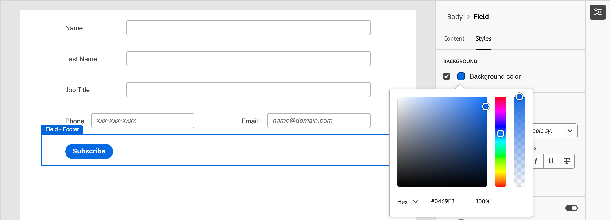

# Design de formulário

Depois que você [cria um formulário](./forms.md#create-forms), o espaço de design visual abre um rascunho com uma definição de formulário básica padrão. No painel _[!UICONTROL Resumo]_ à direita, clique em **[!UICONTROL Editar formulário]** e use o espaço de design visual para definir o estilo do formulário e os componentes do campo.

{width="700" zoomable="yes"}

## Campos

Os campos de formulário são usados para capturar dados de perfil de pessoas que podem ser usados para segmentar pessoas e associá-los a contas e grupos de compras. Todos os novos formulários começam com os seguintes campos em um layout de coluna única:

* Nome
* Sobrenome
* Endereço de email

Use as ferramentas de design de campo para criar o conjunto de campos e o layout necessários para coletar os dados necessários para suas atividades de marketing baseadas em conta.

### Adicionar um campo {#add-field}

1. No painel _[!UICONTROL Componentes]_ à esquerda, arraste o componente de conteúdo **[!UICONTROL Campo]** e solte-o na tela.

   {width="700" zoomable="yes"}

1. Clique em **[!UICONTROL Selecionar atributo de campo]**.

1. Na caixa de diálogo _[!UICONTROL Selecionar atributo de campo]_, marque a caixa de seleção do atributo de perfil de pessoa que você deseja usar para o campo e clique em **[!UICONTROL Selecionar]**.

   Os [esquemas de negócios XDM](../data/field-mapping.md#xdm-business-person-attributes) determinam os atributos disponíveis.  Todos os campos personalizados definidos para a instância do Journey Optimizer B2B edition também estão disponíveis. Use a caixa de texto Pesquisar para filtrar a lista por nome ou clique no ícone Filtrar para filtrar a lista por esquema/tipo de dados.

   {width="700" zoomable="yes"}

   Na tela de desenho, o rótulo de campo padrão para o atributo selecionado é preenchido na tela de desenho. Os **[!UICONTROL Detalhes do campo]** são exibidos no painel à direita.

1. Se necessário, altere o texto **[!UICONTROL Rótulo]**.

   Esse texto é exibido ao lado do campo no formulário. O texto padrão é preenchido no atributo de campo.

1. Defina **[!UICONTROL Tipo de campo]** de acordo com o tipo de dados do campo:

   | Tipo de campo | Uso | Exemplo |
   | ---------- | ----- | ------- |
   | **[!UICONTROL Caixa de seleção]** | Use este tipo para que os visitantes possam selecionar um valor de _true_ (marcado) ou _false_ (desmarcado). | |
   | **[!UICONTROL Grupo de caixas de seleção]** | Use este tipo para que os visitantes possam selecionar um valor de _true_ (marcado) ou _false_ (desmarcado) para vários itens. | |
   | **[!UICONTROL Moeda]** | Use esse tipo para permitir um campo flutuante que represente o tipo de moeda padrão selecionado para a instância do Journey Optimizer B2B edition. | |
   | **[!UICONTROL Data]** | Use esse tipo para restringir a entrada a um formato de data e fornecer um seletor de calendário no campo. | |
   | **[!UICONTROL Duplo]** |  | |
   | **[!UICONTROL Email]** | Use esse tipo para restringir a entrada em um formato de endereço de email. | |
   | **[!UICONTROL Número]** | Use esse tipo para restringir o campo a um valor numérico. | |
   | **[!UICONTROL Grupo de opções]** | Use esse tipo para permitir que os visitantes selecionem uma de um conjunto de opções. | |
   | **[!UICONTROL Selecionar]** | Use esse tipo para permitir que os visitantes selecionem uma de um conjunto de opções usando uma lista suspensa. | |
   | **[!UICONTROL Controle deslizante]** | Use esse tipo para permitir que os visitantes definam um valor numérico usando um controle deslizante. | |
   | **[!UICONTROL Telefone]** | Use esse tipo para um campo de entrada de número de telefone. | |
   | **[!UICONTROL Texto]** | Use este tipo para um campo de entrada de texto padrão (sequência de caracteres). | |
   | **[!UICONTROL Área de texto]** | Use este tipo para suportar entradas de texto mais longas. | |
   | **[!UICONTROL URL]** | Use esse tipo para restringir a entrada de texto a um URL, incluindo o protocolo de URL padrão. | |

1. Dependendo do tipo de campo selecionado, defina as outras opções para a entrada e validação do campo:

   {width="400" zoomable="yes"}

   * **[!UICONTROL Espaço reservado]** - O valor do espaço reservado para o campo que dá ao visitante um exemplo do que é esperado para o campo.

   * **[!UICONTROL Instruções]** - texto instrutivo que ajuda o visitante a preencher o campo. Digite o texto que você deseja exibir como _texto em foco_ para o campo.

     >[!TIP]
     >
     >_Instruções vs. texto de espaço reservado_ 
     >
     >Use essas duas propriedades para orientar os visitantes a preencherem o campo. O texto de instrução é exibido como uma dica de ferramenta/texto pop-up ao passar o ponteiro sobre o campo. O texto do espaço reservado aparece _esmaecido_ dentro do campo e desaparece quando o visitante insere o texto no campo. Você pode usar ambos os métodos, ou apenas um.

   * **[!UICONTROL Valor padrão]** - Use esta opção para especificar um valor padrão para o campo.

   * **[!UICONTROL Mensagem de validação]** - Use esta opção para especificar uma mensagem de validação para o campo. Essa mensagem será exibida se o visitante inserir um valor inválido no campo. A mensagem _[!UICONTROL Padrão]_ está definida por padrão. Escolha **[!UICONTROL Personalizar]** e insira sua própria mensagem.

   * **Comprimento máximo** - Insira o número máximo de caracteres que podem ser inseridos no campo.

1. Defina os **[!UICONTROL Comportamentos do campo]** conforme necessário:

   * **Obrigatório** - Marque a caixa de seleção para criar a entrada de campo necessária para enviar o formulário.

   * **Habilitar máscara de entrada** - Marque a caixa de seleção para restringir a entrada do visitante usando uma máscara de entrada. Por exemplo, talvez você queira que os visitantes insiram números de telefone em um formato específico. Na caixa de diálogo, insira a máscara usando `9` para qualquer número, `a` para qualquer letra e `*` para qualquer um. Clique em Salvar para ativar a máscara de entrada especificada.

     {width="500" zoomable="yes"}

### Alterar estilo do campo {#field-styling}

Selecione a guia **[!UICONTROL Estilos]** no painel direito para alterar o estilo do campo selecionado.

* **[!UICONTROL Plano de fundo]** - Marque a caixa de seleção para aplicar uma cor de plano de fundo ao campo. Branco é a cor padrão. Clique no quadrado **[!UICONTROL Cor do plano de fundo]** para abrir o seletor de cores pop-up e escolher uma cor para o plano de fundo do campo.

  {width="600" zoomable="yes"}

* **[!UICONTROL Rótulo]** - O estilo do rótulo controla as características visuais do texto exibido ao lado do campo. Escolha uma exibição de rótulo superior ou lateral relacionada ao campo. É possível definir o tamanho da fonte, a altura da linha, o estilo do texto e o alinhamento do texto. Clique no quadrado **[!UICONTROL Cor da fonte]** para abrir o seletor de cores pop-up e escolher uma cor para o texto do rótulo.

  {width="600" zoomable="yes"}

* **[!UICONTROL Borda]** - Clique no quadrado **[!UICONTROL Cor da borda]** para abrir o seletor de cores pop-up e escolher uma cor para a borda. É possível definir uma borda para o campo, incluindo a cor e a largura da linha. Desmarque a caixa de seleção para remover a borda do campo exibido. Também é possível alterar o tamanho da borda (largura em pixels), o estilo e a configuração de raio dos cantos.

  {width="600" zoomable="yes"}

* **[!UICONTROL Tamanho]** - Selecione uma configuração de tamanho para determinar a largura de exibição do campo. Escolha _[!UICONTROL Largura total]_, _[!UICONTROL Meia largura]_ ou _[!UICONTROL Automático]_.

* **[!UICONTROL Margem]** - Defina as margens (em pixels) ao redor do campo. Você pode definir a mesma margem em todos os quatro lados ou marcar a caixa de seleção **[!UICONTROL Margem diferente para cada lado]** para definir as margens horizontal e vertical separadamente.

* **[!UICONTROL Preenchimento]** - Defina o preenchimento (em pixels) ao redor do campo. Você pode definir a mesma margem em todos os quatro lados ou marcar a caixa de seleção **[!UICONTROL Diferente para cada lado]** para definir as margens horizontal e vertical separadamente.

  {width="600" zoomable="yes"}

### Reordenar campos {#field-reorder}

Você pode mover campos de formulário diretamente no espaço de trabalho visual. Clique na ferramenta _Mover_ na borda direita do campo selecionado e arraste-o para um novo local.

Adicione componentes estruturais ao formulário e mova os campos para colunas para agrupá-los e alterar o layout. Clique na ferramenta _Mover_ na borda esquerda do componente de coluna selecionado e arraste-o para um novo local no formulário.

{width="500"}

### Excluir ou duplicar um campo {#field-delete-duplicate}

Clique no ícone _Excluir_ (  ) na barra de ferramentas ou no painel direito para excluir um campo selecionado. Na caixa de diálogo de confirmação, clique em **[!UICONTROL Excluir]**.

Clique no ícone _Duplicar_ (  ) na barra de ferramentas ou no painel direito para duplicar um campo selecionado. O novo campo é exibido logo abaixo do campo original. Clique em **[!UICONTROL Selecionar atributo de campo]** para definir o atributo do campo. Defina o tipo de campo, os detalhes e os estilos conforme necessário.

{width="600" zoomable="yes"}

## Botão Enviar

Por padrão, o botão Enviar (campo de rodapé) faz parte do formulário e não pode ser removido. Selecione o componente de botão/rodapé no formulário para alterar o texto e o estilo do botão.

### Editar o conteúdo do botão {#button-content}

Com a guia _[!UICONTROL Conteúdo]_ exibida no painel direito, altere o texto no campo **[!UICONTROL Texto do botão]**. O dimensionamento do botão é ajustado para acomodar o comprimento do texto.

{width="600" zoomable="yes"}

### Estilo do botão de envio {#button-styles}

Selecione a guia **[!UICONTROL Estilos]** no painel direito para alterar o estilo do componente de botão/rodapé selecionado.

* **[!UICONTROL Plano de fundo]** - Marque a caixa de seleção para aplicar uma cor de plano de fundo ao botão. Azul é a cor padrão. Clique no quadrado **[!UICONTROL Cor do plano de fundo]** para abrir o seletor de cores pop-up e escolher uma cor para o plano de fundo do botão.

  {width="600" zoomable="yes"}

* **[!UICONTROL Rótulo]** - O estilo do rótulo controla as características visuais do texto dentro do botão. É possível definir o tamanho da fonte, a altura da linha, o estilo do texto e o alinhamento do texto. Clique no quadrado **[!UICONTROL Cor da fonte]** para abrir o seletor de cores pop-up e escolher uma cor para o texto do rótulo.

* **[!UICONTROL Borda]** - Clique no quadrado **[!UICONTROL Cor da borda]** para abrir o seletor de cores pop-up e escolher uma cor para a borda. É possível definir uma borda para o botão, incluindo a cor e a largura da linha. Desmarque a caixa de seleção para remover a borda do botão exibido. Também é possível alterar o tamanho da borda (largura em pixels), o estilo e a configuração de raio de cantos arredondados.

* **[!UICONTROL Tamanho]** - Selecione uma configuração de tamanho para determinar a largura de exibição do botão. Escolha _[!UICONTROL Largura total]_, _[!UICONTROL Meia largura]_ ou _[!UICONTROL Automático]_. O preenchimento se ajusta de acordo com as configurações de tamanho e alinhamento.

  {width="600" zoomable="yes"}

* **[!UICONTROL Alinhamento do Botão]** - Quando você escolher um tamanho de _Meia largura_ ou _Automático_ para o botão, defina o alinhamento à esquerda, à direita ou ao centro. O preenchimento se ajusta de acordo com as configurações de tamanho e alinhamento.

* **[!UICONTROL Margem]** - Defina as margens (em pixels) ao redor do campo. Você pode definir a mesma margem em todos os quatro lados ou marcar a caixa de seleção **[!UICONTROL Margem diferente para cada lado]** para definir as margens horizontal e vertical separadamente.

* **[!UICONTROL Preenchimento]** - Defina o preenchimento (em pixels) ao redor do campo. Você pode definir a mesma margem em todos os quatro lados ou marcar a caixa de seleção **[!UICONTROL Diferente para cada lado]** para definir as margens horizontal e vertical separadamente. O preenchimento será ajustado se você alterar as configurações de tamanho e alinhamento.

  {width="600" zoomable="yes"}

## Estilo do formulário {#form-styling}

É possível alterar estilos para a área de formulário ao clicar fora dos componentes estruturais ou de formulário. Os componentes de formulário (campos e botões) herdam os estilos _Corpo_ definidos como os estilos de nível superior, a menos que outros estilos sejam definidos no nível de campo ou botão/rodapé.

{width="600" zoomable="yes"}

### Estilos CSS

Novos formulários usam o CSS padrão para o estilo. Se quiser alterar os estilos modificando o CSS, você poderá copiá-lo e usá-lo para definir um CSS personalizado para o formulário.

_Para definir um CSS personalizado para o formulário :_

1. Clique em **[!UICONTROL Exibir CSS]** no painel direito para examinar o código CSS.

   {width="450" zoomable="yes"}

1. Selecione o código CSS na janela de rolagem e copie-o para a área de transferência.

1. Clique em **[!UICONTROL Fechar]**.

1. (Opcional) Cole o código copiado em sua ferramenta de CSS favorita e edite o CSS para refletir o estilo desejado.

1. Clique em **[!UICONTROL Adicionar CSS personalizado]** no painel direito.

1. Cole o código CSS na janela.

   {width="450" zoomable="yes"}

   Você pode editar o texto colado nesta janela.

1. Clique em **[!UICONTROL Salvar]**.

### Estilo manual

Altere as configurações no painel direito para definir a exibição para todo o formulário.

* **[!UICONTROL Cor do plano de fundo]** - Marque a caixa de seleção para aplicar uma cor de plano de fundo ao redor da área do formulário. Branco é a cor padrão. Clique no quadrado colorido para abrir o seletor de cores pop-up e escolha uma cor para o plano de fundo do formulário.

* **[!UICONTROL Plano de fundo do Viewport]** - Marque a caixa de seleção para aplicar uma cor de plano de fundo a todos os componentes do formulário. O padrão é sem cor (herdar do plano de fundo externo). Clique no quadrado colorido para abrir o seletor de cores pop-up e escolha uma cor para os componentes estruturais do formulário.

  {width="600" zoomable="yes"}

* **[!UICONTROL Texto]** - Escolha uma **[!UICONTROL Família de fontes]** para o formulário, o que afeta os rótulos, a dica e o texto de espaço reservado para os campos de formulário. Também afeta o texto do botão de envio padrão.

* **[!UICONTROL Tamanho]** - Alterar o tamanho (largura) do formulário em pixels.

* **[!UICONTROL Margem]** - Defina as margens (em pixels) ao redor dos componentes de formulário. Você pode definir a mesma margem em todos os quatro lados ou marcar a caixa de seleção **[!UICONTROL Margem diferente para cada lado]** para definir as margens horizontal e vertical separadamente.

  {width="600" zoomable="yes"}
